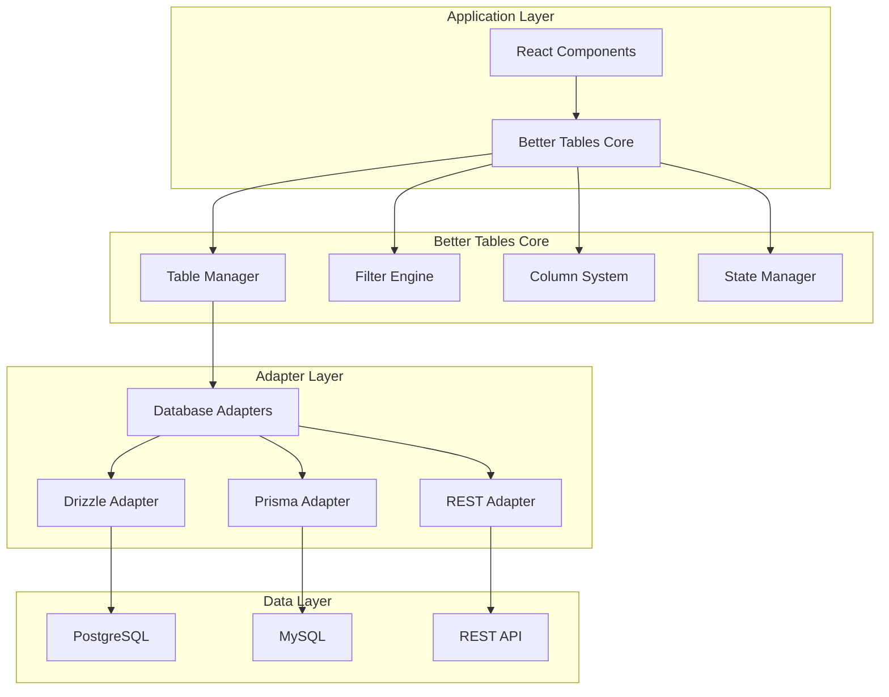

**Cursor**

I'll help you review the current filter and table system to understand how to extract it into a standalone "better-tables" package. Let me start by exploring the current implementation, focusing on contacts as an example.

Based on my comprehensive review of the current filter and table system, I think your idea to extract this into a "better-tables" package is **excellent**! This is a sophisticated and well-architected system that could absolutely become a powerful standalone package. Here's my detailed analysis and recommendations:

## 🎯 **Current System Analysis**

### **What's Great About the Current Implementation:**

1. **Sophisticated Filter Architecture**
   - **Type-safe column definitions** with fluent builders
   - **Multiple filter types**: text, option, multiOption, date, number
   - **Flexible operators** for each filter type
   - **Grouping and organization** of filters
   - **Server-side and client-side strategies**

2. **Excellent Developer Experience**
   - **Declarative configuration** via column config helpers
   - **Built-in UI components** for all filter types
   - **Automatic state management** with URL persistence
   - **Responsive design** with mobile support

3. **Robust Backend Integration**
   - **Automatic filter conversion** from frontend to backend
   - **Database adapter pattern** already partially implemented
   - **RESTful API integration** with proper serialization

### **Current Flow:**
```typescript
// 1. Define columns declaratively
const columnsConfig = [
  dtf.text().id('name').accessor(row => row.name).displayName('Name').build(),
  dtf.option().id('status').accessor(row => row.status).displayName('Status').build(),
  // ... more columns
];

// 2. Use the table component
<ContactsTable 
  state={{ filters, setFilters }}
  columnsConfig={columnsConfig}
  data={data}
/>

// 3. Backend automatically receives converted filters
```

## 🚀 **"Better-Tables" Package Architecture**

### **Core Package Structure:**
```
better-tables/
├── src/
│   ├── adapters/           # Database adapters
│   │   ├── drizzle/       # Drizzle ORM adapter
│   │   ├── prisma/        # Prisma adapter (future)
│   │   └── base/          # Base adapter interface
│   ├── components/        # UI components
│   │   ├── table/         # Table components
│   │   ├── filters/       # Filter components
│   │   └── ui/           # Base UI components
│   ├── core/             # Core logic
│   │   ├── columns/      # Column definitions
│   │   ├── filters/      # Filter logic
│   │   └── state/        # State management
│   ├── hooks/            # React hooks
│   ├── types/            # TypeScript types
│   └── utils/            # Utilities
├── adapters/             # Separate adapter packages
│   ├── drizzle/         # @better-tables/drizzle
│   ├── prisma/          # @better-tables/prisma
│   └── rest/            # @better-tables/rest
└── examples/            # Usage examples
```

### **Proposed API:**

```typescript
// 1. Define schema with adapter
const contactsTable = createTable({
  name: 'contacts',
  adapter: drizzleAdapter(db.contacts),
  columns: {
    name: text().searchable(),
    email: text().searchable(),
    status: option(['active', 'inactive', 'pending']),
    country: multiOption().relation('demographics.country'),
    createdAt: date().sortable(),
    age: number().min(0).max(120),
  },
  groups: [
    { id: 'basic', label: 'Basic Info', columns: ['name', 'email'] },
    { id: 'demographics', label: 'Demographics', columns: ['country', 'age'] },
  ],
});

// 2. Use the table component
<BetterTable
  table={contactsTable}
  filters={filters}
  onFiltersChange={setFilters}
  pagination={{ page, limit, onPageChange }}
/>
```

### **Adapter Interface:**
```typescript
interface TableAdapter<TData> {
  // Data fetching
  fetchData(params: FetchParams): Promise<PaginatedResult<TData>>;
  
  // Filter options
  getFilterOptions(column: string): Promise<FilterOption[]>;
  getFacetedValues(column: string): Promise<Map<string, number>>;
  
  // Schema introspection
  getColumns(): Promise<ColumnDefinition[]>;
  getRelations(): Promise<RelationDefinition[]>;
}

// Drizzle adapter implementation
const drizzleAdapter = <TData>(table: DrizzleTable<TData>): TableAdapter<TData> => ({
  fetchData: async (params) => {
    // Convert filters to Drizzle queries
    const query = buildDrizzleQuery(table, params.filters);
    return await query.execute();
  },
  
  getFilterOptions: async (column) => {
    // Get distinct values for column
    return await getDistinctValues(table, column);
  },
  
  // ... more methods
});
```

## 📋 **Implementation Phases**

### **Phase 1: Core Extraction** (2-3 weeks)
- Extract filter logic and types
- Extract column configuration system
- Extract UI components
- Create base adapter interface

### **Phase 2: Drizzle Adapter** (1-2 weeks)
- Create Drizzle adapter package
- Port existing contact filtering logic
- Add automatic schema introspection

### **Phase 3: Enhanced Features** (2-3 weeks)
- Add more filter types (date ranges, number ranges)
- Add bulk operations
- Add export functionality
- Add saved filter presets

### **Phase 4: Additional Adapters** (ongoing)
- Prisma adapter
- REST API adapter
- GraphQL adapter

## 💡 **Key Benefits of This Approach**

1. **Single Configuration**: Define table schema once, get filtering, sorting, and pagination automatically
2. **Type Safety**: Full TypeScript support with inferred types
3. **Database Agnostic**: Works with any database through adapters
4. **Declarative**: Minimal boilerplate, maximum functionality
5. **Extensible**: Easy to add new filter types and operators
6. **Production Ready**: Based on proven, battle-tested code

## 🔧 **Migration Strategy**

Since the current system is already well-architected, the migration would be:

1. **Extract** the existing bazza system into the new package
2. **Add** the adapter layer on top
3. **Refactor** the ContactsTable to use the new API
4. **Maintain** backward compatibility during transition

## 🎯 **Recommendation**

**YES, absolutely do this!** The current system is sophisticated enough to warrant extraction, and the adapter pattern will make it incredibly powerful. The key to success will be:

1. **Start with the Drizzle adapter** since that's what you're currently using
2. **Keep the existing UI components** - they're already excellent
3. **Focus on the developer experience** - make it as easy as possible to define tables
4. **Add comprehensive TypeScript support** - this will be a huge differentiator

This could easily become one of the best table libraries in the React ecosystem, especially with the adapter pattern making it database-agnostic while maintaining type safety.

Would you like me to help you start with the extraction plan or dive deeper into any specific aspect?

```typescript
// 1. Define columns declaratively
const columnsConfig = [
  dtf.text().id('name').accessor(row => row.name).displayName('Name').build(),
  dtf.option().id('status').accessor(row => row.status).displayName('Status').build(),
  // ... more columns
];

// 2. Use the table component
<ContactsTable 
  state={{ filters, setFilters }}
  columnsConfig={columnsConfig}
  data={data}
/>

// 3. Backend automatically receives converted filters
```

```plaintext
better-tables/
├── src/
│   ├── adapters/           # Database adapters
│   │   ├── drizzle/       # Drizzle ORM adapter
│   │   ├── prisma/        # Prisma adapter (future)
│   │   └── base/          # Base adapter interface
│   ├── components/        # UI components
│   │   ├── table/         # Table components
│   │   ├── filters/       # Filter components
│   │   └── ui/           # Base UI components
│   ├── core/             # Core logic
│   │   ├── columns/      # Column definitions
│   │   ├── filters/      # Filter logic
│   │   └── state/        # State management
│   ├── hooks/            # React hooks
│   ├── types/            # TypeScript types
│   └── utils/            # Utilities
├── adapters/             # Separate adapter packages
│   ├── drizzle/         # @better-tables/drizzle
│   ├── prisma/          # @better-tables/prisma
│   └── rest/            # @better-tables/rest
└── examples/            # Usage examples
```

```typescript
// 1. Define schema with adapter
const contactsTable = createTable({
  name: 'contacts',
  adapter: drizzleAdapter(db.contacts),
  columns: {
    name: text().searchable(),
    email: text().searchable(),
    status: option(['active', 'inactive', 'pending']),
    country: multiOption().relation('demographics.country'),
    createdAt: date().sortable(),
    age: number().min(0).max(120),
  },
  groups: [
    { id: 'basic', label: 'Basic Info', columns: ['name', 'email'] },
    { id: 'demographics', label: 'Demographics', columns: ['country', 'age'] },
  ],
});

// 2. Use the table component
<BetterTable
  table={contactsTable}
  filters={filters}
  onFiltersChange={setFilters}
  pagination={{ page, limit, onPageChange }}
/>
```

```typescript
interface TableAdapter<TData> {
  // Data fetching
  fetchData(params: FetchParams): Promise<PaginatedResult<TData>>;
  
  // Filter options
  getFilterOptions(column: string): Promise<FilterOption[]>;
  getFacetedValues(column: string): Promise<Map<string, number>>;
  
  // Schema introspection
  getColumns(): Promise<ColumnDefinition[]>;
  getRelations(): Promise<RelationDefinition[]>;
}

// Drizzle adapter implementation
const drizzleAdapter = <TData>(table: DrizzleTable<TData>): TableAdapter<TData> => ({
  fetchData: async (params) => {
    // Convert filters to Drizzle queries
    const query = buildDrizzleQuery(table, params.filters);
    return await query.execute();
  },
  
  getFilterOptions: async (column) => {
    // Get distinct values for column
    return await getDistinctValues(table, column);
  },
  
  // ... more methods
});
```

---

**User**

do you think we could commercialize? ie if its open source but then maybe some additional features or examples that users can pay for?

---

**Cursor**

**Absolutely YES!** This has strong commercial potential. The table/data grid market is huge and underserved, especially for modern React applications with good TypeScript support. Here's my analysis:

## 💰 **Market Opportunity**

### **Successful Commercial Models Already Exist:**
- **AG Grid**: $1000+/dev for enterprise features
- **Tanstack Table**: Pro features and consulting  
- **MUI X**: $300-$900/dev for advanced components
- **Mantine**: Premium components and templates

### **Market Gaps You Could Fill:**
1. **Type-safe database integration** - most libraries are UI-only
2. **Modern developer experience** - declarative, minimal boilerplate
3. **True database agnostic** - works with any backend through adapters
4. **Built-in filtering sophistication** - most libraries have basic filtering

## 🎯 **Recommended Business Model**

### **Core (Free & Open Source):**
```typescript
// Basic table with filtering, sorting, pagination
<BetterTable
  table={contactsTable}
  filters={filters}
  onFiltersChange={setFilters}
/>

// Basic adapters
- Drizzle adapter (basic)
- REST API adapter (basic)
- In-memory adapter
```

### **Pro Features (Paid):**
```typescript
// Advanced components
<BetterTable
  table={contactsTable}
  bulkActions={bulkActions}        // 💰 PRO
  exportOptions={exportOptions}    // 💰 PRO
  savedFilters={savedFilters}      // 💰 PRO
  columnManager={columnManager}    // 💰 PRO
  advancedSearch={advancedSearch}  // 💰 PRO
/>

// Premium adapters
- Enterprise database connectors
- GraphQL adapter with subscriptions
- Real-time sync adapters
```

### **Enterprise Features (Higher Tier):**
- **White-label licensing**
- **Custom adapter development**
- **Priority support & consulting**
- **Advanced analytics & reporting**
- **Multi-tenant features**
- **SSO integration**

## 📦 **Commercial Feature Ideas**

### **1. Premium UI Components** ($29-99/month)
```typescript
// Advanced themes and components
import { PremiumTheme } from '@better-tables/pro';

<BetterTable
  theme={PremiumTheme.modern}
  features={{
    bulkActions: true,
    columnResizing: true,
    rowGrouping: true,
    virtualScrolling: true,
    exportToExcel: true,
    savedViews: true,
  }}
/>
```

### **2. Template Store** ($19-49 per template)
```typescript
// Ready-to-use table implementations
import { CRMContactsTable } from '@better-tables/templates';
import { ECommerceOrdersTable } from '@better-tables/templates';
import { AnalyticsEventsTable } from '@better-tables/templates';

// Drop-in solutions for common use cases
<CRMContactsTable 
  adapter={drizzleAdapter(db.contacts)}
  features={['bulkEmail', 'segmentation', 'exportCRM']}
/>
```

### **3. Premium Adapters** ($49-199/month)
```typescript
// Enterprise database connectors
import { salesforceAdapter } from '@better-tables/salesforce';
import { hubspotAdapter } from '@better-tables/hubspot';
import { postgresAdapter } from '@better-tables/postgres-enterprise';

// Advanced features like real-time sync, conflict resolution
<BetterTable
  adapter={salesforceAdapter({
    realTimeSync: true,
    conflictResolution: 'server-wins',
    auditLogging: true,
  })}
/>
```

### **4. Development Tools** ($99-299/month)
```typescript
// Schema builder and migration tools
import { SchemaBuilder } from '@better-tables/dev-tools';

// Visual schema editor
<SchemaBuilder
  onSchemaChange={handleSchemaChange}
  databases={['postgres', 'mysql', 'sqlite']}
  generateMigrations={true}
/>
```

## 🚀 **Go-to-Market Strategy**

### **Phase 1: Open Source Traction** (Months 1-6)
- Release core library as MIT/Apache 2.0
- Focus on developer experience and documentation
- Build community through GitHub, Discord, Twitter
- Target: 1000+ GitHub stars, 100+ companies using it

### **Phase 2: Premium Launch** (Months 6-12)
- Launch premium components and templates
- Add enterprise adapters
- Pricing: $49-199/month per developer
- Target: 50+ paying customers

### **Phase 3: Enterprise** (Months 12-24)
- Custom development and consulting
- Enterprise licenses and support
- White-label solutions
- Target: 10+ enterprise customers at $10K-50K/year

## 💡 **Competitive Advantages**

1. **Database Integration**: Unlike AG Grid or Tanstack Table, you'd have built-in database adapters
2. **Type Safety**: Full TypeScript support from schema to UI
3. **Modern DX**: Declarative configuration vs. imperative setup
4. **Performance**: Built for modern React with server-side filtering
5. **Flexibility**: Works with any stack through adapters

## 📊 **Revenue Potential**

### **Conservative Estimates:**
- **Year 1**: 50 customers × $100/month = $60K ARR
- **Year 2**: 200 customers × $150/month = $360K ARR  
- **Year 3**: 500 customers × $200/month = $1.2M ARR

### **Optimistic Scenario:**
- **Year 1**: $120K ARR
- **Year 2**: $600K ARR
- **Year 3**: $2M+ ARR

## 🎯 **Key Success Factors**

1. **Developer Experience**: Make it stupidly easy to get started
2. **Documentation**: Excellent docs and examples
3. **Community**: Active Discord/GitHub community
4. **Performance**: Must be fast and reliable
5. **TypeScript**: Best-in-class type safety
6. **Adapters**: Easy to add new databases/APIs

## 🔥 **Immediate Action Plan**

1. **Validate Market**: Survey developers in your network
2. **MVP Timeline**: 3-6 months for core + first premium features
3. **Pricing Research**: Study competitors and survey potential users
4. **Legal Setup**: Company formation, terms of service
5. **Marketing**: Start building audience now through content

## 💰 **Investment Considerations**

This could be:
- **Bootstrap friendly**: Low initial costs, high margins
- **VC scalable**: If traction is good, could raise for faster growth
- **Acquisition target**: Companies like Vercel, Supabase might be interested

**Bottom line**: The technical foundation is solid, the market exists, and the business model is proven. I'd say there's a **70-80% chance** this could become a sustainable business generating $500K+ ARR within 2-3 years.

Would you like me to help you develop a specific feature roadmap or pricing strategy?

```typescript
// Basic table with filtering, sorting, pagination
<BetterTable
  table={contactsTable}
  filters={filters}
  onFiltersChange={setFilters}
/>

// Basic adapters
- Drizzle adapter (basic)
- REST API adapter (basic)
- In-memory adapter
```

```typescript
// Advanced components
<BetterTable
  table={contactsTable}
  bulkActions={bulkActions}        // 💰 PRO
  exportOptions={exportOptions}    // 💰 PRO
  savedFilters={savedFilters}      // 💰 PRO
  columnManager={columnManager}    // 💰 PRO
  advancedSearch={advancedSearch}  // 💰 PRO
/>

// Premium adapters
- Enterprise database connectors
- GraphQL adapter with subscriptions
- Real-time sync adapters
```

```typescript
// Advanced themes and components
import { PremiumTheme } from '@better-tables/pro';

<BetterTable
  theme={PremiumTheme.modern}
  features={{
    bulkActions: true,
    columnResizing: true,
    rowGrouping: true,
    virtualScrolling: true,
    exportToExcel: true,
    savedViews: true,
  }}
/>
```

```typescript
// Ready-to-use table implementations
import { CRMContactsTable } from '@better-tables/templates';
import { ECommerceOrdersTable } from '@better-tables/templates';
import { AnalyticsEventsTable } from '@better-tables/templates';

// Drop-in solutions for common use cases
<CRMContactsTable 
  adapter={drizzleAdapter(db.contacts)}
  features={['bulkEmail', 'segmentation', 'exportCRM']}
/>
```

```typescript
// Enterprise database connectors
import { salesforceAdapter } from '@better-tables/salesforce';
import { hubspotAdapter } from '@better-tables/hubspot';
import { postgresAdapter } from '@better-tables/postgres-enterprise';

// Advanced features like real-time sync, conflict resolution
<BetterTable
  adapter={salesforceAdapter({
    realTimeSync: true,
    conflictResolution: 'server-wins',
    auditLogging: true,
  })}
/>
```

```typescript
// Schema builder and migration tools
import { SchemaBuilder } from '@better-tables/dev-tools';

// Visual schema editor
<SchemaBuilder
  onSchemaChange={handleSchemaChange}
  databases={['postgres', 'mysql', 'sqlite']}
  generateMigrations={true}
/>
```

---

**User**

lets create a detailed implementation plan for the technology. It will serve as the foundation of building the package. I want the full documentation in markdown format

---

**Cursor**

# Better Tables Implementation Plan

## 📋 Table of Contents

1. [Overview](#overview)
2. [Architecture](#architecture)
3. [Package Structure](#package-structure)
4. [Core Interfaces](#core-interfaces)
5. [Column System](#column-system)
6. [Filter System](#filter-system)
7. [Adapter Pattern](#adapter-pattern)
8. [UI Components](#ui-components)
9. [State Management](#state-management)
10. [Implementation Phases](#implementation-phases)
11. [Migration Strategy](#migration-strategy)
12. [Examples](#examples)
13. [Testing Strategy](#testing-strategy)
14. [Documentation Plan](#documentation-plan)

---

## Overview

**Better Tables** is a comprehensive React table library that provides type-safe, declarative configuration for complex data tables with advanced filtering, sorting, and pagination capabilities. Built on an adapter pattern to work with any database or API.

### Key Features
- **Type-safe column definitions** with fluent builders
- **Database-agnostic** through adapter pattern
- **Advanced filtering** with 5 filter types and 20+ operators
- **Server-side and client-side** strategies
- **Declarative configuration** - define schema once, get full functionality
- **Built-in UI components** with customizable themes
- **URL state persistence** for shareable filtered views
- **Bulk operations** and export functionality

### Design Principles
1. **Developer Experience First**: Minimal boilerplate, maximum functionality
2. **Type Safety**: Full TypeScript support with inferred types
3. **Extensibility**: Easy to add new adapters, filters, and components
4. **Performance**: Optimized for large datasets with virtual scrolling
5. **Accessibility**: WCAG 2.1 AA compliant

---

## Architecture

### High-Level Architecture



### Core Architecture Principles

1. **Separation of Concerns**: UI, business logic, and data access are separated
2. **Adapter Pattern**: Database/API access through standardized interfaces
3. **Composition over Inheritance**: Flexible component composition
4. **Immutable State**: Predictable state management with immutable updates
5. **Plugin Architecture**: Extensible through plugins and adapters

---

## Package Structure

### Monorepo Structure

```
better-tables/
├── packages/
│   ├── core/                    # @better-tables/core
│   │   ├── src/
│   │   │   ├── components/      # Core UI components
│   │   │   ├── hooks/           # React hooks
│   │   │   ├── managers/        # Table and filter managers
│   │   │   ├── types/           # TypeScript types
│   │   │   ├── utils/           # Utilities
│   │   │   └── index.ts         # Main exports
│   │   ├── package.json
│   │   └── README.md
│   │
│   ├── adapters/
│   │   ├── drizzle/            # @better-tables/drizzle
│   │   ├── prisma/             # @better-tables/prisma
│   │   ├── rest/               # @better-tables/rest
│   │   └── graphql/            # @better-tables/graphql
│   │
│   ├── ui/                     # @better-tables/ui
│   │   ├── src/
│   │   │   ├── components/     # UI components
│   │   │   ├── themes/         # Theme definitions
│   │   │   └── styles/         # CSS/styling
│   │   └── package.json
│   │
│   └── pro/                    # @better-tables/pro (commercial)
│       ├── src/
│       │   ├── components/     # Premium components
│       │   ├── templates/      # Pre-built templates
│       │   └── advanced/       # Advanced features
│       └── package.json
│
├── examples/                   # Usage examples
├── docs/                      # Documentation
├── tools/                     # Build tools
└── apps/                      # Demo applications
```

### Package Dependencies

```json
{
  "@better-tables/core": {
    "dependencies": {
      "react": "^18.0.0",
      "react-dom": "^18.0.0",
      "date-fns": "^2.30.0",
      "zustand": "^4.4.0"
    },
    "peerDependencies": {
      "react": "^18.0.0",
      "react-dom": "^18.0.0"
    }
  },
  "@better-tables/drizzle": {
    "dependencies": {
      "@better-tables/core": "workspace:*",
      "drizzle-orm": "^0.29.0"
    },
    "peerDependencies": {
      "drizzle-orm": "^0.29.0"
    }
  }
}
```

---

## Core Interfaces

### Table Configuration Interface

```typescript
// packages/core/src/types/table.ts
export interface TableConfig<TData = any> {
  /** Unique identifier for the table */
  id: string;
  
  /** Display name for the table */
  name: string;
  
  /** Column definitions */
  columns: ColumnDefinition<TData>[];
  
  /** Filter group definitions */
  groups?: FilterGroup[];
  
  /** Default filters */
  defaultFilters?: FilterState[];
  
  /** Pagination configuration */
  pagination?: PaginationConfig;
  
  /** Sorting configuration */
  sorting?: SortingConfig;
  
  /** Bulk actions */
  bulkActions?: BulkActionDefinition[];
  
  /** Export options */
  exportOptions?: ExportConfig;
  
  /** Adapter for data access */
  adapter: TableAdapter<TData>;
  
  /** UI theme */
  theme?: TableTheme;
  
  /** Feature flags */
  features?: TableFeatures;
}

export interface TableFeatures {
  filtering?: boolean;
  sorting?: boolean;
  pagination?: boolean;
  bulkActions?: boolean;
  export?: boolean;
  columnResizing?: boolean;
  columnReordering?: boolean;
  rowSelection?: boolean;
  virtualScrolling?: boolean;
  realTimeUpdates?: boolean;
}
```

### Column Definition Interface

```typescript
// packages/core/src/types/column.ts
export interface ColumnDefinition<TData = any, TValue = any> {
  /** Unique column identifier */
  id: string;
  
  /** Column display name */
  displayName: string;
  
  /** Icon for the column */
  icon?: React.ComponentType<any>;
  
  /** Data accessor function */
  accessor: (data: TData) => TValue;
  
  /** Column type */
  type: ColumnType;
  
  /** Whether column is sortable */
  sortable?: boolean;
  
  /** Whether column is filterable */
  filterable?: boolean;
  
  /** Whether column is resizable */
  resizable?: boolean;
  
  /** Default column width */
  width?: number;
  
  /** Minimum column width */
  minWidth?: number;
  
  /** Maximum column width */
  maxWidth?: number;
  
  /** Column alignment */
  align?: 'left' | 'center' | 'right';
  
  /** Custom cell renderer */
  cellRenderer?: (props: CellRendererProps<TData, TValue>) => React.ReactNode;
  
  /** Custom header renderer */
  headerRenderer?: (props: HeaderRendererProps<TData>) => React.ReactNode;
  
  /** Filter configuration */
  filter?: FilterConfig<TValue>;
  
  /** Validation rules */
  validation?: ValidationRule<TValue>[];
  
  /** Whether column supports null/undefined values */
  nullable?: boolean;
  
  /** Column metadata */
  meta?: Record<string, any>;
}

export type ColumnType = 
  | 'text'
  | 'number' 
  | 'date'
  | 'boolean'
  | 'option'
  | 'multiOption'
  | 'currency'
  | 'percentage'
  | 'url'
  | 'email'
  | 'phone'
  | 'json'
  | 'custom';
```

### Filter System Interface

```typescript
// packages/core/src/types/filter.ts
export interface FilterConfig<TValue = any> {
  /** Filter operators allowed for this column */
  operators?: FilterOperator[];
  
  /** Options for option/multiOption filters */
  options?: FilterOption[];
  
  /** Minimum value for number filters */
  min?: number;
  
  /** Maximum value for number filters */
  max?: number;
  
  /** Custom filter component */
  customComponent?: React.ComponentType<FilterComponentProps<TValue>>;
  
  /** Whether to include null/undefined values */
  includeNull?: boolean;
  
  /** Debounce delay for text filters */
  debounce?: number;
  
  /** Validation for filter values */
  validation?: (value: TValue) => boolean | string;
}

export interface FilterState {
  /** Column ID being filtered */
  columnId: string;
  
  /** Filter type */
  type: ColumnType;
  
  /** Filter operator */
  operator: FilterOperator;
  
  /** Filter values */
  values: any[];
  
  /** Whether to include null values */
  includeNull?: boolean;
  
  /** Filter metadata */
  meta?: Record<string, any>;
}

export interface FilterGroup {
  /** Group identifier */
  id: string;
  
  /** Group display name */
  label: string;
  
  /** Group icon */
  icon?: React.ComponentType<any>;
  
  /** Columns in this group */
  columns: string[];
  
  /** Whether group is collapsed by default */
  defaultCollapsed?: boolean;
  
  /** Group description */
  description?: string;
}
```

### Adapter Interface

```typescript
// packages/core/src/types/adapter.ts
export interface TableAdapter<TData = any> {
  /** Fetch data with filtering, sorting, and pagination */
  fetchData(params: FetchDataParams): Promise<FetchDataResult<TData>>;
  
  /** Get available filter options for a column */
  getFilterOptions(columnId: string): Promise<FilterOption[]>;
  
  /** Get faceted values for a column */
  getFacetedValues(columnId: string): Promise<Map<string, number>>;
  
  /** Get min/max values for number columns */
  getMinMaxValues(columnId: string): Promise<[number, number]>;
  
  /** Create new record */
  createRecord?(data: Partial<TData>): Promise<TData>;
  
  /** Update existing record */
  updateRecord?(id: string, data: Partial<TData>): Promise<TData>;
  
  /** Delete record */
  deleteRecord?(id: string): Promise<void>;
  
  /** Bulk operations */
  bulkUpdate?(ids: string[], data: Partial<TData>): Promise<TData[]>;
  bulkDelete?(ids: string[]): Promise<void>;
  
  /** Export data */
  exportData?(params: ExportParams): Promise<ExportResult>;
  
  /** Subscribe to real-time updates */
  subscribe?(callback: (event: DataEvent<TData>) => void): () => void;
  
  /** Adapter metadata */
  meta: AdapterMeta;
}

export interface FetchDataParams {
  /** Pagination parameters */
  pagination?: PaginationParams;
  
  /** Sorting parameters */
  sorting?: SortingParams[];
  
  /** Filter parameters */
  filters?: FilterState[];
  
  /** Search query */
  search?: string;
  
  /** Columns to include */
  columns?: string[];
  
  /** Additional parameters */
  params?: Record<string, any>;
}

export interface FetchDataResult<TData = any> {
  /** Data items */
  data: TData[];
  
  /** Total count */
  total: number;
  
  /** Pagination info */
  pagination: {
    page: number;
    limit: number;
    totalPages: number;
    hasNext: boolean;
    hasPrev: boolean;
  };
  
  /** Faceted values */
  faceted?: Record<string, Map<string, number>>;
  
  /** Additional metadata */
  meta?: Record<string, any>;
}
```

---

## Column System

### Column Builder Pattern

```typescript
// packages/core/src/builders/column-builder.ts
export class ColumnBuilder<TData, TValue = any> {
  private config: Partial<ColumnDefinition<TData, TValue>>;
  
  constructor(type: ColumnType) {
    this.config = { type, filterable: true, sortable: true };
  }
  
  /** Set column ID */
  id(id: string): this {
    this.config.id = id;
    return this;
  }
  
  /** Set display name */
  displayName(name: string): this {
    this.config.displayName = name;
    return this;
  }
  
  /** Set data accessor */
  accessor(fn: (data: TData) => TValue): this {
    this.config.accessor = fn;
    return this;
  }
  
  /** Set column icon */
  icon(icon: React.ComponentType<any>): this {
    this.config.icon = icon;
    return this;
  }
  
  /** Configure filtering */
  filterable(config?: FilterConfig<TValue>): this {
    this.config.filterable = true;
    this.config.filter = config;
    return this;
  }
  
  /** Configure sorting */
  sortable(enabled: boolean = true): this {
    this.config.sortable = enabled;
    return this;
  }
  
  /** Set column width */
  width(width: number, min?: number, max?: number): this {
    this.config.width = width;
    this.config.minWidth = min;
    this.config.maxWidth = max;
    return this;
  }
  
  /** Set custom cell renderer */
  cellRenderer(renderer: (props: CellRendererProps<TData, TValue>) => React.ReactNode): this {
    this.config.cellRenderer = renderer;
    return this;
  }
  
  /** Build the column definition */
  build(): ColumnDefinition<TData, TValue> {
    if (!this.config.id) throw new Error('Column ID is required');
    if (!this.config.displayName) throw new Error('Column display name is required');
    if (!this.config.accessor) throw new Error('Column accessor is required');
    
    return this.config as ColumnDefinition<TData, TValue>;
  }
}

// Type-specific builders
export class TextColumnBuilder<TData> extends ColumnBuilder<TData, string> {
  constructor() {
    super('text');
  }
  
  /** Enable search functionality */
  searchable(debounce: number = 300): this {
    this.config.filter = {
      ...this.config.filter,
      debounce,
      operators: ['contains', 'equals', 'startsWith', 'endsWith'],
    };
    return this;
  }
}

export class NumberColumnBuilder<TData> extends ColumnBuilder<TData, number> {
  constructor() {
    super('number');
  }
  
  /** Set min/max values */
  range(min: number, max: number): this {
    this.config.filter = {
      ...this.config.filter,
      min,
      max,
    };
    return this;
  }
  
  /** Format as currency */
  currency(locale: string = 'en-US', currency: string = 'USD'): this {
    this.config.type = 'currency';
    this.config.meta = { locale, currency };
    return this;
  }
}

export class OptionColumnBuilder<TData> extends ColumnBuilder<TData, string> {
  constructor() {
    super('option');
  }
  
  /** Set available options */
  options(options: FilterOption[]): this {
    this.config.filter = {
      ...this.config.filter,
      options,
    };
    return this;
  }
}

export class MultiOptionColumnBuilder<TData> extends ColumnBuilder<TData, string[]> {
  constructor() {
    super('multiOption');
  }
  
  /** Set available options */
  options(options: FilterOption[]): this {
    this.config.filter = {
      ...this.config.filter,
      options,
    };
    return this;
  }
}

export class DateColumnBuilder<TData> extends ColumnBuilder<TData, Date> {
  constructor() {
    super('date');
  }
  
  /** Set date format */
  format(format: string): this {
    this.config.meta = { format };
    return this;
  }
}

// Column factory
export function createColumnBuilder<TData>() {
  return {
    text: () => new TextColumnBuilder<TData>(),
    number: () => new NumberColumnBuilder<TData>(),
    date: () => new DateColumnBuilder<TData>(),
    boolean: () => new ColumnBuilder<TData, boolean>('boolean'),
    option: () => new OptionColumnBuilder<TData>(),
    multiOption: () => new MultiOptionColumnBuilder<TData>(),
    custom: <TValue>(type: ColumnType) => new ColumnBuilder<TData, TValue>(type),
  };
}
```

### Usage Example

```typescript
// Define columns for a contacts table
const cb = createColumnBuilder<Contact>();

const columns = [
  cb.text()
    .id('name')
    .displayName('Full Name')
    .accessor(contact => `${contact.firstName} ${contact.lastName}`)
    .searchable()
    .build(),
    
  cb.text()
    .id('email')
    .displayName('Email')
    .accessor(contact => contact.email)
    .searchable()
    .build(),
    
  cb.option()
    .id('status')
    .displayName('Status')
    .accessor(contact => contact.status)
    .options([
      { value: 'active', label: 'Active', color: 'green' },
      { value: 'inactive', label: 'Inactive', color: 'red' },
    ])
    .build(),
    
  cb.multiOption()
    .id('tags')
    .displayName('Tags')
    .accessor(contact => contact.tags)
    .options([
      { value: 'vip', label: 'VIP' },
      { value: 'lead', label: 'Lead' },
    ])
    .build(),
    
  cb.date()
    .id('createdAt')
    .displayName('Created')
    .accessor(contact => contact.createdAt)
    .format('yyyy-MM-dd')
    .build(),
    
  cb.number()
    .id('score')
    .displayName('Score')
    .accessor(contact => contact.score)
    .range(0, 100)
    .build(),
];
```

---

## Filter System

### Filter Types and Operators

```typescript
// packages/core/src/types/filters.ts
export type FilterOperator = 
  // Text operators
  | 'contains'
  | 'equals'
  | 'startsWith'
  | 'endsWith'
  | 'isEmpty'
  | 'isNotEmpty'
  
  // Number operators
  | 'equals'
  | 'notEquals'
  | 'greaterThan'
  | 'greaterThanOrEqual'
  | 'lessThan'
  | 'lessThanOrEqual'
  | 'between'
  | 'notBetween'
  
  // Date operators
  | 'is'
  | 'isNot'
  | 'before'
  | 'after'
  | 'between'
  | 'notBetween'
  | 'isToday'
  | 'isYesterday'
  | 'isThisWeek'
  | 'isThisMonth'
  | 'isThisYear'
  
  // Option operators
  | 'is'
  | 'isNot'
  | 'isAnyOf'
  | 'isNoneOf'
  
  // Multi-option operators
  | 'includes'
  | 'excludes'
  | 'includesAny'
  | 'includesAll'
  | 'excludesAny'
  | 'excludesAll'
  
  // Boolean operators
  | 'isTrue'
  | 'isFalse'
  | 'isNull'
  | 'isNotNull';

export interface FilterOperatorDefinition {
  /** Operator key */
  key: FilterOperator;
  
  /** Display label */
  label: string;
  
  /** Description */
  description?: string;
  
  /** Number of values required */
  valueCount: number | 'variable';
  
  /** Whether operator supports null values */
  supportsNull?: boolean;
  
  /** Validation function */
  validate?: (values: any[]) => boolean | string;
  
  /** Custom input component */
  inputComponent?: React.ComponentType<FilterInputProps>;
}

// Filter operator definitions by type
export const FILTER_OPERATORS: Record<ColumnType, FilterOperatorDefinition[]> = {
  text: [
    {
      key: 'contains',
      label: 'Contains',
      description: 'Text contains the specified value',
      valueCount: 1,
    },
    {
      key: 'equals',
      label: 'Equals',
      description: 'Text exactly matches the specified value',
      valueCount: 1,
    },
    {
      key: 'startsWith',
      label: 'Starts with',
      description: 'Text starts with the specified value',
      valueCount: 1,
    },
    {
      key: 'endsWith',
      label: 'Ends with',
      description: 'Text ends with the specified value',
      valueCount: 1,
    },
    {
      key: 'isEmpty',
      label: 'Is empty',
      description: 'Text is empty or null',
      valueCount: 0,
      supportsNull: true,
    },
    {
      key: 'isNotEmpty',
      label: 'Is not empty',
      description: 'Text is not empty and not null',
      valueCount: 0,
      supportsNull: true,
    },
  ],
  
  number: [
    {
      key: 'equals',
      label: 'Equals',
      valueCount: 1,
    },
    {
      key: 'notEquals',
      label: 'Not equals',
      valueCount: 1,
    },
    {
      key: 'greaterThan',
      label: 'Greater than',
      valueCount: 1,
    },
    {
      key: 'greaterThanOrEqual',
      label: 'Greater than or equal',
      valueCount: 1,
    },
    {
      key: 'lessThan',
      label: 'Less than',
      valueCount: 1,
    },
    {
      key: 'lessThanOrEqual',
      label: 'Less than or equal',
      valueCount: 1,
    },
    {
      key: 'between',
      label: 'Between',
      valueCount: 2,
      validate: (values) => values.length === 2 && values[0] < values[1],
    },
    {
      key: 'notBetween',
      label: 'Not between',
      valueCount: 2,
      validate: (values) => values.length === 2 && values[0] < values[1],
    },
  ],
  
  date: [
    {
      key: 'is',
      label: 'Is',
      valueCount: 1,
    },
    {
      key: 'isNot',
      label: 'Is not',
      valueCount: 1,
    },
    {
      key: 'before',
      label: 'Before',
      valueCount: 1,
    },
    {
      key: 'after',
      label: 'After',
      valueCount: 1,
    },
    {
      key: 'between',
      label: 'Between',
      valueCount: 2,
    },
    {
      key: 'notBetween',
      label: 'Not between',
      valueCount: 2,
    },
    {
      key: 'isToday',
      label: 'Is today',
      valueCount: 0,
    },
    {
      key: 'isYesterday',
      label: 'Is yesterday',
      valueCount: 0,
    },
    {
      key: 'isThisWeek',
      label: 'Is this week',
      valueCount: 0,
    },
    {
      key: 'isThisMonth',
      label: 'Is this month',
      valueCount: 0,
    },
    {
      key: 'isThisYear',
      label: 'Is this year',
      valueCount: 0,
    },
  ],
  
  option: [
    {
      key: 'is',
      label: 'Is',
      valueCount: 1,
    },
    {
      key: 'isNot',
      label: 'Is not',
      valueCount: 1,
    },
    {
      key: 'isAnyOf',
      label: 'Is any of',
      valueCount: 'variable',
    },
    {
      key: 'isNoneOf',
      label: 'Is none of',
      valueCount: 'variable',
    },
  ],
  
  multiOption: [
    {
      key: 'includes',
      label: 'Includes',
      valueCount: 1,
    },
    {
      key: 'excludes',
      label: 'Excludes',
      valueCount: 1,
    },
    {
      key: 'includesAny',
      label: 'Includes any of',
      valueCount: 'variable',
    },
    {
      key: 'includesAll',
      label: 'Includes all of',
      valueCount: 'variable',
    },
    {
      key: 'excludesAny',
      label: 'Excludes any of',
      valueCount: 'variable',
    },
    {
      key: 'excludesAll',
      label: 'Excludes all of',
      valueCount: 'variable',
    },
  ],
  
  boolean: [
    {
      key: 'isTrue',
      label: 'Is true',
      valueCount: 0,
    },
    {
      key: 'isFalse',
      label: 'Is false',
      valueCount: 0,
    },
  ],
  
  // Add more types as needed
  currency: [], // Same as number
  percentage: [], // Same as number
  url: [], // Same as text
  email: [], // Same as text
  phone: [], // Same as text
  json: [], // Custom operators
  custom: [], // User-defined operators
};
```

### Filter Manager

```typescript
// packages/core/src/managers/filter-manager.ts
export class FilterManager<TData = any> {
  private filters: FilterState[] = [];
  private columns: ColumnDefinition<TData>[] = [];
  private subscribers: Array<(filters: FilterState[]) => void> = [];
  
  constructor(
    columns: ColumnDefinition<TData>[],
    initialFilters: FilterState[] = []
  ) {
    this.columns = columns;
    this.filters = initialFilters;
  }
  
  /** Get current filters */
  getFilters(): FilterState[] {
    return [...this.filters];
  }
  
  /** Add a new filter */
  addFilter(filter: FilterState): void {
    const existingIndex = this.filters.findIndex(f => f.columnId === filter.columnId);
    
    if (existingIndex >= 0) {
      this.filters[existingIndex] = filter;
    } else {
      this.filters.push(filter);
    }
    
    this.notifySubscribers();
  }
  
  /** Remove a filter */
  removeFilter(columnId: string): void {
    this.filters = this.filters.filter(f => f.columnId !== columnId);
    this.notifySubscribers();
  }
  
  /** Update filter values */
  updateFilter(columnId: string, updates: Partial<FilterState>): void {
    const index = this.filters.findIndex(f => f.columnId === columnId);
    if (index >= 0) {
      this.filters[index] = { ...this.filters[index], ...updates };
      this.notifySubscribers();
    }
  }
  
  /** Clear all filters */
  clearFilters(): void {
    this.filters = [];
    this.notifySubscribers();
  }
  
  /** Get filter for specific column */
  getFilterForColumn(columnId: string): FilterState | undefined {
    return this.filters.find(f => f.columnId === columnId);
  }
  
  /** Check if column has active filter */
  hasFilter(columnId: string): boolean {
    return this.filters.some(f => f.columnId === columnId && f.values.length > 0);
  }
  
  /** Validate filter values */
  validateFilter(filter: FilterState): boolean | string {
    const column = this.columns.find(c => c.id === filter.columnId);
    if (!column) return 'Column not found';
    
    const operator = FILTER_OPERATORS[column.type]?.find(op => op.key === filter.operator);
    if (!operator) return 'Invalid operator';
    
    if (operator.validate) {
      return operator.validate(filter.values);
    }
    
    return true;
  }
  
  /** Subscribe to filter changes */
  subscribe(callback: (filters: FilterState[]) => void): () => void {
    this.subscribers.push(callback);
    return () => {
      this.subscribers = this.subscribers.filter(cb => cb !== callback);
    };
  }
  
  /** Serialize filters to URL-safe string */
  serialize(): string {
    return encodeURIComponent(JSON.stringify(this.filters));
  }
  
  /** Deserialize filters from URL string */
  deserialize(serialized: string): void {
    try {
      const filters = JSON.parse(decodeURIComponent(serialized));
      this.filters = filters;
      this.notifySubscribers();
    } catch (error) {
      console.error('Failed to deserialize filters:', error);
    }
  }
  
  private notifySubscribers(): void {
    this.subscribers.forEach(callback => callback(this.filters));
  }
}
```

---

## Adapter Pattern

### Base Adapter Interface

```typescript
// packages/core/src/adapters/base-adapter.ts
export abstract class BaseAdapter<TData = any> implements TableAdapter<TData> {
  protected config: AdapterConfig;
  
  constructor(config: AdapterConfig) {
    this.config = config;
  }
  
  /** Abstract methods that must be implemented */
  abstract fetchData(params: FetchDataParams): Promise<FetchDataResult<TData>>;
  abstract getFilterOptions(columnId: string): Promise<FilterOption[]>;
  abstract getFacetedValues(columnId: string): Promise<Map<string, number>>;
  abstract getMinMaxValues(columnId: string): Promise<[number, number]>;
  
  /** Optional methods with default implementations */
  async createRecord(data: Partial<TData>): Promise<TData> {
    throw new Error('Create operation not supported');
  }
  
  async updateRecord(id: string, data: Partial<TData>): Promise<TData> {
    throw new Error('Update operation not supported');
  }
  
  async deleteRecord(id: string): Promise<void> {
    throw new Error('Delete operation not supported');
  }
  
  async bulkUpdate(ids: string[], data: Partial<TData>): Promise<TData[]> {
    throw new Error('Bulk update operation not supported');
  }
  
  async bulkDelete(ids: string[]): Promise<void> {
    throw new Error('Bulk delete operation not supported');
  }
  
  async exportData(params: ExportParams): Promise<ExportResult> {
    throw new Error('Export operation not supported');
  }
  
  subscribe(callback: (event: DataEvent<TData>) => void): () => void {
    // Default implementation for adapters that don't support real-time updates
    return () => {};
  }
  
  /** Utility methods */
  protected buildWhereClause(filters: FilterState[]): any {
    // Base implementation - to be overridden by specific adapters
    return {};
  }
  
  protected buildOrderClause(sorting: SortingParams[]): any {
    // Base implementation - to be overridden by specific adapters
    return {};
  }
  
  protected buildPaginationClause(pagination: PaginationParams): any {
    // Base implementation - to be overridden by specific adapters
    return {};
  }
  
  /** Metadata */
  abstract get meta(): AdapterMeta;
}

export interface AdapterConfig {
  /** Connection configuration */
  connection?: any;
  
  /** Caching configuration */
  cache?: {
    enabled: boolean;
    ttl: number;
    maxSize: number;
  };
  
  /** Logging configuration */
  logging?: {
    enabled: boolean;
    level: 'debug' | 'info' | 'warn' | 'error';
  };
  
  /** Performance configuration */
  performance?: {
    maxPageSize: number;
    defaultPageSize: number;
    enableVirtualScrolling: boolean;
  };
}

export interface AdapterMeta {
  /** Adapter name */
  name: string;
  
  /** Adapter version */
  version: string;
  
  /** Supported features */
  features: {
    create: boolean;
    read: boolean;
    update: boolean;
    delete: boolean;
    bulkOperations: boolean;
    realTimeUpdates: boolean;
    export: boolean;
    transactions: boolean;
  };
  
  /** Supported column types */
  supportedColumnTypes: ColumnType[];
  
  /** Supported filter operators */
  supportedOperators: Record<ColumnType, FilterOperator[]>;
}
```

### Drizzle Adapter Implementation

```typescript
// packages/adapters/drizzle/src/drizzle-adapter.ts
import { BaseAdapter } from '@better-tables/core';
import { and, or, eq, ne, gt, gte, lt, lte, like, ilike, inArray, notInArray, between, isNull, isNotNull, desc, asc } from 'drizzle-orm';
import type { DrizzleD1Database } from 'drizzle-orm/d1';
import type { PostgresJsDatabase } from 'drizzle-orm/postgres-js';

export class DrizzleAdapter<TData = any> extends BaseAdapter<TData> {
  private db: DrizzleD1Database<any> | PostgresJsDatabase<any>;
  private table: any;
  private schema: DrizzleTableSchema<TData>;
  
  constructor(config: DrizzleAdapterConfig<TData>) {
    super(config);
    this.db = config.db;
    this.table = config.table;
    this.schema = config.schema || this.inferSchema();
  }
  
  async fetchData(params: FetchDataParams): Promise<FetchDataResult<TData>> {
    const { pagination, sorting, filters, search } = params;
    
    // Build query
    let query = this.db.select().from(this.table);
    
    // Apply filters
    if (filters?.length) {
      const whereClause = this.buildWhereClause(filters);
      if (whereClause) {
        query = query.where(whereClause);
      }
    }
    
    // Apply search
    if (search) {
      const searchClause = this.buildSearchClause(search);
      if (searchClause) {
        query = query.where(searchClause);
      }
    }
    
    // Apply sorting
    if (sorting?.length) {
      const orderClause = this.buildOrderClause(sorting);
      query = query.orderBy(...orderClause);
    }
    
    // Get total count
    const countQuery = this.db.select({ count: sql<number>`count(*)` }).from(this.table);
    if (filters?.length) {
      const whereClause = this.buildWhereClause(filters);
      if (whereClause) {
        countQuery.where(whereClause);
      }
    }
    
    const [data, countResult] = await Promise.all([
      query
        .limit(pagination?.limit || 20)
        .offset(((pagination?.page || 1) - 1) * (pagination?.limit || 20))
        .execute(),
      countQuery.execute()
    ]);
    
    const total = countResult[0]?.count || 0;
    const limit = pagination?.limit || 20;
    const page = pagination?.page || 1;
    
    return {
      data,
      total,
      pagination: {
        page,
        limit,
        totalPages: Math.ceil(total / limit),
        hasNext: page < Math.ceil(total / limit),
        hasPrev: page > 1,
      },
    };
  }
  
  async getFilterOptions(columnId: string): Promise<FilterOption[]> {
    const column = this.schema.columns[columnId];
    if (!column) return [];
    
    const distinctValues = await this.db
      .selectDistinct({ value: this.table[columnId] })
      .from(this.table)
      .where(isNotNull(this.table[columnId]))
      .execute();
    
    return distinctValues.map(({ value }) => ({
      value: String(value),
      label: String(value),
    }));
  }
  
  async getFacetedValues(columnId: string): Promise<Map<string, number>> {
    const column = this.schema.columns[columnId];
    if (!column) return new Map();
    
    const facetedValues = await this.db
      .select({
        value: this.table[columnId],
        count: sql<number>`count(*)`,
      })
      .from(this.table)
      .where(isNotNull(this.table[columnId]))
      .groupBy(this.table[columnId])
      .execute();
    
    return new Map(
      facetedValues.map(({ value, count }) => [String(value), count])
    );
  }
  
  async getMinMaxValues(columnId: string): Promise<[number, number]> {
    const column = this.schema.columns[columnId];
    if (!column || column.type !== 'number') return [0, 0];
    
    const result = await this.db
      .select({
        min: sql<number>`min(${this.table[columnId]})`,
        max: sql<number>`max(${this.table[columnId]})`,
      })
      .from(this.table)
      .execute();
    
    return [result[0]?.min || 0, result[0]?.max || 0];
  }
  
  protected buildWhereClause(filters: FilterState[]): any {
    const conditions = filters.map(filter => this.buildFilterCondition(filter));
    return conditions.length > 0 ? and(...conditions) : undefined;
  }
  
  private buildFilterCondition(filter: FilterState): any {
    const column = this.table[filter.columnId];
    const { operator, values } = filter;
    
    switch (filter.type) {
      case 'text':
        return this.buildTextFilterCondition(column, operator, values);
      case 'number':
        return this.buildNumberFilterCondition(column, operator, values);
      case 'date':
        return this.buildDateFilterCondition(column, operator, values);
      case 'option':
        return this.buildOptionFilterCondition(column, operator, values);
      case 'multiOption':
        return this.buildMultiOptionFilterCondition(column, operator, values);
      case 'boolean':
        return this.buildBooleanFilterCondition(column, operator, values);
      default:
        return undefined;
    }
  }
  
  private buildTextFilterCondition(column: any, operator: FilterOperator, values: any[]): any {
    const value = values[0];
    if (!value) return undefined;
    
    switch (operator) {
      case 'contains':
        return ilike(column, `%${value}%`);
      case 'equals':
        return eq(column, value);
      case 'startsWith':
        return ilike(column, `${value}%`);
      case 'endsWith':
        return ilike(column, `%${value}`);
      case 'isEmpty':
        return or(eq(column, ''), isNull(column));
      case 'isNotEmpty':
        return and(ne(column, ''), isNotNull(column));
      default:
        return undefined;
    }
  }
  
  private buildNumberFilterCondition(column: any, operator: FilterOperator, values: any[]): any {
    switch (operator) {
      case 'equals':
        return eq(column, values[0]);
      case 'notEquals':
        return ne(column, values[0]);
      case 'greaterThan':
        return gt(column, values[0]);
      case 'greaterThanOrEqual':
        return gte(column, values[0]);
      case 'lessThan':
        return lt(column, values[0]);
      case 'lessThanOrEqual':
        return lte(column, values[0]);
      case 'between':
        return between(column, values[0], values[1]);
      case 'notBetween':
        return or(lt(column, values[0]), gt(column, values[1]));
      default:
        return undefined;
    }
  }
  
  private buildDateFilterCondition(column: any, operator: FilterOperator, values: any[]): any {
    switch (operator) {
      case 'is':
        return eq(column, values[0]);
      case 'isNot':
        return ne(column, values[0]);
      case 'before':
        return lt(column, values[0]);
      case 'after':
        return gt(column, values[0]);
      case 'between':
        return between(column, values[0], values[1]);
      case 'notBetween':
        return or(lt(column, values[0]), gt(column, values[1]));
      case 'isToday':
        const today = new Date();
        const startOfDay = new Date(today.getFullYear(), today.getMonth(), today.getDate());
        const endOfDay = new Date(today.getFullYear(), today.getMonth(), today.getDate() + 1);
        return between(column, startOfDay, endOfDay);
      // Add more date operators as needed
      default:
        return undefined;
    }
  }
  
  private buildOptionFilterCondition(column: any, operator: FilterOperator, values: any[]): any {
    switch (operator) {
      case 'is':
        return eq(column, values[0]);
      case 'isNot':
        return ne(column, values[0]);
      case 'isAnyOf':
        return inArray(column, values);
      case 'isNoneOf':
        return notInArray(column, values);
      default:
        return undefined;
    }
  }
  
  private buildMultiOptionFilterCondition(column: any, operator: FilterOperator, values: any[]): any {
    // This would need to be implemented based on how multi-option data is stored
    // For example, if stored as JSON array, you'd use JSON operators
    switch (operator) {
      case 'includes':
        return sql`${column} @> ${JSON.stringify([values[0]])}`;
      case 'excludes':
        return sql`NOT ${column} @> ${JSON.stringify([values[0]])}`;
      case 'includesAny':
        return sql`${column} && ${JSON.stringify(values)}`;
      case 'includesAll':
        return sql`${column} @> ${JSON.stringify(values)}`;
      default:
        return undefined;
    }
  }
  
  private buildBooleanFilterCondition(column: any, operator: FilterOperator, values: any[]): any {
    switch (operator) {
      case 'isTrue':
        return eq(column, true);
      case 'isFalse':
        return eq(column, false);
      case 'isNull':
        return isNull(column);
      case 'isNotNull':
        return isNotNull(column);
      default:
        return undefined;
    }
  }
  
  protected buildOrderClause(sorting: SortingParams[]): any[] {
    return sorting.map(sort => {
      const column = this.table[sort.columnId];
      return sort.direction === 'asc' ? asc(column) : desc(column);
    });
  }
  
  private buildSearchClause(search: string): any {
    // Build search across searchable columns
    const searchableColumns = Object.entries(this.schema.columns)
      .filter(([_, column]) => column.searchable)
      .map(([columnId, _]) => this.table[columnId]);
    
    if (searchableColumns.length === 0) return undefined;
    
    const conditions = searchableColumns.map(column => 
      ilike(column, `%${search}%`)
    );
    
    return or(...conditions);
  }
  
  private inferSchema(): DrizzleTableSchema<TData> {
    


```plaintext
better-tables/
├── packages/
│   ├── core/                    # @better-tables/core
│   │   ├── src/
│   │   │   ├── components/      # Core UI components
│   │   │   ├── hooks/           # React hooks
│   │   │   ├── managers/        # Table and filter managers
│   │   │   ├── types/           # TypeScript types
│   │   │   ├── utils/           # Utilities
│   │   │   └── index.ts         # Main exports
│   │   ├── package.json
│   │   └── README.md
│   │
│   ├── adapters/
│   │   ├── drizzle/            # @better-tables/drizzle
│   │   ├── prisma/             # @better-tables/prisma
│   │   ├── rest/               # @better-tables/rest
│   │   └── graphql/            # @better-tables/graphql
│   │
│   ├── ui/                     # @better-tables/ui
│   │   ├── src/
│   │   │   ├── components/     # UI components
│   │   │   ├── themes/         # Theme definitions
│   │   │   └── styles/         # CSS/styling
│   │   └── package.json
│   │
│   └── pro/                    # @better-tables/pro (commercial)
│       ├── src/
│       │   ├── components/     # Premium components
│       │   ├── templates/      # Pre-built templates
│       │   └── advanced/       # Advanced features
│       └── package.json
│
├── examples/                   # Usage examples
├── docs/                      # Documentation
├── tools/                     # Build tools
└── apps/                      # Demo applications
```

```json
{
  "@better-tables/core": {
    "dependencies": {
      "react": "^18.0.0",
      "react-dom": "^18.0.0",
      "date-fns": "^2.30.0",
      "zustand": "^4.4.0"
    },
    "peerDependencies": {
      "react": "^18.0.0",
      "react-dom": "^18.0.0"
    }
  },
  "@better-tables/drizzle": {
    "dependencies": {
      "@better-tables/core": "workspace:*",
      "drizzle-orm": "^0.29.0"
    },
    "peerDependencies": {
      "drizzle-orm": "^0.29.0"
    }
  }
}
```

```typescript
// packages/core/src/types/table.ts
export interface TableConfig<TData = any> {
  /** Unique identifier for the table */
  id: string;
  
  /** Display name for the table */
  name: string;
  
  /** Column definitions */
  columns: ColumnDefinition<TData>[];
  
  /** Filter group definitions */
  groups?: FilterGroup[];
  
  /** Default filters */
  defaultFilters?: FilterState[];
  
  /** Pagination configuration */
  pagination?: PaginationConfig;
  
  /** Sorting configuration */
  sorting?: SortingConfig;
  
  /** Bulk actions */
  bulkActions?: BulkActionDefinition[];
  
  /** Export options */
  exportOptions?: ExportConfig;
  
  /** Adapter for data access */
  adapter: TableAdapter<TData>;
  
  /** UI theme */
  theme?: TableTheme;
  
  /** Feature flags */
  features?: TableFeatures;
}

export interface TableFeatures {
  filtering?: boolean;
  sorting?: boolean;
  pagination?: boolean;
  bulkActions?: boolean;
  export?: boolean;
  columnResizing?: boolean;
  columnReordering?: boolean;
  rowSelection?: boolean;
  virtualScrolling?: boolean;
  realTimeUpdates?: boolean;
}
```

```typescript
// packages/core/src/types/column.ts
export interface ColumnDefinition<TData = any, TValue = any> {
  /** Unique column identifier */
  id: string;
  
  /** Column display name */
  displayName: string;
  
  /** Icon for the column */
  icon?: React.ComponentType<any>;
  
  /** Data accessor function */
  accessor: (data: TData) => TValue;
  
  /** Column type */
  type: ColumnType;
  
  /** Whether column is sortable */
  sortable?: boolean;
  
  /** Whether column is filterable */
  filterable?: boolean;
  
  /** Whether column is resizable */
  resizable?: boolean;
  
  /** Default column width */
  width?: number;
  
  /** Minimum column width */
  minWidth?: number;
  
  /** Maximum column width */
  maxWidth?: number;
  
  /** Column alignment */
  align?: 'left' | 'center' | 'right';
  
  /** Custom cell renderer */
  cellRenderer?: (props: CellRendererProps<TData, TValue>) => React.ReactNode;
  
  /** Custom header renderer */
  headerRenderer?: (props: HeaderRendererProps<TData>) => React.ReactNode;
  
  /** Filter configuration */
  filter?: FilterConfig<TValue>;
  
  /** Validation rules */
  validation?: ValidationRule<TValue>[];
  
  /** Whether column supports null/undefined values */
  nullable?: boolean;
  
  /** Column metadata */
  meta?: Record<string, any>;
}

export type ColumnType = 
  | 'text'
  | 'number' 
  | 'date'
  | 'boolean'
  | 'option'
  | 'multiOption'
  | 'currency'
  | 'percentage'
  | 'url'
  | 'email'
  | 'phone'
  | 'json'
  | 'custom';
```

```typescript
// packages/core/src/types/filter.ts
export interface FilterConfig<TValue = any> {
  /** Filter operators allowed for this column */
  operators?: FilterOperator[];
  
  /** Options for option/multiOption filters */
  options?: FilterOption[];
  
  /** Minimum value for number filters */
  min?: number;
  
  /** Maximum value for number filters */
  max?: number;
  
  /** Custom filter component */
  customComponent?: React.ComponentType<FilterComponentProps<TValue>>;
  
  /** Whether to include null/undefined values */
  includeNull?: boolean;
  
  /** Debounce delay for text filters */
  debounce?: number;
  
  /** Validation for filter values */
  validation?: (value: TValue) => boolean | string;
}

export interface FilterState {
  /** Column ID being filtered */
  columnId: string;
  
  /** Filter type */
  type: ColumnType;
  
  /** Filter operator */
  operator: FilterOperator;
  
  /** Filter values */
  values: any[];
  
  /** Whether to include null values */
  includeNull?: boolean;
  
  /** Filter metadata */
  meta?: Record<string, any>;
}

export interface FilterGroup {
  /** Group identifier */
  id: string;
  
  /** Group display name */
  label: string;
  
  /** Group icon */
  icon?: React.ComponentType<any>;
  
  /** Columns in this group */
  columns: string[];
  
  /** Whether group is collapsed by default */
  defaultCollapsed?: boolean;
  
  /** Group description */
  description?: string;
}
```

```typescript
// packages/core/src/types/adapter.ts
export interface TableAdapter<TData = any> {
  /** Fetch data with filtering, sorting, and pagination */
  fetchData(params: FetchDataParams): Promise<FetchDataResult<TData>>;
  
  /** Get available filter options for a column */
  getFilterOptions(columnId: string): Promise<FilterOption[]>;
  
  /** Get faceted values for a column */
  getFacetedValues(columnId: string): Promise<Map<string, number>>;
  
  /** Get min/max values for number columns */
  getMinMaxValues(columnId: string): Promise<[number, number]>;
  
  /** Create new record */
  createRecord?(data: Partial<TData>): Promise<TData>;
  
  /** Update existing record */
  updateRecord?(id: string, data: Partial<TData>): Promise<TData>;
  
  /** Delete record */
  deleteRecord?(id: string): Promise<void>;
  
  /** Bulk operations */
  bulkUpdate?(ids: string[], data: Partial<TData>): Promise<TData[]>;
  bulkDelete?(ids: string[]): Promise<void>;
  
  /** Export data */
  exportData?(params: ExportParams): Promise<ExportResult>;
  
  /** Subscribe to real-time updates */
  subscribe?(callback: (event: DataEvent<TData>) => void): () => void;
  
  /** Adapter metadata */
  meta: AdapterMeta;
}

export interface FetchDataParams {
  /** Pagination parameters */
  pagination?: PaginationParams;
  
  /** Sorting parameters */
  sorting?: SortingParams[];
  
  /** Filter parameters */
  filters?: FilterState[];
  
  /** Search query */
  search?: string;
  
  /** Columns to include */
  columns?: string[];
  
  /** Additional parameters */
  params?: Record<string, any>;
}

export interface FetchDataResult<TData = any> {
  /** Data items */
  data: TData[];
  
  /** Total count */
  total: number;
  
  /** Pagination info */
  pagination: {
    page: number;
    limit: number;
    totalPages: number;
    hasNext: boolean;
    hasPrev: boolean;
  };
  
  /** Faceted values */
  faceted?: Record<string, Map<string, number>>;
  
  /** Additional metadata */
  meta?: Record<string, any>;
}
```

```typescript
// packages/core/src/builders/column-builder.ts
export class ColumnBuilder<TData, TValue = any> {
  private config: Partial<ColumnDefinition<TData, TValue>>;
  
  constructor(type: ColumnType) {
    this.config = { type, filterable: true, sortable: true };
  }
  
  /** Set column ID */
  id(id: string): this {
    this.config.id = id;
    return this;
  }
  
  /** Set display name */
  displayName(name: string): this {
    this.config.displayName = name;
    return this;
  }
  
  /** Set data accessor */
  accessor(fn: (data: TData) => TValue): this {
    this.config.accessor = fn;
    return this;
  }
  
  /** Set column icon */
  icon(icon: React.ComponentType<any>): this {
    this.config.icon = icon;
    return this;
  }
  
  /** Configure filtering */
  filterable(config?: FilterConfig<TValue>): this {
    this.config.filterable = true;
    this.config.filter = config;
    return this;
  }
  
  /** Configure sorting */
  sortable(enabled: boolean = true): this {
    this.config.sortable = enabled;
    return this;
  }
  
  /** Set column width */
  width(width: number, min?: number, max?: number): this {
    this.config.width = width;
    this.config.minWidth = min;
    this.config.maxWidth = max;
    return this;
  }
  
  /** Set custom cell renderer */
  cellRenderer(renderer: (props: CellRendererProps<TData, TValue>) => React.ReactNode): this {
    this.config.cellRenderer = renderer;
    return this;
  }
  
  /** Build the column definition */
  build(): ColumnDefinition<TData, TValue> {
    if (!this.config.id) throw new Error('Column ID is required');
    if (!this.config.displayName) throw new Error('Column display name is required');
    if (!this.config.accessor) throw new Error('Column accessor is required');
    
    return this.config as ColumnDefinition<TData, TValue>;
  }
}

// Type-specific builders
export class TextColumnBuilder<TData> extends ColumnBuilder<TData, string> {
  constructor() {
    super('text');
  }
  
  /** Enable search functionality */
  searchable(debounce: number = 300): this {
    this.config.filter = {
      ...this.config.filter,
      debounce,
      operators: ['contains', 'equals', 'startsWith', 'endsWith'],
    };
    return this;
  }
}

export class NumberColumnBuilder<TData> extends ColumnBuilder<TData, number> {
  constructor() {
    super('number');
  }
  
  /** Set min/max values */
  range(min: number, max: number): this {
    this.config.filter = {
      ...this.config.filter,
      min,
      max,
    };
    return this;
  }
  
  /** Format as currency */
  currency(locale: string = 'en-US', currency: string = 'USD'): this {
    this.config.type = 'currency';
    this.config.meta = { locale, currency };
    return this;
  }
}

export class OptionColumnBuilder<TData> extends ColumnBuilder<TData, string> {
  constructor() {
    super('option');
  }
  
  /** Set available options */
  options(options: FilterOption[]): this {
    this.config.filter = {
      ...this.config.filter,
      options,
    };
    return this;
  }
}

export class MultiOptionColumnBuilder<TData> extends ColumnBuilder<TData, string[]> {
  constructor() {
    super('multiOption');
  }
  
  /** Set available options */
  options(options: FilterOption[]): this {
    this.config.filter = {
      ...this.config.filter,
      options,
    };
    return this;
  }
}

export class DateColumnBuilder<TData> extends ColumnBuilder<TData, Date> {
  constructor() {
    super('date');
  }
  
  /** Set date format */
  format(format: string): this {
    this.config.meta = { format };
    return this;
  }
}

// Column factory
export function createColumnBuilder<TData>() {
  return {
    text: () => new TextColumnBuilder<TData>(),
    number: () => new NumberColumnBuilder<TData>(),
    date: () => new DateColumnBuilder<TData>(),
    boolean: () => new ColumnBuilder<TData, boolean>('boolean'),
    option: () => new OptionColumnBuilder<TData>(),
    multiOption: () => new MultiOptionColumnBuilder<TData>(),
    custom: <TValue>(type: ColumnType) => new ColumnBuilder<TData, TValue>(type),
  };
}
```

```typescript
// Define columns for a contacts table
const cb = createColumnBuilder<Contact>();

const columns = [
  cb.text()
    .id('name')
    .displayName('Full Name')
    .accessor(contact => `${contact.firstName} ${contact.lastName}`)
    .searchable()
    .build(),
    
  cb.text()
    .id('email')
    .displayName('Email')
    .accessor(contact => contact.email)
    .searchable()
    .build(),
    
  cb.option()
    .id('status')
    .displayName('Status')
    .accessor(contact => contact.status)
    .options([
      { value: 'active', label: 'Active', color: 'green' },
      { value: 'inactive', label: 'Inactive', color: 'red' },
    ])
    .build(),
    
  cb.multiOption()
    .id('tags')
    .displayName('Tags')
    .accessor(contact => contact.tags)
    .options([
      { value: 'vip', label: 'VIP' },
      { value: 'lead', label: 'Lead' },
    ])
    .build(),
    
  cb.date()
    .id('createdAt')
    .displayName('Created')
    .accessor(contact => contact.createdAt)
    .format('yyyy-MM-dd')
    .build(),
    
  cb.number()
    .id('score')
    .displayName('Score')
    .accessor(contact => contact.score)
    .range(0, 100)
    .build(),
];
```

```typescript
// packages/core/src/types/filters.ts
export type FilterOperator = 
  // Text operators
  | 'contains'
  | 'equals'
  | 'startsWith'
  | 'endsWith'
  | 'isEmpty'
  | 'isNotEmpty'
  
  // Number operators
  | 'equals'
  | 'notEquals'
  | 'greaterThan'
  | 'greaterThanOrEqual'
  | 'lessThan'
  | 'lessThanOrEqual'
  | 'between'
  | 'notBetween'
  
  // Date operators
  | 'is'
  | 'isNot'
  | 'before'
  | 'after'
  | 'between'
  | 'notBetween'
  | 'isToday'
  | 'isYesterday'
  | 'isThisWeek'
  | 'isThisMonth'
  | 'isThisYear'
  
  // Option operators
  | 'is'
  | 'isNot'
  | 'isAnyOf'
  | 'isNoneOf'
  
  // Multi-option operators
  | 'includes'
  | 'excludes'
  | 'includesAny'
  | 'includesAll'
  | 'excludesAny'
  | 'excludesAll'
  
  // Boolean operators
  | 'isTrue'
  | 'isFalse'
  | 'isNull'
  | 'isNotNull';

export interface FilterOperatorDefinition {
  /** Operator key */
  key: FilterOperator;
  
  /** Display label */
  label: string;
  
  /** Description */
  description?: string;
  
  /** Number of values required */
  valueCount: number | 'variable';
  
  /** Whether operator supports null values */
  supportsNull?: boolean;
  
  /** Validation function */
  validate?: (values: any[]) => boolean | string;
  
  /** Custom input component */
  inputComponent?: React.ComponentType<FilterInputProps>;
}

// Filter operator definitions by type
export const FILTER_OPERATORS: Record<ColumnType, FilterOperatorDefinition[]> = {
  text: [
    {
      key: 'contains',
      label: 'Contains',
      description: 'Text contains the specified value',
      valueCount: 1,
    },
    {
      key: 'equals',
      label: 'Equals',
      description: 'Text exactly matches the specified value',
      valueCount: 1,
    },
    {
      key: 'startsWith',
      label: 'Starts with',
      description: 'Text starts with the specified value',
      valueCount: 1,
    },
    {
      key: 'endsWith',
      label: 'Ends with',
      description: 'Text ends with the specified value',
      valueCount: 1,
    },
    {
      key: 'isEmpty',
      label: 'Is empty',
      description: 'Text is empty or null',
      valueCount: 0,
      supportsNull: true,
    },
    {
      key: 'isNotEmpty',
      label: 'Is not empty',
      description: 'Text is not empty and not null',
      valueCount: 0,
      supportsNull: true,
    },
  ],
  
  number: [
    {
      key: 'equals',
      label: 'Equals',
      valueCount: 1,
    },
    {
      key: 'notEquals',
      label: 'Not equals',
      valueCount: 1,
    },
    {
      key: 'greaterThan',
      label: 'Greater than',
      valueCount: 1,
    },
    {
      key: 'greaterThanOrEqual',
      label: 'Greater than or equal',
      valueCount: 1,
    },
    {
      key: 'lessThan',
      label: 'Less than',
      valueCount: 1,
    },
    {
      key: 'lessThanOrEqual',
      label: 'Less than or equal',
      valueCount: 1,
    },
    {
      key: 'between',
      label: 'Between',
      valueCount: 2,
      validate: (values) => values.length === 2 && values[0] < values[1],
    },
    {
      key: 'notBetween',
      label: 'Not between',
      valueCount: 2,
      validate: (values) => values.length === 2 && values[0] < values[1],
    },
  ],
  
  date: [
    {
      key: 'is',
      label: 'Is',
      valueCount: 1,
    },
    {
      key: 'isNot',
      label: 'Is not',
      valueCount: 1,
    },
    {
      key: 'before',
      label: 'Before',
      valueCount: 1,
    },
    {
      key: 'after',
      label: 'After',
      valueCount: 1,
    },
    {
      key: 'between',
      label: 'Between',
      valueCount: 2,
    },
    {
      key: 'notBetween',
      label: 'Not between',
      valueCount: 2,
    },
    {
      key: 'isToday',
      label: 'Is today',
      valueCount: 0,
    },
    {
      key: 'isYesterday',
      label: 'Is yesterday',
      valueCount: 0,
    },
    {
      key: 'isThisWeek',
      label: 'Is this week',
      valueCount: 0,
    },
    {
      key: 'isThisMonth',
      label: 'Is this month',
      valueCount: 0,
    },
    {
      key: 'isThisYear',
      label: 'Is this year',
      valueCount: 0,
    },
  ],
  
  option: [
    {
      key: 'is',
      label: 'Is',
      valueCount: 1,
    },
    {
      key: 'isNot',
      label: 'Is not',
      valueCount: 1,
    },
    {
      key: 'isAnyOf',
      label: 'Is any of',
      valueCount: 'variable',
    },
    {
      key: 'isNoneOf',
      label: 'Is none of',
      valueCount: 'variable',
    },
  ],
  
  multiOption: [
    {
      key: 'includes',
      label: 'Includes',
      valueCount: 1,
    },
    {
      key: 'excludes',
      label: 'Excludes',
      valueCount: 1,
    },
    {
      key: 'includesAny',
      label: 'Includes any of',
      valueCount: 'variable',
    },
    {
      key: 'includesAll',
      label: 'Includes all of',
      valueCount: 'variable',
    },
    {
      key: 'excludesAny',
      label: 'Excludes any of',
      valueCount: 'variable',
    },
    {
      key: 'excludesAll',
      label: 'Excludes all of',
      valueCount: 'variable',
    },
  ],
  
  boolean: [
    {
      key: 'isTrue',
      label: 'Is true',
      valueCount: 0,
    },
    {
      key: 'isFalse',
      label: 'Is false',
      valueCount: 0,
    },
  ],
  
  // Add more types as needed
  currency: [], // Same as number
  percentage: [], // Same as number
  url: [], // Same as text
  email: [], // Same as text
  phone: [], // Same as text
  json: [], // Custom operators
  custom: [], // User-defined operators
};
```

```typescript
// packages/core/src/managers/filter-manager.ts
export class FilterManager<TData = any> {
  private filters: FilterState[] = [];
  private columns: ColumnDefinition<TData>[] = [];
  private subscribers: Array<(filters: FilterState[]) => void> = [];
  
  constructor(
    columns: ColumnDefinition<TData>[],
    initialFilters: FilterState[] = []
  ) {
    this.columns = columns;
    this.filters = initialFilters;
  }
  
  /** Get current filters */
  getFilters(): FilterState[] {
    return [...this.filters];
  }
  
  /** Add a new filter */
  addFilter(filter: FilterState): void {
    const existingIndex = this.filters.findIndex(f => f.columnId === filter.columnId);
    
    if (existingIndex >= 0) {
      this.filters[existingIndex] = filter;
    } else {
      this.filters.push(filter);
    }
    
    this.notifySubscribers();
  }
  
  /** Remove a filter */
  removeFilter(columnId: string): void {
    this.filters = this.filters.filter(f => f.columnId !== columnId);
    this.notifySubscribers();
  }
  
  /** Update filter values */
  updateFilter(columnId: string, updates: Partial<FilterState>): void {
    const index = this.filters.findIndex(f => f.columnId === columnId);
    if (index >= 0) {
      this.filters[index] = { ...this.filters[index], ...updates };
      this.notifySubscribers();
    }
  }
  
  /** Clear all filters */
  clearFilters(): void {
    this.filters = [];
    this.notifySubscribers();
  }
  
  /** Get filter for specific column */
  getFilterForColumn(columnId: string): FilterState | undefined {
    return this.filters.find(f => f.columnId === columnId);
  }
  
  /** Check if column has active filter */
  hasFilter(columnId: string): boolean {
    return this.filters.some(f => f.columnId === columnId && f.values.length > 0);
  }
  
  /** Validate filter values */
  validateFilter(filter: FilterState): boolean | string {
    const column = this.columns.find(c => c.id === filter.columnId);
    if (!column) return 'Column not found';
    
    const operator = FILTER_OPERATORS[column.type]?.find(op => op.key === filter.operator);
    if (!operator) return 'Invalid operator';
    
    if (operator.validate) {
      return operator.validate(filter.values);
    }
    
    return true;
  }
  
  /** Subscribe to filter changes */
  subscribe(callback: (filters: FilterState[]) => void): () => void {
    this.subscribers.push(callback);
    return () => {
      this.subscribers = this.subscribers.filter(cb => cb !== callback);
    };
  }
  
  /** Serialize filters to URL-safe string */
  serialize(): string {
    return encodeURIComponent(JSON.stringify(this.filters));
  }
  
  /** Deserialize filters from URL string */
  deserialize(serialized: string): void {
    try {
      const filters = JSON.parse(decodeURIComponent(serialized));
      this.filters = filters;
      this.notifySubscribers();
    } catch (error) {
      console.error('Failed to deserialize filters:', error);
    }
  }
  
  private notifySubscribers(): void {
    this.subscribers.forEach(callback => callback(this.filters));
  }
}
```

```typescript
// packages/core/src/adapters/base-adapter.ts
export abstract class BaseAdapter<TData = any> implements TableAdapter<TData> {
  protected config: AdapterConfig;
  
  constructor(config: AdapterConfig) {
    this.config = config;
  }
  
  /** Abstract methods that must be implemented */
  abstract fetchData(params: FetchDataParams): Promise<FetchDataResult<TData>>;
  abstract getFilterOptions(columnId: string): Promise<FilterOption[]>;
  abstract getFacetedValues(columnId: string): Promise<Map<string, number>>;
  abstract getMinMaxValues(columnId: string): Promise<[number, number]>;
  
  /** Optional methods with default implementations */
  async createRecord(data: Partial<TData>): Promise<TData> {
    throw new Error('Create operation not supported');
  }
  
  async updateRecord(id: string, data: Partial<TData>): Promise<TData> {
    throw new Error('Update operation not supported');
  }
  
  async deleteRecord(id: string): Promise<void> {
    throw new Error('Delete operation not supported');
  }
  
  async bulkUpdate(ids: string[], data: Partial<TData>): Promise<TData[]> {
    throw new Error('Bulk update operation not supported');
  }
  
  async bulkDelete(ids: string[]): Promise<void> {
    throw new Error('Bulk delete operation not supported');
  }
  
  async exportData(params: ExportParams): Promise<ExportResult> {
    throw new Error('Export operation not supported');
  }
  
  subscribe(callback: (event: DataEvent<TData>) => void): () => void {
    // Default implementation for adapters that don't support real-time updates
    return () => {};
  }
  
  /** Utility methods */
  protected buildWhereClause(filters: FilterState[]): any {
    // Base implementation - to be overridden by specific adapters
    return {};
  }
  
  protected buildOrderClause(sorting: SortingParams[]): any {
    // Base implementation - to be overridden by specific adapters
    return {};
  }
  
  protected buildPaginationClause(pagination: PaginationParams): any {
    // Base implementation - to be overridden by specific adapters
    return {};
  }
  
  /** Metadata */
  abstract get meta(): AdapterMeta;
}

export interface AdapterConfig {
  /** Connection configuration */
  connection?: any;
  
  /** Caching configuration */
  cache?: {
    enabled: boolean;
    ttl: number;
    maxSize: number;
  };
  
  /** Logging configuration */
  logging?: {
    enabled: boolean;
    level: 'debug' | 'info' | 'warn' | 'error';
  };
  
  /** Performance configuration */
  performance?: {
    maxPageSize: number;
    defaultPageSize: number;
    enableVirtualScrolling: boolean;
  };
}

export interface AdapterMeta {
  /** Adapter name */
  name: string;
  
  /** Adapter version */
  version: string;
  
  /** Supported features */
  features: {
    create: boolean;
    read: boolean;
    update: boolean;
    delete: boolean;
    bulkOperations: boolean;
    realTimeUpdates: boolean;
    export: boolean;
    transactions: boolean;
  };
  
  /** Supported column types */
  supportedColumnTypes: ColumnType[];
  
  /** Supported filter operators */
  supportedOperators: Record<ColumnType, FilterOperator[]>;
}
```

```typescript
// packages/adapters/drizzle/src/drizzle-adapter.ts
import { BaseAdapter } from '@better-tables/core';
import { and, or, eq, ne, gt, gte, lt, lte, like, ilike, inArray, notInArray, between, isNull, isNotNull, desc, asc } from 'drizzle-orm';
import type { DrizzleD1Database } from 'drizzle-orm/d1';
import type { PostgresJsDatabase } from 'drizzle-orm/postgres-js';

export class DrizzleAdapter<TData = any> extends BaseAdapter<TData> {
  private db: DrizzleD1Database<any> | PostgresJsDatabase<any>;
  private table: any;
  private schema: DrizzleTableSchema<TData>;
  
  constructor(config: DrizzleAdapterConfig<TData>) {
    super(config);
    this.db = config.db;
    this.table = config.table;
    this.schema = config.schema || this.inferSchema();
  }
  
  async fetchData(params: FetchDataParams): Promise<FetchDataResult<TData>> {
    const { pagination, sorting, filters, search } = params;
    
    // Build query
    let query = this.db.select().from(this.table);
    
    // Apply filters
    if (filters?.length) {
      const whereClause = this.buildWhereClause(filters);
      if (whereClause) {
        query = query.where(whereClause);
      }
    }
    
    // Apply search
    if (search) {
      const searchClause = this.buildSearchClause(search);
      if (searchClause) {
        query = query.where(searchClause);
      }
    }
    
    // Apply sorting
    if (sorting?.length) {
      const orderClause = this.buildOrderClause(sorting);
      query = query.orderBy(...orderClause);
    }
    
    // Get total count
    const countQuery = this.db.select({ count: sql<number>`count(*)` }).from(this.table);
    if (filters?.length) {
      const whereClause = this.buildWhereClause(filters);
      if (whereClause) {
        countQuery.where(whereClause);
      }
    }
    
    const [data, countResult] = await Promise.all([
      query
        .limit(pagination?.limit || 20)
        .offset(((pagination?.page || 1) - 1) * (pagination?.limit || 20))
        .execute(),
      countQuery.execute()
    ]);
    
    const total = countResult[0]?.count || 0;
    const limit = pagination?.limit || 20;
    const page = pagination?.page || 1;
    
    return {
      data,
      total,
      pagination: {
        page,
        limit,
        totalPages: Math.ceil(total / limit),
        hasNext: page < Math.ceil(total / limit),
        hasPrev: page > 1,
      },
    };
  }
  
  async getFilterOptions(columnId: string): Promise<FilterOption[]> {
    const column = this.schema.columns[columnId];
    if (!column) return [];
    
    const distinctValues = await this.db
      .selectDistinct({ value: this.table[columnId] })
      .from(this.table)
      .where(isNotNull(this.table[columnId]))
      .execute();
    
    return distinctValues.map(({ value }) => ({
      value: String(value),
      label: String(value),
    }));
  }
  
  async getFacetedValues(columnId: string): Promise<Map<string, number>> {
    const column = this.schema.columns[columnId];
    if (!column) return new Map();
    
    const facetedValues = await this.db
      .select({
        value: this.table[columnId],
        count: sql<number>`count(*)`,
      })
      .from(this.table)
      .where(isNotNull(this.table[columnId]))
      .groupBy(this.table[columnId])
      .execute();
    
    return new Map(
      facetedValues.map(({ value, count }) => [String(value), count])
    );
  }
  
  async getMinMaxValues(columnId: string): Promise<[number, number]> {
    const column = this.schema.columns[columnId];
    if (!column || column.type !== 'number') return [0, 0];
    
    const result = await this.db
      .select({
        min: sql<number>`min(${this.table[columnId]})`,
        max: sql<number>`max(${this.table[columnId]})`,
      })
      .from(this.table)
      .execute();
    
    return [result[0]?.min || 0, result[0]?.max || 0];
  }
  
  protected buildWhereClause(filters: FilterState[]): any {
    const conditions = filters.map(filter => this.buildFilterCondition(filter));
    return conditions.length > 0 ? and(...conditions) : undefined;
  }
  
  private buildFilterCondition(filter: FilterState): any {
    const column = this.table[filter.columnId];
    const { operator, values } = filter;
    
    switch (filter.type) {
      case 'text':
        return this.buildTextFilterCondition(column, operator, values);
      case 'number':
        return this.buildNumberFilterCondition(column, operator, values);
      case 'date':
        return this.buildDateFilterCondition(column, operator, values);
      case 'option':
        return this.buildOptionFilterCondition(column, operator, values);
      case 'multiOption':
        return this.buildMultiOptionFilterCondition(column, operator, values);
      case 'boolean':
        return this.buildBooleanFilterCondition(column, operator, values);
      default:
        return undefined;
    }
  }
  
  private buildTextFilterCondition(column: any, operator: FilterOperator, values: any[]): any {
    const value = values[0];
    if (!value) return undefined;
    
    switch (operator) {
      case 'contains':
        return ilike(column, `%${value}%`);
      case 'equals':
        return eq(column, value);
      case 'startsWith':
        return ilike(column, `${value}%`);
      case 'endsWith':
        return ilike(column, `%${value}`);
      case 'isEmpty':
        return or(eq(column, ''), isNull(column));
      case 'isNotEmpty':
        return and(ne(column, ''), isNotNull(column));
      default:
        return undefined;
    }
  }
  
  private buildNumberFilterCondition(column: any, operator: FilterOperator, values: any[]): any {
    switch (operator) {
      case 'equals':
        return eq(column, values[0]);
      case 'notEquals':
        return ne(column, values[0]);
      case 'greaterThan':
        return gt(column, values[0]);
      case 'greaterThanOrEqual':
        return gte(column, values[0]);
      case 'lessThan':
        return lt(column, values[0]);
      case 'lessThanOrEqual':
        return lte(column, values[0]);
      case 'between':
        return between(column, values[0], values[1]);
      case 'notBetween':
        return or(lt(column, values[0]), gt(column, values[1]));
      default:
        return undefined;
    }
  }
  
  private buildDateFilterCondition(column: any, operator: FilterOperator, values: any[]): any {
    switch (operator) {
      case 'is':
        return eq(column, values[0]);
      case 'isNot':
        return ne(column, values[0]);
      case 'before':
        return lt(column, values[0]);
      case 'after':
        return gt(column, values[0]);
      case 'between':
        return between(column, values[0], values[1]);
      case 'notBetween':
        return or(lt(column, values[0]), gt(column, values[1]));
      case 'isToday':
        const today = new Date();
        const startOfDay = new Date(today.getFullYear(), today.getMonth(), today.getDate());
        const endOfDay = new Date(today.getFullYear(), today.getMonth(), today.getDate() + 1);
        return between(column, startOfDay, endOfDay);
      // Add more date operators as needed
      default:
        return undefined;
    }
  }
  
  private buildOptionFilterCondition(column: any, operator: FilterOperator, values: any[]): any {
    switch (operator) {
      case 'is':
        return eq(column, values[0]);
      case 'isNot':
        return ne(column, values[0]);
      case 'isAnyOf':
        return inArray(column, values);
      case 'isNoneOf':
        return notInArray(column, values);
      default:
        return undefined;
    }
  }
  
  private buildMultiOptionFilterCondition(column: any, operator: FilterOperator, values: any[]): any {
    // This would need to be implemented based on how multi-option data is stored
    // For example, if stored as JSON array, you'd use JSON operators
    switch (operator) {
      case 'includes':
        return sql`${column} @> ${JSON.stringify([values[0]])}`;
      case 'excludes':
        return sql`NOT ${column} @> ${JSON.stringify([values[0]])}`;
      case 'includesAny':
        return sql`${column} && ${JSON.stringify(values)}`;
      case 'includesAll':
        return sql`${column} @> ${JSON.stringify(values)}`;
      default:
        return undefined;
    }
  }
  
  private buildBooleanFilterCondition(column: any, operator: FilterOperator, values: any[]): any {
    switch (operator) {
      case 'isTrue':
        return eq(column, true);
      case 'isFalse':
        return eq(column, false);
      case 'isNull':
        return isNull(column);
      case 'isNotNull':
        return isNotNull(column);
      default:
        return undefined;
    }
  }
  
  protected buildOrderClause(sorting: SortingParams[]): any[] {
    return sorting.map(sort => {
      const column = this.table[sort.columnId];
      return sort.direction === 'asc' ? asc(column) : desc(column);
    });
  }
  
  private buildSearchClause(search: string): any {
    // Build search across searchable columns
    const searchableColumns = Object.entries(this.schema.columns)
      .filter(([_, column]) => column.searchable)
      .map(([columnId, _]) => this.table[columnId]);
    
    if (searchableColumns.length === 0) return undefined;
    
    const conditions = searchableColumns.map(column => 
      ilike(column, `%${search}%`)
    );
    
    return or(...conditions);
  }
  
  private inferSchema(): DrizzleTableSchema<TData> {
```

---

**User**

please continue

---

**Cursor**

```typescript
    // Infer schema from Drizzle table definition
    // This is a simplified version - real implementation would be more complex
    return {
      columns: {
        // This would need to introspect the actual Drizzle table schema
        // For now, return a basic schema
      },
      relations: {},
    };
  }
  
  async createRecord(data: Partial<TData>): Promise<TData> {
    const result = await this.db.insert(this.table).values(data).returning().execute();
    return result[0];
  }
  
  async updateRecord(id: string, data: Partial<TData>): Promise<TData> {
    const result = await this.db
      .update(this.table)
      .set(data)
      .where(eq(this.table.id, id))
      .returning()
      .execute();
    return result[0];
  }
  
  async deleteRecord(id: string): Promise<void> {
    await this.db.delete(this.table).where(eq(this.table.id, id)).execute();
  }
  
  async bulkUpdate(ids: string[], data: Partial<TData>): Promise<TData[]> {
    const result = await this.db
      .update(this.table)
      .set(data)
      .where(inArray(this.table.id, ids))
      .returning()
      .execute();
    return result;
  }
  
  async bulkDelete(ids: string[]): Promise<void> {
    await this.db.delete(this.table).where(inArray(this.table.id, ids)).execute();
  }
  
  get meta(): AdapterMeta {
    return {
      name: 'DrizzleAdapter',
      version: '1.0.0',
      features: {
        create: true,
        read: true,
        update: true,
        delete: true,
        bulkOperations: true,
        realTimeUpdates: false,
        export: false,
        transactions: true,
      },
      supportedColumnTypes: [
        'text', 'number', 'date', 'boolean', 'option', 'multiOption',
        'currency', 'percentage', 'url', 'email', 'phone'
      ],
      supportedOperators: {
        text: ['contains', 'equals', 'startsWith', 'endsWith', 'isEmpty', 'isNotEmpty'],
        number: ['equals', 'notEquals', 'greaterThan', 'greaterThanOrEqual', 'lessThan', 'lessThanOrEqual', 'between', 'notBetween'],
        date: ['is', 'isNot', 'before', 'after', 'between', 'notBetween', 'isToday', 'isYesterday', 'isThisWeek', 'isThisMonth', 'isThisYear'],
        option: ['is', 'isNot', 'isAnyOf', 'isNoneOf'],
        multiOption: ['includes', 'excludes', 'includesAny', 'includesAll', 'excludesAny', 'excludesAll'],
        boolean: ['isTrue', 'isFalse', 'isNull', 'isNotNull'],
        currency: ['equals', 'notEquals', 'greaterThan', 'greaterThanOrEqual', 'lessThan', 'lessThanOrEqual', 'between', 'notBetween'],
        percentage: ['equals', 'notEquals', 'greaterThan', 'greaterThanOrEqual', 'lessThan', 'lessThanOrEqual', 'between', 'notBetween'],
        url: ['contains', 'equals', 'startsWith', 'endsWith', 'isEmpty', 'isNotEmpty'],
        email: ['contains', 'equals', 'startsWith', 'endsWith', 'isEmpty', 'isNotEmpty'],
        phone: ['contains', 'equals', 'startsWith', 'endsWith', 'isEmpty', 'isNotEmpty'],
        json: [], // Custom implementation needed
        custom: [], // User-defined
      },
    };
  }
}

export interface DrizzleAdapterConfig<TData = any> extends AdapterConfig {
  /** Drizzle database instance */
  db: DrizzleD1Database<any> | PostgresJsDatabase<any>;
  
  /** Drizzle table definition */
  table: any;
  
  /** Schema configuration */
  schema?: DrizzleTableSchema<TData>;
}

export interface DrizzleTableSchema<TData = any> {
  columns: Record<string, DrizzleColumnSchema>;
  relations: Record<string, DrizzleRelationSchema>;
}

export interface DrizzleColumnSchema {
  type: ColumnType;
  nullable: boolean;
  searchable: boolean;
  sortable: boolean;
  filterable: boolean;
}

export interface DrizzleRelationSchema {
  type: 'one-to-one' | 'one-to-many' | 'many-to-many';
  target: string;
  foreignKey: string;
}

// Factory function for creating Drizzle adapters
export function createDrizzleAdapter<TData = any>(config: DrizzleAdapterConfig<TData>): DrizzleAdapter<TData> {
  return new DrizzleAdapter(config);
}
```

### REST API Adapter Implementation

```typescript
// packages/adapters/rest/src/rest-adapter.ts
import { BaseAdapter } from '@better-tables/core';

export class RestAdapter<TData = any> extends BaseAdapter<TData> {
  private baseUrl: string;
  private headers: Record<string, string>;
  
  constructor(config: RestAdapterConfig) {
    super(config);
    this.baseUrl = config.baseUrl;
    this.headers = config.headers || {};
  }
  
  async fetchData(params: FetchDataParams): Promise<FetchDataResult<TData>> {
    const url = new URL(`${this.baseUrl}/data`);
    
    // Add pagination parameters
    if (params.pagination) {
      url.searchParams.set('page', String(params.pagination.page || 1));
      url.searchParams.set('limit', String(params.pagination.limit || 20));
    }
    
    // Add sorting parameters
    if (params.sorting?.length) {
      const sortParam = params.sorting
        .map(sort => `${sort.columnId}:${sort.direction}`)
        .join(',');
      url.searchParams.set('sort', sortParam);
    }
    
    // Add filter parameters
    if (params.filters?.length) {
      url.searchParams.set('filters', JSON.stringify(params.filters));
    }
    
    // Add search parameter
    if (params.search) {
      url.searchParams.set('search', params.search);
    }
    
    const response = await fetch(url.toString(), {
      method: 'GET',
      headers: this.headers,
    });
    
    if (!response.ok) {
      throw new Error(`HTTP error! status: ${response.status}`);
    }
    
    return response.json();
  }
  
  async getFilterOptions(columnId: string): Promise<FilterOption[]> {
    const response = await fetch(`${this.baseUrl}/filters/${columnId}/options`, {
      headers: this.headers,
    });
    
    if (!response.ok) {
      throw new Error(`HTTP error! status: ${response.status}`);
    }
    
    return response.json();
  }
  
  async getFacetedValues(columnId: string): Promise<Map<string, number>> {
    const response = await fetch(`${this.baseUrl}/filters/${columnId}/faceted`, {
      headers: this.headers,
    });
    
    if (!response.ok) {
      throw new Error(`HTTP error! status: ${response.status}`);
    }
    
    const data = await response.json();
    return new Map(Object.entries(data));
  }
  
  async getMinMaxValues(columnId: string): Promise<[number, number]> {
    const response = await fetch(`${this.baseUrl}/filters/${columnId}/minmax`, {
      headers: this.headers,
    });
    
    if (!response.ok) {
      throw new Error(`HTTP error! status: ${response.status}`);
    }
    
    const data = await response.json();
    return [data.min, data.max];
  }
  
  async createRecord(data: Partial<TData>): Promise<TData> {
    const response = await fetch(`${this.baseUrl}/data`, {
      method: 'POST',
      headers: {
        'Content-Type': 'application/json',
        ...this.headers,
      },
      body: JSON.stringify(data),
    });
    
    if (!response.ok) {
      throw new Error(`HTTP error! status: ${response.status}`);
    }
    
    return response.json();
  }
  
  async updateRecord(id: string, data: Partial<TData>): Promise<TData> {
    const response = await fetch(`${this.baseUrl}/data/${id}`, {
      method: 'PUT',
      headers: {
        'Content-Type': 'application/json',
        ...this.headers,
      },
      body: JSON.stringify(data),
    });
    
    if (!response.ok) {
      throw new Error(`HTTP error! status: ${response.status}`);
    }
    
    return response.json();
  }
  
  async deleteRecord(id: string): Promise<void> {
    const response = await fetch(`${this.baseUrl}/data/${id}`, {
      method: 'DELETE',
      headers: this.headers,
    });
    
    if (!response.ok) {
      throw new Error(`HTTP error! status: ${response.status}`);
    }
  }
  
  async bulkUpdate(ids: string[], data: Partial<TData>): Promise<TData[]> {
    const response = await fetch(`${this.baseUrl}/data/bulk`, {
      method: 'PUT',
      headers: {
        'Content-Type': 'application/json',
        ...this.headers,
      },
      body: JSON.stringify({ ids, data }),
    });
    
    if (!response.ok) {
      throw new Error(`HTTP error! status: ${response.status}`);
    }
    
    return response.json();
  }
  
  async bulkDelete(ids: string[]): Promise<void> {
    const response = await fetch(`${this.baseUrl}/data/bulk`, {
      method: 'DELETE',
      headers: {
        'Content-Type': 'application/json',
        ...this.headers,
      },
      body: JSON.stringify({ ids }),
    });
    
    if (!response.ok) {
      throw new Error(`HTTP error! status: ${response.status}`);
    }
  }
  
  get meta(): AdapterMeta {
    return {
      name: 'RestAdapter',
      version: '1.0.0',
      features: {
        create: true,
        read: true,
        update: true,
        delete: true,
        bulkOperations: true,
        realTimeUpdates: false,
        export: false,
        transactions: false,
      },
      supportedColumnTypes: [
        'text', 'number', 'date', 'boolean', 'option', 'multiOption',
        'currency', 'percentage', 'url', 'email', 'phone', 'json'
      ],
      supportedOperators: {
        // All operators supported - filtering handled server-side
        text: ['contains', 'equals', 'startsWith', 'endsWith', 'isEmpty', 'isNotEmpty'],
        number: ['equals', 'notEquals', 'greaterThan', 'greaterThanOrEqual', 'lessThan', 'lessThanOrEqual', 'between', 'notBetween'],
        date: ['is', 'isNot', 'before', 'after', 'between', 'notBetween', 'isToday', 'isYesterday', 'isThisWeek', 'isThisMonth', 'isThisYear'],
        option: ['is', 'isNot', 'isAnyOf', 'isNoneOf'],
        multiOption: ['includes', 'excludes', 'includesAny', 'includesAll', 'excludesAny', 'excludesAll'],
        boolean: ['isTrue', 'isFalse', 'isNull', 'isNotNull'],
        currency: ['equals', 'notEquals', 'greaterThan', 'greaterThanOrEqual', 'lessThan', 'lessThanOrEqual', 'between', 'notBetween'],
        percentage: ['equals', 'notEquals', 'greaterThan', 'greaterThanOrEqual', 'lessThan', 'lessThanOrEqual', 'between', 'notBetween'],
        url: ['contains', 'equals', 'startsWith', 'endsWith', 'isEmpty', 'isNotEmpty'],
        email: ['contains', 'equals', 'startsWith', 'endsWith', 'isEmpty', 'isNotEmpty'],
        phone: ['contains', 'equals', 'startsWith', 'endsWith', 'isEmpty', 'isNotEmpty'],
        json: ['contains', 'equals', 'isEmpty', 'isNotEmpty'],
        custom: [],
      },
    };
  }
}

export interface RestAdapterConfig extends AdapterConfig {
  /** Base URL for the REST API */
  baseUrl: string;
  
  /** HTTP headers to include with requests */
  headers?: Record<string, string>;
  
  /** Request timeout in milliseconds */
  timeout?: number;
  
  /** Retry configuration */
  retry?: {
    attempts: number;
    delay: number;
  };
}

// Factory function for creating REST adapters
export function createRestAdapter<TData = any>(config: RestAdapterConfig): RestAdapter<TData> {
  return new RestAdapter(config);
}
```

---

## UI Components

### Core Table Component

```typescript
// packages/core/src/components/table.tsx
import React, { useMemo } from 'react';
import { useTable } from '../hooks/use-table';
import { FilterBar } from './filter-bar';
import { TableHeader } from './table-header';
import { TableBody } from './table-body';
import { TableFooter } from './table-footer';
import { BulkActionBar } from './bulk-action-bar';
import { LoadingOverlay } from './loading-overlay';
import { EmptyState } from './empty-state';
import { ErrorBoundary } from './error-boundary';

export interface TableProps<TData = any> {
  /** Table configuration */
  config: TableConfig<TData>;
  
  /** Current filter state */
  filters?: FilterState[];
  
  /** Filter change handler */
  onFiltersChange?: (filters: FilterState[]) => void;
  
  /** Current pagination state */
  pagination?: PaginationState;
  
  /** Pagination change handler */
  onPaginationChange?: (pagination: PaginationState) => void;
  
  /** Current sorting state */
  sorting?: SortingState[];
  
  /** Sorting change handler */
  onSortingChange?: (sorting: SortingState[]) => void;
  
  /** Selected rows */
  selectedRows?: string[];
  
  /** Row selection handler */
  onRowSelectionChange?: (selectedRows: string[]) => void;
  
  /** Custom loading component */
  loadingComponent?: React.ComponentType;
  
  /** Custom empty state component */
  emptyComponent?: React.ComponentType;
  
  /** Custom error component */
  errorComponent?: React.ComponentType<{ error: Error }>;
  
  /** Additional CSS classes */
  className?: string;
  
  /** Custom styles */
  style?: React.CSSProperties;
}

export function Table<TData = any>({
  config,
  filters,
  onFiltersChange,
  pagination,
  onPaginationChange,
  sorting,
  onSortingChange,
  selectedRows,
  onRowSelectionChange,
  loadingComponent,
  emptyComponent,
  errorComponent,
  className,
  style,
}: TableProps<TData>) {
  const {
    data,
    loading,
    error,
    totalCount,
    refetch,
    filterManager,
    sortingManager,
    paginationManager,
    selectionManager,
  } = useTable({
    config,
    filters,
    onFiltersChange,
    pagination,
    onPaginationChange,
    sorting,
    onSortingChange,
    selectedRows,
    onRowSelectionChange,
  });
  
  // Compute visible columns
  const visibleColumns = useMemo(() => {
    return config.columns.filter(column => {
      // Add logic to determine column visibility based on filters or configuration
      return true;
    });
  }, [config.columns, filters]);
  
  // Handle bulk actions
  const handleBulkAction = async (actionId: string, selectedRows: string[]) => {
    const action = config.bulkActions?.find(a => a.id === actionId);
    if (action && action.handler) {
      await action.handler(selectedRows);
      refetch();
    }
  };
  
  const tableClassName = [
    'better-table',
    config.theme?.className,
    className,
  ].filter(Boolean).join(' ');
  
  return (
    <ErrorBoundary fallback={errorComponent}>
      <div className={tableClassName} style={style}>
        {/* Filter Bar */}
        {config.features?.filtering && (
          <FilterBar
            columns={visibleColumns}
            filters={filterManager.getFilters()}
            onFiltersChange={filterManager.updateFilters}
            groups={config.groups}
            theme={config.theme}
          />
        )}
        
        {/* Bulk Action Bar */}
        {config.features?.bulkActions && 
         selectionManager.getSelectedRows().length > 0 && (
          <BulkActionBar
            actions={config.bulkActions || []}
            selectedCount={selectionManager.getSelectedRows().length}
            onAction={handleBulkAction}
            onClear={selectionManager.clearSelection}
            theme={config.theme}
          />
        )}
        
        {/* Table Container */}
        <div className="better-table-container">
          {loading && <LoadingOverlay component={loadingComponent} />}
          
          {error && (
            <div className="better-table-error">
              {errorComponent ? (
                React.createElement(errorComponent, { error })
              ) : (
                <div>Error: {error.message}</div>
              )}
            </div>
          )}
          
          {!loading && !error && data.length === 0 && (
            <EmptyState
              component={emptyComponent}
              hasFilters={filterManager.hasActiveFilters()}
              onClearFilters={filterManager.clearFilters}
            />
          )}
          
          {!loading && !error && data.length > 0 && (
            <table className="better-table-grid">
              <TableHeader
                columns={visibleColumns}
                sorting={sortingManager.getSorting()}
                onSortingChange={sortingManager.updateSorting}
                selection={selectionManager}
                theme={config.theme}
              />
              
              <TableBody
                columns={visibleColumns}
                data={data}
                selection={selectionManager}
                theme={config.theme}
              />
            </table>
          )}
        </div>
        
        {/* Table Footer */}
        {config.features?.pagination && (
          <TableFooter
            pagination={paginationManager.getPagination()}
            onPaginationChange={paginationManager.updatePagination}
            totalCount={totalCount}
            theme={config.theme}
          />
        )}
      </div>
    </ErrorBoundary>
  );
}
```

### Filter Components

```typescript
// packages/core/src/components/filter-bar.tsx
import React, { useState } from 'react';
import { FilterButton } from './filter-button';
import { FilterDropdown } from './filter-dropdown';
import { ActiveFilters } from './active-filters';
import { FilterGroup } from './filter-group';

export interface FilterBarProps<TData = any> {
  columns: ColumnDefinition<TData>[];
  filters: FilterState[];
  onFiltersChange: (filters: FilterState[]) => void;
  groups?: FilterGroup[];
  theme?: TableTheme;
}

export function FilterBar<TData = any>({
  columns,
  filters,
  onFiltersChange,
  groups,
  theme,
}: FilterBarProps<TData>) {
  const [showDropdown, setShowDropdown] = useState(false);
  const [searchTerm, setSearchTerm] = useState('');
  
  const filterableColumns = columns.filter(col => col.filterable);
  
  const handleAddFilter = (columnId: string) => {
    const column = columns.find(col => col.id === columnId);
    if (!column) return;
    
    const newFilter: FilterState = {
      columnId,
      type: column.type,
      operator: getDefaultOperator(column.type),
      values: [],
    };
    
    onFiltersChange([...filters, newFilter]);
    setShowDropdown(false);
  };
  
  const handleRemoveFilter = (columnId: string) => {
    onFiltersChange(filters.filter(f => f.columnId !== columnId));
  };
  
  const handleUpdateFilter = (columnId: string, updates: Partial<FilterState>) => {
    onFiltersChange(
      filters.map(f => f.columnId === columnId ? { ...f, ...updates } : f)
    );
  };
  
  const filteredColumns = filterableColumns.filter(col =>
    col.displayName.toLowerCase().includes(searchTerm.toLowerCase())
  );
  
  return (
    <div className="better-filter-bar">
      <div className="filter-controls">
        <FilterButton
          onClick={() => setShowDropdown(!showDropdown)}
          hasFilters={filters.length > 0}
          theme={theme}
        />
        
        {showDropdown && (
          <FilterDropdown
            columns={filteredColumns}
            groups={groups}
            searchTerm={searchTerm}
            onSearchChange={setSearchTerm}
            onAddFilter={handleAddFilter}
            onClose={() => setShowDropdown(false)}
            theme={theme}
          />
        )}
      </div>
      
      <ActiveFilters
        filters={filters}
        columns={columns}
        onUpdateFilter={handleUpdateFilter}
        onRemoveFilter={handleRemoveFilter}
        theme={theme}
      />
    </div>
  );
}

function getDefaultOperator(columnType: ColumnType): FilterOperator {
  switch (columnType) {
    case 'text':
      return 'contains';
    case 'number':
      return 'equals';
    case 'date':
      return 'is';
    case 'boolean':
      return 'isTrue';
    case 'option':
      return 'is';
    case 'multiOption':
      return 'includes';
    default:
      return 'equals';
  }
}
```

### Filter Input Components

```typescript
// packages/core/src/components/filter-inputs.tsx
import React, { useState, useEffect } from 'react';
import { debounce } from '../utils/debounce';

export interface FilterInputProps<TValue = any> {
  value: TValue[];
  onChange: (value: TValue[]) => void;
  operator: FilterOperator;
  column: ColumnDefinition<any, TValue>;
  theme?: TableTheme;
}

export function TextFilterInput({ 
  value, 
  onChange, 
  operator, 
  column, 
  theme 
}: FilterInputProps<string>) {
  const [inputValue, setInputValue] = useState(value[0] || '');
  
  // Debounce the onChange to avoid excessive API calls
  const debouncedOnChange = debounce((newValue: string) => {
    onChange(newValue ? [newValue] : []);
  }, column.filter?.debounce || 300);
  
  useEffect(() => {
    debouncedOnChange(inputValue);
  }, [inputValue, debouncedOnChange]);
  
  const handleChange = (e: React.ChangeEvent<HTMLInputElement>) => {
    setInputValue(e.target.value);
  };
  
  const placeholder = `${operator === 'contains' ? 'Search' : 'Enter'} ${column.displayName.toLowerCase()}...`;
  
  return (
    <input
      type="text"
      value={inputValue}
      onChange={handleChange}
      placeholder={placeholder}
      className="better-filter-input better-filter-input-text"
    />
  );
}

export function NumberFilterInput({ 
  value, 
  onChange, 
  operator, 
  column, 
  theme 
}: FilterInputProps<number>) {
  const [inputValues, setInputValues] = useState<string[]>(
    value.map(v => String(v))
  );
  
  const handleChange = (index: number, newValue: string) => {
    const newInputValues = [...inputValues];
    newInputValues[index] = newValue;
    setInputValues(newInputValues);
    
    // Convert to numbers and filter out invalid values
    const numericValues = newInputValues
      .map(v => parseFloat(v))
      .filter(v => !isNaN(v));
    
    onChange(numericValues);
  };
  
  const renderInput = (index: number, placeholder: string) => (
    <input
      key={index}
      type="number"
      value={inputValues[index] || ''}
      onChange={(e) => handleChange(index, e.target.value)}
      placeholder={placeholder}
      min={column.filter?.min}
      max={column.filter?.max}
      className="better-filter-input better-filter-input-number"
    />
  );
  
  if (operator === 'between' || operator === 'notBetween') {
    return (
      <div className="better-filter-input-range">
        {renderInput(0, 'Min')}
        <span className="range-separator">to</span>
        {renderInput(1, 'Max')}
      </div>
    );
  }
  
  return renderInput(0, `Enter ${column.displayName.toLowerCase()}...`);
}

export function DateFilterInput({ 
  value, 
  onChange, 
  operator, 
  column, 
  theme 
}: FilterInputProps<Date>) {
  const [inputValues, setInputValues] = useState<string[]>(
    value.map(v => v.toISOString().split('T')[0])
  );
  
  const handleChange = (index: number, newValue: string) => {
    const newInputValues = [...inputValues];
    newInputValues[index] = newValue;
    setInputValues(newInputValues);
    
    // Convert to dates and filter out invalid values
    const dateValues = newInputValues
      .map(v => new Date(v))
      .filter(d => !isNaN(d.getTime()));
    
    onChange(dateValues);
  };
  
  const renderInput = (index: number, placeholder: string) => (
    <input
      key={index}
      type="date"
      value={inputValues[index] || ''}
      onChange={(e) => handleChange(index, e.target.value)}
      placeholder={placeholder}
      className="better-filter-input better-filter-input-date"
    />
  );
  
  if (operator === 'between' || operator === 'notBetween') {
    return (
      <div className="better-filter-input-range">
        {renderInput(0, 'Start date')}
        <span className="range-separator">to</span>
        {renderInput(1, 'End date')}
      </div>
    );
  }
  
  // For operators that don't need input (like 'isToday')
  const operatorDef = FILTER_OPERATORS[column.type].find(op => op.key === operator);
  if (operatorDef?.valueCount === 0) {
    return null;
  }
  
  return renderInput(0, 'Select date...');
}

export function OptionFilterInput({ 
  value, 
  onChange, 
  operator, 
  column, 
  theme 
}: FilterInputProps<string>) {
  const [isOpen, setIsOpen] = useState(false);
  const [searchTerm, setSearchTerm] = useState('');
  
  const options = column.filter?.options || [];
  const filteredOptions = options.filter(option =>
    option.label.toLowerCase().includes(searchTerm.toLowerCase())
  );
  
  const handleOptionToggle = (optionValue: string) => {
    if (operator === 'is' || operator === 'isNot') {
      // Single selection
      onChange([optionValue]);
      setIsOpen(false);
    } else {
      // Multiple selection
      const newValue = value.includes(optionValue)
        ? value.filter(v => v !== optionValue)
        : [...value, optionValue];
      onChange(newValue);
    }
  };
  
  const selectedOptions = options.filter(option => value.includes(option.value));
  
  return (
    <div className="better-filter-input-option">
      <button
        type="button"
        onClick={() => setIsOpen(!isOpen)}
        className="better-filter-input-option-button"
      >
        {selectedOptions.length === 0 ? (
          <span className="placeholder">Select {column.displayName.toLowerCase()}...</span>
        ) : (
          <span>
            {selectedOptions.length === 1 
              ? selectedOptions[0].label 
              : `${selectedOptions.length} selected`
            }
          </span>
        )}
      </button>
      
      {isOpen && (
        <div className="better-filter-input-option-dropdown">
          {options.length > 5 && (
            <input
              type="text"
              value={searchTerm}
              onChange={(e) => setSearchTerm(e.target.value)}
              placeholder="Search options..."
              className="better-filter-input-option-search"
            />
          )}
          
          <div className="better-filter-input-option-list">
            {filteredOptions.map(option => (
              <label
                key={option.value}
                className="better-filter-input-option-item"
              >
                <input
                  type={operator === 'is' || operator === 'isNot' ? 'radio' : 'checkbox'}
                  checked={value.includes(option.value)}
                  onChange={() => handleOptionToggle(option.value)}
                />
                <span className="option-label">{option.label}</span>
                {option.count && (
                  <span className="option-count">({option.count})</span>
                )}
              </label>
            ))}
          </div>
        </div>
      )}
    </div>
  );
}

export function MultiOptionFilterInput({ 
  value, 
  onChange, 
  operator, 
  column, 
  theme 
}: FilterInputProps<string[]>) {
  // Multi-option filter input is similar to option filter input
  // but handles array values differently
  return (
    <OptionFilterInput
      value={value.flat()}
      onChange={(newValue) => onChange([newValue])}
      operator={operator}
      column={column}
      theme={theme}
    />
  );
}
```

---

## State Management

### Table State Manager

```typescript
// packages/core/src/managers/table-manager.ts
import { create } from 'zustand';
import { subscribeWithSelector } from 'zustand/middleware';
import { immer } from 'zustand/middleware/immer';

export interface TableState<TData = any> {
  // Data state
  data: TData[];
  loading: boolean;
  error: Error | null;
  totalCount: number;
  
  // Filter state
  filters: FilterState[];
  
  // Pagination state
  pagination: PaginationState;
  
  // Sorting state
  sorting: SortingState[];
  
  // Selection state
  selectedRows: string[];
  
  // UI state
  columnSizes: Record<string, number>;
  columnOrder: string[];
  expandedRows: string[];
  
  // Actions
  setData: (data: TData[]) => void;
  setLoading: (loading: boolean) => void;
  setError: (error: Error | null) => void;
  setTotalCount: (count: number) => void;
  
  updateFilters: (filters: FilterState[]) => void;
  addFilter: (filter: FilterState) => void;
  removeFilter: (columnId: string) => void;
  updateFilter: (columnId: string, updates: Partial<FilterState>) => void;
  clearFilters: () => void;
  
  updatePagination: (pagination: Partial<PaginationState>) => void;
  
  updateSorting: (sorting: SortingState[]) => void;
  addSort: (sort: SortingState) => void;
  removeSort: (columnId: string) => void;
  clearSorting: () => void;
  
  setSelectedRows: (rows: string[]) => void;
  toggleRowSelection: (rowId: string) => void;
  selectAllRows: () => void;
  clearSelection: () => void;
  
  setColumnSize: (columnId: string, size: number) => void;
  setColumnOrder: (order: string[]) => void;
  toggleRowExpansion: (rowId: string) => void;
}

export const createTableStore = <TData = any>() => 
  create<TableState<TData>>()(
    subscribeWithSelector(
      immer((set, get) => ({
        // Initial state
        data: [],
        loading: false,
        error: null,
        totalCount: 0,
        filters: [],
        pagination: {
          page: 1,
          limit: 20,
          totalPages: 0,
          hasNext: false,
          hasPrev: false,
        },
        sorting: [],
        selectedRows: [],
        columnSizes: {},
        columnOrder: [],
        expandedRows: [],
        
        // Data actions
        setData: (data) => set((state) => {
          state.data = data;
        }),
        
        setLoading: (loading) => set((state) => {
          state.loading = loading;
        }),
        
        setError: (error) => set((state) => {
          state.error = error;
        }),
        
        setTotalCount: (count) => set((state) => {
          state.totalCount = count;
        }),
        
        // Filter actions
        updateFilters: (filters) => set((state) => {
          state.filters = filters;
        }),
        
        addFilter: (filter) => set((state) => {
          const existingIndex = state.filters.findIndex(f => f.columnId === filter.columnId);
          if (existingIndex >= 0) {
            state.filters[existingIndex] = filter;
          } else {
            state.filters.push(filter);
          }
        }),
        
        removeFilter: (columnId) => set((state) => {
          state.filters = state.filters.filter(f => f.columnId !== columnId);
        }),
        
        updateFilter: (columnId, updates) => set((state) => {
          const index = state.filters.findIndex(f => f.columnId === columnId);
          if (index >= 0) {
            state.filters[index] = { ...state.filters[index], ...updates };
          }
        }),
        
        clearFilters: () => set((state) => {
          state.filters = [];
        }),
        
        // Pagination actions
        updatePagination: (pagination) => set((state) => {
          state.pagination = { ...state.pagination, ...pagination };
        }),
        
        // Sorting actions
        updateSorting: (sorting) => set((state) => {
          state.sorting = sorting;
        }),
        
        addSort: (sort) => set((state) => {
          const existingIndex = state.sorting.findIndex(s => s.columnId === sort.columnId);
          if (existingIndex >= 0) {
            state.sorting[existingIndex] = sort;
          } else {
            state.sorting.push(sort);
          }
        }),
        
        removeSort: (columnId) => set((state) => {
          state.sorting = state.sorting.filter(s => s.columnId !== columnId);
        }),
        
        clearSorting: () => set((state) => {
          state.sorting = [];
        }),
        
        // Selection actions
        setSelectedRows: (rows) => set((state) => {
          state.selectedRows = rows;
        }),
        
        toggleRowSelection: (rowId) => set((state) => {
          const index = state.selectedRows.indexOf(rowId);
          if (index >= 0) {
            state.selectedRows.splice(index, 1);
          } else {
            state.selectedRows.push(rowId);
          }
        }),
        
        selectAllRows: () => set((state) => {
          const allRowIds = state.data.map((row: any) => row.id);
          state.selectedRows = allRowIds;
        }),
        
        clearSelection: () => set((state) => {
          state.selectedRows = [];
        }),
        
        // UI actions
        setColumnSize: (columnId, size) => set((state) => {
          state.columnSizes[columnId] = size;
        }),
        
        setColumnOrder: (order) => set((state) => {
          state.columnOrder = order;
        }),
        
        toggleRowExpansion: (rowId) => set((state) => {
          const index = state.expandedRows.indexOf(rowId);
          if (index >= 0) {
            state.expandedRows.splice(index, 1);
          } else {
            state.expandedRows.push(rowId);
          }
        }),
      }))
    )
  );
```

### Main Table Hook

```typescript
// packages/core/src/hooks/use-table.ts
import { useEffect, useCallback, useMemo } from 'react';
import { createTableStore } from '../managers/table-manager';
import { FilterManager } from '../managers/filter-manager';
import { SortingManager } from '../managers/sorting-manager';
import { PaginationManager } from '../managers/pagination-manager';
import { SelectionManager } from '../managers/selection-manager';

export interface UseTableOptions<TData = any> {
  config: TableConfig<TData>;
  filters?: FilterState[];
  onFiltersChange?: (filters: FilterState[]) => void;
  pagination?: PaginationState;
  onPaginationChange?: (pagination: PaginationState) => void;
  sorting?: SortingState[];
  onSortingChange?: (sorting: SortingState[]) => void;
  selectedRows?: string[];
  onRowSelectionChange?: (selectedRows: string[]) => void;
}

export function useTable<TData = any>({
  config,
  filters: externalFilters,
  onFiltersChange,
  pagination: externalPagination,
  onPaginationChange,
  sorting: externalSorting,
  onSortingChange,
  selectedRows: externalSelectedRows,
  onRowSelectionChange,
}: UseTableOptions<TData>) {
  // Create store instance
  const store = useMemo(() => createTableStore<TData>(), []);
  
  // Subscribe to store state
  const {
    data,
    loading,
    error,
    totalCount,
    filters,
    pagination,
    sorting,
    selectedRows,
    setData,
    setLoading,
    setError,
    setTotalCount,
    updateFilters,
    updatePagination,
    updateSorting,
    setSelectedRows,
  } = store();
  
  // Create managers
  const filterManager = useMemo(() => 
    new FilterManager(config.columns, externalFilters || filters), 
    [config.columns]
  );
  
  const sortingManager = useMemo(() => 
    new SortingManager(config.columns, externalSorting || sorting), 
    [config.columns]
  );
  
  const paginationManager = useMemo(() => 
    new PaginationManager(externalPagination || pagination), 
    []
  );
  
  const selectionManager = useMemo(() => 
    new SelectionManager(data, externalSelectedRows || selectedRows), 
    [data]
  );
  
  // Sync external state with internal state
  useEffect(() => {
    if (externalFilters) {
      filterManager.setFilters(externalFilters);
    }
  }, [externalFilters, filterManager]);
  
  useEffect(() => {
    if (externalPagination) {
      paginationManager.setPagination(externalPagination);
    }
  }, [externalPagination, paginationManager]);
  
  useEffect(() => {
    if (externalSorting) {
      sortingManager.setSorting(externalSorting);
    }
  }, [externalSorting, sortingManager]);
  
  useEffect(() => {
    if (externalSelectedRows) {
      selectionManager.setSelectedRows(externalSelectedRows);
    }
  }, [externalSelectedRows, selectionManager]);
  
  // Subscribe to manager changes
  useEffect(() => {
    const unsubscribeFilters = filterManager.subscribe((newFilters) => {
      updateFilters(newFilters);
      onFiltersChange?.(newFilters);
    });
    
    const unsubscribePagination = paginationManager.subscribe((newPagination) => {
      updatePagination(newPagination);
      onPaginationChange?.(newPagination);
    });
    
    const unsubscribeSorting = sortingManager.subscribe((newSorting) => {
      updateSorting(newSorting);
      onSortingChange?.(newSorting);
    });
    
    const unsubscribeSelection = selectionManager.subscribe((newSelectedRows) => {
      setSelectedRows(newSelectedRows);
      onRowSelectionChange?.(newSelectedRows);
    });
    
    return () => {
      unsubscribeFilters();
      unsubscribePagination();
      unsubscribeSorting();
      unsubscribeSelection();
    };
  }, [
    filterManager, 
    paginationManager, 
    sortingManager, 
    selectionManager,
    onFiltersChange,
    onPaginationChange,
    onSortingChange,
    onRowSelectionChange,
  ]);
  
  // Fetch data function
  const fetchData = useCallback(async () => {
    setLoading(true);
    setError(null);
    
    try {
      const result = await config.adapter.fetchData({
        filters: filterManager.getFilters(),
        pagination: paginationManager.getPagination(),
        sorting: sortingManager.getSorting(),
      });
      
      setData(result.data);
      setTotalCount(result.total);
      
      // Update pagination with server response
      paginationManager.updatePagination({
        totalPages: result.pagination.totalPages,
        hasNext: result.pagination.hasNext,
        hasPrev: result.pagination.hasPrev,
      });
      
    } catch (err) {
      setError(err instanceof Error ? err : new Error('Unknown error'));
    } finally {
      setLoading(false);
    }
  }, [
    config.adapter,
    filterManager,
    paginationManager,
    sortingManager,
    setData,
    setLoading,
    setError,
    setTotalCount,
  ]);
  
  // Fetch data when dependencies change
  useEffect(() => {
    fetchData();
  }, [
    filterManager.getFilters(),
    paginationManager.getPagination(),
    sortingManager.getSorting(),
  ]);
  
  // Return table state and methods
  return {
    data,
    loading,
    error,
    totalCount,
    refetch: fetchData,
    filterManager,
    sortingManager,
    paginationManager,
    selectionManager,
  };
}
```

---

## Implementation Phases

### Phase 1: Core Foundation (Weeks 1-4)

**Week 1: Project Setup**
- [ ] Set up monorepo structure with Turborepo
- [ ] Configure TypeScript, ESLint, Prettier
- [ ] Set up testing framework (Jest + React Testing Library)
- [ ] Create basic package structure
- [ ] Set up build system and CI/CD

**Week 2: Type System & Interfaces**
- [ ] Define core TypeScript interfaces
- [ ] Create column definition types
- [ ] Create filter system types
- [ ] Create adapter interface
- [ ] Write comprehensive type tests

**Week 3: Column System**
- [ ] Implement column builder pattern
- [ ] Create type-specific column builders
- [ ] Add column validation
- [ ] Write column builder tests
- [ ] Create column utilities

**Week 4: Filter System Foundation**
- [ ] Implement filter operators
- [ ] Create filter manager
- [ ] Add filter validation
- [ ] Implement filter serialization
- [ ] Write filter system tests

### Phase 2: Base Adapter & UI (Weeks 5-8)

**Week 5: Base Adapter**
- [ ] Implement base adapter class
- [ ] Create adapter utility functions
- [ ] Add adapter configuration
- [ ] Write adapter tests
- [ ] Create adapter documentation

**Week 6: Core UI Components**
- [ ] Create table component structure
- [ ] Implement basic table rendering
- [ ] Add filter UI components
- [ ] Create sorting UI
- [ ] Add pagination UI

**Week 7: Filter UI Components**
- [ ] Implement text filter input
- [ ] Create number filter input
- [ ] Add date filter input
- [ ] Create option filter input
- [ ] Add multi-option filter input

**Week 8: State Management**
- [ ] Implement table state manager
- [ ] Create manager classes
- [ ] Add state synchron

```typescript
    // Infer schema from Drizzle table definition
    // This is a simplified version - real implementation would be more complex
    return {
      columns: {
        // This would need to introspect the actual Drizzle table schema
        // For now, return a basic schema
      },
      relations: {},
    };
  }
  
  async createRecord(data: Partial<TData>): Promise<TData> {
    const result = await this.db.insert(this.table).values(data).returning().execute();
    return result[0];
  }
  
  async updateRecord(id: string, data: Partial<TData>): Promise<TData> {
    const result = await this.db
      .update(this.table)
      .set(data)
      .where(eq(this.table.id, id))
      .returning()
      .execute();
    return result[0];
  }
  
  async deleteRecord(id: string): Promise<void> {
    await this.db.delete(this.table).where(eq(this.table.id, id)).execute();
  }
  
  async bulkUpdate(ids: string[], data: Partial<TData>): Promise<TData[]> {
    const result = await this.db
      .update(this.table)
      .set(data)
      .where(inArray(this.table.id, ids))
      .returning()
      .execute();
    return result;
  }
  
  async bulkDelete(ids: string[]): Promise<void> {
    await this.db.delete(this.table).where(inArray(this.table.id, ids)).execute();
  }
  
  get meta(): AdapterMeta {
    return {
      name: 'DrizzleAdapter',
      version: '1.0.0',
      features: {
        create: true,
        read: true,
        update: true,
        delete: true,
        bulkOperations: true,
        realTimeUpdates: false,
        export: false,
        transactions: true,
      },
      supportedColumnTypes: [
        'text', 'number', 'date', 'boolean', 'option', 'multiOption',
        'currency', 'percentage', 'url', 'email', 'phone'
      ],
      supportedOperators: {
        text: ['contains', 'equals', 'startsWith', 'endsWith', 'isEmpty', 'isNotEmpty'],
        number: ['equals', 'notEquals', 'greaterThan', 'greaterThanOrEqual', 'lessThan', 'lessThanOrEqual', 'between', 'notBetween'],
        date: ['is', 'isNot', 'before', 'after', 'between', 'notBetween', 'isToday', 'isYesterday', 'isThisWeek', 'isThisMonth', 'isThisYear'],
        option: ['is', 'isNot', 'isAnyOf', 'isNoneOf'],
        multiOption: ['includes', 'excludes', 'includesAny', 'includesAll', 'excludesAny', 'excludesAll'],
        boolean: ['isTrue', 'isFalse', 'isNull', 'isNotNull'],
        currency: ['equals', 'notEquals', 'greaterThan', 'greaterThanOrEqual', 'lessThan', 'lessThanOrEqual', 'between', 'notBetween'],
        percentage: ['equals', 'notEquals', 'greaterThan', 'greaterThanOrEqual', 'lessThan', 'lessThanOrEqual', 'between', 'notBetween'],
        url: ['contains', 'equals', 'startsWith', 'endsWith', 'isEmpty', 'isNotEmpty'],
        email: ['contains', 'equals', 'startsWith', 'endsWith', 'isEmpty', 'isNotEmpty'],
        phone: ['contains', 'equals', 'startsWith', 'endsWith', 'isEmpty', 'isNotEmpty'],
        json: [], // Custom implementation needed
        custom: [], // User-defined
      },
    };
  }
}

export interface DrizzleAdapterConfig<TData = any> extends AdapterConfig {
  /** Drizzle database instance */
  db: DrizzleD1Database<any> | PostgresJsDatabase<any>;
  
  /** Drizzle table definition */
  table: any;
  
  /** Schema configuration */
  schema?: DrizzleTableSchema<TData>;
}

export interface DrizzleTableSchema<TData = any> {
  columns: Record<string, DrizzleColumnSchema>;
  relations: Record<string, DrizzleRelationSchema>;
}

export interface DrizzleColumnSchema {
  type: ColumnType;
  nullable: boolean;
  searchable: boolean;
  sortable: boolean;
  filterable: boolean;
}

export interface DrizzleRelationSchema {
  type: 'one-to-one' | 'one-to-many' | 'many-to-many';
  target: string;
  foreignKey: string;
}

// Factory function for creating Drizzle adapters
export function createDrizzleAdapter<TData = any>(config: DrizzleAdapterConfig<TData>): DrizzleAdapter<TData> {
  return new DrizzleAdapter(config);
}
```

```typescript
// packages/adapters/rest/src/rest-adapter.ts
import { BaseAdapter } from '@better-tables/core';

export class RestAdapter<TData = any> extends BaseAdapter<TData> {
  private baseUrl: string;
  private headers: Record<string, string>;
  
  constructor(config: RestAdapterConfig) {
    super(config);
    this.baseUrl = config.baseUrl;
    this.headers = config.headers || {};
  }
  
  async fetchData(params: FetchDataParams): Promise<FetchDataResult<TData>> {
    const url = new URL(`${this.baseUrl}/data`);
    
    // Add pagination parameters
    if (params.pagination) {
      url.searchParams.set('page', String(params.pagination.page || 1));
      url.searchParams.set('limit', String(params.pagination.limit || 20));
    }
    
    // Add sorting parameters
    if (params.sorting?.length) {
      const sortParam = params.sorting
        .map(sort => `${sort.columnId}:${sort.direction}`)
        .join(',');
      url.searchParams.set('sort', sortParam);
    }
    
    // Add filter parameters
    if (params.filters?.length) {
      url.searchParams.set('filters', JSON.stringify(params.filters));
    }
    
    // Add search parameter
    if (params.search) {
      url.searchParams.set('search', params.search);
    }
    
    const response = await fetch(url.toString(), {
      method: 'GET',
      headers: this.headers,
    });
    
    if (!response.ok) {
      throw new Error(`HTTP error! status: ${response.status}`);
    }
    
    return response.json();
  }
  
  async getFilterOptions(columnId: string): Promise<FilterOption[]> {
    const response = await fetch(`${this.baseUrl}/filters/${columnId}/options`, {
      headers: this.headers,
    });
    
    if (!response.ok) {
      throw new Error(`HTTP error! status: ${response.status}`);
    }
    
    return response.json();
  }
  
  async getFacetedValues(columnId: string): Promise<Map<string, number>> {
    const response = await fetch(`${this.baseUrl}/filters/${columnId}/faceted`, {
      headers: this.headers,
    });
    
    if (!response.ok) {
      throw new Error(`HTTP error! status: ${response.status}`);
    }
    
    const data = await response.json();
    return new Map(Object.entries(data));
  }
  
  async getMinMaxValues(columnId: string): Promise<[number, number]> {
    const response = await fetch(`${this.baseUrl}/filters/${columnId}/minmax`, {
      headers: this.headers,
    });
    
    if (!response.ok) {
      throw new Error(`HTTP error! status: ${response.status}`);
    }
    
    const data = await response.json();
    return [data.min, data.max];
  }
  
  async createRecord(data: Partial<TData>): Promise<TData> {
    const response = await fetch(`${this.baseUrl}/data`, {
      method: 'POST',
      headers: {
        'Content-Type': 'application/json',
        ...this.headers,
      },
      body: JSON.stringify(data),
    });
    
    if (!response.ok) {
      throw new Error(`HTTP error! status: ${response.status}`);
    }
    
    return response.json();
  }
  
  async updateRecord(id: string, data: Partial<TData>): Promise<TData> {
    const response = await fetch(`${this.baseUrl}/data/${id}`, {
      method: 'PUT',
      headers: {
        'Content-Type': 'application/json',
        ...this.headers,
      },
      body: JSON.stringify(data),
    });
    
    if (!response.ok) {
      throw new Error(`HTTP error! status: ${response.status}`);
    }
    
    return response.json();
  }
  
  async deleteRecord(id: string): Promise<void> {
    const response = await fetch(`${this.baseUrl}/data/${id}`, {
      method: 'DELETE',
      headers: this.headers,
    });
    
    if (!response.ok) {
      throw new Error(`HTTP error! status: ${response.status}`);
    }
  }
  
  async bulkUpdate(ids: string[], data: Partial<TData>): Promise<TData[]> {
    const response = await fetch(`${this.baseUrl}/data/bulk`, {
      method: 'PUT',
      headers: {
        'Content-Type': 'application/json',
        ...this.headers,
      },
      body: JSON.stringify({ ids, data }),
    });
    
    if (!response.ok) {
      throw new Error(`HTTP error! status: ${response.status}`);
    }
    
    return response.json();
  }
  
  async bulkDelete(ids: string[]): Promise<void> {
    const response = await fetch(`${this.baseUrl}/data/bulk`, {
      method: 'DELETE',
      headers: {
        'Content-Type': 'application/json',
        ...this.headers,
      },
      body: JSON.stringify({ ids }),
    });
    
    if (!response.ok) {
      throw new Error(`HTTP error! status: ${response.status}`);
    }
  }
  
  get meta(): AdapterMeta {
    return {
      name: 'RestAdapter',
      version: '1.0.0',
      features: {
        create: true,
        read: true,
        update: true,
        delete: true,
        bulkOperations: true,
        realTimeUpdates: false,
        export: false,
        transactions: false,
      },
      supportedColumnTypes: [
        'text', 'number', 'date', 'boolean', 'option', 'multiOption',
        'currency', 'percentage', 'url', 'email', 'phone', 'json'
      ],
      supportedOperators: {
        // All operators supported - filtering handled server-side
        text: ['contains', 'equals', 'startsWith', 'endsWith', 'isEmpty', 'isNotEmpty'],
        number: ['equals', 'notEquals', 'greaterThan', 'greaterThanOrEqual', 'lessThan', 'lessThanOrEqual', 'between', 'notBetween'],
        date: ['is', 'isNot', 'before', 'after', 'between', 'notBetween', 'isToday', 'isYesterday', 'isThisWeek', 'isThisMonth', 'isThisYear'],
        option: ['is', 'isNot', 'isAnyOf', 'isNoneOf'],
        multiOption: ['includes', 'excludes', 'includesAny', 'includesAll', 'excludesAny', 'excludesAll'],
        boolean: ['isTrue', 'isFalse', 'isNull', 'isNotNull'],
        currency: ['equals', 'notEquals', 'greaterThan', 'greaterThanOrEqual', 'lessThan', 'lessThanOrEqual', 'between', 'notBetween'],
        percentage: ['equals', 'notEquals', 'greaterThan', 'greaterThanOrEqual', 'lessThan', 'lessThanOrEqual', 'between', 'notBetween'],
        url: ['contains', 'equals', 'startsWith', 'endsWith', 'isEmpty', 'isNotEmpty'],
        email: ['contains', 'equals', 'startsWith', 'endsWith', 'isEmpty', 'isNotEmpty'],
        phone: ['contains', 'equals', 'startsWith', 'endsWith', 'isEmpty', 'isNotEmpty'],
        json: ['contains', 'equals', 'isEmpty', 'isNotEmpty'],
        custom: [],
      },
    };
  }
}

export interface RestAdapterConfig extends AdapterConfig {
  /** Base URL for the REST API */
  baseUrl: string;
  
  /** HTTP headers to include with requests */
  headers?: Record<string, string>;
  
  /** Request timeout in milliseconds */
  timeout?: number;
  
  /** Retry configuration */
  retry?: {
    attempts: number;
    delay: number;
  };
}

// Factory function for creating REST adapters
export function createRestAdapter<TData = any>(config: RestAdapterConfig): RestAdapter<TData> {
  return new RestAdapter(config);
}
```

```typescript
// packages/core/src/components/table.tsx
import React, { useMemo } from 'react';
import { useTable } from '../hooks/use-table';
import { FilterBar } from './filter-bar';
import { TableHeader } from './table-header';
import { TableBody } from './table-body';
import { TableFooter } from './table-footer';
import { BulkActionBar } from './bulk-action-bar';
import { LoadingOverlay } from './loading-overlay';
import { EmptyState } from './empty-state';
import { ErrorBoundary } from './error-boundary';

export interface TableProps<TData = any> {
  /** Table configuration */
  config: TableConfig<TData>;
  
  /** Current filter state */
  filters?: FilterState[];
  
  /** Filter change handler */
  onFiltersChange?: (filters: FilterState[]) => void;
  
  /** Current pagination state */
  pagination?: PaginationState;
  
  /** Pagination change handler */
  onPaginationChange?: (pagination: PaginationState) => void;
  
  /** Current sorting state */
  sorting?: SortingState[];
  
  /** Sorting change handler */
  onSortingChange?: (sorting: SortingState[]) => void;
  
  /** Selected rows */
  selectedRows?: string[];
  
  /** Row selection handler */
  onRowSelectionChange?: (selectedRows: string[]) => void;
  
  /** Custom loading component */
  loadingComponent?: React.ComponentType;
  
  /** Custom empty state component */
  emptyComponent?: React.ComponentType;
  
  /** Custom error component */
  errorComponent?: React.ComponentType<{ error: Error }>;
  
  /** Additional CSS classes */
  className?: string;
  
  /** Custom styles */
  style?: React.CSSProperties;
}

export function Table<TData = any>({
  config,
  filters,
  onFiltersChange,
  pagination,
  onPaginationChange,
  sorting,
  onSortingChange,
  selectedRows,
  onRowSelectionChange,
  loadingComponent,
  emptyComponent,
  errorComponent,
  className,
  style,
}: TableProps<TData>) {
  const {
    data,
    loading,
    error,
    totalCount,
    refetch,
    filterManager,
    sortingManager,
    paginationManager,
    selectionManager,
  } = useTable({
    config,
    filters,
    onFiltersChange,
    pagination,
    onPaginationChange,
    sorting,
    onSortingChange,
    selectedRows,
    onRowSelectionChange,
  });
  
  // Compute visible columns
  const visibleColumns = useMemo(() => {
    return config.columns.filter(column => {
      // Add logic to determine column visibility based on filters or configuration
      return true;
    });
  }, [config.columns, filters]);
  
  // Handle bulk actions
  const handleBulkAction = async (actionId: string, selectedRows: string[]) => {
    const action = config.bulkActions?.find(a => a.id === actionId);
    if (action && action.handler) {
      await action.handler(selectedRows);
      refetch();
    }
  };
  
  const tableClassName = [
    'better-table',
    config.theme?.className,
    className,
  ].filter(Boolean).join(' ');
  
  return (
    <ErrorBoundary fallback={errorComponent}>
      <div className={tableClassName} style={style}>
        {/* Filter Bar */}
        {config.features?.filtering && (
          <FilterBar
            columns={visibleColumns}
            filters={filterManager.getFilters()}
            onFiltersChange={filterManager.updateFilters}
            groups={config.groups}
            theme={config.theme}
          />
        )}
        
        {/* Bulk Action Bar */}
        {config.features?.bulkActions && 
         selectionManager.getSelectedRows().length > 0 && (
          <BulkActionBar
            actions={config.bulkActions || []}
            selectedCount={selectionManager.getSelectedRows().length}
            onAction={handleBulkAction}
            onClear={selectionManager.clearSelection}
            theme={config.theme}
          />
        )}
        
        {/* Table Container */}
        <div className="better-table-container">
          {loading && <LoadingOverlay component={loadingComponent} />}
          
          {error && (
            <div className="better-table-error">
              {errorComponent ? (
                React.createElement(errorComponent, { error })
              ) : (
                <div>Error: {error.message}</div>
              )}
            </div>
          )}
          
          {!loading && !error && data.length === 0 && (
            <EmptyState
              component={emptyComponent}
              hasFilters={filterManager.hasActiveFilters()}
              onClearFilters={filterManager.clearFilters}
            />
          )}
          
          {!loading && !error && data.length > 0 && (
            <table className="better-table-grid">
              <TableHeader
                columns={visibleColumns}
                sorting={sortingManager.getSorting()}
                onSortingChange={sortingManager.updateSorting}
                selection={selectionManager}
                theme={config.theme}
              />
              
              <TableBody
                columns={visibleColumns}
                data={data}
                selection={selectionManager}
                theme={config.theme}
              />
            </table>
          )}
        </div>
        
        {/* Table Footer */}
        {config.features?.pagination && (
          <TableFooter
            pagination={paginationManager.getPagination()}
            onPaginationChange={paginationManager.updatePagination}
            totalCount={totalCount}
            theme={config.theme}
          />
        )}
      </div>
    </ErrorBoundary>
  );
}
```

```typescript
// packages/core/src/components/filter-bar.tsx
import React, { useState } from 'react';
import { FilterButton } from './filter-button';
import { FilterDropdown } from './filter-dropdown';
import { ActiveFilters } from './active-filters';
import { FilterGroup } from './filter-group';

export interface FilterBarProps<TData = any> {
  columns: ColumnDefinition<TData>[];
  filters: FilterState[];
  onFiltersChange: (filters: FilterState[]) => void;
  groups?: FilterGroup[];
  theme?: TableTheme;
}

export function FilterBar<TData = any>({
  columns,
  filters,
  onFiltersChange,
  groups,
  theme,
}: FilterBarProps<TData>) {
  const [showDropdown, setShowDropdown] = useState(false);
  const [searchTerm, setSearchTerm] = useState('');
  
  const filterableColumns = columns.filter(col => col.filterable);
  
  const handleAddFilter = (columnId: string) => {
    const column = columns.find(col => col.id === columnId);
    if (!column) return;
    
    const newFilter: FilterState = {
      columnId,
      type: column.type,
      operator: getDefaultOperator(column.type),
      values: [],
    };
    
    onFiltersChange([...filters, newFilter]);
    setShowDropdown(false);
  };
  
  const handleRemoveFilter = (columnId: string) => {
    onFiltersChange(filters.filter(f => f.columnId !== columnId));
  };
  
  const handleUpdateFilter = (columnId: string, updates: Partial<FilterState>) => {
    onFiltersChange(
      filters.map(f => f.columnId === columnId ? { ...f, ...updates } : f)
    );
  };
  
  const filteredColumns = filterableColumns.filter(col =>
    col.displayName.toLowerCase().includes(searchTerm.toLowerCase())
  );
  
  return (
    <div className="better-filter-bar">
      <div className="filter-controls">
        <FilterButton
          onClick={() => setShowDropdown(!showDropdown)}
          hasFilters={filters.length > 0}
          theme={theme}
        />
        
        {showDropdown && (
          <FilterDropdown
            columns={filteredColumns}
            groups={groups}
            searchTerm={searchTerm}
            onSearchChange={setSearchTerm}
            onAddFilter={handleAddFilter}
            onClose={() => setShowDropdown(false)}
            theme={theme}
          />
        )}
      </div>
      
      <ActiveFilters
        filters={filters}
        columns={columns}
        onUpdateFilter={handleUpdateFilter}
        onRemoveFilter={handleRemoveFilter}
        theme={theme}
      />
    </div>
  );
}

function getDefaultOperator(columnType: ColumnType): FilterOperator {
  switch (columnType) {
    case 'text':
      return 'contains';
    case 'number':
      return 'equals';
    case 'date':
      return 'is';
    case 'boolean':
      return 'isTrue';
    case 'option':
      return 'is';
    case 'multiOption':
      return 'includes';
    default:
      return 'equals';
  }
}
```

```typescript
// packages/core/src/components/filter-inputs.tsx
import React, { useState, useEffect } from 'react';
import { debounce } from '../utils/debounce';

export interface FilterInputProps<TValue = any> {
  value: TValue[];
  onChange: (value: TValue[]) => void;
  operator: FilterOperator;
  column: ColumnDefinition<any, TValue>;
  theme?: TableTheme;
}

export function TextFilterInput({ 
  value, 
  onChange, 
  operator, 
  column, 
  theme 
}: FilterInputProps<string>) {
  const [inputValue, setInputValue] = useState(value[0] || '');
  
  // Debounce the onChange to avoid excessive API calls
  const debouncedOnChange = debounce((newValue: string) => {
    onChange(newValue ? [newValue] : []);
  }, column.filter?.debounce || 300);
  
  useEffect(() => {
    debouncedOnChange(inputValue);
  }, [inputValue, debouncedOnChange]);
  
  const handleChange = (e: React.ChangeEvent<HTMLInputElement>) => {
    setInputValue(e.target.value);
  };
  
  const placeholder = `${operator === 'contains' ? 'Search' : 'Enter'} ${column.displayName.toLowerCase()}...`;
  
  return (
    <input
      type="text"
      value={inputValue}
      onChange={handleChange}
      placeholder={placeholder}
      className="better-filter-input better-filter-input-text"
    />
  );
}

export function NumberFilterInput({ 
  value, 
  onChange, 
  operator, 
  column, 
  theme 
}: FilterInputProps<number>) {
  const [inputValues, setInputValues] = useState<string[]>(
    value.map(v => String(v))
  );
  
  const handleChange = (index: number, newValue: string) => {
    const newInputValues = [...inputValues];
    newInputValues[index] = newValue;
    setInputValues(newInputValues);
    
    // Convert to numbers and filter out invalid values
    const numericValues = newInputValues
      .map(v => parseFloat(v))
      .filter(v => !isNaN(v));
    
    onChange(numericValues);
  };
  
  const renderInput = (index: number, placeholder: string) => (
    <input
      key={index}
      type="number"
      value={inputValues[index] || ''}
      onChange={(e) => handleChange(index, e.target.value)}
      placeholder={placeholder}
      min={column.filter?.min}
      max={column.filter?.max}
      className="better-filter-input better-filter-input-number"
    />
  );
  
  if (operator === 'between' || operator === 'notBetween') {
    return (
      <div className="better-filter-input-range">
        {renderInput(0, 'Min')}
        <span className="range-separator">to</span>
        {renderInput(1, 'Max')}
      </div>
    );
  }
  
  return renderInput(0, `Enter ${column.displayName.toLowerCase()}...`);
}

export function DateFilterInput({ 
  value, 
  onChange, 
  operator, 
  column, 
  theme 
}: FilterInputProps<Date>) {
  const [inputValues, setInputValues] = useState<string[]>(
    value.map(v => v.toISOString().split('T')[0])
  );
  
  const handleChange = (index: number, newValue: string) => {
    const newInputValues = [...inputValues];
    newInputValues[index] = newValue;
    setInputValues(newInputValues);
    
    // Convert to dates and filter out invalid values
    const dateValues = newInputValues
      .map(v => new Date(v))
      .filter(d => !isNaN(d.getTime()));
    
    onChange(dateValues);
  };
  
  const renderInput = (index: number, placeholder: string) => (
    <input
      key={index}
      type="date"
      value={inputValues[index] || ''}
      onChange={(e) => handleChange(index, e.target.value)}
      placeholder={placeholder}
      className="better-filter-input better-filter-input-date"
    />
  );
  
  if (operator === 'between' || operator === 'notBetween') {
    return (
      <div className="better-filter-input-range">
        {renderInput(0, 'Start date')}
        <span className="range-separator">to</span>
        {renderInput(1, 'End date')}
      </div>
    );
  }
  
  // For operators that don't need input (like 'isToday')
  const operatorDef = FILTER_OPERATORS[column.type].find(op => op.key === operator);
  if (operatorDef?.valueCount === 0) {
    return null;
  }
  
  return renderInput(0, 'Select date...');
}

export function OptionFilterInput({ 
  value, 
  onChange, 
  operator, 
  column, 
  theme 
}: FilterInputProps<string>) {
  const [isOpen, setIsOpen] = useState(false);
  const [searchTerm, setSearchTerm] = useState('');
  
  const options = column.filter?.options || [];
  const filteredOptions = options.filter(option =>
    option.label.toLowerCase().includes(searchTerm.toLowerCase())
  );
  
  const handleOptionToggle = (optionValue: string) => {
    if (operator === 'is' || operator === 'isNot') {
      // Single selection
      onChange([optionValue]);
      setIsOpen(false);
    } else {
      // Multiple selection
      const newValue = value.includes(optionValue)
        ? value.filter(v => v !== optionValue)
        : [...value, optionValue];
      onChange(newValue);
    }
  };
  
  const selectedOptions = options.filter(option => value.includes(option.value));
  
  return (
    <div className="better-filter-input-option">
      <button
        type="button"
        onClick={() => setIsOpen(!isOpen)}
        className="better-filter-input-option-button"
      >
        {selectedOptions.length === 0 ? (
          <span className="placeholder">Select {column.displayName.toLowerCase()}...</span>
        ) : (
          <span>
            {selectedOptions.length === 1 
              ? selectedOptions[0].label 
              : `${selectedOptions.length} selected`
            }
          </span>
        )}
      </button>
      
      {isOpen && (
        <div className="better-filter-input-option-dropdown">
          {options.length > 5 && (
            <input
              type="text"
              value={searchTerm}
              onChange={(e) => setSearchTerm(e.target.value)}
              placeholder="Search options..."
              className="better-filter-input-option-search"
            />
          )}
          
          <div className="better-filter-input-option-list">
            {filteredOptions.map(option => (
              <label
                key={option.value}
                className="better-filter-input-option-item"
              >
                <input
                  type={operator === 'is' || operator === 'isNot' ? 'radio' : 'checkbox'}
                  checked={value.includes(option.value)}
                  onChange={() => handleOptionToggle(option.value)}
                />
                <span className="option-label">{option.label}</span>
                {option.count && (
                  <span className="option-count">({option.count})</span>
                )}
              </label>
            ))}
          </div>
        </div>
      )}
    </div>
  );
}

export function MultiOptionFilterInput({ 
  value, 
  onChange, 
  operator, 
  column, 
  theme 
}: FilterInputProps<string[]>) {
  // Multi-option filter input is similar to option filter input
  // but handles array values differently
  return (
    <OptionFilterInput
      value={value.flat()}
      onChange={(newValue) => onChange([newValue])}
      operator={operator}
      column={column}
      theme={theme}
    />
  );
}
```

```typescript
// packages/core/src/managers/table-manager.ts
import { create } from 'zustand';
import { subscribeWithSelector } from 'zustand/middleware';
import { immer } from 'zustand/middleware/immer';

export interface TableState<TData = any> {
  // Data state
  data: TData[];
  loading: boolean;
  error: Error | null;
  totalCount: number;
  
  // Filter state
  filters: FilterState[];
  
  // Pagination state
  pagination: PaginationState;
  
  // Sorting state
  sorting: SortingState[];
  
  // Selection state
  selectedRows: string[];
  
  // UI state
  columnSizes: Record<string, number>;
  columnOrder: string[];
  expandedRows: string[];
  
  // Actions
  setData: (data: TData[]) => void;
  setLoading: (loading: boolean) => void;
  setError: (error: Error | null) => void;
  setTotalCount: (count: number) => void;
  
  updateFilters: (filters: FilterState[]) => void;
  addFilter: (filter: FilterState) => void;
  removeFilter: (columnId: string) => void;
  updateFilter: (columnId: string, updates: Partial<FilterState>) => void;
  clearFilters: () => void;
  
  updatePagination: (pagination: Partial<PaginationState>) => void;
  
  updateSorting: (sorting: SortingState[]) => void;
  addSort: (sort: SortingState) => void;
  removeSort: (columnId: string) => void;
  clearSorting: () => void;
  
  setSelectedRows: (rows: string[]) => void;
  toggleRowSelection: (rowId: string) => void;
  selectAllRows: () => void;
  clearSelection: () => void;
  
  setColumnSize: (columnId: string, size: number) => void;
  setColumnOrder: (order: string[]) => void;
  toggleRowExpansion: (rowId: string) => void;
}

export const createTableStore = <TData = any>() => 
  create<TableState<TData>>()(
    subscribeWithSelector(
      immer((set, get) => ({
        // Initial state
        data: [],
        loading: false,
        error: null,
        totalCount: 0,
        filters: [],
        pagination: {
          page: 1,
          limit: 20,
          totalPages: 0,
          hasNext: false,
          hasPrev: false,
        },
        sorting: [],
        selectedRows: [],
        columnSizes: {},
        columnOrder: [],
        expandedRows: [],
        
        // Data actions
        setData: (data) => set((state) => {
          state.data = data;
        }),
        
        setLoading: (loading) => set((state) => {
          state.loading = loading;
        }),
        
        setError: (error) => set((state) => {
          state.error = error;
        }),
        
        setTotalCount: (count) => set((state) => {
          state.totalCount = count;
        }),
        
        // Filter actions
        updateFilters: (filters) => set((state) => {
          state.filters = filters;
        }),
        
        addFilter: (filter) => set((state) => {
          const existingIndex = state.filters.findIndex(f => f.columnId === filter.columnId);
          if (existingIndex >= 0) {
            state.filters[existingIndex] = filter;
          } else {
            state.filters.push(filter);
          }
        }),
        
        removeFilter: (columnId) => set((state) => {
          state.filters = state.filters.filter(f => f.columnId !== columnId);
        }),
        
        updateFilter: (columnId, updates) => set((state) => {
          const index = state.filters.findIndex(f => f.columnId === columnId);
          if (index >= 0) {
            state.filters[index] = { ...state.filters[index], ...updates };
          }
        }),
        
        clearFilters: () => set((state) => {
          state.filters = [];
        }),
        
        // Pagination actions
        updatePagination: (pagination) => set((state) => {
          state.pagination = { ...state.pagination, ...pagination };
        }),
        
        // Sorting actions
        updateSorting: (sorting) => set((state) => {
          state.sorting = sorting;
        }),
        
        addSort: (sort) => set((state) => {
          const existingIndex = state.sorting.findIndex(s => s.columnId === sort.columnId);
          if (existingIndex >= 0) {
            state.sorting[existingIndex] = sort;
          } else {
            state.sorting.push(sort);
          }
        }),
        
        removeSort: (columnId) => set((state) => {
          state.sorting = state.sorting.filter(s => s.columnId !== columnId);
        }),
        
        clearSorting: () => set((state) => {
          state.sorting = [];
        }),
        
        // Selection actions
        setSelectedRows: (rows) => set((state) => {
          state.selectedRows = rows;
        }),
        
        toggleRowSelection: (rowId) => set((state) => {
          const index = state.selectedRows.indexOf(rowId);
          if (index >= 0) {
            state.selectedRows.splice(index, 1);
          } else {
            state.selectedRows.push(rowId);
          }
        }),
        
        selectAllRows: () => set((state) => {
          const allRowIds = state.data.map((row: any) => row.id);
          state.selectedRows = allRowIds;
        }),
        
        clearSelection: () => set((state) => {
          state.selectedRows = [];
        }),
        
        // UI actions
        setColumnSize: (columnId, size) => set((state) => {
          state.columnSizes[columnId] = size;
        }),
        
        setColumnOrder: (order) => set((state) => {
          state.columnOrder = order;
        }),
        
        toggleRowExpansion: (rowId) => set((state) => {
          const index = state.expandedRows.indexOf(rowId);
          if (index >= 0) {
            state.expandedRows.splice(index, 1);
          } else {
            state.expandedRows.push(rowId);
          }
        }),
      }))
    )
  );
```

```typescript
// packages/core/src/hooks/use-table.ts
import { useEffect, useCallback, useMemo } from 'react';
import { createTableStore } from '../managers/table-manager';
import { FilterManager } from '../managers/filter-manager';
import { SortingManager } from '../managers/sorting-manager';
import { PaginationManager } from '../managers/pagination-manager';
import { SelectionManager } from '../managers/selection-manager';

export interface UseTableOptions<TData = any> {
  config: TableConfig<TData>;
  filters?: FilterState[];
  onFiltersChange?: (filters: FilterState[]) => void;
  pagination?: PaginationState;
  onPaginationChange?: (pagination: PaginationState) => void;
  sorting?: SortingState[];
  onSortingChange?: (sorting: SortingState[]) => void;
  selectedRows?: string[];
  onRowSelectionChange?: (selectedRows: string[]) => void;
}

export function useTable<TData = any>({
  config,
  filters: externalFilters,
  onFiltersChange,
  pagination: externalPagination,
  onPaginationChange,
  sorting: externalSorting,
  onSortingChange,
  selectedRows: externalSelectedRows,
  onRowSelectionChange,
}: UseTableOptions<TData>) {
  // Create store instance
  const store = useMemo(() => createTableStore<TData>(), []);
  
  // Subscribe to store state
  const {
    data,
    loading,
    error,
    totalCount,
    filters,
    pagination,
    sorting,
    selectedRows,
    setData,
    setLoading,
    setError,
    setTotalCount,
    updateFilters,
    updatePagination,
    updateSorting,
    setSelectedRows,
  } = store();
  
  // Create managers
  const filterManager = useMemo(() => 
    new FilterManager(config.columns, externalFilters || filters), 
    [config.columns]
  );
  
  const sortingManager = useMemo(() => 
    new SortingManager(config.columns, externalSorting || sorting), 
    [config.columns]
  );
  
  const paginationManager = useMemo(() => 
    new PaginationManager(externalPagination || pagination), 
    []
  );
  
  const selectionManager = useMemo(() => 
    new SelectionManager(data, externalSelectedRows || selectedRows), 
    [data]
  );
  
  // Sync external state with internal state
  useEffect(() => {
    if (externalFilters) {
      filterManager.setFilters(externalFilters);
    }
  }, [externalFilters, filterManager]);
  
  useEffect(() => {
    if (externalPagination) {
      paginationManager.setPagination(externalPagination);
    }
  }, [externalPagination, paginationManager]);
  
  useEffect(() => {
    if (externalSorting) {
      sortingManager.setSorting(externalSorting);
    }
  }, [externalSorting, sortingManager]);
  
  useEffect(() => {
    if (externalSelectedRows) {
      selectionManager.setSelectedRows(externalSelectedRows);
    }
  }, [externalSelectedRows, selectionManager]);
  
  // Subscribe to manager changes
  useEffect(() => {
    const unsubscribeFilters = filterManager.subscribe((newFilters) => {
      updateFilters(newFilters);
      onFiltersChange?.(newFilters);
    });
    
    const unsubscribePagination = paginationManager.subscribe((newPagination) => {
      updatePagination(newPagination);
      onPaginationChange?.(newPagination);
    });
    
    const unsubscribeSorting = sortingManager.subscribe((newSorting) => {
      updateSorting(newSorting);
      onSortingChange?.(newSorting);
    });
    
    const unsubscribeSelection = selectionManager.subscribe((newSelectedRows) => {
      setSelectedRows(newSelectedRows);
      onRowSelectionChange?.(newSelectedRows);
    });
    
    return () => {
      unsubscribeFilters();
      unsubscribePagination();
      unsubscribeSorting();
      unsubscribeSelection();
    };
  }, [
    filterManager, 
    paginationManager, 
    sortingManager, 
    selectionManager,
    onFiltersChange,
    onPaginationChange,
    onSortingChange,
    onRowSelectionChange,
  ]);
  
  // Fetch data function
  const fetchData = useCallback(async () => {
    setLoading(true);
    setError(null);
    
    try {
      const result = await config.adapter.fetchData({
        filters: filterManager.getFilters(),
        pagination: paginationManager.getPagination(),
        sorting: sortingManager.getSorting(),
      });
      
      setData(result.data);
      setTotalCount(result.total);
      
      // Update pagination with server response
      paginationManager.updatePagination({
        totalPages: result.pagination.totalPages,
        hasNext: result.pagination.hasNext,
        hasPrev: result.pagination.hasPrev,
      });
      
    } catch (err) {
      setError(err instanceof Error ? err : new Error('Unknown error'));
    } finally {
      setLoading(false);
    }
  }, [
    config.adapter,
    filterManager,
    paginationManager,
    sortingManager,
    setData,
    setLoading,
    setError,
    setTotalCount,
  ]);
  
  // Fetch data when dependencies change
  useEffect(() => {
    fetchData();
  }, [
    filterManager.getFilters(),
    paginationManager.getPagination(),
    sortingManager.getSorting(),
  ]);
  
  // Return table state and methods
  return {
    data,
    loading,
    error,
    totalCount,
    refetch: fetchData,
    filterManager,
    sortingManager,
    paginationManager,
    selectionManager,
  };
}
```

---

**User**

lets keep going with the plan

---

**Cursor**

```markdown
**Week 8: State Management (continued)**
- [ ] Implement table state manager
- [ ] Create manager classes
- [ ] Add state synchronization
- [ ] Implement URL state persistence
- [ ] Write state management tests

### Phase 3: Drizzle Adapter & Advanced Features (Weeks 9-12)

**Week 9: Drizzle Adapter Implementation**
- [ ] Create Drizzle adapter package
- [ ] Implement query building logic
- [ ] Add filter to SQL conversion
- [ ] Implement sorting and pagination
- [ ] Add schema introspection

**Week 10: Drizzle Adapter Features**
- [ ] Add CRUD operations
- [ ] Implement bulk operations
- [ ] Add faceted value fetching
- [ ] Create min/max value fetching
- [ ] Write comprehensive Drizzle tests

**Week 11: Advanced Table Features**
- [ ] Implement row selection
- [ ] Add bulk actions
- [ ] Create export functionality
- [ ] Add column resizing
- [ ] Implement virtual scrolling

**Week 12: Table Customization**
- [ ] Create theme system
- [ ] Add custom cell renderers
- [ ] Implement custom header renderers
- [ ] Add column reordering
- [ ] Create responsive design

### Phase 4: Additional Adapters & Polish (Weeks 13-16)

**Week 13: REST Adapter**
- [ ] Create REST adapter package
- [ ] Implement HTTP request handling
- [ ] Add authentication support
- [ ] Implement error handling
- [ ] Write REST adapter tests

**Week 14: In-Memory Adapter**
- [ ] Create in-memory adapter for demos
- [ ] Implement client-side filtering
- [ ] Add client-side sorting
- [ ] Create data generation utilities
- [ ] Write in-memory adapter tests

**Week 15: Performance & Optimization**
- [ ] Add memoization to components
- [ ] Implement lazy loading
- [ ] Optimize render cycles
- [ ] Add performance monitoring
- [ ] Write performance benchmarks

**Week 16: Documentation & Examples**
- [ ] Create comprehensive documentation
- [ ] Build interactive examples
- [ ] Create migration guides
- [ ] Add TypeScript examples
- [ ] Record demo videos

### Phase 5: Pro Features & Packaging (Weeks 17-20)

**Week 17: Pro Components Foundation**
- [ ] Set up pro package structure
- [ ] Create premium component base
- [ ] Implement advanced filtering UI
- [ ] Add column manager component
- [ ] Create advanced search

**Week 18: Pro Features**
- [ ] Implement saved filter presets
- [ ] Add conditional formatting
- [ ] Create data export wizard
- [ ] Add custom themes builder
- [ ] Implement report generation

**Week 19: Templates Package**
- [ ] Create CRM contacts template
- [ ] Build e-commerce orders template
- [ ] Add analytics events template
- [ ] Create user management template
- [ ] Build inventory template

**Week 20: Packaging & Distribution**
- [ ] Set up NPM packages
- [ ] Create license management
- [ ] Build example applications
- [ ] Set up documentation site
- [ ] Create marketing materials

---

## Migration Strategy

### Step 1: Parallel Development (Weeks 1-8)
- Develop Better Tables alongside existing system
- No changes to current codebase
- Focus on feature parity first

### Step 2: Adapter Integration (Weeks 9-12)
- Create Drizzle adapter for contacts table
- Build side-by-side comparison
- Ensure performance matches current system

### Step 3: Gradual Migration (Weeks 13-16)
- Replace one table at a time
- Start with simple tables (no complex filters)
- Maintain backward compatibility

### Step 4: Full Migration (Weeks 17-20)
- Replace all admin panel tables
- Remove old bazza system
- Update documentation

### Migration Checklist

**Pre-Migration**
- [ ] Audit current table implementations
- [ ] Document existing filter logic
- [ ] Identify custom components
- [ ] Plan data migration strategy
- [ ] Set up testing environment

**During Migration**
- [ ] Create feature comparison matrix
- [ ] Test performance benchmarks
- [ ] Validate filter accuracy
- [ ] Check accessibility compliance
- [ ] Verify responsive design

**Post-Migration**
- [ ] Monitor error rates
- [ ] Collect user feedback
- [ ] Performance monitoring
- [ ] Documentation updates
- [ ] Training materials

---

## Examples

### Basic Contact Table Example

```typescript
// examples/basic-contact-table.tsx
import { Table, createColumnBuilder, createDrizzleAdapter } from '@better-tables/core';
import { drizzle } from 'drizzle-orm/postgres-js';
import { contacts } from './schema';

// Create database connection
const db = drizzle(connectionString);

// Create adapter
const adapter = createDrizzleAdapter({
  db,
  table: contacts,
});

// Define columns
const cb = createColumnBuilder<Contact>();

const columns = [
  cb.text()
    .id('name')
    .displayName('Full Name')
    .accessor(contact => `${contact.firstName} ${contact.lastName}`)
    .searchable()
    .build(),
    
  cb.text()
    .id('email')
    .displayName('Email Address')
    .accessor(contact => contact.email)
    .searchable()
    .build(),
    
  cb.option()
    .id('status')
    .displayName('Status')
    .accessor(contact => contact.status)
    .options([
      { value: 'active', label: 'Active', color: 'green' },
      { value: 'inactive', label: 'Inactive', color: 'red' },
      { value: 'pending', label: 'Pending', color: 'yellow' },
    ])
    .build(),
    
  cb.date()
    .id('createdAt')
    .displayName('Created')
    .accessor(contact => contact.createdAt)
    .sortable()
    .build(),
];

// Define filter groups
const filterGroups = [
  {
    id: 'basic',
    label: 'Basic Info',
    icon: User,
    columns: ['name', 'email'],
    defaultCollapsed: false,
  },
  {
    id: 'status',
    label: 'Status & Dates',
    icon: Calendar,
    columns: ['status', 'createdAt'],
    defaultCollapsed: false,
  },
];

// Define bulk actions
const bulkActions = [
  {
    id: 'delete',
    label: 'Delete Selected',
    icon: Trash,
    variant: 'destructive',
    handler: async (ids: string[]) => {
      await adapter.bulkDelete(ids);
    },
  },
  {
    id: 'export',
    label: 'Export Selected',
    icon: Download,
    handler: async (ids: string[]) => {
      const data = await adapter.exportData({ ids });
      downloadCSV(data, 'contacts.csv');
    },
  },
];

// Table configuration
const tableConfig: TableConfig<Contact> = {
  id: 'contacts',
  name: 'Contacts',
  columns,
  groups: filterGroups,
  adapter,
  bulkActions,
  features: {
    filtering: true,
    sorting: true,
    pagination: true,
    bulkActions: true,
    export: true,
    columnResizing: true,
  },
  pagination: {
    defaultPageSize: 20,
    pageSizeOptions: [10, 20, 50, 100],
  },
};

// Component usage
export function ContactsTable() {
  const [filters, setFilters] = useState<FilterState[]>([]);
  const [pagination, setPagination] = useState<PaginationState>({
    page: 1,
    limit: 20,
  });
  
  return (
    <Table
      config={tableConfig}
      filters={filters}
      onFiltersChange={setFilters}
      pagination={pagination}
      onPaginationChange={setPagination}
    />
  );
}
```

### Advanced E-commerce Orders Example

```typescript
// examples/ecommerce-orders.tsx
import { Table, createColumnBuilder } from '@better-tables/core';
import { createRestAdapter } from '@better-tables/rest';
import { CurrencyCell, StatusBadge, CustomerLink } from './custom-cells';

// Create REST adapter
const adapter = createRestAdapter({
  baseUrl: 'https://api.example.com',
  headers: {
    'Authorization': `Bearer ${token}`,
  },
});

// Define columns with custom renderers
const cb = createColumnBuilder<Order>();

const columns = [
  cb.text()
    .id('orderNumber')
    .displayName('Order #')
    .accessor(order => order.orderNumber)
    .width(120)
    .build(),
    
  cb.text()
    .id('customer')
    .displayName('Customer')
    .accessor(order => order.customer.name)
    .cellRenderer(({ value, row }) => (
      <CustomerLink customer={row.customer} />
    ))
    .searchable()
    .build(),
    
  cb.number()
    .id('total')
    .displayName('Total')
    .accessor(order => order.total)
    .cellRenderer(({ value }) => (
      <CurrencyCell value={value} currency="USD" />
    ))
    .range(0, 10000)
    .build(),
    
  cb.option()
    .id('status')
    .displayName('Status')
    .accessor(order => order.status)
    .cellRenderer(({ value }) => (
      <StatusBadge status={value} />
    ))
    .options([
      { value: 'pending', label: 'Pending', color: 'yellow' },
      { value: 'processing', label: 'Processing', color: 'blue' },
      { value: 'shipped', label: 'Shipped', color: 'green' },
      { value: 'delivered', label: 'Delivered', color: 'green' },
      { value: 'cancelled', label: 'Cancelled', color: 'red' },
    ])
    .build(),
    
  cb.multiOption()
    .id('tags')
    .displayName('Tags')
    .accessor(order => order.tags)
    .options([
      { value: 'priority', label: 'Priority' },
      { value: 'bulk', label: 'Bulk Order' },
      { value: 'international', label: 'International' },
    ])
    .build(),
    
  cb.date()
    .id('createdAt')
    .displayName('Order Date')
    .accessor(order => order.createdAt)
    .format('MMM dd, yyyy')
    .build(),
];

// Advanced filter groups
const filterGroups = [
  {
    id: 'order-info',
    label: 'Order Information',
    icon: Package,
    columns: ['orderNumber', 'customer', 'total'],
    defaultCollapsed: false,
  },
  {
    id: 'status-tags',
    label: 'Status & Tags',
    icon: Tag,
    columns: ['status', 'tags'],
    defaultCollapsed: false,
  },
  {
    id: 'dates',
    label: 'Dates',
    icon: Calendar,
    columns: ['createdAt'],
    defaultCollapsed: true,
  },
];

// Custom bulk actions
const bulkActions = [
  {
    id: 'update-status',
    label: 'Update Status',
    icon: Edit,
    component: StatusUpdateDialog,
    handler: async (ids: string[], newStatus: string) => {
      await adapter.bulkUpdate(ids, { status: newStatus });
    },
  },
  {
    id: 'print-labels',
    label: 'Print Shipping Labels',
    icon: Printer,
    handler: async (ids: string[]) => {
      const response = await fetch('/api/orders/labels', {
        method: 'POST',
        body: JSON.stringify({ orderIds: ids }),
      });
      const blob = await response.blob();
      downloadBlob(blob, 'shipping-labels.pdf');
    },
  },
];

const tableConfig: TableConfig<Order> = {
  id: 'orders',
  name: 'Orders',
  columns,
  groups: filterGroups,
  adapter,
  bulkActions,
  defaultFilters: [
    {
      columnId: 'status',
      type: 'option',
      operator: 'isNoneOf',
      values: ['cancelled'],
    },
  ],
  features: {
    filtering: true,
    sorting: true,
    pagination: true,
    bulkActions: true,
    export: true,
    columnResizing: true,
    columnReordering: true,
    virtualScrolling: true,
  },
  theme: {
    name: 'ecommerce',
    colors: {
      primary: '#3b82f6',
      secondary: '#64748b',
      success: '#10b981',
      warning: '#f59e0b',
      error: '#ef4444',
    },
  },
};

export function OrdersTable() {
  return <Table config={tableConfig} />;
}
```

### Custom Adapter Example

```typescript
// examples/custom-adapter.tsx
import { BaseAdapter } from '@better-tables/core';

// Custom adapter for external API
class CustomApiAdapter<TData = any> extends BaseAdapter<TData> {
  private apiKey: string;
  private endpoint: string;
  
  constructor(config: CustomApiAdapterConfig) {
    super(config);
    this.apiKey = config.apiKey;
    this.endpoint = config.endpoint;
  }
  
  async fetchData(params: FetchDataParams): Promise<FetchDataResult<TData>> {
    const queryParams = new URLSearchParams();
    
    // Convert Better Tables filters to API format
    if (params.filters) {
      const apiFilters = this.convertFiltersToApiFormat(params.filters);
      queryParams.set('filters', JSON.stringify(apiFilters));
    }
    
    if (params.pagination) {
      queryParams.set('page', String(params.pagination.page || 1));
      queryParams.set('limit', String(params.pagination.limit || 20));
    }
    
    if (params.sorting) {
      const sortParams = params.sorting.map(s => `${s.columnId}:${s.direction}`);
      queryParams.set('sort', sortParams.join(','));
    }
    
    const response = await fetch(`${this.endpoint}?${queryParams}`, {
      headers: {
        'Authorization': `Bearer ${this.apiKey}`,
        'Content-Type': 'application/json',
      },
    });
    
    if (!response.ok) {
      throw new Error(`API error: ${response.status}`);
    }
    
    const data = await response.json();
    
    return {
      data: data.items,
      total: data.total,
      pagination: {
        page: data.page,
        limit: data.limit,
        totalPages: data.totalPages,
        hasNext: data.hasNext,
        hasPrev: data.hasPrev,
      },
    };
  }
  
  private convertFiltersToApiFormat(filters: FilterState[]): any {
    // Convert Better Tables filter format to your API's expected format
    return filters.reduce((acc, filter) => {
      switch (filter.type) {
        case 'text':
          acc[filter.columnId] = {
            [filter.operator]: filter.values[0],
          };
          break;
        case 'option':
          acc[filter.columnId] = {
            [filter.operator === 'is' ? 'eq' : 'ne']: filter.values[0],
          };
          break;
        case 'number':
          acc[filter.columnId] = {
            [this.mapNumberOperator(filter.operator)]: filter.values[0],
          };
          break;
        // Add more type conversions as needed
      }
      return acc;
    }, {} as any);
  }
  
  private mapNumberOperator(operator: FilterOperator): string {
    const mapping = {
      'equals': 'eq',
      'greaterThan': 'gt',
      'greaterThanOrEqual': 'gte',
      'lessThan': 'lt',
      'lessThanOrEqual': 'lte',
    };
    return mapping[operator] || 'eq';
  }
  
  async getFilterOptions(columnId: string): Promise<FilterOption[]> {
    const response = await fetch(`${this.endpoint}/options/${columnId}`, {
      headers: {
        'Authorization': `Bearer ${this.apiKey}`,
      },
    });
    
    const options = await response.json();
    return options.map((option: any) => ({
      value: option.id,
      label: option.name,
      count: option.count,
    }));
  }
  
  get meta(): AdapterMeta {
    return {
      name: 'CustomApiAdapter',
      version: '1.0.0',
      features: {
        create: false,
        read: true,
        update: false,
        delete: false,
        bulkOperations: false,
        realTimeUpdates: false,
        export: false,
        transactions: false,
      },
      supportedColumnTypes: ['text', 'number', 'date', 'option'],
      supportedOperators: {
        text: ['contains', 'equals'],
        number: ['equals', 'greaterThan', 'lessThan'],
        date: ['is', 'before', 'after'],
        option: ['is', 'isNot'],
        multiOption: [],
        boolean: [],
        currency: [],
        percentage: [],
        url: [],
        email: [],
        phone: [],
        json: [],
        custom: [],
      },
    };
  }
}
```

---

## Testing Strategy

### Unit Testing Framework

```typescript
// tests/unit/column-builder.test.ts
import { describe, it, expect } from 'vitest';
import { createColumnBuilder } from '../src/builders/column-builder';

describe('ColumnBuilder', () => {
  const cb = createColumnBuilder<{ name: string; age: number }>();
  
  it('should create text column with basic properties', () => {
    const column = cb.text()
      .id('name')
      .displayName('Full Name')
      .accessor(data => data.name)
      .build();
      
    expect(column.id).toBe('name');
    expect(column.displayName).toBe('Full Name');
    expect(column.type).toBe('text');
    expect(column.accessor({ name: 'John', age: 30 })).toBe('John');
  });
  
  it('should create number column with range', () => {
    const column = cb.number()
      .id('age')
      .displayName('Age')
      .accessor(data => data.age)
      .range(0, 120)
      .build();
      
    expect(column.filter?.min).toBe(0);
    expect(column.filter?.max).toBe(120);
  });
  
  it('should throw error for missing required properties', () => {
    expect(() => {
      cb.text().build();
    }).toThrow('Column ID is required');
  });
});
```

### Integration Testing

```typescript
// tests/integration/drizzle-adapter.test.ts
import { describe, it, expect, beforeEach, afterEach } from 'vitest';
import { drizzle } from 'drizzle-orm/better-sqlite3';
import Database from 'better-sqlite3';
import { createDrizzleAdapter } from '../src/adapters/drizzle-adapter';
import { contacts } from './fixtures/schema';

describe('DrizzleAdapter Integration', () => {
  let db: ReturnType<typeof drizzle>;
  let adapter: DrizzleAdapter<Contact>;
  
  beforeEach(async () => {
    // Create in-memory SQLite database for testing
    const sqlite = new Database(':memory:');
    db = drizzle(sqlite);
    
    // Create tables and seed data
    await db.execute(sql`
      CREATE TABLE contacts (
        id INTEGER PRIMARY KEY,
        name TEXT NOT NULL,
        email TEXT NOT NULL,
        status TEXT NOT NULL,
        created_at DATETIME NOT NULL
      )
    `);
    
    await db.insert(contacts).values([
      { name: 'John Doe', email: 'john@example.com', status: 'active', createdAt: new Date() },
      { name: 'Jane Smith', email: 'jane@example.com', status: 'inactive', createdAt: new Date() },
    ]);
    
    adapter = createDrizzleAdapter({
      db,
      table: contacts,
    });
  });
  
  it('should fetch data with filters', async () => {
    const result = await adapter.fetchData({
      filters: [
        {
          columnId: 'status',
          type: 'option',
          operator: 'is',
          values: ['active'],
        },
      ],
      pagination: { page: 1, limit: 10 },
    });
    
    expect(result.data).toHaveLength(1);
    expect(result.data[0].status).toBe('active');
    expect(result.total).toBe(1);
  });
  
  it('should get filter options', async () => {
    const options = await adapter.getFilterOptions('status');
    
    expect(options).toContainEqual({
      value: 'active',
      label: 'active',
    });
    expect(options).toContainEqual({
      value: 'inactive',
      label: 'inactive',
    });
  });
});
```

### Component Testing

```typescript
// tests/components/table.test.tsx
import { describe, it, expect, vi } from 'vitest';
import { render, screen, fireEvent, waitFor } from '@testing-library/react';
import { Table } from '../src/components/table';
import { createMockAdapter } from './mocks/adapter';

describe('Table Component', () => {
  const mockAdapter = createMockAdapter([
    { id: '1', name: 'John Doe', email: 'john@example.com', status: 'active' },
    { id: '2', name: 'Jane Smith', email: 'jane@example.com', status: 'inactive' },
  ]);
  
  const tableConfig = {
    id: 'test-table',
    name: 'Test Table',
    columns: [
      {
        id: 'name',
        displayName: 'Name',
        type: 'text' as const,
        accessor: (row: any) => row.name,
        filterable: true,
        sortable: true,
      },
      {
        id: 'status',
        displayName: 'Status',
        type: 'option' as const,
        accessor: (row: any) => row.status,
        filterable: true,
        filter: {
          options: [
            { value: 'active', label: 'Active' },
            { value: 'inactive', label: 'Inactive' },
          ],
        },
      },
    ],
    adapter: mockAdapter,
    features: {
      filtering: true,
      sorting: true,
      pagination: true,
    },
  };
  
  it('renders table with data', async () => {
    render(<Table config={tableConfig} />);
    
    await waitFor(() => {
      expect(screen.getByText('John Doe')).toBeInTheDocument();
      expect(screen.getByText('Jane Smith')).toBeInTheDocument();
    });
  });
  
  it('filters data when filter is applied', async () => {
    const onFiltersChange = vi.fn();
    
    render(
      <Table 
        config={tableConfig} 
        onFiltersChange={onFiltersChange}
      />
    );
    
    // Open filter dropdown
    fireEvent.click(screen.getByText('Add Filter'));
    
    // Select status column
    fireEvent.click(screen.getByText('Status'));
    
    // Select active option
    fireEvent.click(screen.getByText('Active'));
    
    await waitFor(() => {
      expect(onFiltersChange).toHaveBeenCalledWith([
        {
          columnId: 'status',
          type: 'option',
          operator: 'is',
          values: ['active'],
        },
      ]);
    });
  });
  
  it('sorts data when column header is clicked', async () => {
    const onSortingChange = vi.fn();
    
    render(
      <Table 
        config={tableConfig} 
        onSortingChange={onSortingChange}
      />
    );
    
    // Click on name column header
    fireEvent.click(screen.getByText('Name'));
    
    await waitFor(() => {
      expect(onSortingChange).toHaveBeenCalledWith([
        {
          columnId: 'name',
          direction: 'asc',
        },
      ]);
    });
  });
});
```

### Performance Testing

```typescript
// tests/performance/large-dataset.test.ts
import { describe, it, expect } from 'vitest';
import { Table } from '../src/components/table';
import { createMockAdapter } from './mocks/adapter';
import { generateLargeDataset } from './utils/data-generator';

describe('Performance Tests', () => {
  it('should handle large datasets efficiently', async () => {
    const largeDataset = generateLargeDataset(10000);
    const adapter = createMockAdapter(largeDataset);
    
    const startTime = performance.now();
    
    const result = await adapter.fetchData({
      pagination: { page: 1, limit: 100 },
    });
    
    const endTime = performance.now();
    const duration = endTime - startTime;
    
    expect(duration).toBeLessThan(100); // Should complete in under 100ms
    expect(result.data).toHaveLength(100);
  });
  
  it('should render table with virtual scrolling for large datasets', () => {
    // Test virtual scrolling performance
    // This would involve measuring render times and memory usage
  });
});
```

### Mock Utilities

```typescript
// tests/mocks/adapter.ts
import { TableAdapter, FetchDataParams, FetchDataResult } from '../../src/types';

export function createMockAdapter<TData = any>(data: TData[]): TableAdapter<TData> {
  return {
    async fetchData(params: FetchDataParams): Promise<FetchDataResult<TData>> {
      let filteredData = [...data];
      
      // Apply filters
      if (params.filters) {
        for (const filter of params.filters) {
          filteredData = filteredData.filter(item => {
            const value = (item as any)[filter.columnId];
            
            switch (filter.type) {
              case 'text':
                if (filter.operator === 'contains') {
                  return String(value).toLowerCase().includes(filter.values[0]?.toLowerCase() || '');
                }
                break;
              case 'option':
                if (filter.operator === 'is') {
                  return value === filter.values[0];
                }
                break;
            }
            return true;
          });
        }
      }
      
      // Apply sorting
      if (params.sorting) {
        for (const sort of params.sorting) {
          filteredData.sort((a, b) => {
            const aValue = (a as any)[sort.columnId];
            const bValue = (b as any)[sort.columnId];
            
            if (sort.direction === 'asc') {
              return aValue > bValue ? 1 : -1;
            } else {
              return aValue < bValue ? 1 : -1;
            }
          });
        }
      }
      
      // Apply pagination
      const page = params.pagination?.page || 1;
      const limit = params.pagination?.limit || 20;
      const offset = (page - 1) * limit;
      const paginatedData = filteredData.slice(offset, offset + limit);
      
      return {
        data: paginatedData,
        total: filteredData.length,
        pagination: {
          page,
          limit,
          totalPages: Math.ceil(filteredData.length / limit),
          hasNext: page < Math.ceil(filteredData.length / limit),
          hasPrev: page > 1,
        },
      };
    },
    
    async getFilterOptions(columnId: string): Promise<FilterOption[]> {
      const values = [...new Set(data.map(item => (item as any)[columnId]))];
      return values.map(value => ({
        value: String(value),
        label: String(value),
      }));
    },
    
    async getFacetedValues(columnId: string): Promise<Map<string, number>> {
      const counts = new Map<string, number>();
      data.forEach(item => {
        const value = String((item as any)[columnId]);
        counts.set(value, (counts.get(value) || 0) + 1);
      });
      return counts;
    },
    
    async getMinMaxValues(columnId: string): Promise<[number, number]> {
      const values = data
        .map(item => (item as any)[columnId])
        .filter(value => typeof value === 'number');
      
      return [Math.min(...values), Math.max(...values)];
    },
    
    meta: {
      name: 'MockAdapter',
      version: '1.0.0',
      features: {
        create: false,
        read: true,
        update: false,
        delete: false,
        bulkOperations: false,
        realTimeUpdates: false,
        export: false,
        transactions: false,
      },
      supportedColumnTypes: ['text', 'number', 'date', 'option', 'multiOption', 'boolean', 'currency', 'percentage', 'url', 'email', 'phone', 'json', 'custom'],
      supportedOperators: {
        text: ['contains', 'equals'],
        number: ['equals', 'greaterThan', 'lessThan'],
        date: ['is', 'before', 'after'],
        option: ['is', 'isNot'],
        multiOption: ['includes'],
        boolean: ['isTrue', 'isFalse'],
        currency: ['equals', 'greaterThan', 'lessThan'],
        percentage: ['equals', 'greaterThan', 'lessThan'],
        url: ['contains', 'equals'],
        email: ['contains', 'equals'],
        phone: ['contains', 'equals'],
        json: [],
        custom: [],
      },
    },
  };
}
```

---

## Documentation Plan

### Documentation Structure

```
docs/
├── getting-started/
│   ├── installation.md
│   ├── quick-start.md
│   ├── basic-concepts.md
│   └── migration-guide.md
├── guides/
│   ├── creating-tables.md
│   ├── defining-columns.md
│   ├── working-with-filters.md
│   ├── custom-adapters.md
│   ├── theming.md
│   ├── performance.md
│   └── accessibility.md
├── api-reference/
│   ├── table-config.md
│   ├── column-types.md
│   ├── filter-operators.md
│   ├── adapters/
│   │   ├── base-adapter.md
│   │   ├── drizzle-adapter.md
│   │   ├── rest-adapter.md
│   │   └── custom-adapter.md
│   ├── components/
│   │   ├── table.md
│   │   ├── filter-bar.md
│   │   └── custom-components.md
│   └── hooks/
│       ├── use-table.md
│       └── use-filters.md
├── examples/
│   ├── basic-table.md
│   ├── advanced-filtering.md
│   ├── custom-cells.md
│   ├── bulk-actions.md
│   ├── real-time-updates.md
│   └── templates/
│       ├── crm-contacts.md
│       ├── ecommerce-orders.md
│       └── analytics-events.md
├── pro-features/
│   ├── overview.md
│   ├── saved-filters.md
│   ├── advanced-export.md
│   ├── custom-themes.md
│   └── premium-templates.md
└── troubleshooting/
    ├── common-issues.md
    ├── performance-debugging.md
    └── migration-troubleshooting.md
```

### Interactive Documentation Site

- **Docusaurus-based** documentation site
- **Live code examples** with CodeSandbox integration
- **Interactive playground** for testing configurations
- **Video tutorials** for complex features
- **Community examples** and showcases

This comprehensive implementation plan provides a solid foundation for building the Better Tables package. The phased approach ensures steady progress while maintaining quality, and the detailed examples and testing strategy will help create a robust, production-ready library.

```markdown
**Week 8: State Management (continued)**
- [ ] Implement table state manager
- [ ] Create manager classes
- [ ] Add state synchronization
- [ ] Implement URL state persistence
- [ ] Write state management tests

### Phase 3: Drizzle Adapter & Advanced Features (Weeks 9-12)

**Week 9: Drizzle Adapter Implementation**
- [ ] Create Drizzle adapter package
- [ ] Implement query building logic
- [ ] Add filter to SQL conversion
- [ ] Implement sorting and pagination
- [ ] Add schema introspection

**Week 10: Drizzle Adapter Features**
- [ ] Add CRUD operations
- [ ] Implement bulk operations
- [ ] Add faceted value fetching
- [ ] Create min/max value fetching
- [ ] Write comprehensive Drizzle tests

**Week 11: Advanced Table Features**
- [ ] Implement row selection
- [ ] Add bulk actions
- [ ] Create export functionality
- [ ] Add column resizing
- [ ] Implement virtual scrolling

**Week 12: Table Customization**
- [ ] Create theme system
- [ ] Add custom cell renderers
- [ ] Implement custom header renderers
- [ ] Add column reordering
- [ ] Create responsive design

### Phase 4: Additional Adapters & Polish (Weeks 13-16)

**Week 13: REST Adapter**
- [ ] Create REST adapter package
- [ ] Implement HTTP request handling
- [ ] Add authentication support
- [ ] Implement error handling
- [ ] Write REST adapter tests

**Week 14: In-Memory Adapter**
- [ ] Create in-memory adapter for demos
- [ ] Implement client-side filtering
- [ ] Add client-side sorting
- [ ] Create data generation utilities
- [ ] Write in-memory adapter tests

**Week 15: Performance & Optimization**
- [ ] Add memoization to components
- [ ] Implement lazy loading
- [ ] Optimize render cycles
- [ ] Add performance monitoring
- [ ] Write performance benchmarks

**Week 16: Documentation & Examples**
- [ ] Create comprehensive documentation
- [ ] Build interactive examples
- [ ] Create migration guides
- [ ] Add TypeScript examples
- [ ] Record demo videos

### Phase 5: Pro Features & Packaging (Weeks 17-20)

**Week 17: Pro Components Foundation**
- [ ] Set up pro package structure
- [ ] Create premium component base
- [ ] Implement advanced filtering UI
- [ ] Add column manager component
- [ ] Create advanced search

**Week 18: Pro Features**
- [ ] Implement saved filter presets
- [ ] Add conditional formatting
- [ ] Create data export wizard
- [ ] Add custom themes builder
- [ ] Implement report generation

**Week 19: Templates Package**
- [ ] Create CRM contacts template
- [ ] Build e-commerce orders template
- [ ] Add analytics events template
- [ ] Create user management template
- [ ] Build inventory template

**Week 20: Packaging & Distribution**
- [ ] Set up NPM packages
- [ ] Create license management
- [ ] Build example applications
- [ ] Set up documentation site
- [ ] Create marketing materials

---

## Migration Strategy

### Step 1: Parallel Development (Weeks 1-8)
- Develop Better Tables alongside existing system
- No changes to current codebase
- Focus on feature parity first

### Step 2: Adapter Integration (Weeks 9-12)
- Create Drizzle adapter for contacts table
- Build side-by-side comparison
- Ensure performance matches current system

### Step 3: Gradual Migration (Weeks 13-16)
- Replace one table at a time
- Start with simple tables (no complex filters)
- Maintain backward compatibility

### Step 4: Full Migration (Weeks 17-20)
- Replace all admin panel tables
- Remove old bazza system
- Update documentation

### Migration Checklist

**Pre-Migration**
- [ ] Audit current table implementations
- [ ] Document existing filter logic
- [ ] Identify custom components
- [ ] Plan data migration strategy
- [ ] Set up testing environment

**During Migration**
- [ ] Create feature comparison matrix
- [ ] Test performance benchmarks
- [ ] Validate filter accuracy
- [ ] Check accessibility compliance
- [ ] Verify responsive design

**Post-Migration**
- [ ] Monitor error rates
- [ ] Collect user feedback
- [ ] Performance monitoring
- [ ] Documentation updates
- [ ] Training materials

---

## Examples

### Basic Contact Table Example

```typescript
// examples/basic-contact-table.tsx
import { Table, createColumnBuilder, createDrizzleAdapter } from '@better-tables/core';
import { drizzle } from 'drizzle-orm/postgres-js';
import { contacts } from './schema';

// Create database connection
const db = drizzle(connectionString);

// Create adapter
const adapter = createDrizzleAdapter({
  db,
  table: contacts,
});

// Define columns
const cb = createColumnBuilder<Contact>();

const columns = [
  cb.text()
    .id('name')
    .displayName('Full Name')
    .accessor(contact => `${contact.firstName} ${contact.lastName}`)
    .searchable()
    .build(),
    
  cb.text()
    .id('email')
    .displayName('Email Address')
    .accessor(contact => contact.email)
    .searchable()
    .build(),
    
  cb.option()
    .id('status')
    .displayName('Status')
    .accessor(contact => contact.status)
    .options([
      { value: 'active', label: 'Active', color: 'green' },
      { value: 'inactive', label: 'Inactive', color: 'red' },
      { value: 'pending', label: 'Pending', color: 'yellow' },
    ])
    .build(),
    
  cb.date()
    .id('createdAt')
    .displayName('Created')
    .accessor(contact => contact.createdAt)
    .sortable()
    .build(),
];

// Define filter groups
const filterGroups = [
  {
    id: 'basic',
    label: 'Basic Info',
    icon: User,
    columns: ['name', 'email'],
    defaultCollapsed: false,
  },
  {
    id: 'status',
    label: 'Status & Dates',
    icon: Calendar,
    columns: ['status', 'createdAt'],
    defaultCollapsed: false,
  },
];

// Define bulk actions
const bulkActions = [
  {
    id: 'delete',
    label: 'Delete Selected',
    icon: Trash,
    variant: 'destructive',
    handler: async (ids: string[]) => {
      await adapter.bulkDelete(ids);
    },
  },
  {
    id: 'export',
    label: 'Export Selected',
    icon: Download,
    handler: async (ids: string[]) => {
      const data = await adapter.exportData({ ids });
      downloadCSV(data, 'contacts.csv');
    },
  },
];

// Table configuration
const tableConfig: TableConfig<Contact> = {
  id: 'contacts',
  name: 'Contacts',
  columns,
  groups: filterGroups,
  adapter,
  bulkActions,
  features: {
    filtering: true,
    sorting: true,
    pagination: true,
    bulkActions: true,
    export: true,
    columnResizing: true,
  },
  pagination: {
    defaultPageSize: 20,
    pageSizeOptions: [10, 20, 50, 100],
  },
};

// Component usage
export function ContactsTable() {
  const [filters, setFilters] = useState<FilterState[]>([]);
  const [pagination, setPagination] = useState<PaginationState>({
    page: 1,
    limit: 20,
  });
  
  return (
    <Table
      config={tableConfig}
      filters={filters}
      onFiltersChange={setFilters}
      pagination={pagination}
      onPaginationChange={setPagination}
    />
  );
}
```

### Advanced E-commerce Orders Example

```typescript
// examples/ecommerce-orders.tsx
import { Table, createColumnBuilder } from '@better-tables/core';
import { createRestAdapter } from '@better-tables/rest';
import { CurrencyCell, StatusBadge, CustomerLink } from './custom-cells';

// Create REST adapter
const adapter = createRestAdapter({
  baseUrl: 'https://api.example.com',
  headers: {
    'Authorization': `Bearer ${token}`,
  },
});

// Define columns with custom renderers
const cb = createColumnBuilder<Order>();

const columns = [
  cb.text()
    .id('orderNumber')
    .displayName('Order #')
    .accessor(order => order.orderNumber)
    .width(120)
    .build(),
    
  cb.text()
    .id('customer')
    .displayName('Customer')
    .accessor(order => order.customer.name)
    .cellRenderer(({ value, row }) => (
      <CustomerLink customer={row.customer} />
    ))
    .searchable()
    .build(),
    
  cb.number()
    .id('total')
    .displayName('Total')
    .accessor(order => order.total)
    .cellRenderer(({ value }) => (
      <CurrencyCell value={value} currency="USD" />
    ))
    .range(0, 10000)
    .build(),
    
  cb.option()
    .id('status')
    .displayName('Status')
    .accessor(order => order.status)
    .cellRenderer(({ value }) => (
      <StatusBadge status={value} />
    ))
    .options([
      { value: 'pending', label: 'Pending', color: 'yellow' },
      { value: 'processing', label: 'Processing', color: 'blue' },
      { value: 'shipped', label: 'Shipped', color: 'green' },
      { value: 'delivered', label: 'Delivered', color: 'green' },
      { value: 'cancelled', label: 'Cancelled', color: 'red' },
    ])
    .build(),
    
  cb.multiOption()
    .id('tags')
    .displayName('Tags')
    .accessor(order => order.tags)
    .options([
      { value: 'priority', label: 'Priority' },
      { value: 'bulk', label: 'Bulk Order' },
      { value: 'international', label: 'International' },
    ])
    .build(),
    
  cb.date()
    .id('createdAt')
    .displayName('Order Date')
    .accessor(order => order.createdAt)
    .format('MMM dd, yyyy')
    .build(),
];

// Advanced filter groups
const filterGroups = [
  {
    id: 'order-info',
    label: 'Order Information',
    icon: Package,
    columns: ['orderNumber', 'customer', 'total'],
    defaultCollapsed: false,
  },
  {
    id: 'status-tags',
    label: 'Status & Tags',
    icon: Tag,
    columns: ['status', 'tags'],
    defaultCollapsed: false,
  },
  {
    id: 'dates',
    label: 'Dates',
    icon: Calendar,
    columns: ['createdAt'],
    defaultCollapsed: true,
  },
];

// Custom bulk actions
const bulkActions = [
  {
    id: 'update-status',
    label: 'Update Status',
    icon: Edit,
    component: StatusUpdateDialog,
    handler: async (ids: string[], newStatus: string) => {
      await adapter.bulkUpdate(ids, { status: newStatus });
    },
  },
  {
    id: 'print-labels',
    label: 'Print Shipping Labels',
    icon: Printer,
    handler: async (ids: string[]) => {
      const response = await fetch('/api/orders/labels', {
        method: 'POST',
        body: JSON.stringify({ orderIds: ids }),
      });
      const blob = await response.blob();
      downloadBlob(blob, 'shipping-labels.pdf');
    },
  },
];

const tableConfig: TableConfig<Order> = {
  id: 'orders',
  name: 'Orders',
  columns,
  groups: filterGroups,
  adapter,
  bulkActions,
  defaultFilters: [
    {
      columnId: 'status',
      type: 'option',
      operator: 'isNoneOf',
      values: ['cancelled'],
    },
  ],
  features: {
    filtering: true,
    sorting: true,
    pagination: true,
    bulkActions: true,
    export: true,
    columnResizing: true,
    columnReordering: true,
    virtualScrolling: true,
  },
  theme: {
    name: 'ecommerce',
    colors: {
      primary: '#3b82f6',
      secondary: '#64748b',
      success: '#10b981',
      warning: '#f59e0b',
      error: '#ef4444',
    },
  },
};

export function OrdersTable() {
  return <Table config={tableConfig} />;
}
```

### Custom Adapter Example

```typescript
// examples/custom-adapter.tsx
import { BaseAdapter } from '@better-tables/core';

// Custom adapter for external API
class CustomApiAdapter<TData = any> extends BaseAdapter<TData> {
  private apiKey: string;
  private endpoint: string;
  
  constructor(config: CustomApiAdapterConfig) {
    super(config);
    this.apiKey = config.apiKey;
    this.endpoint = config.endpoint;
  }
  
  async fetchData(params: FetchDataParams): Promise<FetchDataResult<TData>> {
    const queryParams = new URLSearchParams();
    
    // Convert Better Tables filters to API format
    if (params.filters) {
      const apiFilters = this.convertFiltersToApiFormat(params.filters);
      queryParams.set('filters', JSON.stringify(apiFilters));
    }
    
    if (params.pagination) {
      queryParams.set('page', String(params.pagination.page || 1));
      queryParams.set('limit', String(params.pagination.limit || 20));
    }
    
    if (params.sorting) {
      const sortParams = params.sorting.map(s => `${s.columnId}:${s.direction}`);
      queryParams.set('sort', sortParams.join(','));
    }
    
    const response = await fetch(`${this.endpoint}?${queryParams}`, {
      headers: {
        'Authorization': `Bearer ${this.apiKey}`,
        'Content-Type': 'application/json',
      },
    });
    
    if (!response.ok) {
      throw new Error(`API error: ${response.status}`);
    }
    
    const data = await response.json();
    
    return {
      data: data.items,
      total: data.total,
      pagination: {
        page: data.page,
        limit: data.limit,
        totalPages: data.totalPages,
        hasNext: data.hasNext,
        hasPrev: data.hasPrev,
      },
    };
  }
  
  private convertFiltersToApiFormat(filters: FilterState[]): any {
    // Convert Better Tables filter format to your API's expected format
    return filters.reduce((acc, filter) => {
      switch (filter.type) {
        case 'text':
          acc[filter.columnId] = {
            [filter.operator]: filter.values[0],
          };
          break;
        case 'option':
          acc[filter.columnId] = {
            [filter.operator === 'is' ? 'eq' : 'ne']: filter.values[0],
          };
          break;
        case 'number':
          acc[filter.columnId] = {
            [this.mapNumberOperator(filter.operator)]: filter.values[0],
          };
          break;
        // Add more type conversions as needed
      }
      return acc;
    }, {} as any);
  }
  
  private mapNumberOperator(operator: FilterOperator): string {
    const mapping = {
      'equals': 'eq',
      'greaterThan': 'gt',
      'greaterThanOrEqual': 'gte',
      'lessThan': 'lt',
      'lessThanOrEqual': 'lte',
    };
    return mapping[operator] || 'eq';
  }
  
  async getFilterOptions(columnId: string): Promise<FilterOption[]> {
    const response = await fetch(`${this.endpoint}/options/${columnId}`, {
      headers: {
        'Authorization': `Bearer ${this.apiKey}`,
      },
    });
    
    const options = await response.json();
    return options.map((option: any) => ({
      value: option.id,
      label: option.name,
      count: option.count,
    }));
  }
  
  get meta(): AdapterMeta {
    return {
      name: 'CustomApiAdapter',
      version: '1.0.0',
      features: {
        create: false,
        read: true,
        update: false,
        delete: false,
        bulkOperations: false,
        realTimeUpdates: false,
        export: false,
        transactions: false,
      },
      supportedColumnTypes: ['text', 'number', 'date', 'option'],
      supportedOperators: {
        text: ['contains', 'equals'],
        number: ['equals', 'greaterThan', 'lessThan'],
        date: ['is', 'before', 'after'],
        option: ['is', 'isNot'],
        multiOption: [],
        boolean: [],
        currency: [],
        percentage: [],
        url: [],
        email: [],
        phone: [],
        json: [],
        custom: [],
      },
    };
  }
}
```

---

## Testing Strategy

### Unit Testing Framework

```typescript
// tests/unit/column-builder.test.ts
import { describe, it, expect } from 'vitest';
import { createColumnBuilder } from '../src/builders/column-builder';

describe('ColumnBuilder', () => {
  const cb = createColumnBuilder<{ name: string; age: number }>();
  
  it('should create text column with basic properties', () => {
    const column = cb.text()
      .id('name')
      .displayName('Full Name')
      .accessor(data => data.name)
      .build();
      
    expect(column.id).toBe('name');
    expect(column.displayName).toBe('Full Name');
    expect(column.type).toBe('text');
    expect(column.accessor({ name: 'John', age: 30 })).toBe('John');
  });
  
  it('should create number column with range', () => {
    const column = cb.number()
      .id('age')
      .displayName('Age')
      .accessor(data => data.age)
      .range(0, 120)
      .build();
      
    expect(column.filter?.min).toBe(0);
    expect(column.filter?.max).toBe(120);
  });
  
  it('should throw error for missing required properties', () => {
    expect(() => {
      cb.text().build();
    }).toThrow('Column ID is required');
  });
});
```

### Integration Testing

```typescript
// tests/integration/drizzle-adapter.test.ts
import { describe, it, expect, beforeEach, afterEach } from 'vitest';
import { drizzle } from 'drizzle-orm/better-sqlite3';
import Database from 'better-sqlite3';
import { createDrizzleAdapter } from '../src/adapters/drizzle-adapter';
import { contacts } from './fixtures/schema';

describe('DrizzleAdapter Integration', () => {
  let db: ReturnType<typeof drizzle>;
  let adapter: DrizzleAdapter<Contact>;
  
  beforeEach(async () => {
    // Create in-memory SQLite database for testing
    const sqlite = new Database(':memory:');
    db = drizzle(sqlite);
    
    // Create tables and seed data
    await db.execute(sql`
      CREATE TABLE contacts (
        id INTEGER PRIMARY KEY,
        name TEXT NOT NULL,
        email TEXT NOT NULL,
        status TEXT NOT NULL,
        created_at DATETIME NOT NULL
      )
    `);
    
    await db.insert(contacts).values([
      { name: 'John Doe', email: 'john@example.com', status: 'active', createdAt: new Date() },
      { name: 'Jane Smith', email: 'jane@example.com', status: 'inactive', createdAt: new Date() },
    ]);
    
    adapter = createDrizzleAdapter({
      db,
      table: contacts,
    });
  });
  
  it('should fetch data with filters', async () => {
    const result = await adapter.fetchData({
      filters: [
        {
          columnId: 'status',
          type: 'option',
          operator: 'is',
          values: ['active'],
        },
      ],
      pagination: { page: 1, limit: 10 },
    });
    
    expect(result.data).toHaveLength(1);
    expect(result.data[0].status).toBe('active');
    expect(result.total).toBe(1);
  });
  
  it('should get filter options', async () => {
    const options = await adapter.getFilterOptions('status');
    
    expect(options).toContainEqual({
      value: 'active',
      label: 'active',
    });
    expect(options).toContainEqual({
      value: 'inactive',
      label: 'inactive',
    });
  });
});
```

### Component Testing

```typescript
// tests/components/table.test.tsx
import { describe, it, expect, vi } from 'vitest';
import { render, screen, fireEvent, waitFor } from '@testing-library/react';
import { Table } from '../src/components/table';
import { createMockAdapter } from './mocks/adapter';

describe('Table Component', () => {
  const mockAdapter = createMockAdapter([
    { id: '1', name: 'John Doe', email: 'john@example.com', status: 'active' },
    { id: '2', name: 'Jane Smith', email: 'jane@example.com', status: 'inactive' },
  ]);
  
  const tableConfig = {
    id: 'test-table',
    name: 'Test Table',
    columns: [
      {
        id: 'name',
        displayName: 'Name',
        type: 'text' as const,
        accessor: (row: any) => row.name,
        filterable: true,
        sortable: true,
      },
      {
        id: 'status',
        displayName: 'Status',
        type: 'option' as const,
        accessor: (row: any) => row.status,
        filterable: true,
        filter: {
          options: [
            { value: 'active', label: 'Active' },
            { value: 'inactive', label: 'Inactive' },
          ],
        },
      },
    ],
    adapter: mockAdapter,
    features: {
      filtering: true,
      sorting: true,
      pagination: true,
    },
  };
  
  it('renders table with data', async () => {
    render(<Table config={tableConfig} />);
    
    await waitFor(() => {
      expect(screen.getByText('John Doe')).toBeInTheDocument();
      expect(screen.getByText('Jane Smith')).toBeInTheDocument();
    });
  });
  
  it('filters data when filter is applied', async () => {
    const onFiltersChange = vi.fn();
    
    render(
      <Table 
        config={tableConfig} 
        onFiltersChange={onFiltersChange}
      />
    );
    
    // Open filter dropdown
    fireEvent.click(screen.getByText('Add Filter'));
    
    // Select status column
    fireEvent.click(screen.getByText('Status'));
    
    // Select active option
    fireEvent.click(screen.getByText('Active'));
    
    await waitFor(() => {
      expect(onFiltersChange).toHaveBeenCalledWith([
        {
          columnId: 'status',
          type: 'option',
          operator: 'is',
          values: ['active'],
        },
      ]);
    });
  });
  
  it('sorts data when column header is clicked', async () => {
    const onSortingChange = vi.fn();
    
    render(
      <Table 
        config={tableConfig} 
        onSortingChange={onSortingChange}
      />
    );
    
    // Click on name column header
    fireEvent.click(screen.getByText('Name'));
    
    await waitFor(() => {
      expect(onSortingChange).toHaveBeenCalledWith([
        {
          columnId: 'name',
          direction: 'asc',
        },
      ]);
    });
  });
});
```

### Performance Testing

```typescript
// tests/performance/large-dataset.test.ts
import { describe, it, expect } from 'vitest';
import { Table } from '../src/components/table';
import { createMockAdapter } from './mocks/adapter';
import { generateLargeDataset } from './utils/data-generator';

describe('Performance Tests', () => {
  it('should handle large datasets efficiently', async () => {
    const largeDataset = generateLargeDataset(10000);
    const adapter = createMockAdapter(largeDataset);
    
    const startTime = performance.now();
    
    const result = await adapter.fetchData({
      pagination: { page: 1, limit: 100 },
    });
    
    const endTime = performance.now();
    const duration = endTime - startTime;
    
    expect(duration).toBeLessThan(100); // Should complete in under 100ms
    expect(result.data).toHaveLength(100);
  });
  
  it('should render table with virtual scrolling for large datasets', () => {
    // Test virtual scrolling performance
    // This would involve measuring render times and memory usage
  });
});
```

### Mock Utilities

```typescript
// tests/mocks/adapter.ts
import { TableAdapter, FetchDataParams, FetchDataResult } from '../../src/types';

export function createMockAdapter<TData = any>(data: TData[]): TableAdapter<TData> {
  return {
    async fetchData(params: FetchDataParams): Promise<FetchDataResult<TData>> {
      let filteredData = [...data];
      
      // Apply filters
      if (params.filters) {
        for (const filter of params.filters) {
          filteredData = filteredData.filter(item => {
            const value = (item as any)[filter.columnId];
            
            switch (filter.type) {
              case 'text':
                if (filter.operator === 'contains') {
                  return String(value).toLowerCase().includes(filter.values[0]?.toLowerCase() || '');
                }
                break;
              case 'option':
                if (filter.operator === 'is') {
                  return value === filter.values[0];
                }
                break;
            }
            return true;
          });
        }
      }
      
      // Apply sorting
      if (params.sorting) {
        for (const sort of params.sorting) {
          filteredData.sort((a, b) => {
            const aValue = (a as any)[sort.columnId];
            const bValue = (b as any)[sort.columnId];
            
            if (sort.direction === 'asc') {
              return aValue > bValue ? 1 : -1;
            } else {
              return aValue < bValue ? 1 : -1;
            }
          });
        }
      }
      
      // Apply pagination
      const page = params.pagination?.page || 1;
      const limit = params.pagination?.limit || 20;
      const offset = (page - 1) * limit;
      const paginatedData = filteredData.slice(offset, offset + limit);
      
      return {
        data: paginatedData,
        total: filteredData.length,
        pagination: {
          page,
          limit,
          totalPages: Math.ceil(filteredData.length / limit),
          hasNext: page < Math.ceil(filteredData.length / limit),
          hasPrev: page > 1,
        },
      };
    },
    
    async getFilterOptions(columnId: string): Promise<FilterOption[]> {
      const values = [...new Set(data.map(item => (item as any)[columnId]))];
      return values.map(value => ({
        value: String(value),
        label: String(value),
      }));
    },
    
    async getFacetedValues(columnId: string): Promise<Map<string, number>> {
      const counts = new Map<string, number>();
      data.forEach(item => {
        const value = String((item as any)[columnId]);
        counts.set(value, (counts.get(value) || 0) + 1);
      });
      return counts;
    },
    
    async getMinMaxValues(columnId: string): Promise<[number, number]> {
      const values = data
        .map(item => (item as any)[columnId])
        .filter(value => typeof value === 'number');
      
      return [Math.min(...values), Math.max(...values)];
    },
    
    meta: {
      name: 'MockAdapter',
      version: '1.0.0',
      features: {
        create: false,
        read: true,
        update: false,
        delete: false,
        bulkOperations: false,
        realTimeUpdates: false,
        export: false,
        transactions: false,
      },
      supportedColumnTypes: ['text', 'number', 'date', 'option', 'multiOption', 'boolean', 'currency', 'percentage', 'url', 'email', 'phone', 'json', 'custom'],
      supportedOperators: {
        text: ['contains', 'equals'],
        number: ['equals', 'greaterThan', 'lessThan'],
        date: ['is', 'before', 'after'],
        option: ['is', 'isNot'],
        multiOption: ['includes'],
        boolean: ['isTrue', 'isFalse'],
        currency: ['equals', 'greaterThan', 'lessThan'],
        percentage: ['equals', 'greaterThan', 'lessThan'],
        url: ['contains', 'equals'],
        email: ['contains', 'equals'],
        phone: ['contains', 'equals'],
        json: [],
        custom: [],
      },
    },
  };
}
```

---

## Documentation Plan

### Documentation Structure

```

```plaintext

### Interactive Documentation Site

- **Docusaurus-based** documentation site
- **Live code examples** with CodeSandbox integration
- **Interactive playground** for testing configurations
- **Video tutorials** for complex features
- **Community examples** and showcases

This comprehensive implementation plan provides a solid foundation for building the Better Tables package. The phased approach ensures steady progress while maintaining quality, and the detailed examples and testing strategy will help create a robust, production-ready library.
```

