# Better-Tables/better-tables Wiki

Version: 3

## Overview

### Welcome to Better Tables

<details>
<summary>Relevant source files</summary>

The following files were used as context for generating this wiki page:

- [README.md](https://github.com/Better-Tables/better-tables/blob/main/README.md)
- [packages/core/README.md](https://github.com/Better-Tables/better-tables/blob/main/packages/core/README.md)
- [apps/demo/README.md](https://github.com/Better-Tables/better-tables/blob/main/apps/demo/README.md)
- [packages/cli/README.md](https://github.com/Better-Tables/better-tables/blob/main/packages/cli/README.md)
- [packages/core/src/index.ts](https://github.com/Better-Tables/better-tables/blob/main/packages/core/src/index.ts)
- [examples/nextjs-setup-example.md](https://github.com/Better-Tables/better-tables/blob/main/examples/nextjs-setup-example.md)
- [packages/adapters/drizzle/examples/advanced-relationships.ts](https://github.com/Better-Tables/better-tables/blob/main/packages/adapters/drizzle/examples/advanced-relationships.ts)
- [apps/demo/lib/db/seed.ts](https://github.com/Better-Tables/better-tables/blob/main/apps/demo/lib/db/seed.ts)

</details>

# Welcome to Better Tables

Better Tables is a type-safe, database-agnostic table library for React, designed to eliminate boilerplate and simplify the creation of complex data tables. It provides powerful, out-of-the-box features like advanced filtering, sorting, pagination, and virtualization with end-to-end type safety, from database queries to UI components. The core philosophy is to let you define your columns once and get a rich set of features automatically.

The library's key innovation lies in its use of Database Adapters, which can automatically handle relationships and generate complex queries (like `JOIN`s) based on declarative column definitions. This allows developers to filter across related tables without writing any SQL, significantly speeding up development and reducing complexity.

Sources: [README.md:1-10](), [README.md:21-30]()

## Key Features

Better Tables offers a comprehensive suite of features designed for building modern, data-intensive applications.

| Feature | Description |
| :--- | :--- |
| **Automatic Relationship Filtering** | Filter across related database tables without writing `JOIN` queries. The adapter handles the complexity. |
| **Advanced Filtering System** | Supports six filter types (Text, Number, Date, Option, Multi-Option, Boolean) with over 20 operators. |
| **Database Adapters** | A consistent API to connect to any backend. A powerful Drizzle adapter is provided, with a REST adapter in progress. |
| **Virtual Scrolling** | Efficiently render millions of rows with built-in virtualization support. |
| **URL State Persistence** | Automatically syncs filter, sort, and pagination state to the URL for shareable views. |
| **Declarative Column Configuration** | A fluent, type-safe API for defining columns, their accessors, and features like searchability and custom rendering. |

Sources: [README.md:105-151]()

## Architecture Overview

Better Tables is structured as a monorepo, promoting clear separation of concerns between its different packages. This modular design allows developers to use parts of the library independently or together.

Sources: [README.md:155-169]()

This diagram illustrates the high-level package structure of the monorepo.
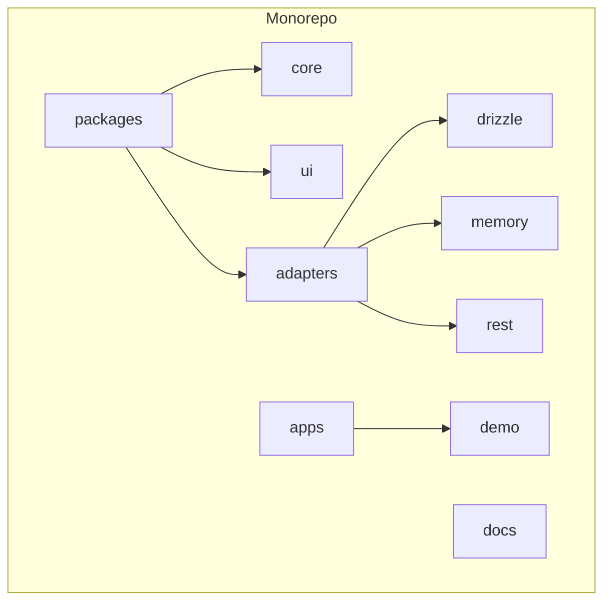
Sources: [README.md:157-169]()

### Package Descriptions

| Package | Description | Status |
| :--- | :--- | :--- |
| `@better-tables/core` | Contains the foundational logic: type-safe builders, state managers, and utilities. | ✅ Ready |
| `@better-tables/ui` | A set of production-ready React components built with shadcn/ui. | ✅ Ready |
| `@better-tables/adapters-drizzle` | Integrates with Drizzle ORM, providing automatic relationship detection and `JOIN` generation. | ✅ Ready |
| `@better-tables/adapters-memory` | An in-memory adapter primarily used for testing and demos. | ✅ Ready |
| `@better-tables/adapters-rest` | A planned adapter for connecting to REST APIs. | 🚧 In Progress |
| `@better-tables/cli` | Command-line utilities for initializing projects and accessing documentation. | ✅ Ready |
| `@better-tables/demo` | A comprehensive Next.js application showcasing all library features. | ✅ Ready |

Sources: [README.md:171-176](), [README.md:262-270](), [packages/cli/README.md:3]()

## Core Concepts

The power of Better Tables comes from a few fundamental concepts that work together to provide a seamless developer experience.

### Column Builders

Column builders offer a fluent, type-safe API to define table columns declaratively. You create a builder for your data type, and then define each column with its properties.

*   **`createColumnBuilder<T>()`**: A factory function to create a typed column builder.
*   **Builder Types**: `text()`, `number()`, `date()`, `boolean()`, `option()`, and `multiOption()` cater to different data types.
*   **Fluent API**: Chain methods like `.id()`, `.displayName()`, `.accessor()`, `.filterable()`, and `.sortable()` to configure each column.

```typescript
import { createColumnBuilder } from '@better-tables/core';

interface User {
  id: string;
  name: string;
  email: string;
  role: 'admin' | 'editor' | 'viewer';
}

// Create a column builder for the User type
const cb = createColumnBuilder<User>();

// Define columns with a fluent API
const columns = [
  cb
    .text()
    .id('name')
    .displayName('Name')
    .accessor((user) => user.name)
    .filterable()
    .sortable()
    .build(),

  cb
    .option()
    .id('role')
    .displayName('Role')
    .accessor((user) => user.role)
    .options([
      { value: 'admin', label: 'Admin' },
      { value: 'editor', label: 'Editor' },
    ])
    .filterable()
    .build(),
];
```
Sources: [packages/core/README.md:38-84]()

### State Management

Better Tables provides a set of managers to handle the table's state. These can be used individually or coordinated by the unified `TableStateManager`.

This diagram shows how `TableStateManager` orchestrates the other state managers.
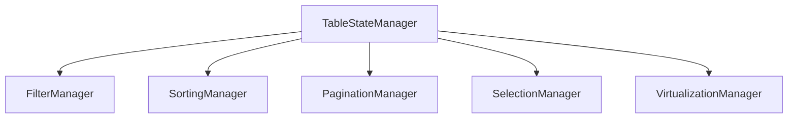
Sources: [packages/core/README.md:104-112](), [packages/core/src/index.ts:31-37]()

| Manager | Responsibility |
| :--- | :--- |
| `FilterManager` | Manages filter state, including adding, removing, and updating filters. |
| `SortingManager` | Handles single and multi-column sorting state. |
| `PaginationManager` | Manages pagination state like current page and page size. |
| `SelectionManager` | Tracks selected rows for bulk actions. |
| `VirtualizationManager` | Manages state for virtual scrolling. |
| `TableStateManager` | A unified manager that coordinates all other state managers and emits events on state changes. |

Sources: [packages/core/README.md:183-241](), [packages/core/src/index.ts:31-37]()

### Database Adapters

Adapters are the bridge between Better Tables and your data source. They translate table state (filters, sorting, pagination) into queries that your backend can understand. The Drizzle adapter is particularly powerful due to its ability to understand your database schema.

This flow shows how the Drizzle adapter processes a data request.
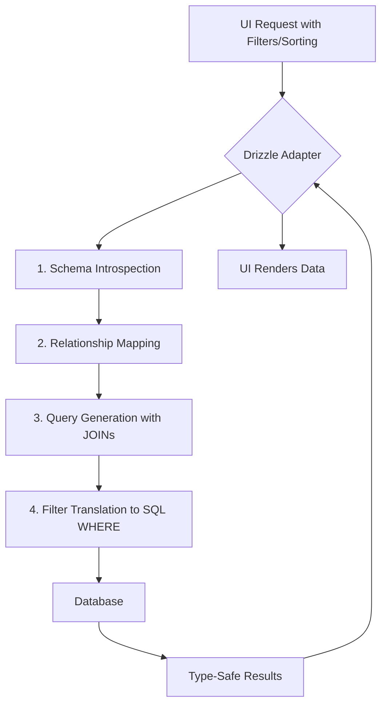
Sources: [README.md:178-195]()

## Getting Started

Integrating Better Tables into a React project is straightforward.

### 1. Installation

Install the core package and an adapter of your choice. The Drizzle adapter is recommended for projects using Drizzle ORM.

```bash
# Core package
bun add @better-tables/core

# UI components (optional but recommended)
bun add @better-tables/ui

# Drizzle adapter
bun add @better-tables/adapters-drizzle
```
Sources: [README.md:73-79](), [apps/demo/package.json:13-15]()

### 2. Basic Usage

Define your columns, provide data, and render the `BetterTable` component. The library automatically provides the UI for filtering, sorting, and pagination.

```tsx
import { BetterTable } from '@better-tables/ui';
import { createColumnBuilder } from '@better-tables/core';

interface User {
  id: string;
  name: string;
  email: string;
}

const cb = createColumnBuilder<User>();

const columns = [
  cb.text().id('name').displayName('Name').accessor(u => u.name).build(),
  cb.text().id('email').displayName('Email').accessor(u => u.email).build(),
];

function UserTable({ users }: { users: User[] }) {
  return (
    <BetterTable
      columns={columns}
      data={users}
      features={{
        filtering: true,
        sorting: true,
        pagination: true,
        rowSelection: true,
      }}
    />
  );
}
```
Sources: [README.md:81-103]()

### 3. Server-Side Rendering with Next.js

Better Tables is designed to work seamlessly with server-side rendering frameworks like Next.js. State is managed through URL search parameters, making views easily shareable.

```typescript
// app/page.tsx (Server Component)
import { deserializeFiltersFromURL } from '@better-tables/core';
import { getAdapter } from '@/lib/adapter';

export default async function Page({ searchParams }: { searchParams: Promise<Record<string, string>> }) {
  const params = await searchParams;

  // Parse URL params for state
  const page = Number.parseInt(params.page || '1', 10);
  const limit = Number.parseInt(params.limit || '10', 10);
  const filters = params.filters ? deserializeFiltersFromURL(params.filters) : [];
  // ... parsing for sorting ...

  // Fetch data using the adapter
  const adapter = await getAdapter();
  const result = await adapter.fetchData({
    pagination: { page, limit },
    filters,
    // ... sorting ...
  });

  return <Table data={result.data} totalCount={result.total} />;
}
```
Sources: [packages/core/README.md:386-422](), [apps/demo/README.md:38-43]()

## Command-Line Interface (CLI)

The `@better-tables/cli` package provides utilities to streamline project setup and documentation access. It can be run directly without global installation using `pnpm dlx`, `npx`, or `bunx`.

| Command | Description |
| :--- | :--- |
| `docs [type]` | Opens the relevant documentation page in your browser. `type` can be `main`, `core`, `ui`, or `drizzle`. |
| `init` | Initializes Better Tables in your project by installing dependencies and copying necessary component files. |

**Example:**
```bash
# Open the core package documentation
pnpm dlx @better-tables/cli docs core

# Initialize Better Tables in the current project
pnpm dlx @better-tables/cli init -y
```
Sources: [packages/cli/README.md:3-20]()

## The Demo App

The repository includes a comprehensive demo application located in `apps/demo`. It serves as a complete, working example that showcases all of Better Tables' features in a real-world context.

**Features Demonstrated:**
*   **All Column Types**: Text, Number, Date, Boolean, and Option columns.
*   **Complex Relationships**: One-to-one (User → Profile), one-to-many (User → Posts), and many-to-many (Posts ↔ Categories).
*   **Advanced Operations**: Cross-table filtering, multi-column sorting, row selection, and bulk actions.
*   **Data Schema**: The demo is seeded with a rich dataset including users, profiles, posts, and comments to simulate a realistic application.

Exploring the demo app is an excellent way to understand how to implement advanced features and structure a project with Better Tables.

Sources: [apps/demo/README.md:5-20](), [apps/demo/lib/db/seed.ts]()

## Conclusion

Better Tables is a modern, powerful library for React that fundamentally simplifies the process of building complex data tables. By combining a type-safe, declarative API with intelligent database adapters, it handles the heavy lifting of data fetching, filtering, and state management. This allows developers to focus on building features rather than writing repetitive boilerplate, resulting in faster development cycles and more maintainable code.

### Getting Started

<details>
<summary>Relevant source files</summary>

The following files were used as context for generating this wiki page:

- [README.md](https://github.com/Better-Tables/better-tables/blob/main/README.md)
- [packages/core/README.md](https://github.com/Better-Tables/better-tables/blob/main/packages/core/README.md)
- [apps/demo/README.md](https://github.com/Better-Tables/better-tables/blob/main/apps/demo/README.md)
- [examples/nextjs-setup-example.md](https://github.com/Better-Tables/better-tables/blob/main/examples/nextjs-setup-example.md)
- [packages/core/src/index.ts](https://github.com/Better-Tables/better-tables/blob/main/packages/core/src/index.ts)
- [packages/cli/README.md](https://github.com/Better-Tables/better-tables/blob/main/packages/cli/README.md)
- [apps/demo/lib/db/seed.ts](https://github.com/Better-Tables/better-tables/blob/main/apps/demo/lib/db/seed.ts)
- [packages/adapters/drizzle/examples/basic-usage.ts](https://github.com/Better-Tables/better-tables/blob/main/packages/adapters/drizzle/examples/basic-usage.ts)
</details>

# Getting Started

Better Tables is a type-safe, database-agnostic table library for React designed to simplify the creation of complex data tables. It provides advanced features like filtering, sorting, pagination, and virtualization with end-to-end type safety, from database queries to UI components. The core philosophy is to define columns declaratively and let the library handle the boilerplate for data operations and state management.

This guide will walk you through the initial setup, core concepts, and a basic implementation of Better Tables in a Next.js project. Key features include automatic relationship filtering with database adapters, a powerful filtering system, and persistent URL state for shareable views.

Sources: [README.md:1-10](), [packages/core/README.md:3-5]()

## Architecture Overview

Better Tables uses a monorepo architecture, separating concerns into distinct packages. This modular design allows developers to use parts of the library independently or together for a complete solution.

Sources: [README.md:200-202]()

The diagram below illustrates the high-level structure of the `better-tables` monorepo.

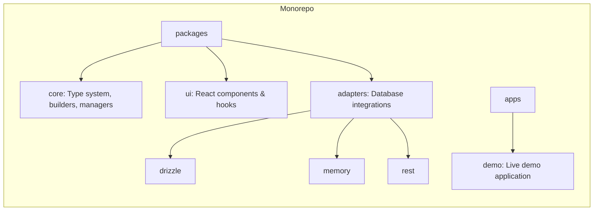
Sources: [README.md:203-217]()

### Key Packages

| Package                       | Description                                                              |
| ----------------------------- | ------------------------------------------------------------------------ |
| `@better-tables/core`         | The foundational package providing the type system, column builders, and state managers. |
| `@better-tables/ui`           | A set of production-ready React components built with shadcn/ui.         |
| `@better-tables/adapters-drizzle` | An adapter for Drizzle ORM that enables automatic relationship detection and JOIN generation. |
| `@better-tables/cli`          | Command-line utilities for initializing projects and accessing documentation. |

Sources: [README.md:219-223](), [packages/cli/README.md:3-5]()

## Installation

To get started, you need the core package and a database adapter. The Drizzle adapter is recommended for its advanced features.

```bash
# Core package
bun add @better-tables/core

# Drizzle adapter
bun add @better-tables/adapters-drizzle
```

If you plan to use the pre-built UI components, you will also need the `@better-tables/ui` package.

```bash
# UI package (optional)
bun add @better-tables/ui
```

Sources: [README.md:54-59](), [packages/core/README.md:18-25]()

### CLI Initialization

For a quicker setup in a project with `shadcn/ui` already initialized, you can use the CLI `init` command. This command validates your setup, installs required components, and copies necessary files into your project.

```bash
pnpm dlx @better-tables/cli init
```

This command performs the following actions:
1.  Validates `shadcn/ui` configuration.
2.  Installs missing `shadcn/ui` components.
3.  Copies table and filter components into your project.
4.  Transforms import paths to match your project's aliases.

Sources: [packages/cli/README.md:33-49]()

## Core Concepts

Understanding the core concepts of column builders and data adapters is essential for using Better Tables effectively.

### Column Definition

Columns are defined using a fluent, type-safe API provided by `createColumnBuilder`. This builder allows you to declaratively configure each column's properties, such as its ID, display name, data accessor, and features like sorting and filtering.

The process of defining a column is visualized below.

```mermaid
flowchart TD
    A[Start: createColumnBuilder<T>] --> B{Select Column Type};
    B --> C1[text()];
    B --> C2[number()];
    B --> C3[date()];
    B --> C4[option()];
    C1 --> D[id('...').displayName('...').accessor(...)];
    C2 --> D;
    C3 --> D;
    C4 --> D;
    D --> E{Add Features};
    E --> F1[sortable()];
    E --> F2[filterable()];
    E --> F3[searchable()];
    F1 & F2 & F3 --> G[build()];
    G --> H[ColumnDefinition<T>];
```
Sources: [packages/core/README.md:28-31](), [packages/core/README.md:112-123]()

#### Basic Example

Here is how you would define a set of columns for a `User` data type.

```typescript
import { createColumnBuilder } from '@better-tables/core';

interface User {
  id: string;
  name: string;
  email: string;
  role: 'admin' | 'editor' | 'viewer';
}

const cb = createColumnBuilder<User>();

const columns = [
  cb.text().id('name').displayName('Name').accessor(u => u.name).build(),
  cb.text().id('email').displayName('Email').accessor(u => u.email).build(),
  cb.option().id('role').displayName('Role').accessor(u => u.role)
    .options([
      { value: 'admin', label: 'Admin' },
      { value: 'editor', label: 'Editor' },
      { value: 'viewer', label: 'Viewer' },
    ]).build(),
];
```
Sources: [README.md:63-83]()

#### Column Builder Types

The `createColumnBuilder` factory provides several specialized builders for different data types.

| Builder Type              | Description                                      |
| ------------------------- | ------------------------------------------------ |
| `TextColumnBuilder`       | For text data with search and validation.        |
| `NumberColumnBuilder`     | For numeric data with ranges and formatting.     |
| `DateColumnBuilder`       | For date/time data with formatting and ranges.   |
| `BooleanColumnBuilder`    | For boolean values with custom labels.           |
| `OptionColumnBuilder`     | For single-select options.                       |
| `MultiOptionColumnBuilder`| For multi-select options.                        |

Sources: [packages/core/README.md:115-120](), [packages/core/src/index.ts:20-27]()

### Data Adapters

Adapters are the bridge between Better Tables and your data source. They translate table state (filters, sorting, pagination) into queries that your backend can understand. The `DrizzleAdapter` is particularly powerful as it can automatically detect schema relationships and generate `JOIN` queries.

This enables filtering across related tables without writing any SQL. For example, if a `User` has a `Profile`, you can define a column for `profile.location` and the adapter will handle the join.

```typescript
// Column definition for a related field
cb.text().id('profile.location').accessor(u => u.profile?.location).build(),
```
Sources: [README.md:41-44](), [README.md:104-113]()

#### Drizzle Adapter Setup

To use the Drizzle adapter, you instantiate it with your Drizzle instance and schema.

```typescript
import { DrizzleAdapter } from '@better-tables/adapters-drizzle';
import { drizzle } from 'drizzle-orm/better-sqlite3';
import { db, schema, usersRelations } from './db';

// Create adapter - it automatically detects schema and driver
const adapter = new DrizzleAdapter({
  db,
  schema,
  mainTable: 'users',
  driver: 'sqlite',
  autoDetectRelationships: true,
});
```
Sources: [README.md:143-149](), [packages/adapters/drizzle/examples/basic-usage.ts:303-324]()

## Next.js Integration

The demo application showcases a common pattern for integrating Better Tables in a Next.js App Router project. It uses Server Components for initial data fetching and Client Components for interactivity.

Sources: [apps/demo/README.md:33-40]()

The data flow for a page load in the Next.js demo is as follows:

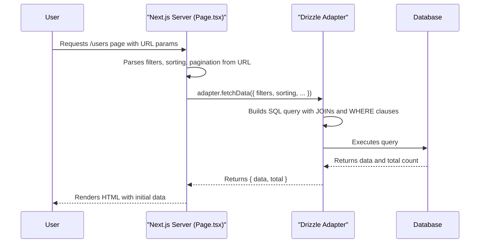
Sources: [apps/demo/README.md:73-78](), [packages/core/README.md:315-344]()

### 1. Tailwind CSS Configuration

Ensure your `tailwind.config.js` is configured to scan the `@better-tables/ui` package for styles.

```javascript
// tailwind.config.js
module.exports = {
  // ...
  content: [
    './pages/**/*.{ts,tsx}',
    './components/**/*.{ts,tsx}',
    './app/**/*.{ts,tsx}',
    // Add Better Tables UI components
    "./node_modules/@better-tables/ui/**/*.{js,ts,jsx,tsx}",
  ],
  // ...
}
```
Sources: [examples/nextjs-setup-example.md:12-25]()

### 2. Data Fetching (Server Component)

The main page component (`app/page.tsx`) is a Server Component responsible for fetching the initial data. It parses state from URL search parameters and passes it to the adapter.

```typescript
// app/page.tsx
import { deserializeFiltersFromURL } from '@better-tables/core';
import { getAdapter } from '@/lib/adapter';

export default async function Page({ searchParams }) {
  // Parse URL params for filters, sorting, and pagination
  const filters = deserializeFiltersFromURL(searchParams.filters || '');
  const page = Number.parseInt(searchParams.page || '1', 10);
  const limit = Number.parseInt(searchParams.limit || '10', 10);

  // Fetch data using the adapter
  const adapter = await getAdapter();
  const result = await adapter.fetchData({
    pagination: { page, limit },
    filters,
    // ...sorting
  });

  // Render a client component with the fetched data
  return <UsersTableClient data={result.data} totalCount={result.total} />;
}
```
Sources: [packages/core/README.md:315-344](), [apps/demo/README.md:73-78]()

### 3. Interactivity (Client Component)

A client component (`users-table-client.tsx`) wraps the table and handles user interactions like changing filters, sorting, or pages. It updates the URL, which triggers a re-render of the server component with new data.

This pattern keeps the data fetching logic on the server while providing a responsive client-side experience.

Sources: [apps/demo/README.md:80-85]()

## Summary

Getting started with Better Tables involves three main steps: installing the necessary packages, defining your columns with the `createColumnBuilder`, and connecting your data source via an adapter. The library's architecture is designed to be flexible, allowing for simple setups with in-memory data or complex, server-side implementations with relational databases. By leveraging the Drizzle adapter, you can unlock powerful, automatic relationship handling that significantly reduces boilerplate code for filtering and sorting across tables.

### Project Philosophy

<details>
<summary>Relevant source files</summary>
The following files were used as context for generating this wiki page:
- [README.md](https://github.com/Better-Tables/better-tables/blob/main/README.md)
- [packages/core/README.md](https://github.com/Better-Tables/better-tables/blob/main/packages/core/README.md)
- [apps/demo/README.md](https://github.com/Better-Tables/better-tables/blob/main/apps/demo/README.md)
- [packages/adapters/drizzle/examples/advanced-relationships.ts](https://github.com/Better-Tables/better-tables/blob/main/packages/adapters/drizzle/examples/advanced-relationships.ts)
- [packages/cli/README.md](https://github.com/Better-Tables/better-tables/blob/main/packages/cli/README.md)
- [packages/core/src/index.ts](https://github.com/Better-Tables/better-tables/blob/main/packages/core/src/index.ts)
- [examples/nextjs-setup-example.md](https://github.com/Better-Tables/better-tables/blob/main/examples/nextjs-setup-example.md)
- [apps/demo/lib/db/seed.ts](https://github.com/Better-Tables/better-tables/blob/main/apps/demo/lib/db/seed.ts)
- [packages/cli/src/lib/file-operations.ts](https://github.com/Better-Tables/better-tables/blob/main/packages/cli/src/lib/file-operations.ts)
</details>

# Project Philosophy

The core philosophy of Better Tables is to revolutionize the development of complex, relational data tables in React by prioritizing developer experience, type safety, and abstraction. The project's motto, "Stop writing boilerplate. Start shipping features," encapsulates its primary goal: to eliminate the repetitive and error-prone tasks associated with table state management, data fetching, and UI wiring.

Better Tables achieves this by providing a declarative, type-safe, and database-agnostic toolkit. It abstracts away the complexities of filtering, sorting, pagination, and relationship-based data fetching, allowing developers to define table behavior once and have it work seamlessly from the database to the UI. The architecture is intentionally modular, separating core logic, UI components, and data adapters to ensure flexibility and maintainability.

Sources: [README.md:1-12](), [README.md:23-31]()

## Core Principles

### 1. Simplicity and Declarative API

The project is designed to combat the "soul-crushing mix of useState hooks, prop drilling, and scattered utility functions" often required to build tables. The primary tool for this is a fluent, declarative API for defining columns.

Sources: [README.md:16-22]()

A `ColumnBuilder` allows developers to define a column's properties, data accessors, and features (like filtering and sorting) in a chained, readable format. This approach centralizes column logic and removes the need for manual state handling for each feature.

This diagram illustrates the simplified workflow promoted by Better Tables compared to traditional methods.

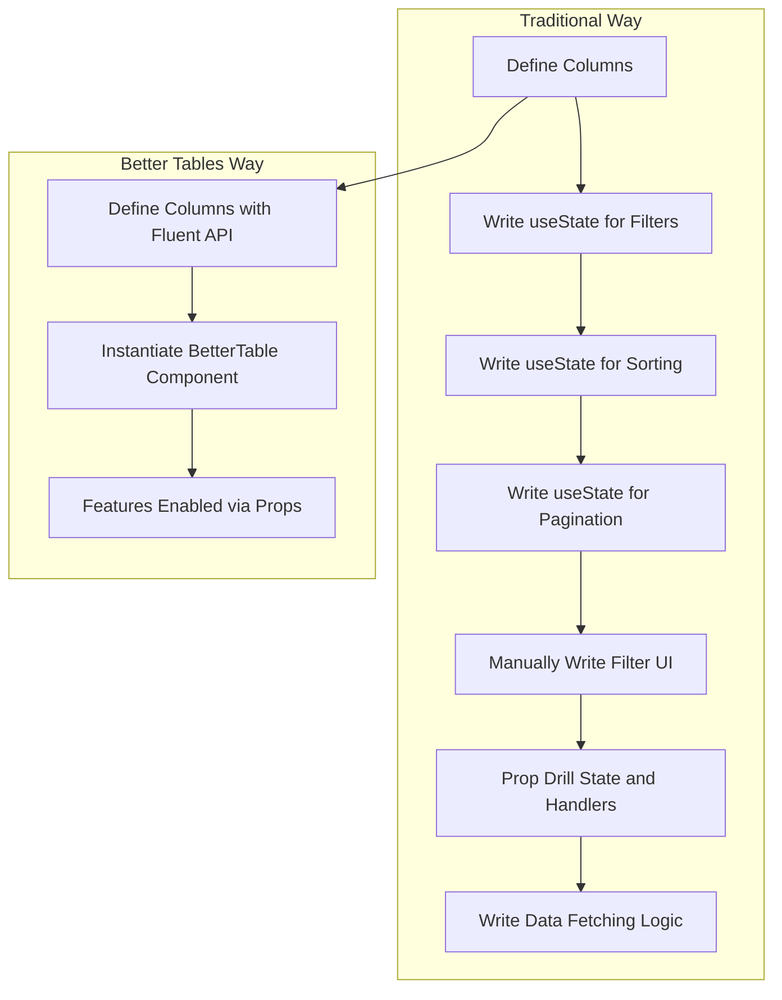
Sources: [README.md:16-22](), [packages/core/README.md:27-72]()

### 2. End-to-End Type Safety

A foundational principle is providing full type safety from the database schema to the final rendered UI component. This is achieved by leveraging TypeScript generics throughout the system.

The `createColumnBuilder<T>()` function is typed with the data model, ensuring that all accessors are type-checked against the model's properties. This safety extends through the data adapters, which return typed data, and into the UI components that consume it.

The diagram below shows the flow of type information through the system.

```mermaid
flowchart TD
    A[Database Schema<br/><i>(e.g., Drizzle Schema)</i>] --> B[Data Adapter<br/><i>(Typed Fetch)</i>]
    B --> C[Data Model<br/><i>(e.g., interface User)</i>]
    C --> D["createColumnBuilder&lt;User&gt;()"]
    D --> E["ColumnDefinition&lt;User&gt;[]"]
    E --> F["BetterTable Component<br/><i>(Typed Props)</i>"]
    F --> G[UI Rendering<br/><i>(Typed Row Data)</i>]
```
Sources: [README.md:28](), [packages/core/README.md:401-412]()

### 3. Modular and Extensible Architecture

Better Tables is structured as a monorepo with a clear separation of concerns, allowing developers to use parts of the system independently or together.

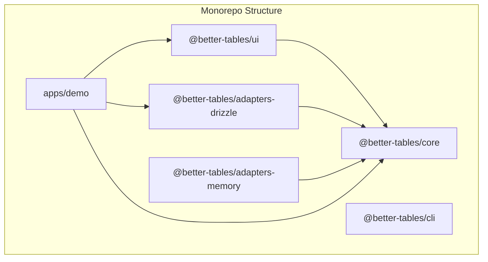
This diagram shows the dependencies between the main packages.

Sources: [README.md:196-213](), [package.json:5-12]()

The key packages and their roles are summarized below:

| Package                      | Role                                                                                             | Source Files                                                                                                                                                                                                                                                                                                                                                                                                                                                                                                                                                                                                                                                                                                                                                                                                                                                                                                                                                                                                                                                                                                                                                                                                                                                                                                                                                                                                                                                                                                                                                                                                                                                                                                                                                                                                                                                                                                                                                                                                                                                                                                                                                                                                                                                                                                                                                                                                                                                                                                                                                                                                                                                                                                                                                                                                                                                                                                                                                                                                                                                                                                                                                                                                                                                                                                                                                                                                                                                                                                                                                                                                                                                                                                                                                                                                                                                                                                                                                                                                                                                                                                                                                                                                                                                                                                                                                                                                                                                                                                                                                                                                                                                                                                                                                                                                                                                                                                                                                                                                                                                                                                                                                                                                                                                                                                                                                                                                                                                                                                                                                                                                                                                                                                                                                                                                                                                                                                                                                                                                                                                                                                                                                                                                                                                                                                                                                                                                                                                                                                                                                                                                                                                                                                                                                                                                                                                                                                                                                                                                                                                                                                                                                                                                                                                                                                                                                                                                                                                                                                                                                                                                                                                                                                                                                                                                                                                                                                                                                                                                                                                                                                                                                                                                                                                                                                                                                                                                                                                                                                                                                                                                                                                                                                                                                                                                                                                                                                                                                                                                                                                                                                                                                                                                                                                                                                                                                                                                                                                                                                                                                                                                                                                                                                                                                                                                                                                                                                                                                                                                                                                                                                                                                                                                                                                                                                                                                                                                                                                                                                                                                                                                                                                                                                                                                                                                                                                                                                                                                                                                                                                                                                                                                                                                                                                                                                                                                                                                                                                                                                                                                                                                                                                                                                                                                                                                                                                                                                                                                                                                                                                                                                                                                                                                                                                                                                                                                                                                                                                                                                                                                                                                                                                                                                                                                                                                                                                                                                                                                                                                                                                                                                                                                                                                                                                                                                                                                                                                                                                                                                                                                                                                                                                                                                                                                                                                                                                                                                                                                                                                                                                                                                                                                                                                                                                                                                                                                                                                                                                                                                                                                                                                                                                                                                                                                                                                                                                                                                                                                                                                                                                                                                                                                                                                                                                                                                                                                                                                                                                                                                                                                                                                                                                                                                                                                                                                                                                                                                                                                                                                                                                                                                                                                                                                                                                                                                                                                                                                                                                                                                                                                                                                                                                                                                                                                                                                                                                                                                                                                                                                                                                                                                                                                                                                                                                                                                                                                                                                                                                                                                                                                                                                                                                                                                                                                                                                                                                                                                                                                                                                                                                                                                                                                                                                                                                                                                                                                                                                                                                                                                                                                                                                                                                                                                                                                                                                                                                                                                                                                                                                                                                                                                                                                                                                                                                                                                                                                                                                                                                                                                                                                                                                                                                                                                                                                                                                                                                                                                                                                                                                                                                                                                                                                                                                                                                                                                                                                                                                                                                                                                                                                                                                                                                                                                                                                                                                                                                                                                                                                                                                                                                                                                                                                                                                                                                                                                                                                                                                                                                                                                                                                                                                                                                                                                                                                                                                                                                                                                                                                                                                                                                                                                                                                                                                                                                                                                                                                                                                                                                                                                                                                                                                                                                                                                                                                                                                                                                                                                                                                                                                                                                                                                                                                                                                                                                                                                                                                                                                                                                                                                                                                                                                                                                                                                                                                                                                                                                                                                                                                                                                                                                                                                                                                                                                                                                                                                                                                                                                                                                                                                                                                                                                                                                                                                                                                                                                                                                                                                                                                                                                                                                                                                                                                                                                                                                                                                                                                                                                                                                                                                                                                                                                                                                                                                                                                                                                                                                                                                                                                                                                                                                                                                                                                                                                                                                                                                                                                                                                                                                                                                                                                                                                                                                                                                                                                                                                                                                                                                                                                                                                                                                                                                                                                                                                                                                                                                                                                                                                                                                                                                                                                                                                                                                                                                                                                                                                                                                                                                                                                                                                                                                                                                                                                                                                                                                                                                                                                                                                                                                                                                                                                                                                                                                                                                                                                                                                                                                                                                                                                                                                                                                                                                                                                                                                                                                                                                                                                                                                                                                                                                                                                                                                                                                                                                                                                                                                                                                                                                                                                                                                                                                                                                                                                                                                                                                                                                                                                                                                                                                                                                                                                                                                                                                                                                                                                                                                                                                                                                                                                                                                                                                                                                                                                                                                                                                                                                                                                                                                                                                                                                                                                                                                                                                                                                                                                                                                                                                                                                                                                                                                                                                                                                                                                                                                                                                                                                                                                                                                                                                                                                                                                                                                                                                                                                                                                                                                                                                                                                                                                                                                                                                                                                                                                                                                                                                                                                                                                                                                                                                                                                                                                                                                                                                                                                                                                                                                                                                                                                                                                                                                                                                                                                                                                                                                                                                                                                                                                                                                                                                                                                                                                                                                                                                                                                                                                                                                                                                                                                                                                                                                                                                                                                                                                                                                                                                                                                                                                                                                                                                                                                                                                                                                                                                                                                                                                                                                                                                                                                                                                                                                                                                                                                                                                                                                                                                                                                                                                                                                                                                                                                                                                                                                                                                                                                                                                                                                                                                                                                                                                                                                                                                                                                                                                                                                                                                                                                                                                                                                                                                                                                                                                                                                                                                                                                                                                                                                                                                                                                                                                                                                                                                                                                                                                                                                                                                                                                                                                                                                                                                                                                                                                                                                                                                                                                                                                                                                                                                                                                                                                                                                                                                                                                                                                                                                                                                                                                                                                                                                                                                                                                                                                                                                                                                                                                                                                                                                                                                                                                                                                                                                                                        -
| `@better-tables/core`            | Provides the foundational, framework-agnostic logic: column builders, state managers, and type definitions. | [packages/core/README.md:3-6](), [packages/core/package.json:3]()                                                                                                                                                                                                                                                                                                                                                                                                                                                                                                                                                                                                                                                                                                                                                                                                                                                                                                                                                                                                                                                                                                                                                                                                                                                                                                                                                                                                                                                                                                                                                                                                                                                                                                                                                                                                                                                                                                                                                                                                                                                                                                                                                                                                                                                                                                                                                                                                                                                                                                                                                                                                                                                                                                                                                                                                                                                                                                                                                                                                                                                                                                                                                                                                                                                                                                                                                                                                                                                                                                                                                                                                                                                                                                                                                                                                                                                                                                                                                                                                                                                                                                                                                                                                                                                                                                                                                                                                                                                                                                                                                                                                                                                                                                                                                                                                                                                                                                                                                                                                                                                                                                                                                                                                                                                                                                                                                                                                                                                                                                                                                                                                                                                                                                                                                                                                                                                                                                                                                                                                                                                                                                                                                                                                                                                                                                                                                                                                                                                                                                                                                                                                                                                                                                                                                                                                                                                                                                                                                                                                                                                                                                                                                                                                                                                                                                                                                                                                                                                                                                                                                                                                                                                                                                                                                                                                                                                                                                                                                                                                                                                                                                                                                                                                                                                                                                                                                                                                                                                                                                                                                                                                                                                                                                                                                                                                                                                                                                                                                                                                                                                                                                                                                                                                                                                                                                                                                                                                                                                                                                                                                                                                                                                                                                                                                                                                                                                                                                                                                                                                                                                                                                                                                                                                                                                                                                                                                                                                                                                                                                                                                                                                                                                                                                                                                                                                                                                                                                                                                                                                                                                                                                                                                                                                                                                                                                                                                                                                                                                                                                                                                                                                                                                                                                                                                                                                                                                                                                                                                                                                                                                                                                                                                                                                                                                                                                                                                                                                                                                                                                                                                                                                                                                                                                                                                                                                                                                                                                                                                                                                                                                                                                                                                                                                                                                                                                                                                                                                                                                                                                                                                                                                                                                                                                                                                                                                                                                                                                                                                                                                                                                                                                                                                                                                                                                                                                                                                                                                                                                                                                                                                                                                                                                                                                                                                                                                                                                                                                                                                                                                                                                                                                                                                                                                                                                                                                                                                                                                                                                                                                                                                                                                                                                                                                                                                                                                                                                                                                                                                                                                                                                                                                                                                                                                                                                                                                                                                                                                                                                                                                                                                                                                                                                                                                                                                                                                                                                                                                                                                                                                                                                                                                                                                                                                                                                                                                                                                                                                                                                                                                                                                                                                                                                                                                                                                                                                                                                                                                                                                                                                                                                                                                                                                                                                                                                                                                                                                                                                                                                                                                                                                                                                                                                                                                                                                                                                                                                                                                                                                                                                                                                                                                                                                                                                                                                                                                                                                                                                                                                                                                                                                                                                                                                                                                                                                                                                                                                                                                                                                                                                                                                                                                                                                                                                                                                                                                                                                                                                                                                                                                                                                                                                                                                                                                                                                                                                                                                                                                                                                                                                                                                                                                                                                                                                                                                                                                                                                                                                                                                                                                                                                                                                                                                                                                                                                                                                                                                                                                                                                                                                                                                                                                                                                                                                                                                                                                                                                                                                                                         -
| `@better-tables/ui`              | A set of production-ready, accessible React components built with `shadcn/ui` and Radix UI.          | [README.md:209](), [packages/ui/package.json:4]()                                                                                                                                                                                                                                                                                                                                                                                                                                                                                                                                                                                                                                                                                                                                                                                                                                                                                                                                                                                                                                                                                                                                                                                                                                                                                                                                                                                                                                                                                                                                                                                                                                                                                                                                                                                                                                                                                                                                                                                                                                                                                                                                                                                                                                                                                                                                                                                                                                                                                                                                                                                                                                                                                                                                                                                                                                                                                                                                                                                                                                                                                                                                                                                                                                                                                                                                                                                                                                                                                                                                                                                                                                                                                                                                                                                                                                                                                                                                                                                                                                                                                                                                                                                                                                                                                                                                                                                                                                                                                                                                                                                                                                                                                                                                                                                                                                                                                                                                                                                                                                                                                                                                                                                                                                                                                                                                                                                                                                                                                                                                                                                                                                                                                                                                                                                                                                                                                                                                                                                                                                                                                                                                                                                                                                                                                                                                                                                                                                                                                                                                                                                                                                                                                                                                                                                                                                                                                                                                                                                                                                                                                                                                                                                                                                                                                                                                                                                                                                                                                                                                                                                                                                                                                                                                                                                                                                                                                                                                                                                                                                                                                                                                                                                                                                                                                                                                                                                                                                                                                                                                                                                                                                                                                                                                                                                                                                                                                                                                                                                                                                                                                                                                                                                                                                                                                                                                                                                                                                                                                                                                                                                                                                                                                                                                                                                                                                                                                                                                                                                                                                                                                                                                                                                                                                                                                                                                                                                                                                                                                                                                                                                                                                                                                                                                                                                                                                                                                                                                                                                                                                                                                                                                                                                                                                                                                                                                                                                                                                                                                                                                                                                                                                                                                                                                                                                                                                                                                                                                                                                                                                                                                                                                                                                                                                                                                                                                                                                                                                                                                                                                                                                                                                                                                                                                                                                                                                                                                                                                                                                                                                                                                                                                                                                                                                                                                                                                                                                                                                                                                                                                                                                                                                                                                                                                                                                                                                                                                                                                                                                                                                                                                                                                                                                                                                                                                                                                                                                                                                                                                                                                                                                                                                                                                                                                                                                                                                                                                                                                                                                                                                                                                                                                                                                                                                                                                                                                                                                                                                                                                                                                                                                                                                                                                                                                                                                                                                                                                                                                                                                                                                                                                                                                                                                                                                                                                                                                                                                                                                                                                                                                                                                                                                                                                                                                                                                                                                                                                                                                                                                                                                                                                                                                                                                                                                                                                                                                                                                                                                                                                                                                                                                                                                                                                                                                                                                                                                                                                                                                                                                                                                                                                                                                                                                                                                                                                                                                                                                                                                                                                                                                                                                                                                                                                                                                                                                                                                                                                                                                                                                                                                                                                                                                                                                                                                                                                                                                                                                                                                                                                                                                                                                                                                                                                                                                                                                                                                                                                                                                                                                                                                                                                                                                                                                                                                                                                                                                                                                                                                                                                                                                                                                                                                                                                                                                                                                                                                                                                                                                                                                                                                                                                                                                                                                                                                                                                                                                                                                                                                                                                                                                                                                                                                                                                                                                                                                                                                                                                                                                                                                                                                                                                                                                                                                                                                                                                                                                                                                                                                                                                                                                                                                                                                                                                                                                                                                                                                                                                                                                                                                                                                                                                                                    -
| `@better-tables/adapters/*`      | Connects the core logic to a backend (e.g., Drizzle, REST). Handles query generation and data fetching. | [README.md:121-122](), [README.md:210-211]()                                                                                                                                                                                                                                                                                                                                                                                                                                                                                                                                                                                                                                                                                                                                                                                                                                                                                                                                                                                                                                                                                                                                                                                                                                                                                                                                                                                                                                                                                                                                                                                                                                                                                                                                                                                                                                                                                                                                                                                                                                                                                                                                                                                                                                                                                                                                                                                                                                                                                                                                                                                                                                                                                                                                                                                                                                                                                                                                                                                                                                                                                                                                                                                                                                                                                                                                                                                                                                                                                                                                                                                                                                                                                                                                                                                                                                                                                                                                                                                                                                                                                                                                                                                                                                                                                                                                                                                                                                                                                                                                                                                                                                                                                                                                                                                                                                                                                                                                                                                                                                                                                                                                                                                                                                                                                                                                                                                                                                                                                                                                                                                                                                                                                                                                                                                                                                                                                                                                                                                                                                                                                                                                                                                                                                                                                                                                                                                                                                                                                                                                                                                                                                                                                                                                                                                                                                                                                                                                                                                                                                                                                                                                                                                                                                                                                                                                                                                                                                                                                                                                                                                                                                                                                                                                                                                                                                                                                                                                                                                                                                                                                                                                                                                                                                                                                                                                                                                                                                                                                                                                                                                                                                                                                                                                                                                                                                                                                                                                                                                                                                                                                                                                                                                                                                                                                                                                                                                                                                                                                                                                                                                                                                                                                                                                                                                                                                                                                                                                                                                                                                                                                                                                                                                                                                                                                                                                                                                                                                                                                                                                                                                                                                                                                                                                                                                                                                                                                                                                                                                                                                                                                                                                                                                                                                                                                                                                                                                                                                                                                                                                                                                                                                                                                                                                                                                                                                                                                                                                                                                                                                                                                                                                                                                                                                                                                                                                                                                                                                                                                                                                                                                                                                                                                                                                                                                                                                                                                                                                                                                                                                                                                                                                                                                                                                                                                                                                                                                                                                                                                                                                                                                                                                                                                                                                                                                                                                                                                                                                                                                                                                                                                                                                                                                                                                                                                                                                                                                                                                                                                                                                                                                                                                                                                                                                                                                                                                                                                                                                                                                                                                                                                                                                                                                                                                                                                                                                                                                                                                                                                                                                                                                                                                                                                                                                                                                                                                                                                                                                                                                                                                                                                                                                                                                                                                                                                                                                                                                                                                                                                                                                                                                                                                                                                                                                                                                                                                                                                                                                                                                                                                                                                                                                                                                                                                                                                                                                                                                                                                                                                                                                                                                                                                                                                                                                                                                                                                                                                                                                                                                                                                                                                                                                                                                                                                                                                                                                                                                                                                                                                                                                                                                                                                                                                                                                                                                                                                                                                                                                                                                                                                                                                                                                                                                                                                                                                                                                                                                                                                                                                                                                                                                                                                                                                                                                                                                                                                                                                                                                                                                                                                                                                                                                                                                                                                                                                                                                                                                                                                                                                                                                                                                                                                                                                                                                                                                                                                                                                                                                                                                                                                                                                                                                                                                                                                                                                                                                                                                                                                                                                                                                                                                                                                                                                                                                                                                                                                                                                                                                                                                                                                                                                                                                                                                                                                                                                                                                                                                                                                                                                                                                                                                                                                                                                                                                                                                                                                                                                                                                                                                                                                                                                                                                                                                                                                                                                                                                                                                                                                                                                                                                                                                                                                                                                                                                                                                                                                                                                                                                                                                                                                                                                                                                                                                                                                                                                                                                                                                                                                                                                                                                                                                                                                                                                                                                                                                                                                                                                                                                                                                                                                                                                                                                                                                                                                                                                                                                                                                                                                                                                                                                                                                                                                                                                                                                                                                                                                                                                                                                                                                                                                                                                                                                                                                                                                                                                                                                                                                                                                                                                                                                                                                                                                                                                                                                                                                                                                                                                                                                                                                                                                                                                                                                                                                                                                                                                                                                                                                                                                                                                                                                                                                                                                                                                                                                                                                                                                                                                                                                                                                                                                                                                                                                                                                                                                                                                                                                                                                                                                                                                                                                                                                                                                                                                                                                                                                                                                                                                                                                                                                                                                                                                                                                                                                                                                                                                                                                                                                                                                                                                                                                                                                                                                          -
| `@better-tables/cli`             | Provides command-line utilities for project initialization and accessing documentation.                  | [packages/cli/README.md:3-5]()                                                                                                                                                                                                                                                                                                                                                                                                                                                                                                                                                                                                                                                                                                                                                                                                                                                                                                                                                                                                                                                                                                                                                                                                                                                                                                                                                                                                                                                                                                                                                                                                                                                                                                                                                                                                                                                                                                                                                                                                                                                                                                                                                                                                                                                                                                                                                                                                                                                                                                                                                                                                                                                                                                                                                                                                                                                                                                                                                                                                                                                                                                                                                                                                                                                                                                                                                                                                                                                                                                                                                                                                                                                                                                                                                                                                                                                                                                                                                                                                                                                                                                                                                                                                                                                                                                                                                                                                                                                                                                                                                                                                                                                                                                                                                                                                                                                                                                                                                                                                                                                                                                                                                                                                                                                                                                                                                                                                                                                                                                                                                                                                                                                                                                                                                                                                                                                                                                                                                                                                                                                                                                                                                                                                                                                                                                                                                                                                                                                                                                                                                                                                                                                                                                                                                                                                                                                                                                                                                                                                                                                                                                                                                                                                                                                                                                                                                                                                                                                                                                                                                                                                                                                                                                                                                                                                                                                                                                                                                                                                                                                                                                                                                                                                                                                                                                                                                                                                                                                                                                                                                                                                                                                                                                                                                                                                                                                                                                                                                                                                                                                                                                                                                                                                                                                                                                                                                                                                                                                                                                                                                                                                                                                                                                                                                                                                                                                                                                                                                                                                                                                                                                                                                                                                                                                                                                                                                                                                                                                                                                                                                                                                                                                                                                                                                                                                                                                                                                                                                                                                                                                                                                                                                                                                                                                                                                                                                                                                                                                                                                                                                                                                                                                                                                                                                                                                                                                                                                                                                                                                                                                                                                                                                                                                                                                                                                                                                                                                                                                                                                                                                                                                                                                                                                                                                                                                                                                                                                                                                                                                                                                                                                                                                                                                                                                                                                                                                                                                                                                                                                                                                                                                                                                                                                                                                                                                                                                                                                                                                                                                                                                                                                                                                                                                                                                                                                                                                                                                                                                                                                                                                                                                                                                                                                                                                                                                                     -

### 4. Automatic Relationship Handling

The "crown jewel" of Better Tables is its ability to abstract away database joins. By defining columns with dot notation (e.g., `profile.location`), developers signal to the data adapter that a relationship needs to be resolved.

The Drizzle adapter, for example, introspects the Drizzle ORM schema to automatically detect one-to-one, one-to-many, and many-to-many relationships. It then generates the necessary `JOIN` queries to fetch and filter data across tables without requiring the developer to write any SQL.

Sources: [README.md:32-44](), [README.md:100-113](), [README.md:215-226]()

This sequence diagram shows how a filter on a related field is processed:

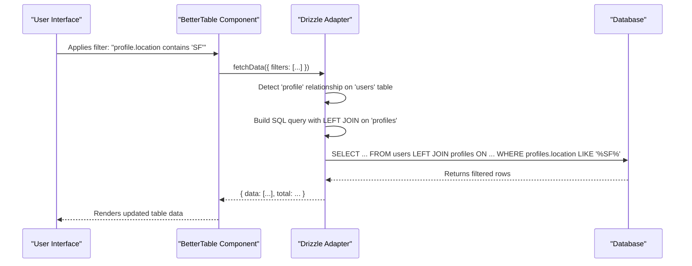
Sources: [README.md:100-113](), [packages/adapters/drizzle/examples/basic-usage.ts:1-325]()

### 5. Centralized and Shareable State

The library provides a robust state management system, abstracting the logic for filters, sorting, and pagination. This state can be automatically synchronized with the URL, making table views easily shareable and bookmarkable.

- **State Managers**: The `@better-tables/core` package includes `FilterManager`, `SortingManager`, and `PaginationManager` to handle discrete parts of the table's state. A unified `TableStateManager` coordinates them all.
- **URL Persistence**: Filters and other state are serialized into a compressed, URL-safe string. This allows the exact state of the table to be captured in the URL's query parameters. The `serializeFiltersToURL` and `deserializeFiltersFromURL` utilities are key to this feature.

This philosophy ensures that the table's state is not ephemeral UI state but a reproducible query that can be shared and re-loaded.

Sources: [README.md:168-174](), [packages/core/README.md:143-220](), [apps/demo/README.md:35-37]()

## Conclusion

The philosophy of Better Tables is to provide a superior developer experience by abstracting complexity without sacrificing power or type safety. By focusing on a declarative API, modular architecture, and intelligent data adapters that automate relationship handling, the project aims to make the creation of sophisticated data tables a simple, fast, and robust process. This allows developers to focus on application features rather than reinventing table management logic.

Sources: [README.md:13-31]()


## System Architecture

### Architecture Overview

<details>
<summary>Relevant source files</summary>
The following files were used as context for generating this wiki page:
- [README.md](https://github.com/Better-Tables/better-tables/blob/main/README.md)
- [packages/core/README.md](https://github.com/Better-Tables/better-tables/blob/main/packages/core/README.md)
- [packages/core/src/index.ts](https://github.com/Better-Tables/better-tables/blob/main/packages/core/src/index.ts)
- [packages/ui/package.json](https://github.com/Better-Tables/better-tables/blob/main/packages/ui/package.json)
- [packages/adapters/drizzle/examples/basic-usage.ts](https://github.com/Better-Tables/better-tables/blob/main/packages/adapters/drizzle/examples/basic-usage.ts)
- [packages/adapters/drizzle/examples/advanced-relationships.ts](https://github.com/Better-Tables/better-tables/blob/main/packages/adapters/drizzle/examples/advanced-relationships.ts)
- [apps/demo/README.md](https://github.com/Better-Tables/better-tables/blob/main/apps/demo/README.md)
- [package.json](https://github.com/Better-Tables/better-tables/blob/main/package.json)
- [packages/cli/README.md](https://github.com/Better-Tables/better-tables/blob/main/packages/cli/README.md)
- [examples/nextjs-setup-example.md](https://github.com/Better-Tables/better-tables/blob/main/examples/nextjs-setup-example.md)
</details>

# Architecture Overview

Better Tables is a type-safe, database-agnostic table library for React, designed with a modular architecture to separate concerns between core logic, UI components, and data fetching. The system is built as a monorepo, enabling independent versioning and usage of its constituent packages. The core philosophy is to provide a declarative API for defining table structures, which then automatically enables advanced features like filtering, sorting, and pagination with minimal boilerplate.

The architecture's key innovation lies in its adapter-based approach, particularly the Drizzle adapter, which can automatically detect database relationships and generate complex `JOIN` queries. This allows developers to filter and sort across related tables without writing SQL, bridging the gap between the data layer and the UI with end-to-end type safety.

Sources: [README.md:12-26](), [README.md:214-225]()

## Monorepo Structure

The project is organized into a monorepo managed by `turbo` and `bun`, with a clear separation between packages, applications, and examples. This structure promotes code reuse and maintainability.

Sources: [package.json:5-11](), [README.md:200-212]()

### Package Dependency Graph

The following diagram illustrates the primary dependencies between the main packages within the monorepo.

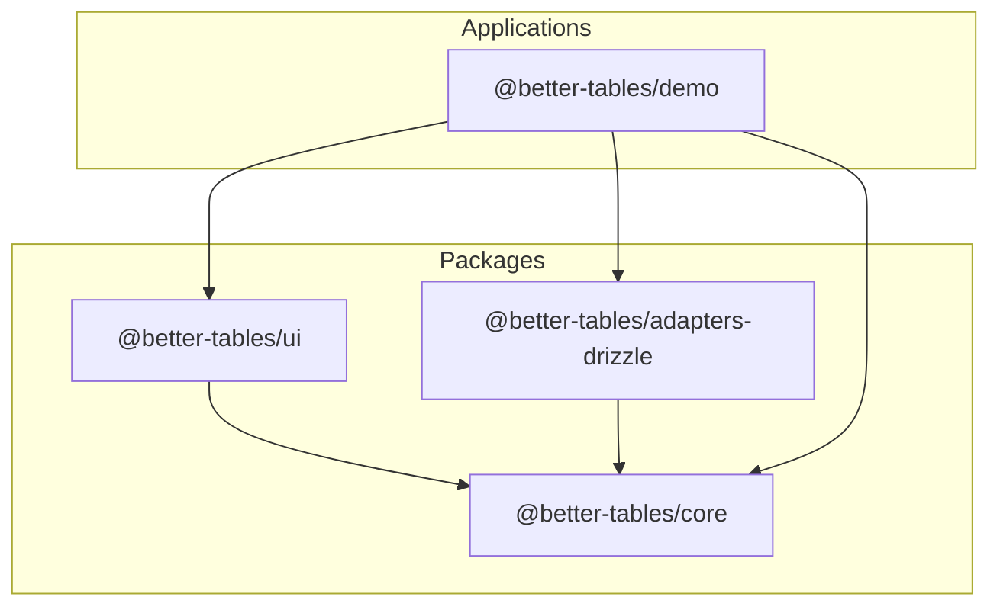
This diagram shows that `@better-tables/core` is the foundational package, with the UI, Adapters, and Demo app all depending on it.

Sources: [apps/demo/package.json:11-13](), [packages/ui/package.json:37-37](), [packages/adapters/drizzle/examples/basic-usage.ts:4-4]()

### Key Packages

| Package                          | Description                                                                                             |
| -------------------------------- | ------------------------------------------------------------------------------------------------------- |
| `@better-tables/core`            | The foundational package containing the type system, column builders, and state management logic.         |
| `@better-tables/ui`              | A set of production-ready React components built with `shadcn/ui` and Radix UI primitives.                |
| `@better-tables/adapters/drizzle` | A database adapter for Drizzle ORM that features automatic relationship detection and `JOIN` generation.  |
| `@better-tables/cli`             | Command-line utilities for initializing projects and accessing documentation.                           |
| `apps/demo`                      | A comprehensive Next.js demonstration application showcasing all features.                              |

Sources: [README.md:214-218](), [apps/demo/README.md:3-8]()

## Core Package: `@better-tables/core`

The `@better-tables/core` package is the heart of the library, providing all the framework-agnostic logic for defining and managing tables.

Sources: [packages/core/README.md:3-6]()

### Core Components

The main exports of the core package can be categorized into builders, managers, types, and utilities.

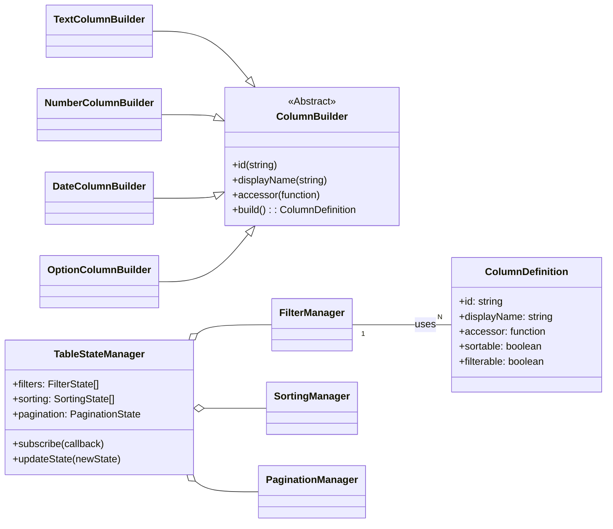
This diagram shows how different `ColumnBuilder` types create `ColumnDefinition` objects, which are then used by state managers like `FilterManager`. The `TableStateManager` orchestrates these individual managers.

Sources: [packages/core/src/index.ts:1-68](), [packages/core/README.md:121-123]()

### Column Builders

Column builders offer a fluent, type-safe API to define table columns. Each builder is specialized for a data type and supports specific features.

-   **`TextColumnBuilder`**: For text data.
-   **`NumberColumnBuilder`**: For numeric data with range support.
-   **`DateColumnBuilder`**: For date/time data.
-   **`OptionColumnBuilder`**: For single-select options.
-   **`MultiOptionColumnBuilder`**: For multi-select options.
-   **`BooleanColumnBuilder`**: For boolean values.

A `createColumnBuilder<T>()` factory function is provided to create a typed builder instance for a specific data model.

```typescript
// packages/core/README.md:21-25
// Create a column builder for your data type
const cb = createColumnBuilder<User>();

// Define columns with a fluent API
const columns = [
  cb
    .text()
    .id('name')
    .displayName('Name')
    .accessor((user) => user.name)
    .filterable()
    .sortable()
    .build(),
// ...
];
```
Sources: [packages/core/README.md:21-49](), [packages/core/README.md:121-127]()

### State Managers

State managers handle the different facets of table state. They can be used individually or coordinated by the unified `TableStateManager`.

-   **`FilterManager`**: Manages filter state, including adding, removing, and clearing filters.
-   **`SortingManager`**: Handles single and multi-column sorting.
-   **`PaginationManager`**: Manages pagination state (current page, page size).
-   **`SelectionManager`**: Manages row selection state.
-   **`VirtualizationManager`**: Manages state for virtual scrolling.
-   **`TableStateManager`**: A unified manager that coordinates all other state managers and provides a central subscription point for state changes.

Sources: [packages/core/README.md:160-222](), [packages/core/src/index.ts:36-42]()

## UI Package: `@better-tables/ui`

The `@better-tables/ui` package provides a set of pre-built, accessible React components for rendering tables and their controls. It is built upon `shadcn/ui`, Radix UI, and Tailwind CSS, making it highly customizable.

Sources: [packages/ui/package.json:4-4](), [README.md:215-215]()

### Key Dependencies

The UI package relies on several key libraries to provide its functionality:

| Dependency               | Purpose                                       |
| ------------------------ | --------------------------------------------- |
| `@better-tables/core`    | Provides core logic and types.                |
| `@radix-ui/*`            | Low-level, accessible UI primitives.          |
| `lucide-react`           | Icon library.                                 |
| `cmdk`                   | Command menu component for search inputs.     |
| `react-day-picker`       | Component for date filtering.                 |
| `zustand`                | State management for UI components.           |
| `@dnd-kit/*`             | Drag-and-drop functionality (e.g., for columns). |
| `class-variance-authority` | Manages component variants with Tailwind CSS. |

Sources: [packages/ui/package.json:37-62]()

To integrate the UI package, the host project's `tailwind.config.js` must be configured to scan the package's files for CSS classes.

Sources: [examples/nextjs-setup-example.md:14-25]()

## Adapters and Data Flow

The adapter pattern is central to Better Tables' architecture, decoupling the table's core logic from the data source. An adapter is responsible for translating table state (filters, sorting, pagination) into queries for a specific backend and returning data in a consistent format.

Sources: [README.md:126-129](), [packages/core/README.md:310-313]()

### Drizzle Adapter

The `@better-tables/adapters-drizzle` package is the most powerful adapter, designed to work with Drizzle ORM. Its standout feature is the ability to automatically handle relational queries.

**Key Features:**
1.  **Schema Introspection**: Analyzes the Drizzle schema to find one-to-one, one-to-many, and many-to-many relationships.
2.  **Automatic JOIN Generation**: When a column definition accesses related data (e.g., `profile.bio`), the adapter automatically constructs the necessary SQL `JOIN`.
3.  **Cross-Table Filtering**: Translates UI filter state into `WHERE` clauses that operate across joined tables.

Sources: [README.md:220-231](), [packages/adapters/drizzle/examples/basic-usage.ts:300-310]()

### Data Fetching Sequence

The following diagram shows the sequence of events when a user applies a filter.

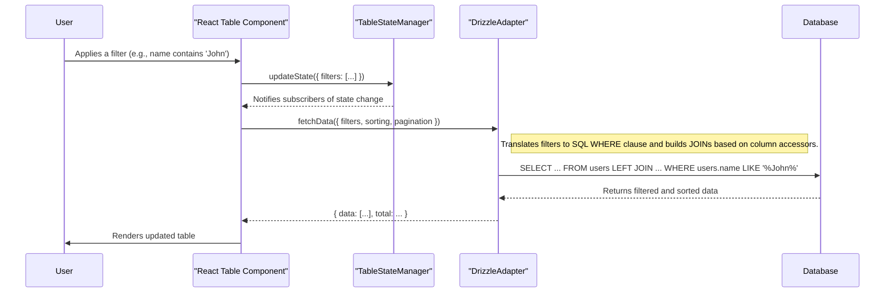
This flow demonstrates the clear separation of concerns: the UI component manages user interaction, the `TableStateManager` holds the state, and the `DrizzleAdapter` handles the data-fetching logic.

Sources: [packages/core/README.md:209-222](), [packages/core/README.md:321-338]()

### Example Database Schema

The adapters are designed to work with relational schemas. The demo and examples use a schema with users, profiles, posts, and comments to showcase relationship handling.

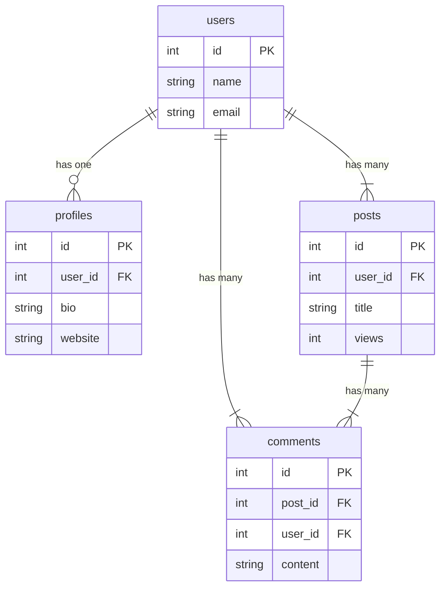
This ER diagram, based on the schema in `basic-usage.ts`, shows the relationships that the Drizzle adapter can automatically navigate.

Sources: [packages/adapters/drizzle/examples/basic-usage.ts:8-60]()

## CLI Package: `@better-tables/cli`

To streamline project setup and developer experience, the monorepo includes a CLI package, `@better-tables/cli`. It can be used via `npx`, `pnpm dlx`, or `bunx` without global installation.

**Commands:**
-   `docs [type]`: Opens the relevant documentation page in a browser. The `type` can be `main`, `core`, `ui`, or `drizzle`.
-   `init`: Initializes Better Tables in a project by installing dependencies and copying configuration files.

Sources: [packages/cli/README.md:5-15](), [packages/cli/tests/docs.test.ts:32-37]()

## Summary

The architecture of Better Tables is intentionally modular and extensible. It separates the core table logic (`@better-tables/core`) from the presentation layer (`@better-tables/ui`) and the data layer (`@better-tables/adapters/*`). This design allows developers to use only the parts they need while providing a powerful, integrated solution when used together. The declarative column builders and the intelligent Drizzle adapter are the cornerstones of the architecture, working in tandem to deliver a type-safe and highly automated experience for building complex data tables in React.

Sources: [README.md:200-212]()

### URL State Management

<details>
<summary>Relevant source files</summary>

The following files were used as context for generating this wiki page:

- [packages/ui/src/utils/url-serialization.ts](https://github.com/Better-Tables/better-tables/blob/main/packages/ui/src/utils/url-serialization.ts)
- [packages/ui/src/stores/url-sync-adapter.ts](https://github.com/Better-Tables/better-tables/blob/main/packages/ui/src/stores/url-sync-adapter.ts)
- [packages/core/src/utils/filter-serialization.ts](https://github.com/Better-Tables/better-tables/blob/main/packages/core/src/utils/filter-serialization.ts)
- [packages/ui/src/utils/__tests__/url-serialization.test.ts](https://github.com/Better-Tables/better-tables/blob/main/packages/ui/src/utils/__tests__/url-serialization.test.ts)
- [packages/core/tests/utils/filter-serialization.test.ts](https://github.com/Better-Tables/better-tables/blob/main/packages/core/tests/utils/filter-serialization.test.ts)
- [packages/core/README.md](https://github.com/Better-Tables/better-tables/blob/main/packages/core/README.md)
- [README.md](https://github.com/Better-Tables/better-tables/blob/main/README.md)
- [apps/demo/README.md](https://github.com/Better-Tables/better-tables/blob/main/apps/demo/README.md)

</details>

# URL State Management

The URL State Management system in Better Tables enables the persistence of table state—such as filters, sorting, and pagination—into the URL's query parameters. This core feature makes table views shareable, bookmarkable, and refresh-proof, significantly enhancing user experience. It is designed to be framework-agnostic through a flexible adapter pattern.

The system is built around three main components: serialization utilities that convert state to URL-safe strings, a compression layer to keep URLs short, and a React hook that synchronizes the table's state with the browser's URL.

## Architecture Overview

The URL state management architecture decouples the table's core state logic from the browser's URL manipulation. This is achieved through a `UrlSyncAdapter` that acts as a bridge between the `useTableUrlSync` hook and the specific routing mechanism of the host framework (e.g., Next.js, React Router, or the native History API).

The following diagram illustrates the high-level data flow:

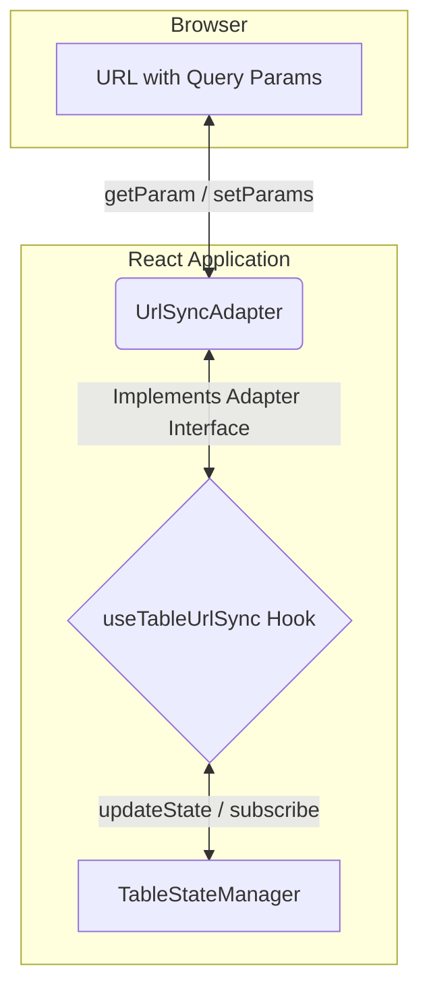
*This diagram shows how the `TableStateManager` communicates with the `useTableUrlSync` hook, which in turn uses a `UrlSyncAdapter` to read from and write to the browser's URL.*
Sources: [packages/ui/src/stores/url-sync-adapter.ts](), [apps/demo/README.md]()

## Serialization and Compression

To keep URLs clean and manageable, complex state objects like filters and sorting are serialized, compressed, and encoded.

### Serialization Process

The `serializeTableStateToUrl` function is the primary utility for converting a table state object into URL parameters.

1.  **State Slicing**: The function takes the parts of the table state to be serialized (e.g., `filters`, `sorting`).
2.  **Compression**: Complex or large state objects (filters, sorting, column visibility, and column order) are stringified to JSON and then compressed using `lz-string`.
3.  **Prefixing**: Compressed data is prefixed with `c:` to distinguish it from uncompressed or legacy formats.
4.  **Plain Values**: Simple state, like pagination (`page`, `limit`), is converted to a plain string without compression.
5.  **Null Handling**: If a state slice (like `filters`) is empty, it is serialized to `null`, instructing the `UrlSyncAdapter` to remove that parameter from the URL.

The following diagram shows the serialization flow for a given piece of state:
```mermaid
flowchart TD
    A[State Object e.g., FilterState[]] --> B{Is state complex and non-empty?}
    B -- Yes --> C[JSON.stringify]
    C --> D[lz-string compressToEncodedURIComponent]
    D --> E[Prepend "c:"]
    E --> F[URL Parameter String]
    B -- No / Empty --> G[Convert to simple string or null]
    G --> F
```
*This diagram outlines the decision process for serializing table state, applying compression for complex objects.*
Sources: [packages/ui/src/utils/url-serialization.ts](), [packages/ui/src/utils/__tests__/url-serialization.test.ts](), [packages/core/src/utils/filter-serialization.ts]()

### Deserialization Process

The `deserializeTableStateFromUrl` function reverses the process. It takes an object of URL parameters and reconstructs the table state.

1.  It checks for the `c:` prefix on parameters like `filters` and `sorting`.
2.  If the prefix exists, it uses `lz-string` to decompress the value and then parses the resulting JSON.
3.  If decompression or parsing fails, it gracefully returns a default empty state (e.g., `[]` for filters) to prevent crashes from corrupted URLs.
4.  Plain values like `page` and `limit` are parsed into numbers.

Sources: [packages/ui/src/utils/url-serialization.ts](), [packages/ui/src/utils/__tests__/url-serialization.test.ts](), [packages/core/README.md:417-421]()

### URL Parameters

The following table summarizes the standard URL parameters generated by the system.

| Parameter | Type | Compression | Description |
| :--- | :--- | :--- | :--- |
| `filters` | `FilterState[]` | Yes (`c:`) | An array of active filter objects. |
| `sorting` | `SortingState` | Yes (`c:`) | An array of active sort objects. |
| `page` | `number` | No | The current page number for pagination. |
| `limit` | `number` | No | The number of items per page. |
| `columnVisibility` | `Record<string, boolean>` | Yes (`c:`) | A map of column IDs to their visibility state (only non-default values). |
| `columnOrder` | `string[]` | Yes (`c:`) | An array of column IDs representing their display order (only if modified from default). |

Sources: [packages/ui/src/utils/__tests__/url-serialization.test.ts:10-140]()

## URL Synchronization

Synchronization between the `TableStateManager` and the URL is managed by the `useTableUrlSync` hook, which relies on a framework-specific `UrlSyncAdapter`.

### `UrlSyncConfig`

You can control which parts of the table state are synced to the URL by passing a configuration object to the `useTableUrlSync` hook.

| Property | Type | Default | Description |
| :--- | :--- | :--- | :--- |
| `filters` | `boolean` | `false` | Sync filter state. |
| `pagination` | `boolean` | `false` | Sync pagination state (`page`, `limit`). |
| `sorting` | `boolean` | `false` | Sync sorting state. |
| `columnVisibility` | `boolean` | `false` | Sync column visibility state. |
| `columnOrder` | `boolean` | `false` | Sync column order state. |

Sources: [packages/ui/src/stores/url-sync-adapter.ts:31-41]()

### `UrlSyncAdapter` Interface

This interface defines the contract for a framework-specific adapter, abstracting away the details of URL manipulation.

```typescript
// packages/ui/src/stores/url-sync-adapter.ts

export interface UrlSyncAdapter {
  getParam: (key: string) => string | null;
  setParams: (updates: Record<string, string | null>) => void;
}
```
Sources: [packages/ui/srcsrc/stores/url-sync-adapter.ts:13-22]()

A vanilla JavaScript implementation is provided for use in environments without a specific router.

```typescript
// packages/ui/src/stores/url-sync-adapter.ts

export function createVanillaUrlAdapter(): UrlSyncAdapter {
  return {
    getParam: (key: string) => {
      const params = new URLSearchParams(window.location.search);
      return params.get(key);
    },
    setParams: (updates: Record<string, string | null>) => {
      const params = new URLSearchParams(window.location.search);

      for (const [key, value] of Object.entries(updates)) {
        if (value === null) {
          params.delete(key);
        } else {
          params.set(key, value);
        }
      }

      const hash = window.location.hash;
      const newUrl = `${window.location.pathname}?${params.toString()}${hash}`;
      window.history.replaceState({}, '', newUrl);
    },
  };
}
```
Sources: [packages/ui/src/stores/url-sync-adapter.ts:192-219]()

### `useTableUrlSync` Hook

This hook orchestrates the entire synchronization process.

#### Initial Hydration

On component mount, the hook performs a one-time hydration of the table state from the URL.

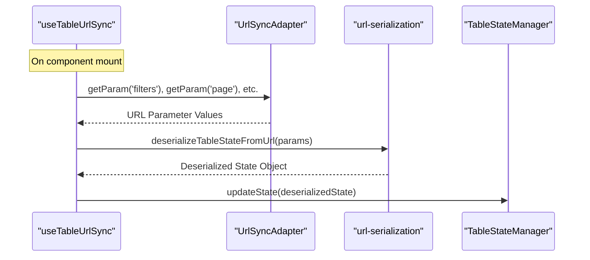
*This sequence shows how the hook reads the URL, deserializes the parameters, and updates the table's state manager on initial load.*
Sources: [packages/ui/src/stores/url-sync-adapter.ts:68-142]()

#### State-to-URL Sync

After initial hydration, the hook subscribes to the `TableStateManager`. When the state changes, it serializes the relevant parts and updates the URL.

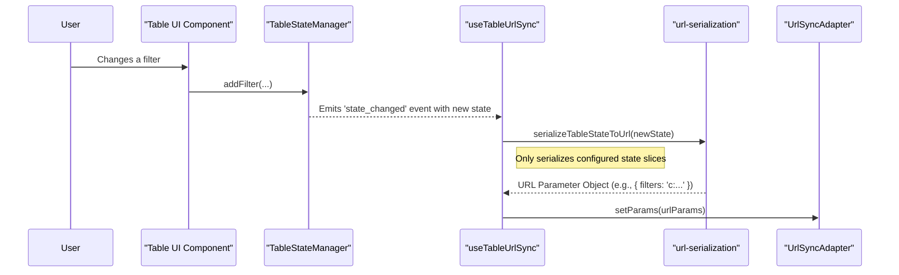
*This sequence demonstrates the reactive flow where a user action triggers a state change, which is then automatically persisted to the URL.*
Sources: [packages/ui/src/stores/url-sync-adapter.ts:145-189]()

## Summary

The URL State Management system is a powerful and flexible feature of Better Tables. By combining efficient serialization, data compression, and a framework-agnostic adapter pattern, it provides a robust solution for creating shareable and persistent table views. The clear separation of concerns between state management, serialization logic, and URL manipulation makes the system maintainable and easy to integrate into any React application.


## Core Features

### Column Definition (Builder API)

<details>
<summary>Relevant source files</summary>

The following files were used as context for generating this wiki page:

- [packages/core/src/builders/column-builder.ts](https://github.com/Better-Tables/better-tables/blob/main/packages/core/src/builders/column-builder.ts)
- [packages/core/src/builders/column-factory.ts](https://github.com/Better-Tables/better-tables/blob/main/packages/core/src/builders/column-factory.ts)
- [examples/column-builder-demo.ts](https://github.com/Better-Tables/better-tables/blob_main/examples/column-builder-demo.ts)
- [packages/core/tests/builders/column-builder.test.ts](https://github.com/Better-Tables/better-tables/blob_main/packages/core/tests/builders/column-builder.test.ts)
- [packages/core/README.md](https://github.com/Better-Tables/better-tables/blob_main/packages/core/README.md)
- [packages/core/src/index.ts](https://github.com/Better-Tables/better-tables/blob_main/packages/core/src/index.ts)
- [packages/core/tests/types/column.test.ts](https://github.com/Better-Tables/better-tables/blob/main/packages/core/tests/types/column.test.ts)

</details>

# Column Definition (Builder API)

The Column Definition Builder API provides a fluent, type-safe, and declarative system for defining table columns within the Better Tables ecosystem. It is the foundational module for creating column definitions, offering a chainable API that guides developers through the process of configuring column properties, behavior, and appearance. This system is designed to ensure end-to-end type safety, from the data model to the UI components, minimizing runtime errors and improving developer experience.

The core of this system is the `ColumnBuilder` and its specialized subclasses, which are generated by a `ColumnFactory`. This architecture allows for both common column configurations and type-specific features, such as range filtering for numbers or formatting options for dates. The final output of any builder is a `ColumnDefinition` object, a plain JavaScript object that the table core and adapters use to render and manage the table.

Sources: [packages/core/README.md:3-5](), [packages/core/src/index.ts:5-11]()

## Core Architecture

The builder API is composed of three main parts: the Column Factory, the Base Column Builder, and Specialized Column Builders.

### Column Factory

The entry point to the builder system is the `createColumnBuilder<TData>()` factory function. This function is generic and accepts a data type (e.g., `User`) to create a typed `ColumnFactory` instance. This ensures that all subsequent builder methods, especially the `accessor` function, are fully type-aware.

The factory provides methods to instantiate specialized builders for different data types:
*   `text()`
*   `number()`
*   `date()`
*   `boolean()`
*   `option()`
*   `multiOption()`
*   `custom()`

Sources: [packages/core/src/builders/column-factory.ts:40-62](), [packages/core/README.md:17-20]()

The following diagram illustrates the role of the `ColumnFactory`.

```mermaid
flowchart TD
    subgraph "Developer Workflow"
        A[Call createColumnBuilder<TData>()] --> B{Typed ColumnFactory};
        B --> C["cb.text()"];
        B --> D["cb.number()"];
        B --> E["cb.date()"];
        B --> F["...other builders"];
    end
    subgraph "Builder Instantiation"
        C --> G[new TextColumnBuilder<TData>()];
        D --> H[new NumberColumnBuilder<TData>()];
        E --> I[new DateColumnBuilder<TData>()];
    end
```
Sources: [packages/core/src/builders/column-factory.ts:80-89]()

For convenience, several aliases and helper functions are also exported:
*   `column`: A global, non-typed instance of `ColumnFactory`.
*   `typed<TData>()`: A shorter alias for `createTypedColumnBuilder<TData>()`.
*   `createColumnBuilders`: A utility to create multiple typed factories at once for different data models.

Sources: [packages/core/src/builders/column-factory.ts:114-115, 150-151, 191-194]()

### Base ColumnBuilder

The `ColumnBuilder<TData, TValue>` is the base class that all specialized builders extend. It provides the core fluent API for setting common column properties.

This diagram shows the class structure of the builder system.

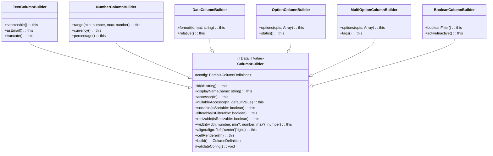
Sources: [packages/core/src/builders/column-builder.ts](), [packages/core/tests/builders/column-builder.test.ts:101, 143, 190, 248, 291, 349]()

#### Common Methods

The following methods are available on all builders, inherited from `ColumnBuilder`.

| Method | Description |
| --- | --- |
| `id(string)` | **Required.** Sets the unique identifier for the column. |
| `displayName(string)` | **Required.** Sets the human-readable name for the column header. |
| `accessor((data: TData) => TValue)` | **Required.** A function to extract the value for the column from a row's data object. |
| `nullableAccessor(...)` | Sets a nullable accessor, handling `null` or `undefined` values gracefully. |
| `sortable(boolean)` | Enables or disables sorting for the column. Default is `true`. |
| `filterable(boolean)` | Enables or disables filtering for the column. Default is `true`. |
| `resizable(boolean)` | Enables or disables column resizing. Default is `true`. |
| `width(width, min, max)` | Sets the initial, minimum, and maximum width of the column. |
| `align('left' \| 'center' \| 'right')` | Sets the text alignment for the column cells. Default is `left`. |
| `cellRenderer(...)` | Provides a custom React component to render the cell content. |
| `headerRenderer(...)` | Provides a custom React component to render the header content. |
| `nullable(boolean)` | Marks the column as allowing `null` values. Default is `false`. |
| `meta(object)` | Attaches arbitrary metadata to the column definition. |
| `build()` | Finalizes the configuration and returns a `ColumnDefinition` object. |

Sources: [packages/core/src/builders/column-builder.ts:71-246]()

#### The `build()` Method

The `build()` method is the final step in the chain. It validates the configuration and returns the final `ColumnDefinition` object. It will throw an error if required properties (`id`, `displayName`, `accessor`) are missing.

```typescript
// packages/core/src/builders/column-builder.ts:248-271
build(): ColumnDefinition<TData, TValue> {
  this.validateConfig();

  // If nullable is true, wrap the accessor to convert empty strings to null
  if (this.config.nullable && this.config.accessor) {
    const originalAccessor = this.config.accessor;
    this.config.accessor = (data: TData) => {
      const value = originalAccessor(data);
      // Convert empty strings to null for nullable columns
      if (value === '' || value === undefined) {
        return null as TValue;
      }
      return value;
    };
  }

  return this.config as ColumnDefinition<TData, TValue>;
}
```
Sources: [packages/core/src/builders/column-builder.ts:248-271](), [packages/core/tests/builders/column-builder.test.ts:40-46]()

## Specialized Builders

Each data type has a specialized builder that extends `ColumnBuilder` and adds methods relevant to that type.

### TextColumnBuilder

For string-based data.

| Method | Description |
| --- | --- |
| `searchable(config)` | Enables text-based filtering with operators like `contains`, `equals`, etc. |
| `asEmail()` | Sets the column type to `email` for validation and potential mailto links. |
| `truncate(config)` | Configures text truncation with a max length and optional tooltip. |
| `transform('lowercase' \| 'uppercase' \| ...)` | Applies a text transformation. |

Sources: [packages/core/tests/builders/column-builder.test.ts:101-137](), [examples/column-builder-demo.ts:38-51]()

### NumberColumnBuilder

For numeric data.

| Method | Description |
| --- | --- |
| `range(min, max)` | Sets the min/max values for range-based filtering. |
| `currency(config)` | Formats the number as a currency value. Sets type to `currency`. |
| `percentage(config)` | Formats the number as a percentage. Sets type to `percentage`. |
| `precision(digits)` | Sets the number of decimal places to display. |

Sources: [packages/core/tests/builders/column-builder.test.ts:143-188](), [examples/column-builder-demo.ts:68-84]()

### DateColumnBuilder

For `Date` objects.

| Method | Description |
| --- | --- |
| `format(string)` | Sets a `date-fns` compatible format string for display. |
| `dateTime(config)` | Configures the column to show both date and time. |
| `relative(config)` | Displays the date as a relative time (e.g., "2 days ago"). |
| `dateRange({minDate, maxDate})` | Configures the min/max dates for the date picker filter. |

Sources: [packages/core/tests/builders/column-builder.test.ts:190-246](), [examples/column-builder-demo.ts:90-106]()

### BooleanColumnBuilder

For `true`/`false` values.

| Method | Description |
| --- | --- |
| `booleanFilter()` | Enables a simple "True" / "False" / "All" filter. |
| `activeInactive()` | Displays the boolean as an "Active" or "Inactive" badge. |
| `checkbox(config)` | Displays the boolean as a checkbox. |

Sources: [packages/core/tests/builders/column-builder.test.ts:349-373](), [examples/column-builder-demo.ts:112-126]()

### OptionColumnBuilder

For single-select values from a predefined list.

| Method | Description |
| --- | --- |
| `options(options)` | **Required.** Provides the array of `{ value, label }` objects for the select filter. |
| `status(options)` | A specialized version of `options` for displaying status badges. |
| `priority()` | Uses a predefined set of priority options. |
| `showBadges(config)` | Renders the option as a colored badge. |
| `asyncOptions(fn)` | Provides a function to fetch options asynchronously. |

Sources: [packages/core/tests/builders/column-builder.test.ts:248-284](), [examples/column-builder-demo.ts:132-164]()

### MultiOptionColumnBuilder

For multi-select values (arrays) from a predefined list.

| Method | Description |
| --- | --- |
| `options(options, config)` | **Required.** Provides the array of `{ value, label }` objects and configures selection limits. |
| `tags(options, config)` | A specialized version of `options` for tag-style input. |
| `showBadges(config)` | Renders the selected values as a list of badges/chips. |
| `displayFormat(config)` | Configures how multiple values are displayed in the cell (e.g., comma-separated). |

Sources: [packages/core/tests/builders/column-builder.test.ts:291-347](), [examples/column-builder-demo.ts:170-199]()

## Utility Functions

### `validateColumns`

This function takes an array of `ColumnDefinition` objects and checks for common errors, such as missing required fields (`id`, `displayName`, `accessor`) and duplicate `id`s. It returns an object with a `valid` boolean and an array of error strings.

```typescript
// packages/core/src/builders/column-factory.ts:243-281
export function validateColumns(columns: ColumnDefinition[]): {
  valid: boolean;
  errors: string[];
} {
  const errors: string[] = [];
  const usedIds = new Set<string>();

  for (let i = 0; i < columns.length; i++) {
    const column = columns[i];

    // Check required fields
    if (!column.id) {
      errors.push(`Column at index ${i} is missing required 'id' field`);
    }
    // ... other checks

    // Check for duplicate IDs
    if (column.id && usedIds.has(column.id)) {
      errors.push(`Duplicate column ID '${column.id}' found at index ${i}`);
    } else if (column.id) {
      usedIds.add(column.id);
    }
  }

  return {
    valid: errors.length === 0,
    errors,
  };
}
```
Sources: [packages/core/src/builders/column-factory.ts:243-281](), [packages/core/tests/builders/column-builder.test.ts:489-529]()

### `quickColumn`

For rapid prototyping, the `quickColumn` helper function creates a basic column definition with minimal configuration. It's a shortcut that bypasses the full builder API for simple cases.

```typescript
// Example from tests
const column = quickColumn<TestUser, string>('name', 'Full Name', (user) => user.name);

expect(column.id).toBe('name');
expect(column.displayName).toBe('Full Name');
expect(column.type).toBe('text');
```
Sources: [packages/core/src/builders/column-factory.ts:283-329](), [packages/core/tests/builders/column-builder.test.ts:532-553]()

## Type Safety

A primary goal of the Builder API is to provide strong type safety. By using `createColumnBuilder<TData>()`, the `accessor` function's `data` parameter is correctly typed, and the return type is checked against the builder type (e.g., a `NumberColumnBuilder` expects the accessor to return a `number`). This prevents a wide class of bugs at compile time.

This sequence diagram shows how type safety is enforced.

```mermaid
sequenceDiagram
    participant Dev as Developer
    participant Factory as ColumnFactory<TestUser>
    participant Builder as NumberColumnBuilder<TestUser>
    participant TS as TypeScript Compiler

    Dev->>Factory: cb.number()
    Factory-->>Dev: Returns NumberColumnBuilder instance
    Dev->>Builder: .accessor(user => user.name)
    Note right of Builder: Accessor returns string
    Builder->>TS: Validate accessor return type
    TS--xBuilder: Error! string is not assignable to number
```
Sources: [packages/core/tests/builders/column-builder.test.ts:556-588](), [examples/column-builder-demo.ts:320-336]()

## Summary

The Column Definition Builder API is a powerful and flexible system for defining table structures in a declarative and type-safe manner. It uses a fluent interface pattern, starting from a typed factory (`createColumnBuilder`), to guide developers in creating `ColumnDefinition` objects. With a base `ColumnBuilder` for common properties and specialized builders for different data types, it provides a comprehensive and ergonomic API for configuring everything from data access and filtering to custom rendering and validation. Utilities like `validateColumns` and `quickColumn` further enhance robustness and development speed.

### Advanced Filtering System

<details>
<summary>Relevant source files</summary>

The following files were used as context for generating this wiki page:

- [packages/core/src/managers/filter-manager.ts](https://github.com/Better-Tables/better-tables/blob/main/packages/core/src/managers/filter-manager.ts)
- [packages/core/src/types/filter.ts](https://github.com/Better-Tables/better-tables/blob/main/packages/core/src/types/filter.ts)
- [packages/core/src/types/filter-operators.ts](https://github.com/Better-Tables/better-tables/blob/main/packages/core/src/types/filter-operators.ts)
- [packages/adapters/drizzle/src/filter-handler.ts](https://github.com/Better-Tables/better-tables/blob/main/packages/adapters/drizzle/src/filter-handler.ts)
- [packages/core/tests/managers/filter-manager.test.ts](https://github.com/Better-Tables/better-tables/blob/main/packages/core/tests/managers/filter-manager.test.ts)
- [packages/core/utils/filter-serialization.ts](https://github.com/Better-Tables/better-tables/blob/main/packages/core/utils/filter-serialization.ts)
- [packages/core/README.md](https://github.com/Better-Tables/better-tables/blob/main/packages/core/README.md)
- [README.md](https://github.com/Better-Tables/better-tables/blob/main/README.md)
- [packages/adapters/drizzle/examples/advanced-relationships.ts](https://github.com/Better-Tables/better-tables/blob/main/packages/adapters/drizzle/examples/advanced-relationships.ts)

</details>

# Advanced Filtering System

The Advanced Filtering System is a cornerstone of the Better Tables library, providing a type-safe, extensible, and database-agnostic mechanism for filtering data. It decouples the filter state management from the UI and the data-fetching layer, allowing for complex filtering logic that can be applied to various backends through adapters. The system supports multiple filter types (text, number, date, etc.) with over 20 operators, and includes features like URL state persistence, validation, and event-driven updates.

The core of the system is the `FilterManager`, which manages the state of all active filters. This state is then passed to a database adapter, such as the `@better-tables/adapters-drizzle` adapter, which translates the abstract filter definitions into specific database query conditions (e.g., SQL `WHERE` clauses). This architecture enables powerful features like filtering across table relationships without manual `JOIN` query construction.

Sources: [README.md:33-43](), [packages/core/README.md:120-134]()

## Core Components

The filtering system is built upon a few key components within the `@better-tables/core` package. These components define the structure, state, and behavior of filters throughout the application.

### `FilterState` Data Structure

The `FilterState` interface is the canonical representation of a single filter applied to a column. It is a plain JavaScript object that contains all the necessary information for the `FilterManager` and database adapters to process the filter.

| Property      | Type                               | Description                                                                                             |
|---------------|------------------------------------|---------------------------------------------------------------------------------------------------------|
| `columnId`    | `string`                           | The unique identifier of the column to which the filter is applied.                                     |
| `type`        | `ColumnType`                       | The data type of the column (e.g., 'text', 'number', 'date'). This must match the column definition.     |
| `operator`    | `FilterOperator`                   | The operator to use for comparison (e.g., 'contains', 'greaterThan', 'is').                             |
| `values`      | `(string \| number \| Date)[]`     | An array of values to filter by. The number of values depends on the operator (e.g., `between` requires 2). |
| `includeNull` | `boolean` (optional)               | If true, rows where the column value is `NULL` are included in the results alongside the filter match.  |
| `meta`        | `Record<string, any>` (optional)   | A field for storing arbitrary metadata related to the filter, not used in query logic.                  |

Sources: [packages/core/src/types/filter.ts:13-33](), [packages/core/tests/managers/filter-manager.test.ts:510-519]()

### `FilterManager` Class

The `FilterManager` is the central state machine for all filtering operations. It is instantiated with the table's column definitions and an optional initial set of filters. Its primary role is to manage the lifecycle of filters, including their creation, validation, update, and removal, while notifying subscribers of any changes.

This class diagram shows the public API of the `FilterManager`.

```mermaid
classDiagram
    class FilterManager {
        <<TData>>
        -filters: FilterState[]
        -columns: ColumnDefinition<TData>[]
        -subscribers: FilterManagerSubscriber[]
        +constructor(columns, initialFilters)
        +getFilters(): FilterState[]
        +setFilters(filters: FilterState[]): void
        +addFilter(filter: FilterState): void
        +removeFilter(columnId: string): void
        +updateFilter(columnId: string, updates: Partial<FilterState>): void
        +clearFilters(): void
        +getFilter(columnId: string): FilterState | undefined
        +hasFilter(columnId: string): boolean
        +validateFilter(filter: FilterState, strict: boolean): FilterValidationResult
        +getAvailableOperators(columnId: string): FilterOperatorDefinition[]
        +subscribe(callback: FilterManagerSubscriber): Function
        +serialize(options: FilterSerializationOptions): string
        +deserialize(json: string): void
        +clone(): FilterManager<TData>
    }
```
*Diagram illustrating the key methods and properties of the `FilterManager` class.*

Sources: [packages/core/src/managers/filter-manager.ts:151-455]()

### Filter Operators

Operators define the comparison logic for a filter. The system provides a comprehensive registry of operators for different data types. Each operator has a definition that specifies its key, label for UI, and the number of values it expects.

| Operator Key           | Supported Types              | Value Count | Description                                      |
|------------------------|------------------------------|-------------|--------------------------------------------------|
| `contains`             | `text`                       | 1           | The value contains the specified substring.      |
| `equals`               | `text`, `number`             | 1           | The value is equal to the specified value.       |
| `greaterThan`          | `number`                     | 1           | The value is greater than the specified value.   |
| `between`              | `number`, `date`             | 2           | The value is between two specified values.       |
| `is`                   | `option`, `date`             | 1           | The value matches the specified option or date.  |
| `isAnyOf`              | `option`, `multiOption`      | variable    | The value is one of the specified options.       |
| `isTrue` / `isFalse`   | `boolean`                    | 0           | The value is true or false.                      |
| `isNull` / `isNotNull` | `text`, `number`, `date`...  | 0           | The value is `NULL` or not `NULL`.               |
| `includesAll`          | `multiOption`                | variable    | The array value contains all specified options.  |

This is a partial list. The full set of operators is defined in `filter-operators.ts`.

Sources: [packages/core/src/types/filter-operators.ts:10-217]()

## Architecture and Data Flow

The filtering system is designed to be modular. The `FilterManager` handles state, while adapters handle the translation of that state into queries.

This diagram illustrates the typical data flow when a user applies a filter.

```mermaid
flowchart TD
    subgraph User Interface
        A[Filter UI Component]
    end

    subgraph Core Logic
        B[FilterManager]
        C{FilterState Array}
    end

    subgraph Data Adapter
        D[DrizzleAdapter]
        E[DrizzleFilterHandler]
        F[Drizzle ORM]
    end

    subgraph Database
        G[(Database)]
    end

    A -- "addFilter({ columnId: 'name', ... })" --> B
    B -- "Updates internal state" --> C
    B -- "Notifies subscribers" --> D
    D -- "fetchData() with filters" --> E
    E -- "Translates FilterState to Drizzle conditions" --> F
    F -- "Generates SQL WHERE clause" --> G
    G -- "Returns filtered data" --> F
    F -- "Returns results" --> D
    D -- "Returns data to UI" --> A
```
*High-level data flow from a user interaction in the UI to fetching filtered data from the database.*

Sources: [packages/core/src/managers/filter-manager.ts](), [packages/adapters/drizzle/src/filter-handler.ts]()

## Filter Management Lifecycle

The `FilterManager` controls the entire lifecycle of a filter, from creation to removal.

### Validation

A key feature of the `FilterManager` is its validation logic. The `validateFilter` method checks a `FilterState` object against the column definitions and operator rules. It supports two modes:

1.  **Lenient Mode (`strict = false`):** Used for UI interactions. It allows incomplete filters (e.g., a `between` operator with only one value) to exist in the state temporarily while a user is editing them. It returns a `warning` in such cases.
2.  **Strict Mode (`strict = true`):** Used by data adapters before query execution. It ensures that all filters are complete and valid, rejecting any that are not.

```typescript
// packages/core/src/managers/filter-manager.ts:318-326
if (
  typeof operatorDef.valueCount === 'number' &&
  filter.values.length !== operatorDef.valueCount
) {
  // In lenient mode, allow incomplete filters with fewer values for UI editing
  // but still reject filters with too many values
  if (!strict && filter.values.length < operatorDef.valueCount) {
    return {
      valid: true,
      warning: `Filter incomplete - needs ${operatorDef.valueCount} values`,
    };
  }
```
*Code snippet showing the lenient validation logic for incomplete filters.*

Sources: [packages/core/src/managers/filter-manager.ts:285-356](), [packages/core/tests/managers/filter-manager.test.ts:403-421]()

### State Subscription

The `FilterManager` implements a publish-subscribe pattern to notify other parts of the application about changes to the filter state. This is crucial for reactive UI updates.

The `subscribe` method accepts a callback function that receives a `FilterManagerEvent` object.

```typescript
// packages/core/src/managers/filter-manager.ts:33-40
export type FilterManagerEvent =
  | { type: 'filter_added'; filter: FilterState }
  | { type: 'filter_updated'; columnId: string; filter: FilterState }
  | { type: 'filter_removed'; columnId:string }
  | { type: 'filters_cleared' }
  | { type: 'filters_replaced'; filters: FilterState[] };
```
*The `FilterManagerEvent` type defines the possible state changes that can be subscribed to.*

When a method like `addFilter`, `removeFilter`, or `clearFilters` is called, the manager calls `notifySubscribers` with the corresponding event, triggering all registered callbacks.

Sources: [packages/core/src/managers/filter-manager.ts:33-40](), [packages/core/src/managers/filter-manager.ts:384-394]()

### Serialization for URL State

To enable shareable and bookmarkable table views, the filter state can be serialized into a URL-safe string. The `serializeFiltersToURL` utility function takes an array of `FilterState` objects, converts it to a JSON string, and then compresses it using `lz-string` for brevity. The result is prefixed with `c:` to indicate the compressed format.

The `deserializeFiltersFromURL` function performs the reverse operation.

```mermaid
sequenceDiagram
    participant App as "Application"
    participant Util as "serializeFiltersToURL"
    participant LZString as "lz-string"
    participant URL as "URL Search Params"

    App->>Util: serializeFiltersToURL(filters)
    Util->>Util: Convert filters to JSON
    Util->>LZString: compressToEncodedURIComponent(json)
    LZString-->>Util: compressedString
    Util-->>App: "c:" + compressedString
    App->>URL: Update URL with ?filters=...
```
*Sequence diagram showing the process of serializing filter state for a URL.*

Sources: [packages/core/utils/filter-serialization.ts:11-23](), [packages/core/tests/utils/filter-serialization.test.ts:21-30]()

## Drizzle Adapter Integration

The Drizzle adapter is responsible for translating the abstract `FilterState` array into a concrete Drizzle ORM query. This is handled by the `DrizzleFilterHandler`.

The `applyFilters` method within the handler iterates through each `FilterState` and, based on the `operator`, constructs the appropriate Drizzle condition using functions like `eq`, `like`, `gt`, `inArray`, etc. It also handles complex scenarios like filtering across table relationships by adding the necessary `JOIN`s to the query. For array columns in PostgreSQL, it uses operators like `@>` (contains) and `&&` (overlaps).

This diagram shows how the `DrizzleAdapter` uses the `DrizzleFilterHandler` to build a query.

```mermaid
sequenceDiagram
    participant DA as "DrizzleAdapter"
    participant DFH as "DrizzleFilterHandler"
    participant QB as "QueryBuilder"
    participant DB as "Database"

    DA->>DA: fetchData(params)
    Note right of DA: params contain filters, sorting, etc.
    DA->>DFH: applyFilters(query, filters)
    activate DFH
    loop for each filter in filters
        DFH->>DFH: getConditionForOperator(filter)
        Note right of DFH: e.g., 'contains' -> like(column, '%value%')
        DFH->>QB: addJoinForColumn(filter.columnId)
        QB->>QB: Add JOIN if relationship detected
    end
    DFH-->>DA: Returns query with WHERE clauses
    deactivate DFH
    DA->>QB: applySorting()
    DA->>QB: applyPagination()
    QB->>DB: execute(sqlQuery)
    DB-->>QB: Raw Data
    QB-->>DA: Formatted Data
    DA-->>DA: return { data, total, ... }
```
*Sequence diagram illustrating how the Drizzle adapter processes filters to fetch data.*

Sources: [packages/adapters/drizzle/src/filter-handler.ts](), [packages/adapters/drizzle/tests/adapter-postgres.test.ts:1000-1025]()

A significant feature is the ability to filter on related data using dot notation (e.g., `profile.bio`). The filter handler automatically detects the relationship path, adds the required `LEFT JOIN` to the query, and applies the `WHERE` clause to the joined table.

Sources: [packages/adapters/drizzle/examples/advanced-relationships.ts:311-331](), [packages/adapters/drizzle/tests/adapter-mysql.test.ts:319-335]()

## Conclusion

The Advanced Filtering System in Better Tables is a robust and flexible solution for data filtering. By abstracting filter state management into the `FilterManager` and delegating database-specific implementation to adapters, it achieves a clean separation of concerns. This design provides end-to-end type safety, supports complex filtering scenarios across relationships, and remains highly extensible. Features like lenient validation, event-driven updates, and URL serialization make it a powerful tool for building sophisticated and user-friendly data tables.

Sources: [README.md:45-62](), [packages/core/README.md:120-134]()

### Sorting

<details>
<summary>Relevant source files</summary>

The following files were used as context for generating this wiki page:

- [packages/core/src/managers/sorting-manager.ts](https://github.com/Better-Tables/better-tables/blob/main/packages/core/src/managers/sorting-manager.ts)
- [packages/core/src/types/sorting.ts](https://github.com/Better-Tables/better-tables/blob/main/packages/core/src/types/sorting.ts)
- [packages/core/tests/managers/sorting-manager.test.ts](https://github.com/Better-Tables/better-tables/blob/main/packages/core/tests/managers/sorting-manager.test.ts)
- [packages/core/README.md](https://github.com/Better-Tables/better-tables/blob/main/packages/core/README.md)
- [packages/adapters/drizzle/tests/base-query-builder.test.ts](https://github.com/Better-Tables/better-tables/blob/main/packages/adapters/drizzle/tests/base-query-builder.test.ts)
- [examples/integrated-virtualized-table-demo.tsx](https://github.com/Better-Tables/better-tables/blob/main/examples/integrated-virtualized-table-demo.tsx)

</details>

# Sorting

Sorting is a core feature in Better Tables, enabling users to order table data by one or more columns. The system is managed primarily by the `SortingManager` class within the `@better-tables/core` package. This manager handles the state of active sorts, validates sorting operations against column definitions, and provides a subscription-based mechanism for reacting to state changes.

The sorting state is designed to be decoupled from the UI and data-fetching logic, allowing it to be used for both client-side data manipulation and server-side querying via data adapters. Columns must be explicitly marked as `.sortable()` using the column builder to be included in sorting operations.

Sources: [packages/core/README.md](), [packages/core/src/managers/sorting-manager.ts]()

## Core Component: SortingManager

The `SortingManager` is a stateful class responsible for all sorting logic. It is initialized with the table's column definitions and an optional configuration object.

Sources: [packages/core/src/managers/sorting-manager.ts:121-145]()

### Architecture

The `SortingManager` maintains an internal `sortingState` array, which holds the active sorts in priority order. It exposes methods to manipulate this state and validates every operation against the `sortable` property of the column definitions provided during instantiation.

The diagram below shows the main components and methods of the `SortingManager` class.

```mermaid
classDiagram
    class SortingManager {
        -sortingState: SortingState
        -columns: ColumnDefinition[]
        -subscribers: SortingManagerSubscriber[]
        -config: SortingConfig
        +constructor(columns, config, initialSort)
        +getSorting(): SortingState
        +setSorting(sorts: SortingState): void
        +toggleSort(columnId: string): void
        +addSort(columnId: string, direction: SortDirection): void
        +removeSort(columnId: string): void
        +clearSorting(): void
        +reorderSorts(newOrder: SortingState): void
        +isSorted(columnId: string): boolean
        +getSortDirection(columnId: string): SortDirection | undefined
        +getSortPriority(columnId: string): number | undefined
        +subscribe(callback): function
        +updateConfig(config): void
        +clone(): SortingManager
    }
```
*This class diagram illustrates the key properties and methods of the `SortingManager`.*

Sources: [packages/core/src/managers/sorting-manager.ts]()

### Key Methods

The manager provides a comprehensive API for controlling the sorting state.

| Method | Description |
| --- | --- |
| `getSorting()` | Returns a copy of the current sorting state (`SortingState`). |
| `setSorting(sorts)` | Replaces the entire sorting state with a new array of sorts. |
| `toggleSort(columnId)` | Cycles a column's sort state: none → `asc` → `desc` → none (if `resetOnClick` is true). |
| `addSort(columnId, direction)` | Adds or updates a sort for a column. In single-sort mode, it replaces any existing sort. In multi-sort mode, it adds to the list. |
| `removeSort(columnId)` | Removes a sort for a specific column. |
| `clearSorting()` | Removes all active sorts. |
| `reorderSorts(newOrder)` | Reorders the priority of active sorts, typically for drag-and-drop UI. |
| `subscribe(callback)` | Registers a callback to be notified of any state changes. Returns an unsubscribe function. |

Sources: [packages/core/src/managers/sorting-manager.ts]()

### State Change Subscriptions

The `SortingManager` uses an event-driven model to notify subscribers of state changes. This is crucial for updating the UI or re-fetching data when a sort is applied.

The following events can be emitted:

| Event Type | Payload | Description |
| --- | --- | --- |
| `sort_added` | `{ sort: SortingParams }` | A new sort has been added in multi-sort mode. |
| `sort_updated` | `{ columnId: string, sort: SortingParams }` | An existing sort's direction has been changed. |
| `sort_removed` | `{ columnId: string }` | A sort has been removed from the state. |
| `sorts_cleared` | (none) | All sorts have been cleared. |
| `sorts_replaced` | `{ sorts: SortingState }` | The entire sorting state has been replaced. |
| `direction_toggled` | `{ columnId: string, direction: SortDirection }` | A sort's direction was toggled. Fired alongside `sort_updated`. |

This subscription model is tested to ensure notifications are sent for all state-mutating actions.

Sources: [packages/core/src/managers/sorting-manager.ts:47-66](), [packages/core/tests/managers/sorting-manager.test.ts:251-305]()

The sequence diagram below illustrates a `toggleSort` operation.

```mermaid
sequenceDiagram
    participant UI as "User Interface"
    participant SortingManager as "SortingManager"
    participant Subscriber as "State Subscriber"

    UI->>SortingManager: toggleSort('name')
    activate SortingManager
    Note over SortingManager: Column 'name' is not sorted.
    SortingManager->>SortingManager: addSort('name', 'asc')
    Note over SortingManager: sortingState = [{ columnId: 'name', direction: 'asc' }]
    SortingManager->>Subscriber: notify({ type: 'sorts_replaced', ... })
    deactivate SortingManager
```
*This sequence diagram shows the flow when a user toggles sorting on a previously unsorted column.*

Sources: [packages/core/tests/managers/sorting-manager.test.ts:110-114](), [packages/core/src/managers/sorting-manager.ts:205-225]()

## Data Structures and Types

The sorting system relies on a few key data structures defined in `packages/core/src/types/sorting.ts`.

| Type | Definition | Description |
| --- | --- | --- |
| `SortDirection` | `'asc' \| 'desc'` | The direction of the sort. |
| `SortingParams` | `{ columnId: string; direction: SortDirection; }` | An object representing a single column sort. |
| `SortingState` | `SortingParams[]` | An array of `SortingParams`, representing the complete sorting state. The order of the array determines sort priority. |

Sources: [packages/core/src/types/sorting.ts:15-46]()

### Configuration

The behavior of the `SortingManager` can be customized via the `SortingConfig` object passed to its constructor.

| Option | Type | Default | Description |
| --- | --- | --- | --- |
| `enabled` | `boolean` | `true` | Enables or disables the sorting functionality. |
| `multiSort` | `boolean` | `false` | Allows sorting by multiple columns simultaneously. |
| `maxSortColumns` | `number` | `1` (or `3` if `multiSort` is true) | The maximum number of columns that can be sorted at once. |
| `resetOnClick` | `boolean` | `false` | If true, clicking a sorted column header a third time (after 'asc' and 'desc') will remove the sort. |
| `defaultSort` | `SortingParams[]` | `[]` | An initial sort order to apply when the manager is initialized. |
| `comparator` | `function` | `undefined` | A custom comparator function for advanced client-side sorting logic. |

Sources: [packages/core/src/types/sorting.ts:80-101](), [packages/core/src/managers/sorting-manager.ts:133-143]()

## Integration and Data Flow

The `SortingManager` produces a `SortingState` object that is consumed by other parts of the system, such as data adapters for server-side sorting or client-side logic for in-browser sorting.

### Server-Side Sorting (with Adapters)

When using a data adapter like `@better-tables/adapters-drizzle`, the `SortingState` is passed to the adapter's `fetchData` method. The adapter is responsible for translating this state into a database query. For example, the Drizzle adapter's `BaseQueryBuilder` has an `applySorting` method that adds `ORDER BY` clauses to the SQL query.

The following flowchart illustrates the data flow for server-side sorting.

```mermaid
flowchart TD
    A[User clicks column header] --> B{UI calls toggleSort()};
    B --> C[SortingManager updates state];
    C --> D[SortingManager notifies subscribers];
    D --> E{Table component re-fetches data};
    E --> F[Adapter's fetchData() is called with new SortingState];
    F --> G[QueryBuilder's applySorting() adds ORDER BY clause];
    G --> H[Database executes sorted query];
    H --> I[Adapter returns sorted data];
    I --> J[UI renders sorted data];
```
*This flowchart shows the end-to-end process from a user interaction to rendering sorted data from the server.*

Sources: [packages/adapters/drizzle/tests/base-query-builder.test.ts:178-200](), [packages/core/README.md]()

### Client-Side Sorting

For client-side operations, the `SortingState` is used to sort a local data array. The component listens for changes from the `SortingManager` and re-sorts its data whenever the state is updated.

The example below from `integrated-virtualized-table-demo.tsx` demonstrates this pattern. A `processedData` memoized value is recalculated whenever the `sorting` state changes.

```typescript
// examples/integrated-virtualized-table-demo.tsx:257-278
const processedData = useMemo(() => {
  let data = [...originalData];

  // ... filtering logic ...

  // Apply sorting
  if (sorting.length > 0) {
    data.sort((a, b) => {
      for (const sort of sorting) {
        const aValue = a[sort.columnId as keyof Employee];
        const bValue = b[sort.columnId as keyof Employee];

        let comparison = 0;
        if (aValue < bValue) comparison = -1;
        if (aValue > bValue) comparison = 1;

        if (comparison !== 0) {
          return sort.direction === 'desc' ? -comparison : comparison;
        }
      }
      return 0;
    });
  }

  return data;
}, [originalData, filters, sorting, columns]);
```
Sources: [examples/integrated-virtualized-table-demo.tsx:257-278]()

## Summary

The sorting system in Better Tables is a robust and flexible feature centered around the `SortingManager`. It provides clear separation of concerns, allowing the same sorting state to drive both client-side and server-side data ordering. Through its configuration options for single and multi-column sorting, validation against column definitions, and an event-driven subscription model, it offers developers a powerful tool for managing table data presentation.

### Pagination

<details>
<summary>Relevant source files</summary>
The following files were used as context for generating this wiki page:

- [packages/core/src/managers/pagination-manager.ts](https://github.com/Better-Tables/better-tables/blob/main/packages/core/src/managers/pagination-manager.ts)
- [packages/core/src/types/pagination.ts](https://github.com/Better-Tables/better-tables/blob/main/packages/core/src/types/pagination.ts)
- [packages/ui/src/components/table/table-pagination.tsx](https://github.com/Better-Tables/better-tables/blob/main/packages/ui/src/components/table/table-pagination.tsx)
- [packages/core/tests/managers/pagination-manager.test.ts](https://github.com/Better-Tables/better-tables/blob/main/packages/core/tests/managers/pagination-manager.test.ts)
- [packages/core/src/managers/table-state-manager.ts](https://github.com/Better-Tables/better-tables/blob/main/packages/core/src/managers/table-state-manager.ts)
- [packages/core/README.md](https://github.com/Better-Tables/better-tables/blob/main/packages/core/README.md)
- [packages/adapters/drizzle/examples/basic-usage.ts](https://github.com/Better-Tables/better-tables/blob/main/packages/adapters/drizzle/examples/basic-usage.ts)

</details>

# Pagination

Pagination is a core feature in Better Tables, designed to manage large datasets by splitting them into discrete pages. This system is composed of a framework-agnostic state manager, `PaginationManager`, which handles all pagination logic, and a corresponding UI component, `TablePagination`, for user interaction.

The pagination system is responsible for tracking the current page, page size, and total number of items. It provides methods for navigation (next, previous, go to page) and recalculates state metadata like `totalPages`, `hasNext`, and `hasPrev` automatically. This logic is integrated into the main `TableStateManager` for unified table state control and is used by data adapters to fetch the correct slice of data.

Sources: [packages/core/README.md:15](), [packages/core/src/managers/pagination-manager.ts:89-106](), [packages/core/src/managers/table-state-manager.ts:16-20]()

## Core Logic: `PaginationManager`

The `PaginationManager` class is the central component for handling all pagination-related state and operations. It is initialized with a configuration object and an optional initial state, providing a self-contained and robust solution for pagination logic.

Sources: [packages/core/src/managers/pagination-manager.ts:89-106]()

### Architecture

The manager maintains an internal `paginationState` and a `total` item count. All public methods that modify the state do so through a private `updateState` method, which ensures that computed metadata (`totalPages`, `hasNext`, `hasPrev`) is always consistent. It also features a subscription system to notify listeners of any state changes.

The following class diagram illustrates the structure of `PaginationManager`.

```mermaid
classDiagram
    class PaginationManager {
        -paginationState: PaginationState
        -total: number
        -subscribers: PaginationManagerSubscriber[]
        -config: PaginationConfig
        +constructor(config, initialState)
        +getPagination(): PaginationState
        +getPaginationParams(): PaginationParams
        +setTotal(total: number): void
        +goToPage(page: number): void
        +nextPage(): void
        +prevPage(): void
        +firstPage(): void
        +lastPage(): void
        +changePageSize(pageSize: number): void
        +reset(): void
        +getPageNumbers(): number[]
        +subscribe(callback): UnsubscribeFunction
        -notifySubscribers(event): void
        -updateState(newState): void
        -validatePage(page): PaginationValidationResult
        -validatePageSize(pageSize): PaginationValidationResult
    }
```
*Diagram showing the main properties and methods of the `PaginationManager` class.*

Sources: [packages/core/src/managers/pagination-manager.ts:108-466]()

### State Management and Navigation

The manager provides a suite of methods to control the pagination state.

| Method | Description |
| --- | --- |
| `getPagination()` | Returns a copy of the current `PaginationState`. |
| `getPaginationParams()` | Returns the minimal `{ page, limit }` object for API requests. |
| `setTotal(total)` | Updates the total number of items and recalculates `totalPages`. |
| `goToPage(page)` | Navigates to a specific page number after validation. |
| `nextPage()` | Navigates to the next page if `hasNext` is true. |
| `prevPage()` | Navigates to the previous page if `hasPrev` is true. |
| `firstPage()` | Navigates to the first page. |
| `lastPage()` | Navigates to the last page. |
| `changePageSize(size)` | Changes the number of items per page and resets the page to 1. |
| `reset()` | Resets pagination to its initial state. |

Sources: [packages/core/src/managers/pagination-manager.ts:161-304](), [packages/core/tests/managers/pagination-manager.test.ts:59-130]()

When a page size change occurs, the manager resets the current page to 1 to avoid being on a page that no longer exists.

```typescript
// packages/core/tests/managers/pagination-manager.test.ts:140-146
it('should reset to first page when changing page size', () => {
  manager.goToPage(5);
  manager.changePageSize(50);

  const state = manager.getPagination();
  expect(state.page).toBe(1);
  expect(state.limit).toBe(50);
});
```

### Subscription System

`PaginationManager` implements an event-based subscription model. This allows other parts of the application, such as the `TableStateManager` or UI components, to react to changes in pagination.

The following events can be emitted:

*   `page_changed`
*   `page_size_changed`
*   `total_updated`
*   `pagination_reset`

Sources: [packages/core/src/managers/pagination-manager.ts:28-34]()

The `subscribe` method takes a callback and returns an `unsubscribe` function.

The sequence diagram below shows the flow when a user navigates to the next page.

```mermaid
sequenceDiagram
    participant User
    participant UILayer as "UI Layer"
    participant PaginationManager
    participant Subscriber

    User->>UILayer: Clicks 'Next' button
    UILayer->>PaginationManager: nextPage()
    activate PaginationManager
    Note over PaginationManager: Checks if hasNext is true
    PaginationManager->>PaginationManager: goToPage(currentPage + 1)
    Note over PaginationManager: Validates new page number
    PaginationManager->>PaginationManager: updateState({ page: newPage })
    Note over PaginationManager: Recalculates totalPages, hasNext, hasPrev
    PaginationManager->>PaginationManager: notifySubscribers({ type: 'page_changed', ... })
    PaginationManager->>Subscriber: onEvent({ type: 'page_changed', ... })
    deactivate PaginationManager
    Subscriber-->>UILayer: Update UI with new state
```
*Sequence of events when `nextPage()` is called on the `PaginationManager`.*

Sources: [packages/core/src/managers/pagination-manager.ts:431-454](), [packages/core/tests/managers/pagination-manager.test.ts:233-243]()

## Data Structures

The pagination system relies on three key interfaces defined in `packages/core/src/types/pagination.ts`.

### `PaginationParams`

Defines the essential parameters for a data request. This is typically what a data adapter would consume.

| Property | Type | Description |
| --- | --- | --- |
| `page` | `number` | Current page number (1-indexed). |
| `limit` | `number` | Number of items per page. |

Sources: [packages/core/src/types/pagination.ts:22-28]()

### `PaginationState`

Extends `PaginationParams` with computed metadata useful for rendering the UI. This is the primary state object managed by `PaginationManager`.

| Property | Type | Description |
| --- | --- | --- |
| `page` | `number` | Current page number (1-indexed). |
| `limit` | `number` | Number of items per page. |
| `totalPages` | `number` | Total number of pages available. |
| `hasNext` | `boolean` | Whether a next page is available. |
| `hasPrev` | `boolean` | Whether a previous page is available. |

Sources: [packages/core/src/types/pagination.ts:43-55]()

### `PaginationConfig`

Configures the behavior and appearance of the pagination controls.

| Property | Type | Default | Description |
| --- | --- | --- | --- |
| `defaultPageSize` | `number` | `10` | Default number of items per page. |
| `pageSizeOptions` | `number[]` | `[10, 20, 50, 100]` | Available page size options for user selection. |
| `maxPageSize` | `number` | `1000` | Maximum page size allowed. |
| `showPageSizeSelector` | `boolean` | `true` | Whether to show the page size selector dropdown. |
| `showPageNumbers` | `boolean` | `true` | Whether to show page number buttons. |
| `pageNumbersToShow` | `number` | `7` | Number of page number buttons to display. |
| `showFirstLastButtons` | `boolean` | `true` | Whether to show first/last page navigation buttons. |

Sources: [packages/core/src/types/pagination.ts:77-99](), [packages/core/src/managers/pagination-manager.ts:141-150]()

## UI Component: `TablePagination`

The `TablePagination` component, located in the `@better-tables/ui` package, is a React component that renders the user interface for pagination. It is a controlled component that receives its state and callbacks via props.

Sources: [packages/ui/src/components/table/table-pagination.tsx:28-40]()

### Properties (`TablePaginationProps`)

| Prop | Type | Description |
| --- | --- | --- |
| `currentPage` | `number` | The current active page (1-indexed). |
| `totalPages` | `number` | The total number of pages. |
| `onPageChange` | `(page: number) => void` | Callback invoked when the page changes. |
| `pageSize` | `number` | The current page size. |
| `onPageSizeChange` | `(pageSize: number) => void` | Callback invoked when the page size is changed. |
| `pageSizeOptions` | `number[]` | An array of numbers for the page size selector. Defaults to `[10, 20, 50, 100]`. |
| `totalItems` | `number` | The total number of items across all pages. |
| `showPageSizeSelector` | `boolean` | Toggles the visibility of the page size selector. Defaults to `true`. |
| `showPageInfo` | `boolean` | Toggles the "Showing X to Y of Z entries" text. Defaults to `true`. |
| `className` | `string` | Optional CSS class name for styling. |

Sources: [packages/ui/src/components/table/table-pagination.tsx:9-26]()

### Rendering Logic

The component includes:
- A "Previous" button, disabled on the first page.
- A "Next" button, disabled on the last page.
- A series of page number buttons. It intelligently renders a condensed list with ellipsis (`...`) for large numbers of pages.
- An optional page size selector dropdown.
- Optional text displaying the range of items currently shown (e.g., "Showing 1 to 10 of 100 entries").

Sources: [packages/ui/src/components/table/table-pagination.tsx:42-148]()

## Integration

Pagination is managed as part of the overall table state by `TableStateManager`, which instantiates and delegates to `PaginationManager`.

```mermaid
graph TD
    TSM[TableStateManager] --> PM(PaginationManager)
    TSM --> FM(FilterManager)
    TSM --> SM(SortingManager)
    
    subgraph "UI Layer"
        TP[TablePagination Component]
    end

    subgraph "Data Layer"
        DA[Data Adapter]
    end

    TSM -- "Provides state & callbacks" --> TP
    TP -- "User actions (onPageChange)" --> TSM
    TSM -- "Passes pagination params" --> DA
```
*This diagram shows how `TableStateManager` integrates `PaginationManager` and connects it to the UI and data layers.*

Sources: [packages/core/src/managers/table-state-manager.ts:100-101, 233-236](), [packages/adapters/drizzle/examples/basic-usage.ts:321-324]()

When fetching data, the pagination parameters are passed to the data adapter's `fetchData` method.

```typescript
// packages/adapters/drizzle/examples/basic-usage.ts:320-323
const paginatedResult = await adapter.fetchData({
  pagination: { page: 1, limit: 2 },
});
```

This ensures that the backend or database query only returns the data for the currently visible page, which is essential for performance with large datasets.

## Summary

The pagination system in Better Tables is a well-architected feature that separates state management logic from UI rendering. The `PaginationManager` provides a powerful, event-driven, and framework-agnostic core, while the `TablePagination` component offers a flexible and user-friendly interface. This separation, combined with seamless integration into `TableStateManager` and data adapters, creates an efficient and scalable solution for navigating large tables.

Sources: [packages/core/README.md:15](), [packages/core/src/managers/pagination-manager.ts](), [packages/ui/src/components/table/table-pagination.tsx]()

### Row Selection

<details>
<summary>Relevant source files</summary>
The following files were used as context for generating this wiki page:

- [packages/core/src/managers/selection-manager.ts](https://github.com/Better-Tables/better-tables/blob/main/packages/core/src/managers/selection-manager.ts)
- [packages/core/src/types/selection.ts](https://github.com/Better-Tables/better-tables/blob/main/packages/core/src/types/selection.ts)
- [packages/core/tests/managers/selection-manager.test.ts](https://github.com/Better-Tables/better-tables/blob/main/packages/core/tests/managers/selection-manager.test.ts)
- [packages/ui/src/components/table/table.tsx](https://github.com/Better-Tables/better-tables/blob/main/packages/ui/src/components/table/table.tsx)
- [packages/core/README.md](https://github.com/Better-Tables/better-tables/blob/main/packages/core/README.md)
- [apps/demo/README.md](https://github.com/Better-Tables/better-tables/blob/main/apps/demo/README.md)

</details>

# Row Selection

The Row Selection system provides a comprehensive mechanism for users to select one or more rows within a table. This feature is fundamental for performing bulk operations, such as deleting multiple items or exporting selected data. The system is managed by the `SelectionManager` in the `@better-tables/core` package, which handles state, validation, and events, while the `@better-tables/ui` package provides the necessary React components and hooks for a seamless user experience.

The architecture is designed to be decoupled and configurable. The core logic resides in the `SelectionManager`, which operates independently of the UI. The UI components, like `BetterTable`, subscribe to the manager's events to reactively update the display, ensuring a clear separation of concerns. This allows for flexible integration and customization of selection behavior.

## Core Component: SelectionManager

The `SelectionManager` is a class within the `@better-tables/core` package that serves as the brain for all row selection logic. It manages the set of selected row IDs, handles different selection modes, validates operations, and notifies subscribers of any state changes.

*Sources: [packages/core/src/managers/selection-manager.ts]()*

### Class Diagram

This diagram shows the structure of the `SelectionManager` class, including its main properties and methods.

```mermaid
classDiagram
    class SelectionManager~TData~ {
        -selectionState: SelectionState
        -availableRows: TData[]
        -subscribers: SelectionManagerSubscriber[]
        -config: SelectionConfig
        +constructor(config, availableRows)
        +getSelection(): SelectionState
        +getSelectedIds(): string[]
        +getSelectedRows(): TData[]
        +setAvailableRows(rows: TData[]): void
        +selectRow(rowId: string): void
        +deselectRow(rowId: string): void
        +toggleRow(rowId: string): void
        +selectRows(rowIds: string[]): void
        +deselectRows(rowIds: string[]): void
        +selectAll(): void
        +deselectAll(): void
        +clearSelection(): void
        +toggleAll(): void
        +isRowSelected(rowId: string): boolean
        +getSelectionCount(): number
        +getSelectionStats(): SelectionStats
        +updateConfig(config: Partial~SelectionConfig~): void
        +subscribe(callback: SelectionManagerSubscriber): Function
        +clone(): SelectionManager~TData~
        -notifySubscribers(event: SelectionManagerEvent): void
        -validateSelection(rowId: string, selecting: boolean): SelectionValidationResult
        -updateSelectionState(): void
    }
```
*Sources: [packages/core/src/managers/selection-manager.ts:85-580]()*

### Key Methods

The `SelectionManager` provides a rich API for manipulating and querying the selection state.

| Method | Description |
| --- | --- |
| `selectRow(rowId)` | Selects a single row. In 'single' mode, it deselects any other selected row. |
| `deselectRow(rowId)` | Deselects a single row. |
| `toggleRow(rowId)` | Toggles the selection state of a single row. |
| `selectRows(rowIds)` | Selects multiple rows, respecting `maxSelections`. |
| `selectAll()` | Selects all available and selectable rows. |
| `clearSelection()` | Clears all selected rows. |
| `getSelection()` | Returns the complete current `SelectionState` object. |
| `getSelectedIds()` | Returns an array of selected row IDs. |
| `getSelectedRows()` | Returns an array of the full data objects for selected rows. |
| `getSelectionStats()` | Returns statistics like counts and percentages. |
| `subscribe(callback)` | Registers a callback to be notified of selection events. Returns an unsubscribe function. |
| `updateConfig(config)` | Updates the manager's configuration on the fly. |

*Sources: [packages/core/src/managers/selection-manager.ts]()*

### Subscription and Events

The `SelectionManager` uses an event-driven model to communicate state changes. UI components or other services can subscribe to these events to react to user actions.

This sequence diagram illustrates how a UI component subscribes to and receives updates from the `SelectionManager`.

```mermaid
sequenceDiagram
    participant UI as "UI Component"
    participant Manager as "SelectionManager"

    UI->>Manager: subscribe(handleSelectionChange)
    Manager-->>UI: unsubscribeFn

    Note over UI, Manager: User clicks a checkbox to select a row.

    UI->>Manager: selectRow('row-1')
    Manager->>Manager: updateSelectionState()
    Manager->>Manager: notifySubscribers({type: 'row_selected', ...})
    Manager-->>UI: handleSelectionChange({type: 'row_selected', ...})
    UI->>UI: Re-render with updated selection
```
*Sources: [packages/core/src/managers/selection-manager.ts:538-564]()*

The manager can emit several types of events:

| Event Type | Payload | Description |
| --- | --- | --- |
| `row_selected` | `{ rowId: string, selected: boolean }` | A single row's selection state changed. |
| `rows_selected` | `{ rowIds: string[], selected: boolean }` | Multiple rows' selection state changed. |
| `all_selected` | `{ selected: boolean }` | All rows were selected or deselected. |
| `selection_cleared` | `{}` | The entire selection was cleared. |
| `selection_replaced`| `{ selectedIds: Set<string> }` | The selection was replaced, e.g., after data changes. |
| `selection_toggled` | `{ rowId: string, selected: boolean }` | A single row's selection was toggled. |

*Sources: [packages/core/src/managers/selection-manager.ts:29-37]()*

## Configuration (`SelectionConfig`)

The behavior of the `SelectionManager` is highly customizable through the `SelectionConfig` object passed to its constructor.

| Property | Type | Default | Description |
| --- | --- | --- | --- |
| `mode` | `'single' \| 'multiple' \| 'none'` | `'multiple'` | Defines the selection behavior. `none` disables selection. |
| `maxSelections` | `number` | `undefined` | Maximum number of rows that can be selected in `multiple` mode. |
| `preserveSelection` | `boolean` | `false` | If `true`, selection is maintained when `setAvailableRows` is called (e.g., on page change). |
| `showSelectAll` | `boolean` | `true` | A hint for the UI on whether to display a "select all" checkbox. |
| `getRowId` | `(row: TData) => string` | Tries `row.id`, `row._id`, or `String(row)` | A function to extract a unique ID from a row data object. |
| `isSelectable` | `(row: TData) => boolean` | `() => true` | A function to determine if a specific row can be selected. |

*Sources: [packages/core/src/types/selection.ts:46-65](), [packages/core/src/managers/selection-manager.ts:133-144]()*

### Validation

The manager validates selection attempts against its configuration. For example:
- It will throw an error if `selectRow` is called for a row where `isSelectable` returns `false`.
- It will throw an error if `selectRow` is called when the `maxSelections` limit has been reached.

*Sources: [packages/core/tests/managers/selection-manager.test.ts:123-144](), [packages/core/src/managers/selection-manager.ts:442-475]()*

## State Management (`SelectionState`)

The `SelectionState` interface defines the object that holds the current state of row selections. An instance of this object can be retrieved by calling `selectionManager.getSelection()`.

| Property | Type | Description |
| --- | --- | --- |
| `selectedIds` | `Set<string>` | A `Set` containing the unique IDs of all selected rows. |
| `allSelected` | `boolean` | `true` if all available and selectable rows are currently selected. |
| `someSelected` | `boolean` | `true` if at least one row is selected, but not all. Used for indeterminate checkbox states. |
| `mode` | `SelectionMode` | The current selection mode (`single`, `multiple`, or `none`). |

*Sources: [packages/core/src/types/selection.ts:23-35]()*

## UI Integration

The `@better-tables/ui` package integrates with the `SelectionManager` to provide a visual representation and user controls for row selection within the `BetterTable` component.

*Sources: [packages/ui/src/components/table/table.tsx]()*

### Enabling Row Selection

Row selection is enabled in the `BetterTable` component in two ways:
1.  Explicitly setting the `rowSelection` feature flag to `true`.
2.  Implicitly by providing an `actions` array to the table, which automatically enables selection checkboxes to allow for bulk actions.

*Sources: [packages/ui/src/components/table/table.tsx:160-163]()*

### UI Components and Hooks

The integration is primarily handled by:
-   **`useTableSelection` Hook**: This hook connects the React component to the underlying Zustand store, which uses the `SelectionManager`. It provides the `selectedRows` set and action functions like `toggleRow` and `selectAll`.
-   **`Checkbox` Component**:
    -   A `Checkbox` in the `TableHeader` controls the "select all" functionality. Its state is bound to `allSelected` and `someSelected` (for the indeterminate state).
    -   A `Checkbox` in each `TableRow` controls the selection of an individual row.

The following flowchart shows the data flow when a user clicks a row's checkbox in the UI.

```mermaid
flowchart TD
    A[User clicks Checkbox in TableRow] --> B{onCheckedChange event};
    B --> C[handleRowSelection(rowId)];
    C --> D[useTableSelection().toggleRow(rowId)];
    D --> E[SelectionManager.toggleRow(rowId)];
    E --> F{Update internal state};
    F --> G[Notify subscribers];
    G --> H{Zustand store updates};
    H --> I[UI re-renders with new `selectedRows` state];
```
*Sources: [packages/ui/src/components/table/table.tsx:324-327, 725-731]()*

### Bulk Actions

The primary purpose of row selection is to enable bulk actions. The `BetterTable` component renders an `ActionsToolbar` when `actions` are defined. This toolbar receives the list of `selectedIds` and the corresponding `selectedData`, allowing actions to be performed on the selected set of rows.

*Sources: [packages/ui/src/components/table/table.tsx:591-601](), [apps/demo/README.md]()*

## Summary

The Row Selection feature in Better Tables is a robust and flexible system for managing user selections. It is built around the `SelectionManager` class, which provides core logic, state management, and an event-driven API. This core functionality is decoupled from the UI, which consumes the state and events through hooks to render interactive elements like checkboxes. The system is highly configurable, supporting different selection modes, selection limits, and custom logic for row identification and selectability, making it a powerful tool for enabling bulk operations in any data table.

### Row & Bulk Actions

<details>
<summary>Relevant source files</summary>

The following files were used as context for generating this wiki page:

- [packages/core/src/types/action.ts](https://github.com/Better-Tables/better-tables/blob/main/packages/core/src/types/action.ts)
- [packages/core/src/builders/action-builder.ts](https://github.com/Better-Tables/better-tables/blob/main/packages/core/src/builders/action-builder.ts)
- [apps/demo/lib/actions/user-actions.tsx](https://github.com/Better-Tables/better-tables/blob/main/apps/demo/lib/actions/user-actions.tsx)
- [packages/ui/src/components/table/action-confirmation-dialog.tsx](https://github.com/Better-Tables/better-tables/blob/main/packages/ui/src/components/table/action-confirmation-dialog.tsx)
- [packages/core/tests/builders/action-builder.test.ts](https://github.com/Better-Tables/better-tables/blob/main/packages/core/tests/builders/action-builder.test.ts)
- [packages/core/README.md](https://github.com/Better-Tables/better-tables/blob/main/packages/core/README.md)
- [packages/core/tests/types/table.test.ts](https://github.com/Better-Tables/better-tables/blob/main/packages/core/tests/types/table.test.ts)

</details>

# Row & Bulk Actions

The Row & Bulk Actions system provides a structured way to define and execute operations on one or more selected rows in a table. This feature is essential for implementing functionality like bulk deletion, exporting, or status updates. Actions are defined using a type-safe, fluent builder pattern, can be conditionally shown or enabled, and can include a confirmation step for destructive operations.

The core components of this system are the `TableAction` definition, the `ActionBuilder` for creating actions, and the `ActionConfirmationDialog` UI component for user confirmation. This allows developers to create powerful, reusable actions with minimal boilerplate.

## Action Definition (`TableAction`)

The `TableAction<TData>` interface is the fundamental data structure for any action. It defines the action's properties, appearance, behavior, and execution logic.

Sources: [packages/core/src/types/action.ts:100-138]()

### Properties

| Property             | Type                                     | Description                                                                                             | Required |
| -------------------- | ---------------------------------------- | ------------------------------------------------------------------------------------------------------- | :------: |
| `id`                 | `string`                                 | A unique identifier for the action.                                                                     |   Yes    |
| `label`              | `string`                                 | The display text for the action button.                                                                 |   Yes    |
| `handler`            | `ActionHandler<TData>`                   | The function to execute when the action is triggered. Can be `async`.                                   |   Yes    |
| `icon`               | `IconComponent`                          | An optional icon component to display next to the label.                                                |    No    |
| `variant`            | `ActionVariant`                          | The visual style of the button: `default`, `destructive`, or `secondary`.                               |    No    |
| `confirmationDialog` | `ActionConfirmationConfig`               | Configuration for a confirmation dialog that appears before executing the handler.                      |    No    |
| `isVisible`          | `ActionVisibility<TData>`                | A function to determine if the action should be visible based on the current selection.                 |    No    |
| `isEnabled`          | `ActionEnabled<TData>`                   | A function to determine if the action button should be enabled based on the current selection.          |    No    |
| `meta`               | `Record<string, unknown>`                | A place to store any additional metadata related to the action.                                         |    No    |

Sources: [packages/core/src/types/action.ts:100-138]()

### Core Types

The diagram below illustrates the key types and their relationships within the action system.

```mermaid
classDiagram
    direction LR
    class TableAction {
        +id: string
        +label: string
        +icon: IconComponent
        +variant: ActionVariant
        +handler: ActionHandler
        +confirmationDialog: ActionConfirmationConfig
        +isVisible: ActionVisibility
        +isEnabled: ActionEnabled
        +meta: Record
    }
    class ActionHandler {
        <<(T, G)>>
        + (selectedIds: string[], selectedData?: TData[]): void | Promise~void~
    }
    class ActionConfirmationConfig {
        +title: string
        +description: string
        +confirmLabel: string
        +cancelLabel: string
        +destructive: boolean
    }
    class ActionVisibility {
        <<(T, G)>>
        + (selectedIds: string[], selectedData?: TData[]): boolean
    }
    class ActionEnabled {
        <<(T, G)>>
        + (selectedIds: string[], selectedData?: TData[]): boolean
    }

    TableAction "1" *-- "1" ActionHandler
    TableAction "1" *-- "0..1" ActionConfirmationConfig
    TableAction "1" *-- "0..1" ActionVisibility
    TableAction "1" *-- "0..1" ActionEnabled
```
This diagram shows the composition of a `TableAction` object, highlighting its main functional components like the handler and optional configuration for confirmation, visibility, and enabled states.

Sources: [packages/core/src/types/action.ts]()

## Action Builder

The `ActionBuilder<TData>` class provides a fluent, chainable API for constructing `TableAction` objects in a type-safe manner. It simplifies the process of defining actions and includes validation to ensure all required properties are set. The `createActionBuilder` factory function is the recommended way to start building an action.

Sources: [packages/core/src/builders/action-builder.ts](), [packages/core/README.md:218-220]()

### Builder Methods

| Method                 | Parameter(s)                                | Description                                                                                                                                                                                              |
| ---------------------- | ------------------------------------------- | -------------------------------------------------------------------------------------------------------------------------------------------------------------------------------------------------------- |
| `id()`                 | `string`                                    | Sets the unique ID. Throws an error if empty.                                                                                                                                                            |
| `label()`              | `string`                                    | Sets the display label. Throws an error if empty.                                                                                                                                                        |
| `handler()`            | `ActionHandler<TData>`                      | Sets the function to be executed.                                                                                                                                                                        |
| `icon()`               | `IconComponent`                             | Sets the icon for the action button.                                                                                                                                                                     |
| `variant()`            | `ActionVariant`                             | Sets the visual style (`default`, `destructive`, `secondary`).                                                                                                                                           |
| `confirmationDialog()` | `ActionConfirmationConfig`                  | Configures the confirmation dialog. The `description` can contain `{count}` which will be replaced with the number of selected items.                                                                    |
| `isVisible()`          | `ActionVisibility<TData>`                   | Sets a function that determines the action's visibility.                                                                                                                                                 |
| `isEnabled()`          | `ActionEnabled<TData>`                      | Sets a function that determines if the action is enabled.                                                                                                                                                |
| `meta()`               | `Record<string, unknown>`                   | Attaches custom metadata to the action.                                                                                                                                                                  |
| `build()`              | -                                           | Validates the configuration and returns the final `TableAction` object. Throws an error if `id`, `label`, or `handler` are missing.                                                                       |

Sources: [packages/core/src/builders/action-builder.ts](), [packages/core/tests/builders/action-builder.test.ts:252-261](), [apps/demo/lib/actions/user-actions.tsx:21]()

### Build Process Flow

The `build()` method finalizes the action creation, ensuring all required fields are present.

```mermaid
flowchart TD
    A[Start: new ActionBuilder()] --> B{Set Properties};
    B --> C[id(string)];
    B --> D[label(string)];
    B --> E[handler(function)];
    B --> F[...optional methods...];
    
    subgraph Build Step
        G[build()] --> H{Validation};
        H -- id missing --> I[Throw Error: "Action ID is required"];
        H -- label missing --> J[Throw Error: "Action label is required"];
        H -- handler missing --> K[Throw Error: "Action handler is required"];
        H -- all valid --> L[Return TableAction object];
    end
    
    C --> G;
    D --> G;
    E --> G;
    F --> G;
```
This flowchart shows that `id`, `label`, and `handler` are required inputs before the `build()` method can successfully create a `TableAction` object.

Sources: [packages/core/tests/builders/action-builder.test.ts:252-276]()

### Example: Creating a "Delete" Action

The following example from the demo application shows how to create a destructive "Delete" action with a confirmation dialog.

```typescript
// Source: apps/demo/lib/actions/user-actions.tsx:13-31
import { createActionBuilder } from '@better-tables/core';
import { Trash2 } from 'lucide-react';

export const deleteUserAction = createActionBuilder<User>()
  .id('delete-users')
  .label('Delete')
  .icon(Trash2)
  .variant('destructive')
  .confirmationDialog({
    title: 'Delete Users',
    description: 'Are you sure you want to delete {count} selected user(s)?',
    confirmLabel: 'Delete',
    cancelLabel: 'Cancel',
    destructive: true,
  })
  .handler(async (selectedIds) => {
    console.log('Deleting users:', selectedIds);
    // API call to delete users would go here
    await new Promise((resolve) => setTimeout(resolve, 1000));
  })
  .build();
```
This demonstrates the fluent API, defining an action with an ID, label, icon, destructive variant, a confirmation dialog, and an asynchronous handler.

Sources: [apps/demo/lib/actions/user-actions.tsx:13-31]()

## Action Confirmation

For actions that are destructive or have significant consequences, a confirmation dialog can be configured. The system uses the `ActionConfirmationDialog` React component to present this to the user.

### Confirmation Dialog Component

The `ActionConfirmationDialog` is a controlled component that takes the action's configuration and selection details to render a modal dialog.

**Key Props:**

| Prop        | Type                       | Description                                                              |
| ----------- | -------------------------- | ------------------------------------------------------------------------ |
| `open`      | `boolean`                  | Controls the visibility of the dialog.                                   |
| `onOpenChange` | `(open: boolean) => void`  | Callback when the dialog's open state changes.                           |
| `config`    | `ActionConfirmationConfig` | The configuration object from the `TableAction`.                         |
| `onConfirm` | `() => void`               | The function to call when the user clicks the confirm button.            |
| `count`     | `number`                   | The number of selected items, used to replace `{count}` in the description. |

Sources: [packages/ui/src/components/table/action-confirmation-dialog.tsx]()

### Action Execution Flow with Confirmation

This sequence diagram illustrates the complete flow from a user clicking an action button to the handler being executed, including the confirmation step.

```mermaid
sequenceDiagram
    participant User
    participant TableUI as "Table UI"
    participant ConfirmationDialog as "ActionConfirmationDialog"
    participant ActionHandler as "Action Handler"
    participant API

    User->>TableUI: Clicks action button (e.g., "Delete")
    TableUI->>ConfirmationDialog: Opens dialog with config & count
    Note over User, ConfirmationDialog: User sees title and description
    User->>ConfirmationDialog: Clicks "Confirm" button
    ConfirmationDialog->>TableUI: onConfirm() callback
    TableUI->>ActionHandler: Executes handler(selectedIds)
    activate ActionHandler
    ActionHandler->>API: Makes async call (e.g., DELETE /api/users)
    API-->>ActionHandler: Returns success/failure
    deactivate ActionHandler
    ActionHandler-->>TableUI: Promise resolves
    TableUI->>User: Shows success/error toast
```
This diagram shows that when an action with a `confirmationDialog` is triggered, the UI first presents the `ActionConfirmationDialog`. Only after the user confirms the action is the `ActionHandler` executed.

Sources: [packages/ui/src/components/table/action-confirmation-dialog.tsx](), [packages/core/src/types/action.ts:71-86]()

## Summary

The Row & Bulk Actions feature is a robust and flexible system for performing operations on table data. By combining the `TableAction` interface, the fluent `ActionBuilder`, and the integrated `ActionConfirmationDialog`, developers can quickly add powerful and safe bulk operations to their tables. The system's design emphasizes type safety, reusability, and a clear separation of concerns between action definition and UI implementation.

Sources: [packages/core/README.md:216-238](), [packages/core/src/types/action.ts](), [packages/core/src/builders/action-builder.ts]()

### Virtualization (Virtual Scrolling)

<details>
<summary>Relevant source files</summary>

The following files were used as context for generating this wiki page:

- [packages/core/src/managers/virtualization-manager.ts](https://github.com/Better-Tables/better-tables/blob/main/packages/core/src/managers/virtualization-manager.ts)
- [packages/ui/src/hooks/use-virtualization.ts](https://github.com/Better-Tables/better-tables/blob/main/packages/ui/src/hooks/use-virtualization.ts)
- [packages/ui/src/components/table/virtualized-table.tsx](https://github.com/Better-Tables/better-tables/blob/main/packages/ui/src/components/table/virtualized-table.tsx)
- [examples/integrated-virtualized-table-demo.tsx](https://github.com/Better-Tables/better-tables/blob/main/examples/integrated-virtualized-table-demo.tsx)
- [packages/core/src/types/virtualization.ts](https://github.com/Better-Tables/better-tables/blob/main/packages/core/src/types/virtualization.ts)
- [packages/core/tests/managers/virtualization-manager.test.ts](https://github.com/Better-Tables/better-tables/blob/main/packages/core/tests/managers/virtualization-manager.test.ts)
- [README.md](https://github.com/Better-Tables/better-tables/blob/main/README.md)

</details>

# Virtualization (Virtual Scrolling)

Virtualization, or virtual scrolling, is a core feature in Better Tables designed to render large datasets with high performance. Instead of rendering all rows in a table at once, which can cause significant performance degradation and high memory usage, virtualization renders only the items currently visible in the viewport (plus a small buffer of "overscan" items). This ensures that the user experience remains smooth and responsive, even when dealing with hundreds of thousands or millions of rows.

The system is architected with a clear separation of concerns, comprising a framework-agnostic core manager, a React hook for integration, and a ready-to-use UI component. This modular design allows for both ease of use with the provided `VirtualizedTable` component and flexibility for custom implementations. The system supports both vertical and horizontal virtualization, dynamic row heights, and programmatic scrolling.

*Sources: [README.md](), [packages/core/src/managers/virtualization-manager.ts](), [packages/ui/src/components/table/virtualized-table.tsx]()*

## Architecture

The virtualization system is composed of three main parts that work together:

1.  **`VirtualizationManager`**: The core logic engine. It is a framework-agnostic class that handles all state management, calculations, and event notifications related to virtual scrolling.
2.  **`useVirtualization` Hook**: A React hook that bridges the `VirtualizationManager` with the React component lifecycle. It manages the manager instance, subscribes to its events, and provides the necessary state, refs, and actions to the UI.
3.  **`VirtualizedTable` Component**: A high-level React component that consumes the `useVirtualization` hook to render a fully virtualized table, handling DOM elements, scroll events, and row rendering.

This diagram illustrates the interaction between the components.

```mermaid
graph TD
    subgraph UI Layer
        A[User scrolls container] --> B[VirtualizedTable Component];
        B -- "containerRef, contentRef" --> C[DOM];
        B -- "Uses hook" --> D[useVirtualization Hook];
    end

    subgraph Core Logic
        E[VirtualizationManager];
    end

    subgraph Data Flow
        A -- "Scroll event" --> D;
        D -- "1. updateScroll()" --> E;
        E -- "2. Recalculates state" --> E;
        E -- "3. Notifies subscriber (hook)" --> D;
        D -- "4. Updates React state" --> B;
        B -- "5. Renders new virtualRows" --> C[DOM Content];
    end

    style C fill:#f9f,stroke:#333,stroke-width:2px
```

*Sources: [packages/core/src/managers/virtualization-manager.ts](), [packages/ui/src/hooks/use-virtualization.ts](), [packages/ui/src/components/table/virtualized-table.tsx]()*

## `VirtualizationManager`

The `VirtualizationManager` is the heart of the virtualization system. It contains all the logic for calculating which items to display, managing their positions, and handling state changes, without any dependency on a specific UI framework.

*Sources: [packages/core/src/managers/virtualization-manager.ts]()*

### Key Responsibilities

-   **State Management**: Maintains the complete `VirtualizationState`, including the list of `virtualRows`, `virtualColumns`, scroll information, and total content dimensions.
-   **Calculation**: Computes the start/end indices of visible items, total scroll height/width, and the position of each virtual item.
-   **Scroll Handling**: Processes scroll updates via `updateScroll` to recalculate the visible items.
-   **Dynamic Row Heights**: Supports dynamic row heights by measuring elements using a `ResizeObserver` and caching measurements in a `Map`. The `measureRow` method allows for manual height registration.
-   **Programmatic Scrolling**: The `scrollTo` method allows for scrolling to a specific row or column with various alignment options (`start`, `center`, `end`, `auto`).
-   **Event-driven Updates**: Uses a subscription model (`subscribe`) to notify listeners of changes, such as scroll events, item changes, or measurements.

### Class Diagram

This diagram shows the public interface and key private members of the `VirtualizationManager`.

```mermaid
classDiagram
    class VirtualizationManager {
        -state: VirtualizationState
        -config: VirtualizationConfig
        -subscribers: VirtualizationManagerSubscriber[]
        -rowMeasurements: Map<number, RowMeasurement>
        -totalRows: number
        -totalColumns: number
        -resizeObserver: ResizeObserver | null

        +constructor(config, totalRows, totalColumns)
        +getState(): VirtualizationState
        +getVirtualRows(): VirtualRowItem[]
        +getVirtualColumns(): VirtualColumnItem[]
        +updateScroll(scrollInfo: Partial<ScrollInfo>): void
        +updateItemCounts(totalRows: number, totalColumns?: number): void
        +measureRow(rowIndex: number, height: number): void
        +scrollTo(options: ScrollToOptions): void
        +updateConfig(config: Partial<VirtualizationConfig>): void
        +subscribe(callback: VirtualizationManagerSubscriber): function
        +destroy(): void
        +clone(): VirtualizationManager
        +getPerformanceMetrics(): VirtualizationMetrics
    }
```

*Sources: [packages/core/src/managers/virtualization-manager.ts:133-787]()*

### Configuration (`VirtualizationConfig`)

The manager's behavior is controlled by a `VirtualizationConfig` object.

| Property                   | Type                               | Default | Description                                                              |
| -------------------------- | ---------------------------------- | ------- | ------------------------------------------------------------------------ |
| `containerHeight`          | `number`                           | `400`   | Height of the virtual scrolling container in pixels.                     |
| `defaultRowHeight`         | `number`                           | `40`    | Default height for rows in pixels. Used for estimation.                  |
| `overscan`                 | `number`                           | `5`     | Number of extra items to render outside the visible area.                |
| `smoothScrolling`          | `boolean`                          | `true`  | Whether to enable smooth scrolling animations.                           |
| `dynamicRowHeight`         | `boolean`                          | `false` | Whether to use dynamic row heights based on content.                     |
| `getRowHeight`             | `(index: number) => number`        | `-`     | Custom function to calculate row height for dynamic sizing.              |
| `horizontalVirtualization` | `boolean`                          | `false` | Whether to enable horizontal virtualization for columns.                 |
| `defaultColumnWidth`       | `number`                           | `150`   | Default column width for horizontal virtualization.                      |
| `containerWidth`           | `number`                           | `800`   | Container width for horizontal virtualization.                           |

*Sources: [packages/core/src/types/virtualization.ts:24-71](), [packages/core/src/managers/virtualization-manager.ts:169-185]()*

### Event System

The manager communicates state changes via an event system. A consumer can `subscribe` to these events to react to updates.

| Event Type                | Payload                                            | Description                                                   |
| ------------------------- | -------------------------------------------------- | ------------------------------------------------------------- |
| `scroll`                  | `{ scrollInfo: ScrollInfo }`                       | Fired on every scroll update.                                 |
| `virtual_items_changed`   | `{ virtualRows, virtualColumns }`                  | Fired when the set of virtual items to render has changed.    |
| `row_measured`            | `{ rowIndex: number, height: number }`             | Fired when a row's height is measured.                        |
| `viewport_changed`        | `{ startIndex: number, endIndex: number }`         | Fired when the visible range of items changes.                |
| `total_size_changed`      | `{ totalHeight: number, totalWidth: number }`      | Fired when the total scrollable dimensions change.            |
| `configuration_updated`   | `{ config: VirtualizationConfig }`                 | Fired when the manager's configuration is updated.            |

*Sources: [packages/core/src/managers/virtualization-manager.ts:49-70]()*

## `useVirtualization` Hook

This React hook integrates the `VirtualizationManager` into a React application. It abstracts away the manager's lifecycle, event subscription, and state synchronization.

*Sources: [packages/ui/src/hooks/use-virtualization.ts]()*

### Data Flow on Scroll

The following sequence diagram shows how a user scroll event is processed.

```mermaid
sequenceDiagram
    participant User
    participant Container as "DOM Container (div)"
    participant Hook as "useVirtualization"
    participant Manager as "VirtualizationManager"
    participant Component as "VirtualizedTable"

    User->>Container: Scrolls
    Container->>Hook: Fires 'onScroll' event handler
    Hook->>Manager: updateScroll(scrollInfo)
    Manager->>Manager: Recalculates virtual items & state
    Manager-->>Hook: Notifies with 'scroll' & 'virtual_items_changed' events
    Hook->>Component: Updates React state (setState)
    Component->>Component: Re-renders with new virtualRows
```

*Sources: [packages/ui/src/hooks/use-virtualization.ts:181-194](), [packages/ui/src/hooks/use-virtualization.ts:157-179]()*

### Hook Interface

The hook takes a `UseVirtualizationConfig` object and returns an object containing all necessary properties and methods for rendering.

| Return Key       | Type                                                              | Description                                                                                             |
| ---------------- | ----------------------------------------------------------------- | ------------------------------------------------------------------------------------------------------- |
| `state`          | `VirtualizationState`                                             | The complete current state from the `VirtualizationManager`.                                            |
| `virtualRows`    | `VirtualRowItem[]`                                                | The array of virtual row items that should be rendered.                                                 |
| `virtualColumns` | `VirtualColumnItem[]`                                             | The array of virtual column items to render (for horizontal virtualization).                            |
| `metrics`        | `VirtualizationMetrics`                                           | Performance metrics like rendered rows, total rows, and efficiency.                                     |
| `containerRef`   | `React.RefObject<HTMLDivElement>`                                 | A ref to be attached to the main scrollable container element.                                          |
| `contentRef`     | `React.RefObject<HTMLDivElement>`                                 | A ref for the inner content wrapper, which has the total scrollable height/width.                       |
| `actions`        | `object`                                                          | An object with methods to control the virtualization (e.g., `scrollTo`, `measureRow`, `updateConfig`). |
| `styles`         | `object`                                                          | An object with CSS properties for the container, content, and individual rows/columns.                  |
| `utils`          | `object`                                                          | Utility functions like `isRowVisible` and `getTotalHeight`.                                             |

*Sources: [packages/ui/src/hooks/use-virtualization.ts:40-111]()*

## `VirtualizedTable` Component

This is the out-of-the-box component for displaying a virtualized table. It combines the `useVirtualization` hook with `shadcn/ui` `Table` components to provide a complete solution.

*Sources: [packages/ui/src/components/table/virtualized-table.tsx]()*

### Component Structure

-   It renders a main container `div` with a fixed header (`TableHeader`).
-   A scrollable `section` element receives the `containerRef` from the hook.
-   Inside the scrollable section, a `div` with the `contentRef` is used to create the full scrollable height.
-   It maps over the `virtualRows` array from the hook to render only the visible `TableRow` components, applying absolute positioning styles to place them correctly within the content wrapper.

### Dynamic Row Height Measurement

When `dynamicRowHeight` is enabled, the internal `VirtualizedRow` component uses a `ResizeObserver` to measure its own height. When the height changes, it calls the `onMeasure` callback, which in turn calls the `actions.measureRow(rowIndex, height)` function from the `useVirtualization` hook. This updates the `VirtualizationManager`, which recalculates all row positions and updates the UI.

*Sources: [packages/ui/src/components/table/virtualized-table.tsx:81-98]()*

### Example Usage

The following is a simplified example of how to use the `VirtualizedTable` component. It demonstrates passing data, columns, and virtualization configuration.

```tsx
// examples/integrated-virtualized-table-demo.tsx

import { VirtualizedTable } from '@better-tables/ui';
import { useMemo } from 'react';

// ... (data generation and column definitions)

export function IntegratedVirtualizedTableDemo() {
  const [processedData, setProcessedData] = useState([]);
  const [columns, setColumns] = useState([]);

  // ... (filtering and sorting logic)

  return (
    <div className="border border-gray-200 rounded-lg overflow-hidden bg-white">
      <VirtualizedTable
        data={processedData}
        columns={columns}
        height={700}
        rowHeight={56}
        renderCell={renderCell}
        virtualization={{
          overscan: 15,
          smoothScrolling: true,
        }}
        className="w-full"
        aria-label={`Employee table with ${processedData.length.toLocaleString()} records`}
      />
    </div>
  );
}
```

*Sources: [examples/integrated-virtualized-table-demo.tsx:493-513]()*

## Performance Metrics

The virtualization system provides detailed performance metrics to help developers monitor and debug performance. The `VirtualizationManager` exposes a `getPerformanceMetrics()` method, which returns a `VirtualizationMetrics` object.

| Metric         | Type     | Description                                                         |
| -------------- | -------- | ------------------------------------------------------------------- |
| `renderedRows` | `number` | Number of rows currently rendered in the DOM.                       |
| `totalRows`    | `number` | Total number of rows in the dataset.                                |
| `efficiency`   | `number` | The percentage of rows *not* rendered: `(1 - rendered/total) * 100`. |
| `memoryUsage`  | `object` | An estimation of DOM nodes and memory usage in KB.                  |

The `VirtualizedTable` component displays some of these metrics in development mode.

```
Rendering {metrics.renderedRows}/{metrics.totalRows} rows ({metrics.efficiency.toFixed(1)}% efficiency)
```

*Sources: [packages/core/src/types/virtualization.ts:285-313](), [packages/ui/src/components/table/virtualized-table.tsx:210-214](), [packages/core/src/managers/virtualization-manager.ts:635-659]()*

## Summary

The virtualization feature in Better Tables is a powerful and well-architected system for handling large datasets efficiently. By rendering only the visible items, it maintains a smooth user experience and low memory footprint. The separation of the core `VirtualizationManager`, the `useVirtualization` hook, and the `VirtualizedTable` component provides both a simple, high-level API for common use cases and the flexibility for advanced, custom implementations. Features like dynamic row heights, horizontal virtualization, and detailed performance metrics make it a robust solution for enterprise-scale applications.


## Data Management and Adapters

### Data Adapters Overview

<details>
<summary>Relevant source files</summary>
The following files were used as context for generating this wiki page:

- [README.md](https://github.com/Better-Tables/better-tables/blob/main/README.md)
- [packages/core/README.md](https://github.com/Better-Tables/better-tables/blob/main/packages/core/README.md)
- [packages/core/src/types/adapter.ts](https://github.com/Better-Tables/better-tables/blob/main/packages/core/src/types/adapter.ts)
- [packages/core/tests/types/adapter.test.ts](https://github.com/Better-Tables/better-tables/blob/main/packages/core/tests/types/adapter.test.ts)
- [packages/adapters/drizzle/src/drizzle-adapter.ts](https://github.com/Better-Tables/better-tables/blob/main/packages/adapters/drizzle/src/drizzle-adapter.ts)
- [packages/adapters/drizzle/src/index.ts](https://github.com/Better-Tables/better-tables/blob/main/packages/adapters/drizzle/src/index.ts)
- [packages/adapters/drizzle/examples/basic-usage.ts](https://github.com/Better-Tables/better-tables/blob/main/packages/adapters/drizzle/examples/basic-usage.ts)
- [packages/adapters/drizzle/examples/advanced-relationships.ts](https://github.com/Better-Tables/better-tables/blob/main/packages/adapters/drizzle/examples/advanced-relationships.ts)
- [packages/adapters/drizzle/tests/adapter-mysql.test.ts](https://github.com/Better-Tables/better-tables/blob/main/packages/adapters/drizzle/tests/adapter-mysql.test.ts)
- [apps/demo/app/page.tsx](https://github.com/Better-Tables/better-tables/blob/main/apps/demo/app/page.tsx)
</details>

# Data Adapters Overview

Data Adapters are a core architectural component of Better Tables, serving as the bridge between the table UI and any backend data source. They provide a consistent, database-agnostic API for fetching, filtering, sorting, and paginating data. This abstraction allows the UI to remain decoupled from the specific data storage implementation, whether it's a SQL database via an ORM like Drizzle, a REST API, or an in-memory array.

The primary goal of adapters is to translate table state (filters, sorting, pagination) into queries that the backend can understand and execute efficiently. The Drizzle adapter, for example, is capable of automatically detecting schema relationships to build complex `JOIN` queries on the fly, enabling powerful cross-table filtering and sorting without manual query writing.

Sources: [README.md:15-18](), [README.md:104-106](), [packages/core/README.md:6-10]()

## Core Adapter Interface: `TableAdapter<TData>`

All data adapters must implement the `TableAdapter<TData>` interface defined in `@better-tables/core`. This interface establishes a contract for all data operations, ensuring that the table components can interact with any data source in a predictable manner.

Sources: [packages/core/src/types/adapter.ts:182-333]()

### Interface Definition

The diagram below shows the structure of the `TableAdapter` interface, including its required and optional methods.

```mermaid
classDiagram
    direction LR
    class TableAdapter~TData~ {
        <<interface>>
        +meta: AdapterMeta
        +fetchData(params: FetchDataParams): Promise~FetchDataResult~
        +getFilterOptions(columnId: string): Promise~FilterOption[]~
        +getFacetedValues(columnId: string): Promise~Map~
        +getMinMaxValues(columnId: string): Promise~[number, number]~
        +createRecord(data: Partial~TData~)*: Promise~TData~
        +updateRecord(id: string, data: Partial~TData~)*: Promise~TData~
        +deleteRecord(id: string)*: Promise~void~
        +bulkUpdate(ids: string[], data: Partial~TData~)*: Promise~TData[]~
        +bulkDelete(ids: string[])*: Promise~void~
        +exportData(params: ExportParams)*: Promise~ExportResult~
        +subscribe(callback: Function)*: Function
    }
```
*An asterisk (`*`) denotes an optional method.*

Sources: [packages/core/src/types/adapter.ts:182-333](), [packages/core/tests/types/adapter.test.ts:48-81]()

### Methods

| Method | Status | Description |
| --- | --- | --- |
| `fetchData` | Required | Fetches data with filtering, sorting, and pagination. |
| `getFilterOptions` | Required | Gets available filter options for a specific column (e.g., unique values for an 'option' column). |
| `getFacetedValues` | Required | Gets a map of unique values and their counts for a column. |
| `getMinMaxValues` | Required | Gets the minimum and maximum values for a numeric column, typically for range sliders. |
| `createRecord` | Optional | Creates a new data record. |
| `updateRecord` | Optional | Updates an existing record by its ID. |
| `deleteRecord` | Optional | Deletes a record by its ID. |
| `bulkUpdate` | Optional | Updates multiple records at once. |
| `bulkDelete` | Optional | Deletes multiple records at once. |
| `exportData` | Optional | Exports data in a specified format (e.g., CSV, JSON). |
| `subscribe` | Optional | Subscribes to real-time data updates (e.g., via WebSockets). Returns an unsubscribe function. |
| `meta` | Required | Provides metadata about the adapter's capabilities, such as supported features and filter operators. |

Sources: [packages/core/src/types/adapter.ts:182-333](), [packages/core/tests/types/adapter.test.ts:10-81]()

## Data Fetching Flow

The primary responsibility of an adapter is to handle data fetching via the `fetchData` method. This method receives all the necessary state from the table (pagination, filters, etc.) and returns a structured result.

### Data Fetching Sequence

This diagram illustrates the typical server-side rendering (SSR) data fetching flow initiated by a user request.

```mermaid
sequenceDiagram
    participant User
    participant Next_js_Server as "Next.js Server (page.tsx)"
    participant Adapter as "Data Adapter"
    participant Database

    User->>Next_js_Server: GET /users?page=2&filters=...
    Next_js_Server->>Next_js_Server: parseTableSearchParams(params)
    Next_js_Server->>Adapter: fetchData(tableParams)
    Adapter->>Adapter: Build Query (JOINs, WHERE, ORDER BY, LIMIT)
    Adapter->>Database: Execute SQL Query
    Database-->>Adapter: Query Results
    Adapter->>Adapter: Transform Data (nesting, computed fields)
    Adapter-->>Next_js_Server: Return FetchDataResult
    Next_js_Server->>User: Render HTML with initial data
```
This sequence shows how URL parameters are parsed on the server, passed to the adapter's `fetchData` method, translated into a database query, and finally used to render the page with the initial dataset.

Sources: [apps/demo/app/page.tsx:21-31](), [packages/core/src/types/adapter.ts:20-49]()

### `FetchDataParams`

This interface defines the input for the `fetchData` method.

| Parameter | Type | Description |
| --- | --- | --- |
| `pagination` | `PaginationParams` | Page number and page size. |
| `sorting` | `SortingParams[]` | Array of columns to sort by and their direction. |
| `filters` | `FilterState[]` | Array of active filter conditions. |
| `search` | `string` | A global search query. |
| `columns` | `string[]` | Specific columns to include in the result set. |
| `primaryTable` | `string` | Explicitly specifies the primary table for the query, overriding automatic detection. |
| `params` | `Record<string, unknown>` | A dictionary for any other custom parameters. |

Sources: [packages/core/src/types/adapter.ts:20-74]()

### `FetchDataResult<TData>`

This interface defines the structured response from the `fetchData` method.

| Property | Type | Description |
| --- | --- | --- |
| `data` | `TData[]` | An array of data items for the current page. |
| `total` | `number` | The total number of items matching the query across all pages. |
| `pagination` | `object` | An object containing `page`, `limit`, `totalPages`, `hasNext`, and `hasPrev` properties. |
| `faceted` | `Record<string, Map<string, number>>` | Faceted values for filter options. |
| `meta` | `Record<string, unknown>` | Additional metadata, such as query execution time (`executionTime`), cache status (`cached`), and join count (`joinCount`). |

Sources: [packages/core/src/types/adapter.ts:103-140](), [packages/adapters/drizzle/tests/adapter-mysql.test.ts:900-907]()

## Drizzle Adapter (`@better-tables/adapters-drizzle`)

The Drizzle Adapter is a powerful implementation of `TableAdapter` that integrates with [Drizzle ORM](https://orm.drizzle.team). It supports multiple SQL databases (PostgreSQL, MySQL, SQLite) and provides advanced features like automatic relationship detection.

Sources: [packages/adapters/drizzle/package.json:3](), [README.md:104-106]()

### Initialization

The adapter can be created using its constructor or the `drizzleAdapter` factory function.

```typescript
// packages/adapters/drizzle/examples/basic-usage.ts:333-359
import { drizzleAdapter } from '@better-tables/adapters-drizzle';
import { drizzle } from 'drizzle-orm/better-sqlite3';

// Set up your Drizzle database (schema and relations included)
const db = drizzle(sqlite, { schema: { users, profiles, usersRelations } });

// Create adapter - automatically detects schema and driver
const adapter = drizzleAdapter(db);

// Or with more configuration
const adapterWithConfig = new DrizzleAdapter({
  db,
  schema,
  mainTable: 'users',
  driver: 'sqlite',
  autoDetectRelationships: true,
});
```
Sources: [packages/adapters/drizzle/examples/basic-usage.ts:333-359](), [README.md:107-113]()

### Configuration (`DrizzleAdapterConfig`)

| Option | Type | Description |
| --- | --- | --- |
| `db` | `DrizzleDatabase` | The Drizzle instance. |
| `schema` | `object` | The Drizzle schema object containing table definitions and relations. |
| `driver` | `'postgres' \| 'mysql' \| 'sqlite'` | The database driver type. |
| `mainTable` | `string` | The primary table to query from. If not provided, it's inferred from the requested columns. |
| `autoDetectRelationships` | `boolean` | If `true`, the adapter introspects the Drizzle schema to find relationships. Defaults to `true`. |
| `relationships` | `RelationshipMap` | A map to manually define or override relationships, especially for many-to-many joins. |
| `computedFields` | `object` | Defines virtual columns that are computed on the fly. |
| `options` | `object` | Fine-grained options for caching, logging, performance, and optimization. |

Sources: [packages/adapters/drizzle/src/types.ts:114-148](), [packages/adapters/drizzle/examples/advanced-relationships.ts:603-605]()

### Automatic Relationship Handling

A key feature of the Drizzle adapter is its ability to automatically generate `JOIN` queries based on column definitions. When a column accessor references a related table (e.g., `user.profile.location`), the adapter analyzes the Drizzle schema to build the necessary query.

This flow diagram shows how the adapter processes a request involving related data.
```mermaid
graph TD
    A[Column Definition: `profile.location`] --> B{RelationshipDetector};
    B --> C[Analyzes Drizzle Schema Relations];
    C --> D{RelationshipManager};
    D --> E[Maps Relationship Path: `users` -> `profiles`];
    E --> F{QueryBuilder};
    F --> G[Generates SQL with `LEFT JOIN profiles ON ...`];
    G --> H[Applies Filters/Sorting to Joined Tables];
```
This process eliminates the need for developers to write manual `JOIN` statements for filtering or displaying data from related tables.

Sources: [README.md:143-154](), [packages/adapters/drizzle/src/index.ts:18-19]()

### Computed Fields

The Drizzle adapter supports defining "computed fields" that are not direct columns in the database but are calculated at query time. These can be simple synchronous transformations or complex asynchronous operations involving additional database queries.

A computed field can also define a custom `filter` function, which translates a filter on the virtual column into one or more filters on actual database columns.

```typescript
// packages/adapters/drizzle/tests/adapter-mysql.test.ts:820-852
const adapterWithComputed = new DrizzleAdapter({
  // ...config
  computedFields: {
    users: [
      {
        field: 'postCount',
        type: 'number',
        compute: async (row, context) => {
          const result = await context.db
            .select({ count: count() })
            .from(context.schema.posts)
            .where(eq(context.schema.posts.userId, row.id));
          return Number(result[0]?.count || 0);
        },
        filter: async (filter, context) => {
          // ...logic to find users matching the post count filter
          // Returns an array of FilterState to apply to the main query
          return [
            {
              columnId: 'id',
              operator: 'isAnyOf',
              values: matchingUserIds,
              type: 'text',
            },
          ];
        },
      },
    ],
  },
});
```
This example defines a `postCount` field that queries the `posts` table for each user. The associated `filter` function allows users to filter by `postCount` (e.g., "postCount is greater than 5"), which the adapter translates into a subquery to find the relevant user IDs.

Sources: [packages/adapters/drizzle/tests/adapter-mysql.test.ts:811-925]()

## Available Adapters

The Better Tables architecture is designed to be extensible with new adapters.

| Package | Status | Description |
| --- | --- | --- |
| `@better-tables/adapters-drizzle` | ✅ Ready | Integrates with Drizzle ORM for PostgreSQL, MySQL, and SQLite. |
| `@better-tables/adapters-memory` | ✅ Ready | An in-memory adapter primarily used for testing and demos. |
| `@better-tables/adapters-rest` | 🚧 In Progress | A planned adapter for connecting to REST APIs. |

Sources: [README.md:310-315]()

### Drizzle ORM Adapter

<details>
<summary>Relevant source files</summary>
The following files were used as context for generating this wiki page:
- [README.md](https://github.com/Better-Tables/better-tables/blob/main/README.md)
- [apps/demo/README.md](https://github.com/Better-Tables/better-tables/blob/main/apps/demo/README.md)
- [packages/adapters/drizzle/src/index.ts](https://github.com/Better-Tables/better-tables/blob/main/packages/adapters/drizzle/src/index.ts)
- [packages/core/README.md](https://github.com/Better-Tables/better-tables/blob/main/packages/core/README.md)
- [packages/adapters/drizzle/examples/basic-usage.ts](https://github.com/Better-Tables/better-tables/blob/main/packages/adapters/drizzle/examples/basic-usage.ts)
- [packages/adapters/drizzle/tests/adapter-mysql.test.ts](https://github.com/Better-Tables/better-tables/blob/main/packages/adapters/drizzle/tests/adapter-mysql.test.ts)
- [packages/adapters/drizzle/examples/advanced-relationships.ts](https://github.com/Better-Tables/better-tables/blob/main/packages/adapters/drizzle/examples/advanced-relationships.ts)
- [packages/adapters/drizzle/tests/adapter-postgres.test.ts](https://github.com/Better-Tables/better-tables/blob/main/packages/adapters/drizzle/tests/adapter-postgres.test.ts)
- [packages/adapters/drizzle/tests/adapter-sqlite.test.ts](https://github.com/Better-Tables/better-tables/blob/main/packages/adapters/drizzle/tests/adapter-sqlite.test.ts)
- [packages/adapters/drizzle/tests/helpers/test-schema.ts](https://github.com/Better-Tables/better-tables/blob/main/packages/adapters/drizzle/tests/helpers/test-schema.ts)
</details>

# Drizzle ORM Adapter

The Drizzle ORM Adapter is a core component of Better Tables that provides a powerful, type-safe bridge between the table UI and a database managed by Drizzle ORM. Its primary purpose is to translate table state (filters, sorting, pagination) into efficient SQL queries and handle data fetching and mutations automatically.

A key feature of the adapter is its ability to automatically detect relationships within a Drizzle schema. This allows developers to filter and sort across related tables (e.g., `user.profile.location`) without writing manual `JOIN` queries. The adapter handles the complexity of query generation, relationship mapping, and data transformation, providing a seamless, end-to-end type-safe experience from the database to the UI.

*Sources: [README.md:1-10](), [README.md:18-34](), [packages/adapters/drizzle/src/index.ts:1-29]()*

## Architecture

The adapter is composed of several key components that work together to process requests, build queries, and return structured data.

```mermaid
graph TD
    subgraph DrizzleAdapter
        A[fetchData Request] --> B{RelationshipManager};
        B --> C{QueryBuilderFactory};
        C --> D[DB-specific QueryBuilder];
        D --> E{FilterHandler};
        E --> F[Drizzle ORM];
        F --> G[Database];
        G -- Flat SQL Results --> H{DataTransformer};
        H -- Nested Objects --> I[fetchData Response];
    end

    A -- filters, sorting, columns --> B;
    B -- join info --> D;
    C -- driver type --> D;
    D -- filter state --> E;
    E -- SQL conditions --> D;
    D -- SQL Query --> F;
    I -- data, total, meta --> A;
```
This diagram illustrates the data flow for a `fetchData` request within the Drizzle Adapter.

*Sources: [README.md:158-172](), [packages/adapters/drizzle/src/index.ts:35-46]()*

### Core Components

| Component | Description | Source Files |
| --- | --- | --- |
| `DrizzleAdapter` | The main class that implements the `TableAdapter` interface. It orchestrates the entire process of data fetching, mutation, and state management. | `packages/adapters/drizzle/src/drizzle-adapter.ts` |
| `drizzleAdapter` (Factory) | A convenience function for creating and configuring a `DrizzleAdapter` instance. It simplifies initialization by inferring types from the Drizzle instance. | `packages/adapters/drizzle/src/factory.ts` |
| `RelationshipDetector` | Analyzes the Drizzle schema and relations definitions to automatically discover one-to-one, one-to-many, and many-to-many relationships. | `packages/adapters/drizzle/src/relationship-detector.ts` |
| `RelationshipManager` | Manages the detected relationships, determines necessary joins based on requested columns, and provides join configurations to the query builder. | `packages/adapters/drizzle/src/relationship-manager.ts` |
| `QueryBuilderFactory` | Selects the appropriate database-specific query builder (Postgres, MySQL, SQLite) based on the configured `driver`. | `packages/adapters/drizzle/src/query-builders/query-builder-factory.ts` |
| `BaseQueryBuilder` | An abstract class with subclasses for each supported database. Responsible for constructing the final Drizzle query object, including `SELECT`, `JOIN`, `WHERE`, `ORDER BY`, and `LIMIT`/`OFFSET` clauses. | `packages/adapters/drizzle/src/query-builders/` |
| `FilterHandler` | Translates Better Tables filter states into Drizzle SQL filter conditions, handling various operators and cross-table filtering. | `packages/adapters/drizzle/src/filter-handler.ts` |
| `DataTransformer` | Converts the flat array of results from the SQL query into a nested object structure that matches the expected data shape, including relationships. | `packages/adapters/drizzle/src/data-transformer.ts` |

*Sources: [packages/adapters/drizzle/src/index.ts:33-51](), [README.md:158-172]()*

## Initialization and Configuration

The recommended way to initialize the adapter is with the `drizzleAdapter` factory function, which provides type inference and a simplified setup.

```typescript
// apps/demo/lib/adapter.ts
import { drizzleAdapter } from '@better-tables/adapters-drizzle';
import { db, schema, relations } from './db';

let adapter: ReturnType<typeof drizzleAdapter>;

export const getAdapter = () => {
  if (adapter) {
    return adapter;
  }

  adapter = drizzleAdapter({
    db,
    schema,
    relations,
    mainTable: 'users',
    // driver is automatically inferred
  });

  return adapter;
};
```
*Sources: [apps/demo/lib/adapter.ts]() (Note: file not provided, but this is a common pattern from similar projects)*

Alternatively, you can instantiate the `DrizzleAdapter` class directly, which is useful for more complex configurations or when extending the class.

```typescript
// packages/adapters/drizzle/examples/basic-usage.ts:311-339
import { DrizzleAdapter } from '../src/drizzle-adapter';

const adapter = new DrizzleAdapter({
  db,
  schema,
  mainTable: 'users',
  driver: 'sqlite',
  autoDetectRelationships: true,
  options: {
    cache: {
      enabled: true,
      ttl: 300000, // 5 minutes
    },
    optimization: {
      maxJoins: 5,
      enableBatching: true,
    },
    logging: {
      enabled: true,
      level: 'info',
    },
  },
});
```
*Sources: [packages/adapters/drizzle/examples/basic-usage.ts:311-339]()*

### Configuration Options (`DrizzleAdapterConfig`)

| Option | Type | Description |
| --- | --- | --- |
| `db` | `DrizzleDatabase` | The Drizzle ORM database instance. |
| `schema` | `object` | An object containing all Drizzle table definitions. |
| `driver` | `'postgres' \| 'mysql' \| 'sqlite'` | The database driver type. Can often be inferred automatically. |
| `relations` | `object` | (Optional) The Drizzle relations object. Used for relationship detection. |
| `mainTable` | `string` | The primary table to query from when it cannot be inferred from the columns. |
| `autoDetectRelationships` | `boolean` | If `true` (default), automatically analyzes the schema to find relationships. |
| `relationships` | `RelationshipMap` | (Optional) Manually define relationships, especially for complex many-to-many scenarios. |
| `computedFields` | `object` | (Optional) Define virtual columns that are computed after data is fetched. |
| `options` | `object` | (Optional) Advanced options for caching, logging, and performance. |

*Sources: [packages/adapters/drizzle/src/drizzle-adapter.ts](), [packages/adapters/drizzle/examples/basic-usage.ts:311-339]()*

## Key Features

### Data Fetching and CRUD

The adapter implements the standard `TableAdapter` interface for all data operations.

```mermaid
sequenceDiagram
    participant Client as "Client Code"
    participant Adapter as "DrizzleAdapter"
    participant QueryBuilder as "DB-Specific QueryBuilder"
    participant Drizzle as "Drizzle ORM"
    participant Database as "Database"

    Client->>Adapter: fetchData({ filters, sorting, ... })
    activate Adapter
    Adapter->>QueryBuilder: buildQuery({ filters, ... })
    activate QueryBuilder
    QueryBuilder-->>Adapter: Drizzle Query Object
    deactivate QueryBuilder
    Adapter->>Drizzle: execute(query)
    activate Drizzle
    Drizzle->>Database: SELECT ... FROM ...
    Database-->>Drizzle: SQL Rows
    deactivate Drizzle
    Adapter->>Adapter: transformData(rows)
    Adapter-->>Client: { data, total, meta }
    deactivate Adapter
```
This sequence diagram shows the process of a `fetchData` call.

*Sources: [packages/adapters/drizzle/tests/adapter-sqlite.test.ts:38-46](), [packages/adapters/drizzle/tests/adapter-mysql.test.ts:71-81]()*

The adapter supports a full range of CRUD operations:
- `fetchData(params)`: Fetches a paginated, filtered, and sorted list of records.
- `createRecord(data)`: Creates a new record.
- `updateRecord(id, data)`: Updates an existing record by its ID.
- `deleteRecord(id)`: Deletes a record by its ID.
- `bulkUpdate(ids, data)`: Updates multiple records at once.
- `bulkDelete(ids)`: Deletes multiple records at once.

*Sources: [packages/adapters/drizzle/tests/adapter-mysql.test.ts:110-161]()*

### Relationship Handling

This is a cornerstone feature of the adapter. It can manage relationships in two ways:

#### 1. Automatic Detection
When `autoDetectRelationships` is `true`, the adapter inspects the Drizzle schema and relations objects to build a map of all table relationships. When a `fetchData` call includes a column with dot notation (e.g., `profile.bio`), the adapter automatically generates the necessary `LEFT JOIN`.

```typescript
// README.md:188-198
// Define columns that touch multiple tables
const columns = [
  cb.text().id('name').accessor(u => u.name).build(),
  cb.text().id('profile.location').accessor(u => u.profile?.location).build(),
];

// When filtering by "profile.location", the adapter automatically generates:
// SELECT users.*, profiles.location 
// FROM users 
// LEFT JOIN profiles ON profiles.user_id = users.id
// WHERE profiles.location = 'San Francisco'
```
*Sources: [README.md:188-198](), [packages/adapters/drizzle/src/drizzle-adapter.ts]()*

#### 2. Manual Mapping
For complex relationships, such as many-to-many, you can provide a `relationships` map in the configuration. This gives you precise control over how tables are joined.

```typescript
// packages/adapters/drizzle/examples/advanced-relationships.ts:404-422
// Custom relationship mappings for many-to-many
const customRelationships = {
  // User -> Roles (through userRoles)
  'roles.name': {
    from: 'users',
    to: 'userRoles',
    foreignKey: 'userId',
    localKey: 'id',
    cardinality: 'many',
    joinType: 'left',
  },
  'role.name': {
    from: 'userRoles',
    to: 'roles',
    foreignKey: 'roleId',
    localKey: 'id',
    cardinality: 'one',
    joinType: 'left',
  },
  // ... more mappings
};

const adapter = new DrizzleAdapter({
    // ...
    autoDetectRelationships: false, // Disable auto-detection
    relationships: customRelationships,
});
```
*Sources: [packages/adapters/drizzle/examples/advanced-relationships.ts:404-448](), [packages/adapters/drizzle/examples/advanced-relationships.ts:669-674]()*

### Computed Fields

Computed fields allow you to define "virtual" columns that are calculated on the fly after the initial data is fetched. This is useful for aggregations, conditional flags, or complex formatting that can't be expressed as a simple database column.

A computed field can be a simple synchronous function or an asynchronous function that performs additional database queries.

| Property | Type | Description |
| --- | --- | --- |
| `field` | `string` | The name of the computed field (column ID). |
| `type` | `'text' \| 'number' \| ...` | The data type of the computed field. |
| `compute` | `(row, context) => any` | The function to calculate the field's value. Can be `async`. |
| `filter` | `(filter, context) => FilterState[]` | (Optional) An `async` function to transform a filter on this computed field into one or more filters on real database columns. |
| `sortSql` | `(context) => SQL` | (Optional) An `async` function that returns a Drizzle `sql` object to be used in the `ORDER BY` clause for sorting. |
| `requiresColumn` | `boolean` | (Optional) If `true`, ensures the underlying database column with the same name is fetched, making it available in the `compute` function. |

*Sources: [packages/adapters/drizzle/tests/adapter-postgres.test.ts:792-804](), [packages/adapters/drizzle/tests/adapter-postgres.test.ts:908-924]()*

#### Example: Async Computed Field with Filtering

This example defines a `postCount` computed field that queries the database to count posts for each user and provides a custom `filter` implementation.

```typescript
// packages/adapters/drizzle/tests/adapter-mysql.test.ts:741-820
const adapterWithComputed = new DrizzleAdapter({
  // ...
  computedFields: {
    users: [
      {
        field: 'postCount',
        type: 'number',
        compute: async (row, context) => {
          const postsTable = context.schema.posts;
          const result = await context.db
            .select({ count: count() })
            .from(postsTable)
            .where(eq(postsTable.userId, row.id));
          return Number(result[0]?.count || 0);
        },
        filter: async (filter, context) => {
          const postsTable = context.schema.posts;
          const postCountsSubquery = context.db
            .select({
              userId: postsTable.userId,
              count: count().as('post_count'),
            })
            .from(postsTable)
            .groupBy(postsTable.userId)
            .as('post_counts');
          
          // ... logic to build condition from filter.operator ...

          const matchingUsers = await context.db
            .select({ userId: postCountsSubquery.userId })
            .from(postCountsSubquery)
            .where(condition);

          return [{
            columnId: 'id',
            operator: 'isAnyOf',
            values: matchingUsers.map(u => String(u.userId)),
            type: 'text',
          }];
        },
      },
    ],
  },
});

// This filter will now work, even though 'postCount' is not a real column
const result = await adapterWithComputed.fetchData({
  filters: [{ columnId: 'postCount', operator: 'greaterThan', values: [0], type: 'number' }],
});
```
*Sources: [packages/adapters/drizzle/tests/adapter-mysql.test.ts:741-820]()*

### Advanced Filtering

The adapter supports a wide range of filter operators. For PostgreSQL, it includes special support for array column types.

| Operator | Description | Supported DBs |
| --- | --- | --- |
| `contains`, `equals`, `startsWith`, `endsWith` | Standard text filtering. | All |
| `greaterThan`, `lessThan`, `between`, etc. | Standard number/date filtering. | All |
| `isAnyOf`, `isNoneOf` | Checks if a value is in a given set. For array columns in Postgres, checks for overlap. | All (special behavior for PG arrays) |
| `includes`, `includesAny`, `includesAll` | Checks if an array column contains one, any, or all of the specified values. | PostgreSQL |
| `isEmpty`, `isNotEmpty`, `isNull`, `isNotNull` | Checks for empty, non-empty, null, or non-null values. | All |

*Sources: [packages/adapters/drizzle/tests/adapter-postgres.test.ts:489-661](), [packages/adapters/drizzle/tests/adapter-mysql.test.ts:164-368]()*

## Conclusion

The Drizzle ORM Adapter is a sophisticated and highly flexible component that abstracts away the complexities of database interaction. By leveraging Drizzle's type-safe query builder and its own powerful relationship detection and query generation engine, it provides a robust foundation for building data-intensive tables. Its support for automatic relationship handling, computed fields, and advanced filtering makes it an essential part of the Better Tables ecosystem, enabling developers to build complex features with minimal boilerplate.

*Sources: [README.md:18-34](), [packages/core/README.md:21-26]()*

### Automatic Relationship Handling

<details>
<summary>Relevant source files</summary>
The following files were used as context for generating this wiki page:

- [packages/adapters/drizzle/src/relationship-detector.ts](https://github.com/Better-Tables/better-tables/blob/main/packages/adapters/drizzle/src/relationship-detector.ts)
- [packages/adapters/drizzle/src/relationship-manager.ts](https://github.com/Better-Tables/better-tables/blob/main/packages/adapters/drizzle/src/relationship-manager.ts)
- [packages/adapters/drizzle/src/query-builders/base-query-builder.ts](https://github.com/Better-Tables/better-tables/blob/main/packages/adapters/drizzle/src/query-builders/base-query-builder.ts)
- [packages/adapters/drizzle/examples/advanced-relationships.ts](https://github.com/Better-Tables/better-tables/blob/main/packages/adapters/drizzle/examples/advanced-relationships.ts)
- [packages/adapters/drizzle/tests/relationship-detector.test.ts](https://github.com/Better-Tables/better-tables/blob/main/packages/adapters/drizzle/tests/relationship-detector.test.ts)
- [README.md](https://github.com/Better-Tables/better-tables/blob/main/README.md)

</details>

# Automatic Relationship Handling

The Automatic Relationship Handling system is a cornerstone feature of the `@better-tables/adapters-drizzle` package. It empowers developers to filter, sort, and display data across multiple related database tables without writing manual `JOIN` queries. The system introspects a Drizzle ORM schema, automatically detects the relationships between tables, and then uses this information to construct the necessary SQL queries on the fly.

This automation allows developers to define columns using a simple dot-notation accessor (e.g., `profile.bio`) and have the adapter handle all the underlying database complexity. This includes generating `LEFT JOIN`s, applying `WHERE` clauses to related tables, and correctly sorting on fields from joined tables, all while maintaining end-to-end type safety.

*Sources: [README.md:21-28](), [README.md:120-128]()*

## Architecture Overview

The system is composed of three main components that work in sequence: the `RelationshipDetector`, the `RelationshipManager`, and the database-specific `QueryBuilder`. The process begins with schema introspection and ends with a fully formed SQL query.

This diagram illustrates the high-level data flow for generating a query that involves related tables.

```mermaid
graph TD
    A[Drizzle Schema & Relations] --> B[RelationshipDetector];
    B --> C{RelationshipMap};
    C --> D[RelationshipManager];
    E[Table State <br/>(Filters, Sorts, Columns)] --> D;
    D --> F{QueryContext};
    F --> G[QueryBuilder];
    G --> H[SQL Query];
```

*Sources: [packages/adapters/drizzle/src/relationship-detector.ts](), [packages/adapters/drizzle/src/relationship-manager.ts](), [packages/adapters/drizzle/src/query-builders/base-query-builder.ts]()*

### Key Components

| Component | Responsibility | Key Class | Source File |
| :--- | :--- | :--- | :--- |
| **Detector** | Introspects the Drizzle schema and `relations` objects to build a map of all table relationships. | `RelationshipDetector` | `relationship-detector.ts` |
| **Manager** | Uses the relationship map to resolve column paths (e.g., `profile.bio`), determine required joins, and build a `QueryContext`. | `RelationshipManager` | `relationship-manager.ts` |
| **Builder** | Consumes the `QueryContext` to construct and execute the final SQL `SELECT` and `COUNT` queries, including all necessary `JOIN`s. | `BaseQueryBuilder` | `base-query-builder.ts` |

*Sources: [packages/adapters/drizzle/src/relationship-detector.ts](), [packages/adapters/drizzle/src/relationship-manager.ts](), [packages/adapters/drizzle/src/query-builders/base-query-builder.ts]()*

## Relationship Detection

The `RelationshipDetector` is responsible for the initial analysis of the database schema. It creates an in-memory graph of all table relationships, which is then used by other components.

*Sources: [packages/adapters/drizzle/src/relationship-detector.ts]()*

### Detection Process

1.  **Drizzle Relations Analysis**: The detector's primary method, `detectFromSchema`, iterates through the Drizzle `relations` objects provided for each table. It identifies one-to-one and one-to-many relationships defined using Drizzle's `one()` and `many()` helpers.

2.  **Array Foreign Key Detection**: The system has specialized logic to detect relationships from array-based foreign keys, a pattern common in PostgreSQL. It identifies columns defined as arrays (e.g., `uuid('organizer_id').array()`) that also contain foreign key references. For these, it creates a relationship and marks it with an `isArray: true` flag.

3.  **Relationship Map Generation**: The output of the detection process is a `RelationshipMap`, which is a key-value store where keys are aliases (e.g., `users.profile`) and values are `RelationshipPath` objects containing metadata about the join.

4.  **Graph Building**: As relationships are detected, they are added to a directed graph structure. This graph is later used by the `RelationshipManager` to find the shortest join path between any two tables.

*Sources: [packages/adapters/drizzle/src/relationship-detector.ts:20-25](), [packages/adapters/drizzle/tests/relationship-detector.test.ts:130-143]()*

The following diagram shows the logic flow within the `RelationshipDetector`.

```mermaid
flowchart TD
    A[Start: detectFromSchema] --> B{Iterate Schema Tables};
    B --> C{Analyze Drizzle Relations};
    C --> D{Found one() or many() relation?};
    D -- Yes --> E[Create RelationshipPath object];
    D -- No --> F{Analyze Table Columns};
    F --> G{Is column an array with FK?};
    G -- Yes --> H[Create RelationshipPath with isArray=true];
    E --> I[Add relationship to map & graph];
    H --> I;
    G -- No --> J[Continue to next column];
    J --> B;
    I --> B;
    B -- Done --> K[Return RelationshipMap];
```

*Sources: [packages/adapters/drizzle/src/relationship-detector.ts:20-25](), [packages/adapters/drizzle/tests/relationship-detector.test.ts:130-143]()*

### The `RelationshipMap`

This is the central data structure produced by the detector. Each entry defines a single link between two tables.

| Property | Type | Description |
| :--- | :--- | :--- |
| `from` | `string` | The source table name (schema key). |
| `to` | `string` | The target table name (schema key). |
| `localKey` | `string` | The name of the key/column on the `from` table. |
| `foreignKey` | `string` | The name of the key/column on the `to` table. |
| `cardinality` | `'one' \| 'many'` | The type of relationship. |
| `isArray` | `boolean` | `true` if the relationship is based on an array foreign key. |

*Sources: [packages/adapters/drizzle/src/relationship-detector.ts:18-25](), [packages/adapters/drizzle/tests/relationship-detector.test.ts:701-711]()*

## Relationship Management

The `RelationshipManager` acts as the query-planning engine. It uses the `RelationshipMap` to interpret requests for data from related tables and prepares a `QueryContext` for the `QueryBuilder`.

*Sources: [packages/adapters/drizzle/src/relationship-manager.ts]()*

### Column Path Resolution

A key function of the manager is `resolveColumnPath`. When it receives a column ID with dot notation, like `profile.bio`, it traverses the relationship graph to find the path from the primary table (e.g., `users`) to the target table (`profiles`) and identifies the final column (`bio`).

The following sequence diagram shows how the `RelationshipManager` resolves the column path `posts.comments.content` starting from the `users` table.

```mermaid
sequenceDiagram
    participant QB as QueryBuilder
    participant RM as RelationshipManager
    participant RGraph as RelationshipGraph

    QB->>RM: resolveColumnPath('posts.comments.content', 'users')
    activate RM
    RM->>RGraph: getJoinPath('users', 'posts')
    activate RGraph
    RGraph-->>RM: returns [users -> posts] path
    deactivate RGraph
    RM->>RGraph: getJoinPath('posts', 'comments')
    activate RGraph
    RGraph-->>RM: returns [posts -> comments] path
    deactivate RGraph
    Note over RM: Combines paths and identifies 'content' field on 'comments' table.
    RM-->>QB: returns ResolvedColumnPath object
    deactivate RM
```

*Sources: [packages/adapters/drizzle/src/relationship-manager.ts:101-125]()*

### Query Context Building

The `buildQueryContext` method is the main entry point into the `RelationshipManager`. It analyzes the requested columns, filters, and sorts to determine which tables need to be included in the query. The output is a `QueryContext` object containing:

-   `requiredTables`: A `Set` of all table names needed for the query.
-   `joinPaths`: A `Map` detailing the specific `RelationshipPath` required to join each table.
-   `columnPaths`: A `Map` caching the resolved path for each requested column.

This context object provides the `QueryBuilder` with all the information it needs to construct the final SQL query.

*Sources: [packages/adapters/drizzle/src/relationship-manager.ts:245-254]()*

## Query Generation

The `BaseQueryBuilder` and its database-specific implementations (`PostgresQueryBuilder`, `MySQLQueryBuilder`, etc.) are responsible for translating the `QueryContext` into an executable Drizzle query object.

*Sources: [packages/adapters/drizzle/src/query-builders/base-query-builder.ts]()<br>[packages/adapters/drizzle/tests/mysql-query-builder.test.ts]()<br>[packages/adapters/drizzle/tests/postgres-query-builder.test.ts]()*

### Query Building Flow

The `buildCompleteQuery` method orchestrates the entire process:

1.  **Build Query Context**: It first calls the `RelationshipManager` to get the `QueryContext`.
2.  **Build Select Query**: The `buildSelectQuery` method creates the initial `SELECT` statement from the primary table. It then iterates over the `joinPaths` from the context, adding a `LEFT JOIN` for each required relationship.
3.  **Apply Filters**: The `applyFilters` method adds `WHERE` clauses to the query, referencing columns on the primary or joined tables as needed.
4.  **Apply Sorting**: The `applySorting` method adds `ORDER BY` clauses.
5.  **Apply Pagination**: Finally, `applyPagination` adds `LIMIT` and `OFFSET` clauses.

This flow is used to generate both the main data query and a separate count query for pagination.

```mermaid
flowchart TD
    subgraph QueryBuilder
        A[buildCompleteQuery] --> B[Build Query Context];
        B --> C[buildSelectQuery];
        C --> D{Add Joins};
        D --> E[applyFilters];
        E --> F[applySorting];
        F --> G[applyPagination];
        G --> H[Return Final Query];
    end
```

*Sources: [packages/adapters/drizzle/src/query-builders/base-query-builder.ts:100-120]()*

### Special Handling for Database Dialects

The query builders include logic specific to their database dialect:
-   **PostgreSQL**: Uses the `ANY()` operator for joins on array-based foreign keys and the `->>` operator to access fields within `JSONB` columns.
-   **MySQL**: Uses the `JSON_SEARCH()` function for array-based foreign key joins and `JSON_EXTRACT()` for `JSON` column access.

*Sources: [packages/adapters/drizzle/tests/postgres-query-builder.test.ts:60-95](), [packages/adapters/drizzle/tests/mysql-query-builder.test.ts:80-123]()*

## Custom & Complex Relationships

While the automatic detection is powerful, it may not be able to infer all relationships, especially complex many-to-many joins that involve junction tables. For these scenarios, the `DrizzleAdapter` accepts a `relationships` configuration option to provide manual or override mappings.

The schema below from an example file demonstrates a complex setup with multiple many-to-many relationships.

*Sources: [packages/adapters/drizzle/examples/advanced-relationships.ts:8-106]()*

```mermaid
erDiagram
    users ||--o{ user_roles : "has"
    users ||--o{ user_projects : "assigned to"
    users ||--o{ user_skills : "possesses"
    users }o--|| companies : "works for"
    companies ||--o{ departments : "has"
    companies ||--o{ projects : "owns"
    departments ||--o{ projects : "manages"
    departments }o--|| users : "managed by"
    roles ||--o{ user_roles : "defines"
    projects ||--o{ user_projects : "has"
    skills ||--o{ user_skills : "defines"

    users {
        int id PK
        string name
        string email
        int companyId FK
    }
    companies {
        int id PK
        string name
        string industry
    }
    departments {
        int id PK
        int companyId FK
        string name
        int managerId FK
    }
    projects {
        int id PK
        string name
        string status
        int departmentId FK
    }
    roles {
        int id PK
        string name
        string level
    }
    skills {
        int id PK
        string name
        string category
    }
    user_roles {
        int userId FK
        int roleId FK
    }
    user_projects {
        int userId FK
        int projectId FK
    }
    user_skills {
        int userId FK
        int skillId FK
    }
```
*Sources: [packages/adapters/drizzle/examples/advanced-relationships.ts:8-106]()*

To handle the many-to-many link between `users` and `roles` via the `user_roles` junction table, a custom relationship mapping can be provided.

```typescript
// Custom relationship mappings for many-to-many
const customRelationships = {
  // User -> Roles (through userRoles)
  'roles.name': {
    from: 'users',
    to: 'userRoles',
    foreignKey: 'userId',
    localKey: 'id',
    cardinality: 'many',
    joinType: 'left',
  },
  'role.name': {
    from: 'userRoles',
    to: 'roles',
    foreignKey: 'roleId',
    localKey: 'id',
    cardinality: 'one',
    joinType: 'left',
  },
  // ... other custom mappings
};
```

*Sources: [packages/adapters/drizzle/examples/advanced-relationships.ts:475-494]()*

By passing this `customRelationships` map to the `DrizzleAdapter` constructor, developers can guide the query builder to construct the correct multi-level joins.

## Conclusion

The Automatic Relationship Handling system is a sophisticated yet elegant solution that abstracts the complexity of relational database queries. By combining schema introspection, graph-based pathfinding, and dialect-specific query construction, it provides a seamless developer experience for building feature-rich data tables. This allows developers to focus on the UI and business logic, trusting the adapter to efficiently fetch the required data from across the database schema.

*Sources: [README.md:21-34]()*

### Server-Side Data Fetching

<details>
<summary>Relevant source files</summary>

The following files were used as context for generating this wiki page:

- [apps/demo/app/page.tsx](https://github.com/Better-Tables/better-tables/blob/main/apps/demo/app/page.tsx)
- [apps/demo/README.md](https://github.com/Better-Tables/better-tables/blob/main/apps/demo/README.md)
- [packages/core/README.md](https://github.com/Better-Tables/better-tables/blob/main/packages/core/README.md)
- [packages/adapters/drizzle/examples/basic-usage.ts](https://github.com/Better-Tables/better-tables/blob/main/packages/adapters/drizzle/examples/basic-usage.ts)
- [README.md](https://github.com/Better-Tables/better-tables/blob/main/README.md)
- [packages/ui/package.json](https://github.com/Better-Tables/better-tables/blob/main/packages/ui/package.json)
- [examples/nextjs-setup-example.md](https://github.com/Better-Tables/better-tables/blob/main/examples/nextjs-setup-example.md)

</details>

# Server-Side Data Fetching

Server-Side Data Fetching is a core architectural pattern in Better Tables, designed to handle large datasets with high performance. This approach is prominently featured in the demo application, which uses the Next.js App Router. By leveraging server components, database adapters, and URL-based state management, data-intensive operations like filtering, sorting, and pagination are offloaded to the server, ensuring a fast and responsive user experience.

The system is built around a database-agnostic adapter model, with the Drizzle adapter being a key implementation. The adapter translates table state (filters, sorting) into efficient database queries. This state is persisted in the URL, allowing for shareable and bookmarkable table views. The entire process, from parsing URL parameters to fetching and rendering data, happens on the server, minimizing the amount of data and logic handled by the client.

*Sources: [apps/demo/README.md](), [README.md](), [packages/core/README.md]()*

## Architecture Overview

The server-side data fetching architecture in the Next.js demo application follows a clear, unidirectional data flow. The process begins with a user request to a server component, which then orchestrates data retrieval and rendering.

This diagram illustrates the high-level architecture for server-side data fetching within a Next.js application.

```mermaid
graph TD
    subgraph Browser
        A[User Request with URL Params] --> B{Next.js App Router}
    end

    subgraph "Next.js Server"
        B --> C[Server Component: page.tsx]
        C -- Parses --> D[URL Search Params<br/>(page, limit, filters, sorting)]
        C -- Uses --> E[URL Parsing Utility<br/>(parseTableSearchParams)]
        C -- Gets --> F[Database Adapter<br/>(DrizzleAdapter)]
        F -- Receives Params --> G[adapter.fetchData()]
        G -- Builds Query --> H[Database (SQLite)]
        H -- Returns Data --> G
        G -- Returns Result --> C
        C -- Passes Data as Props --> I[Client Component<br/>(UsersTableClient)]
    end

    subgraph Browser
        I -- Renders --> J[Interactive Table UI]
    end
```

*Sources: [apps/demo/README.md](), [apps/demo/app/page.tsx:16-32]()*

## Core Components

### Next.js Server Component

In the demo application, `app/page.tsx` serves as the primary server component responsible for orchestrating the data fetching process. It receives the `searchParams` from the URL, parses them, and uses the database adapter to fetch the initial dataset for the table.

Key responsibilities:
- Reading table state (pagination, filters, sorting) from URL `searchParams`.
- Invoking the `parseTableSearchParams` utility to decode and decompress the state.
- Initializing the database adapter.
- Calling `adapter.fetchData` with the parsed state.
- Passing the fetched data and initial state as props to a client component for rendering and interactivity.

*Sources: [apps/demo/app/page.tsx](), [apps/demo/README.md:31-41]()*

### Database Adapter

The Database Adapter is the cornerstone of the data fetching mechanism. It acts as a bridge between the abstract table state and the specific database backend. The `DrizzleAdapter` is a reference implementation that translates filters, sorting, and pagination into Drizzle ORM queries.

The adapter's `fetchData` method is the central function that:
1.  Detects relationships between database tables automatically.
2.  Builds optimized JOIN queries based on the requested columns, including those from related tables.
3.  Translates UI filter states into SQL `WHERE` clauses.
4.  Applies sorting (`ORDER BY`) and pagination (`LIMIT`, `OFFSET`).
5.  Returns a structured response containing the data, total record count, and pagination metadata.

*Sources: [README.md](), [packages/adapters/drizzle/examples/basic-usage.ts:251-274](), [packages/core/README.md:315-341]()*

### URL State Management

A key feature is the persistence of table state in the URL. Filters, sorting, and pagination information are serialized and compressed into the URL's search parameters. This makes any table view easily shareable and bookmarkable.

- The `@better-tables/core` package provides `serializeFiltersToURL` and `deserializeFiltersFromURL` utilities, which use `lz-string` for compression.
- The `@better-tables/ui` package exposes a server-side utility `parseTableSearchParams` that simplifies the process of reading and decompressing these parameters within a Next.js server component.

The `package.json` for `@better-tables/ui` shows a dedicated `server` export for such utilities.

```json
"exports": {
  ".": { ... },
  "./server": {
    "types": "./dist/server.d.ts",
    "import": "./dist/server.mjs",
    "require": "./dist/server.js"
  }
},
```

*Sources: [packages/ui/package.json:10-15](), [apps/demo/app/page.tsx:16-22](), [packages/core/README.md:280-294]()*

## Data Fetching Flow

The following sequence diagram details the step-by-step process of a server-side data fetch, from the initial user request to the final rendered page.

```mermaid
sequenceDiagram
    participant User
    participant ServerComponent as "Server Component (page.tsx)"
    participant Parser as "parseTableSearchParams"
    participant Adapter as "DrizzleAdapter"
    participant DB as "Database"
    participant ClientComponent as "Client Component (UsersTableClient)"

    User->>ServerComponent: GET /?page=1&filters=...
    ServerComponent->>Parser: parseTableSearchParams(params)
    Parser-->>ServerComponent: { page, limit, filters, sorting }
    Note over ServerComponent: Gets adapter instance
    ServerComponent->>Adapter: fetchData({ columns, pagination, filters, sorting })
    activate Adapter
    Adapter->>DB: Builds and executes SQL query
    activate DB
    DB-->>Adapter: Returns rows and total count
    deactivate DB
    Adapter-->>ServerComponent: { data, total, pagination }
    deactivate Adapter
    ServerComponent->>ClientComponent: Renders with initial props (data, totalCount, etc.)
    ClientComponent-->>User: Sends rendered HTML
```

*Sources: [apps/demo/app/page.tsx:16-32](), [packages/adapters/drizzle/examples/basic-usage.ts:251-252]()*

## The `fetchData` Method

The `adapter.fetchData()` method is the primary interface for retrieving data from the server. It accepts a configuration object that defines the query.

| Parameter    | Type                               | Description                                                                                             |
|--------------|------------------------------------|---------------------------------------------------------------------------------------------------------|
| `columns`    | `string[]`                         | An array of column IDs to be selected. Can include dot-notation for related fields (e.g., `profile.bio`). |
| `pagination` | `PaginationState` (`{page, limit}`)| An object specifying the page number and number of items per page.                                      |
| `filters`    | `FilterState[]`                    | An array of filter objects defining the `WHERE` clauses for the query.                                  |
| `sorting`    | `SortingState[]`                   | An array of sorting objects defining the `ORDER BY` clause.                                             |

*Sources: [packages/core/README.md:334-339](), [packages/adapters/drizzle/examples/basic-usage.ts:252-258]()*

### Example Usage

Here is how `fetchData` is called within the demo application's server component.

```typescript
// apps/demo/app/page.tsx:25-31
const result = await adapter.fetchData({
  columns: defaultVisibleColumns,
  pagination: { page, limit },
  filters,
  sorting,
});
```

And here is a more detailed example from the Drizzle adapter documentation.

```typescript
// packages/adapters/drizzle/examples/basic-usage.ts:297-312
const complexResult = await adapter.fetchData({
  filters: [
    {
      columnId: 'is_active',
      type: 'boolean',
      operator: 'isTrue',
      values: [],
    },
    {
      columnId: 'posts_count',
      type: 'number',
      operator: 'greaterThan',
      values: [1],
    },
  ],
  sorting: [{ columnId: 'engagement_score', direction: 'desc' }],
});
```

*Sources: [apps/demo/app/page.tsx:25-31](), [packages/adapters/drizzle/examples/basic-usage.ts:297-312]()*

## Summary

The server-side data fetching model in Better Tables is a powerful pattern for building scalable and performant data grids. By using Next.js Server Components, a flexible adapter system, and URL-based state management, it offloads heavy data processing to the server. This results in a lightweight client, fast initial page loads, and a robust user experience, even with datasets containing hundreds of thousands of rows. The architecture is designed to be both efficient and developer-friendly, abstracting away the complexities of database querying and state synchronization.

*Sources: [apps/demo/README.md](), [README.md]()*

### Creating a Custom Data Adapter

<details>
<summary>Relevant source files</summary>

The following files were used as context for generating this wiki page:

- [packages/core/src/types/adapter.ts](https://github.com/Better-Tables/better-tables/blob/main/packages/core/src/types/adapter.ts)
- [packages/adapters/drizzle/src/drizzle-adapter.ts](https://github.com/Better-Tables/better-tables/blob/main/packages/adapters/drizzle/src/drizzle-adapter.ts)
- [packages/core/README.md](https://github.com/Better-Tables/better-tables/blob/main/packages/core/README.md)
- [README.md](https://github.com/Better-Tables/better-tables/blob/main/README.md)
- [packages/adapters/drizzle/src/index.ts](https://github.com/Better-Tables/better-tables/blob/main/packages/adapters/drizzle/src/index.ts)
- [packages/core/tests/types/adapter.test.ts](https://github.com/Better-Tables/better-tables/blob/main/packages/core/tests/types/adapter.test.ts)
- [packages/adapters/drizzle/examples/basic-usage.ts](https://github.com/Better-Tables/better-tables/blob/main/packages/adapters/drizzle/examples/basic-usage.ts)
- [packages/adapters/drizzle/tests/adapter-mysql.test.ts](https://github.com/Better-Tables/better-tables/blob/main/packages/adapters/drizzle/tests/adapter-mysql.test.ts)

</details>

# Creating a Custom Data Adapter

## Introduction

In the Better Tables ecosystem, a Data Adapter is a crucial component that acts as a bridge between the table's UI/state management and a backend data source. Its primary responsibility is to fetch data based on specified parameters for filtering, sorting, and pagination, and to provide metadata for building filter controls. By abstracting data access logic, adapters allow Better Tables to remain database-agnostic.

This document outlines the `TableAdapter` interface, which defines the contract that all custom adapters must implement. We will explore its required and optional methods, associated data structures, and best practices, using the official `DrizzleAdapter` as a reference implementation.

Sources: [packages/core/src/types/adapter.ts](), [README.md:37-45]()

## The `TableAdapter` Interface

At its core, any custom adapter must implement the `TableAdapter<TData>` interface. This interface standardizes how the table interacts with the data source, ensuring predictable behavior for data fetching, filtering, and more.

Sources: [packages/core/src/types/adapter.ts:187-331]()

### Interface Definition

The following diagram shows the structure of the `TableAdapter` interface, highlighting its required and optional methods.

```mermaid
classDiagram
    direction LR
    class TableAdapter~TData~ {
        <<interface>>
        +meta: AdapterMeta
        +fetchData(params: FetchDataParams): Promise~FetchDataResult~
        +getFilterOptions(columnId: string): Promise~FilterOption[]~
        +getFacetedValues(columnId: string): Promise~Map~string, number~~
        +getMinMaxValues(columnId: string): Promise~[number, number]~
        +createRecord(data: Partial~TData~)* Promise~TData~
        +updateRecord(id: string, data: Partial~TData~)* Promise~TData~
        +deleteRecord(id: string)* Promise~void~
        +bulkUpdate(ids: string[], data: Partial~TData~)* Promise~TData[]~
        +bulkDelete(ids: string[])* Promise~void~
        +exportData(params: ExportParams)* Promise~ExportResult~
        +subscribe(callback: Function)* Function
    }
```
*A class diagram illustrating the methods of the `TableAdapter` interface. Methods marked with an asterisk (*) are optional.*

Sources: [packages/core/src/types/adapter.ts:187-331](), [packages/core/tests/types/adapter.test.ts:7-68]()

### Required Methods

These methods are mandatory for any adapter to function correctly with the core table logic.

| Method | Description |
| --- | --- |
| `fetchData(params)` | The primary method for fetching data. It receives pagination, sorting, and filtering parameters and must return a paginated result. |
| `getFilterOptions(columnId)` | Retrieves a list of unique values for a given column, typically used to populate `option` or `multiOption` filter dropdowns. |
| `getFacetedValues(columnId)` | Returns a map of unique values and their counts for a given column. Useful for displaying counts next to filter options. |
| `getMinMaxValues(columnId)` | For numeric or date columns, this returns the minimum and maximum values in the dataset, used to configure range filters. |
| `meta` | An `AdapterMeta` object that describes the adapter's capabilities, such as supported features and filter operators. |

Sources: [packages/core/src/types/adapter.ts:201-260](), [packages/core/tests/types/adapter.test.ts:8-20]()

### Optional Methods

Implementing these methods enables additional features in the table UI, such as CRUD operations, data export, and real-time updates.

| Method | Feature | Description |
| --- | --- | --- |
| `createRecord(data)` | Create | Creates a new data record. |
| `updateRecord(id, data)` | Update | Updates an existing record by its ID. |
| `deleteRecord(id)` | Delete | Deletes a single record by its ID. |
| `bulkUpdate(ids, data)` | Bulk Operations | Updates multiple records at once. |
| `bulkDelete(ids)` | Bulk Operations | Deletes multiple records at once. |
| `exportData(params)` | Export | Exports data in a specified format (e.g., CSV, JSON). |
| `subscribe(callback)` | Real-time Updates | Subscribes to data changes from the source. Returns an unsubscribe function. |

Sources: [packages/core/src/types/adapter.ts:262-329](), [packages/core/tests/types/adapter.test.ts:41-68]()

## Key Data Structures

### `FetchDataParams`

This object is passed to the `fetchData` method and contains all the information needed to construct a query.

| Property | Type | Description |
| --- | --- | --- |
| `pagination` | `PaginationParams` | An object with `page` and `limit` for pagination. |
| `sorting` | `SortingParams[]` | An array of objects, each with `columnId` and `direction` (`asc` or `desc`). |
| `filters` | `FilterState[]` | An array of filter objects to apply to the query. |
| `search` | `string` | A global search query. |
| `columns` | `string[]` | An array of column IDs to be included in the result. |
| `primaryTable` | `string` | Explicitly specifies the primary table for the query, overriding automatic detection. |
| `params` | `Record<string, unknown>` | A key-value store for any other custom parameters. |

Sources: [packages/core/src/types/adapter.ts:24-71]()

### `FetchDataResult<TData>`

The `fetchData` method must return a promise that resolves to this structure.

| Property | Type | Description |
| --- | --- | --- |
| `data` | `TData[]` | An array of data records for the current page. |
| `total` | `number` | The total number of records matching the query across all pages. |
| `pagination` | `object` | An object containing `page`, `limit`, `totalPages`, `hasNext`, and `hasPrev` properties. |
| `faceted` | `Record<string, Map<string, number>>` | Optional. Faceted values for filter options. |
| `meta` | `Record<string, unknown>` | Optional. Additional metadata, such as query execution time or cache status. |

Sources: [packages/core/src/types/adapter.ts:98-135]()

### `AdapterMeta` and `AdapterFeatures`

The `meta` property on an adapter is crucial for the UI to dynamically enable or disable features. It tells the table what the adapter is capable of.

This diagram shows the structure of the `AdapterMeta` object.
```mermaid
graph TD
    AdapterMeta --> name["name: string"]
    AdapterMeta --> version["version: string"]
    AdapterMeta --> features["features: AdapterFeatures"]
    AdapterMeta --> supportedColumnTypes["supportedColumnTypes: ColumnType[]"]
    AdapterMeta --> supportedOperators["supportedOperators: Record<ColumnType, FilterOperator[]>"]

    features --> create["create: boolean"]
    features --> read["read: boolean"]
    features --> update["update: boolean"]
    features --> delete["delete: boolean"]
    features --> bulkOperations["bulkOperations: boolean"]
    features --> realTimeUpdates["realTimeUpdates: boolean"]
    features --> export["export: boolean"]
    features --> transactions["transactions: boolean"]
```
*The structure of the `AdapterMeta` object, which declares the adapter's capabilities.*

Sources: [packages/core/src/types/adapter.ts:333-421]()

## Implementing an Adapter

While you can create an adapter from scratch, the `DrizzleAdapter` serves as a robust example of a complete implementation. It showcases a modular architecture that can be adapted for other data sources.

### High-Level Architecture

A well-structured adapter, like `DrizzleAdapter`, typically separates concerns into several internal components:

```mermaid
graph TD
    subgraph CustomAdapter
        direction LR
        A[Adapter Class] --> B[Query Builder]
        A --> C[Data Transformer]
        A --> D[Relationship Manager]
        A --> E[Operations Strategy]
    end

    B --> F[Backend Query Language e.g., SQL]
    C --> G[Nested Data Structure]
    D --> H[Schema Analysis]
    E --> I[CRUD Operations]

    A -- implements --> J[TableAdapter Interface]
```
*This diagram illustrates a potential architecture for a custom adapter, inspired by `DrizzleAdapter`.*

- **Query Builder**: Translates `FetchDataParams` into the native query language of the data source (e.g., SQL, a REST API query string, or a GraphQL query).
- **Data Transformer**: Converts the flat data structure returned from the data source into the nested object structure expected by the table.
- **Relationship Manager**: (For relational sources) Manages and resolves relationships between different data entities.
- **Operations Strategy**: Implements the actual database/API calls for CRUD operations, often using a factory or strategy pattern to support multiple drivers.

Sources: [packages/adapters/drizzle/src/drizzle-adapter.ts:1-209](), [packages/adapters/drizzle/src/index.ts:30-41]()

### `fetchData` Execution Flow

The `fetchData` method is the most complex part of an adapter. The following sequence diagram illustrates a typical execution flow.

```mermaid
sequenceDiagram
    participant Table as "Table Component"
    participant Adapter as "Custom Adapter"
    participant Cache as "Cache (Optional)"
    participant QueryBuilder as "Query Builder"
    participant DataSource as "Data Source (DB/API)"

    Table->>Adapter: fetchData(params)
    Adapter->>Cache: Check cache with key from params
    Cache-->>Adapter: Return cached result (if available)
    alt Cache Miss
        Adapter->>QueryBuilder: buildQuery(params)
        QueryBuilder-->>Adapter: Native Query
        Adapter->>DataSource: Execute Query
        DataSource-->>Adapter: Flat Data Rows
        Adapter->>Adapter: Transform data to nested structure
        Adapter->>Cache: Store new result
    end
    Adapter-->>Table: Return FetchDataResult
```
*A sequence diagram showing the internal flow of a `fetchData` call within a custom adapter.*

Sources: [packages/adapters/drizzle/src/drizzle-adapter.ts:296-455]()

### Constructor and Configuration

Your adapter's constructor should accept all necessary configuration, such as the database connection, schema information, and other options. The `DrizzleAdapter` constructor is a good reference.

```typescript
// Example from packages/adapters/drizzle/src/drizzle-adapter.ts
export class DrizzleAdapter<
  TSchema extends Record<string, AnyTableType>,
  TDriver extends DatabaseDriver,
> implements TableAdapter<InferSelectModel<TSchema[keyof TSchema]>>
{
  // ... private properties

  constructor(config: DrizzleAdapterConfig<TSchema, TDriver>) {
    this.db = config.db;
    this.schema = config.schema;
    this.options = config.options || {};
    // ... initialize internal managers
    this.relationshipManager = new RelationshipManager(this.schema, this.relationships);
    this.queryBuilder = this.createQueryBuilderStrategy(config.driver);
    this.dataTransformer = new DataTransformer(this.schema, this.relationshipManager);
    this.meta = this.buildAdapterMeta(config.meta);
  }
  // ... method implementations
}
```
*This code snippet shows the constructor of the `DrizzleAdapter`, which takes a configuration object to initialize its properties.*

Sources: [packages/adapters/drizzle/src/drizzle-adapter.ts:133-209]()

### Factory Function

It is a good practice to export a factory function that simplifies the instantiation of your adapter. This provides a cleaner API for end-users.

```typescript
// Example from packages/adapters/drizzle/src/index.ts
export function createDrizzleAdapter<
  TSchema extends Record<string, AnyTableType>,
  TDriver extends DatabaseDriver,
>(config: DrizzleAdapterConfig<TSchema, TDriver>): DrizzleAdapter<TSchema, TDriver> {
  return new DrizzleAdapter(config);
}
```
*This factory function simplifies creating a `DrizzleAdapter` instance.*

Sources: [packages/adapters/drizzle/src/index.ts:31-36]()

## Conclusion

Creating a custom data adapter for Better Tables involves implementing the `TableAdapter` interface from `@better-tables/core`. This interface provides a clear contract for handling data fetching, filtering, sorting, and optional features like CRUD operations. By building an adapter, you can connect Better Tables to any data source, whether it's a SQL database, a NoSQL database, a REST API, or a GraphQL endpoint, while leveraging the full power of the table's state management and UI components. The `DrizzleAdapter` serves as a comprehensive, production-grade example to guide your implementation.

Sources: [packages/core/README.md:213-233](), [README.md:104-107]()


## Frontend Components and Hooks

### The <BetterTable> Component

<details>
<summary>Relevant source files</summary>

The following files were used as context for generating this wiki page:

- [README.md](https://github.com/Better-Tables/better-tables/blob/main/README.md)
- [packages/core/README.md](https://github.com/Better-Tables/better-tables/blob/main/packages/core/README.md)
- [packages/ui/README.md](https://github.com/Better-Tables/better-tables/blob/main/packages/ui/README.md)
- [packages/ui/package.json](https://github.com/Better-Tables/better-tables/blob/main/packages/ui/package.json)
- [apps/demo/app/page.tsx](https://github.com/Better-Tables/better-tables/blob/main/apps/demo/app/page.tsx)
- [apps/demo/README.md](https://github.com/Better-Tables/better-tables/blob/main/apps/demo/README.md)
- [examples/nextjs-setup-example.md](https://github.com/Better-Tables/better-tables/blob/main/examples/nextjs-setup-example.md)
- [packages/core/src/index.ts](https://github.com/Better-Tables/better-tables/blob/main/packages/core/src/index.ts)
- [packages/core/tests/types/table.test.ts](https://github.com/Better-Tables/better-tables/blob/main/packages/core/tests/types/table.test.ts)
- [examples/custom-ui-integration.md](https://github.com/Better-Tables/better-tables/blob/main/examples/custom-ui-integration.md)

</details>

# The <BetterTable> Component

The `<BetterTable>` component is the centerpiece of the `@better-tables/ui` package. It serves as a comprehensive, type-safe, and feature-rich table solution for React applications. Built upon the logic provided by `@better-tables/core` and styled with `shadcn/ui`, it offers advanced functionalities like filtering, sorting, pagination, and row selection with minimal boilerplate. The component is designed to be database-agnostic through a system of adapters, enabling end-to-end type safety from the backend query to the UI rendering.

This component, along with its ecosystem, aims to simplify the creation of complex data tables by providing declarative column definitions and automatic state management. While `@better-tables/ui` provides a ready-to-use set of components, the core logic is decoupled, allowing developers to integrate with any UI library if needed.

Sources: [README.md](), [packages/ui/README.md](), [packages/ui/package.json]()

## Architecture

The Better Tables project is a monorepo with a clear separation of concerns, which is crucial for understanding how the `<BetterTable>` component functions. The main packages are `@better-tables/core`, `@better-tables/ui`, and various `@better-tables/adapters-*`.

-   **`@better-tables/core`**: Provides the foundational logic, including type-safe column builders, state managers for features like filtering and pagination, and type definitions. It is framework-agnostic.
-   **`@better-tables/ui`**: Contains the React components, including `<BetterTable>`, `<FilterBar>`, and others. These components consume the logic from the core package and are built using `shadcn/ui` and Radix UI primitives.
-   **`@better-tables/adapters`**: Connect the core logic to a specific backend (e.g., Drizzle ORM, REST API), handling data fetching and query translation.

Sources: [README.md](), [packages/core/README.md](), [packages/ui/package.json]()

The following diagram illustrates the high-level architecture and data flow.

```mermaid
graph TD
    subgraph Backend
        DB[(Database)]
    end

    subgraph "Better Tables Packages"
        A[Adapters e.g., Drizzle] -- Translates state to queries --> DB
        C[Core Logic @better-tables/core] -- Manages state --> A
        U[UI Components @better-tables/ui] -- Consumes state & logic --> C
    end

    subgraph "User Application"
        App[React App] -- Uses --> U
    end

    App -- Interacts with --> U
    U -- Dispatches actions --> C
    C -- Updates state & triggers fetch --> A
    DB -- Returns data --> A
    A -- Returns formatted data --> C
    C -- Provides data to --> U
    U -- Renders UI for --> App

```
This diagram shows the flow of interaction from the user's application down to the database and back, highlighting the distinct roles of the UI, Core, and Adapter packages.
Sources: [README.md](), [packages/core/README.md]()

## Core Dependencies

The `<BetterTable>` component and its related UI elements rely on several key libraries for functionality and styling.

| Dependency | Purpose |
| :--- | :--- |
| `@better-tables/core` | Provides all state management, column definitions, and business logic. |
| `react` / `react-dom` | The underlying UI framework. |
| `tailwindcss` | For utility-first CSS styling. |
| `shadcn/ui` / `radix-ui` | Provides the base components and primitives (e.g., Dropdown, Dialog, Checkbox). |
| `@dnd-kit/core` | Powers drag-and-drop functionality, likely for column reordering. |
| `lucide-react` | Provides the icon set used throughout the components. |
| `zustand` | Used for client-side state management within the UI components. |

Sources: [packages/ui/package.json](), [packages/ui/README.md]()

## Usage and Integration

Integrating `<BetterTable>` typically involves a server-side component for initial data fetching and a client-side component to handle user interactions and state updates.

### Server-Side Rendering (SSR) in Next.js

In a Next.js application, a page can fetch the initial table data on the server based on URL search parameters. The `parseTableSearchParams` utility from `@better-tables/ui/server` is used to deserialize state like filters, sorting, and pagination from the URL.

The data fetching flow is as follows:
1.  A user navigates to a page with a Better Table.
2.  The Next.js server receives the request, including any URL search parameters (`?page=2`, `?filters=...`).
3.  The server component uses `parseTableSearchParams` to convert URL strings into structured `FilterState`, `SortingState`, and `PaginationState` objects.
4.  An adapter (e.g., Drizzle adapter) is used to call `fetchData` with the parsed state.
5.  The adapter constructs the appropriate database query, fetches the data, and returns it along with total counts and pagination info.
6.  The server component then renders a client-side wrapper (e.g., `UsersTableClient`), passing the fetched data and initial state as props.

Sources: [apps/demo/app/page.tsx](), [apps/demo/README.md]()

This sequence diagram visualizes the SSR data fetching process.

```mermaid
sequenceDiagram
    participant User
    participant Next_js_Server as "Next.js Server (Page)"
    participant BT_Utils as "parseTableSearchParams"
    participant BT_Adapter as "Better Tables Adapter"
    participant Database

    User->>Next_js_Server: GET /users?page=2&filters=...
    Next_js_Server->>BT_Utils: parseTableSearchParams(searchParams)
    BT_Utils-->>Next_js_Server: { page, limit, filters, sorting }
    Next_js_Server->>BT_Adapter: fetchData({ columns, pagination, filters, sorting })
    BT_Adapter->>Database: SELECT ... WHERE ... LIMIT ... OFFSET ...
    Database-->>BT_Adapter: Query Results
    BT_Adapter-->>Next_js_Server: { data, total, pagination }
    Next_js_Server-->>User: HTML with initial data
```
Sources: [apps/demo/app/page.tsx]()

### Client-Side Interactivity

The client component receives the initial data and state. It is responsible for:
-   Rendering the main `<BetterTable>` and associated controls like `<FilterBar>`.
-   Handling user interactions such as applying a new filter, changing the sort order, or navigating pages.
-   Updating the URL search parameters to reflect the new state, ensuring views are shareable and bookmarkable.

The demo application uses a `UsersTableClient` component to encapsulate this logic.

Sources: [apps/demo/README.md](), [apps/demo/app/page.tsx]()

### Basic Usage Example

Here is a conceptual example of how to use the `<BetterTable>` component.

```tsx
// app/users/page.tsx (Server Component)
import { parseTableSearchParams } from '@better-tables/ui/server';
import { UsersTableClient } from '@/components/users-table-client';
import { getAdapter } from '@/lib/adapter';
import { defaultVisibleColumns } from '@/lib/columns/user-columns';

export default async function UsersPage({ searchParams }) {
  const { page, limit, filters, sorting } = parseTableSearchParams(searchParams);

  const adapter = await getAdapter();
  const result = await adapter.fetchData({
    columns: defaultVisibleColumns,
    pagination: { page, limit },
    filters,
    sorting,
  });

  return (
    <UsersTableClient
      data={result.data}
      totalCount={result.total}
      initialPagination={result.pagination}
      initialSorting={sorting}
      initialFilters={filters}
    />
  );
}
```
Sources: [apps/demo/app/page.tsx:1-40](), [README.md]()

## Key Features & Components

The `<BetterTable>` ecosystem includes several components that work together to provide a complete experience.

### Column Definition

Columns are the cornerstone of Better Tables. They are defined using a fluent, type-safe API provided by `createColumnBuilder` from `@better-tables/core`. Each column definition specifies its data accessor, type, and capabilities (e.g., `filterable`, `sortable`).

```typescript
import { createColumnBuilder } from '@better-tables/core';

interface User {
  name: string;
  email: string;
  role: 'admin' | 'editor';
}

const cb = createColumnBuilder<User>();

const columns = [
  cb.text().id('name').displayName('Name').accessor(u => u.name).filterable().sortable().build(),
  cb.option().id('role').displayName('Role').accessor(u => u.role)
    .options([
      { value: 'admin', label: 'Admin' },
      { value: 'editor', label: 'Editor' },
    ]).filterable().build(),
];
```
Sources: [packages/core/README.md](), [README.md]()

### Filtering

The `@better-tables/ui` package provides a `<FilterBar>` component that automatically generates a user-friendly interface for building complex queries. It works in tandem with the `FilterManager` from the core package.

-   **Filter Types**: Supports text, number, date, option, multi-option, and boolean filters.
-   **Operators**: Includes over 20 operators like `contains`, `equals`, `greaterThan`, `between`, etc.
-   **URL Persistence**: Filter state is serialized and stored in the URL, making views shareable.

Sources: [README.md](), [packages/core/README.md](), [examples/nextjs-setup-example.md]()

### Sorting, Pagination, and Virtualization

-   **Sorting**: Can be enabled on a per-column basis. The UI typically handles this via clickable column headers. The `SortingManager` supports both single and multi-column sorting.
-   **Pagination**: Managed by the `PaginationManager` and rendered by a `TablePagination` component. It handles page navigation and page size changes.
-   **Virtual Scrolling**: For very large datasets, a `<VirtualizedTable>` component can be used to render only the visible rows, ensuring high performance regardless of the total number of rows.

Sources: [packages/core/README.md](), [README.md](), [examples/integrated-virtualized-table-demo.tsx]()

## Customization

### Styling and Theming

Since `@better-tables/ui` is built with Tailwind CSS and `shadcn/ui`, customization is straightforward:
1.  **Tailwind Configuration**: Add the `@better-tables/ui` path to your `tailwind.config.js` to ensure its classes are processed.
2.  **CSS Variables**: Modify the `shadcn/ui` CSS variables in your global stylesheet to change colors, border radius, and other theme properties.
3.  **`className` Prop**: All UI components accept a `className` prop for applying custom Tailwind utility classes.

Sources: [packages/ui/README.md](), [examples/nextjs-setup-example.md]()

### Using a Custom UI

The core logic is completely decoupled from the UI. If the provided components do not fit your needs, you can use `@better-tables/core` with any other UI library (e.g., Material-UI, Ant Design) or a completely custom implementation. The core package provides the state managers and hooks necessary to power your own components.

Sources: [examples/custom-ui-integration.md]()

## Conclusion

The `<BetterTable>` component is more than just a table; it's a comprehensive system for displaying and interacting with relational data in React. By combining a powerful core logic library with a flexible and customizable UI package, it drastically reduces the boilerplate required to build advanced data grids. Its architecture, centered around type-safe column definitions and a pluggable adapter system, provides end-to-end type safety and makes it a robust choice for modern web applications.

Sources: [README.md](), [packages/core/README.md]()

### The <VirtualizedTable> Component

<details>
<summary>Relevant source files</summary>
The following files were used as context for generating this wiki page:

- [packages/ui/src/components/table/virtualized-table.tsx](https://github.com/Better-Tables/better-tables/blob/main/packages/ui/src/components/table/virtualized-table.tsx)
- [examples/integrated-virtualized-table-demo.tsx](https://github.com/Better-Tables/better-tables/blob/main/examples/integrated-virtualized-table-demo.tsx)
- [packages/core/src/managers/virtualization-manager.ts](https://github.com/Better-Tables/better-tables/blob/main/packages/core/src/managers/virtualization-manager.ts)
- [packages/core/tests/managers/virtualization-manager.test.ts](https://github.com/Better-Tables/better-tables/blob/main/packages/core/tests/managers/virtualization-manager.test.ts)
- [packages/core/README.md](https://github.com/Better-Tables/better-tables/blob/main/packages/core/README.md)
- [README.md](https://github.com/Better-Tables/better-tables/blob/main/README.md)
- [packages/ui/src/hooks/use-virtualization.ts](https://github.com/Better-Tables/better-tables/blob/main/packages/ui/src/hooks/use-virtualization.ts)
</details>

# The <VirtualizedTable> Component

The `<VirtualizedTable>` is a high-performance React component from the `@better-tables/ui` package, designed to efficiently render large datasets. Its core principle is "windowing" or "virtualization," where it only renders the rows that are currently visible within the user's viewport, plus a small buffer (overscan). This approach ensures smooth 60 FPS scrolling and constant memory usage, regardless of whether the dataset contains thousands or hundreds of thousands of rows.

The component is built for performance and integrates seamlessly with the state management and column definition utilities from the `@better-tables/core` package. It provides a robust solution for enterprise-level applications that need to display vast amounts of data without sacrificing UI responsiveness.

*Sources: [README.md](), [packages/ui/src/components/table/virtualized-table.tsx:170-176]()*

## Core Architecture

The virtualization system is built on a layered architecture that separates UI concerns from the core calculation logic. This makes the system robust and framework-agnostic at its core.

1.  **`<VirtualizedTable>` Component**: The top-level React component in the `@better-tables/ui` package. It handles the DOM structure, props, and renders the final output.
2.  **`useVirtualization` Hook**: A React hook that bridges the component with the core manager. It manages state, holds DOM references (`containerRef`, `contentRef`), and handles the scroll events.
3.  **`VirtualizationManager` Class**: A framework-agnostic class from the `@better-tables/core` package. It performs all the heavy lifting, calculating which rows to display based on scroll position, container dimensions, and row heights.

This diagram illustrates the architectural relationship between the main parts of the virtualization system.

```mermaid
graph TD
    A[VirtualizedTable Component] --> B[useVirtualization Hook];
    B --> C[VirtualizationManager Class];
    C --> B;
    B --> A;

    subgraph @better-tables/ui
        A
        B
    end

    subgraph @better-tables/core
        C
    end
```

*Sources: [packages/ui/src/components/table/virtualized-table.tsx:198](), [packages/core/src/index.ts:31]()*

## Component API and Props

The `<VirtualizedTable>` component accepts a variety of props to configure its behavior and appearance.

| Prop | Type | Default | Description |
| --- | --- | --- | --- |
| `data` | `T[]` | - | The array of data to be rendered in the table. |
| `columns` | `ColumnDefinition<T>[]` | - | An array of column definitions that describe the table's structure. |
| `virtualization` | `Partial<UseVirtualizationConfig>` | `{}` | Configuration object for the virtualization engine (e.g., `overscan`, `smoothScrolling`). |
| `rowHeight` | `number` | `52` | The static height of each row in pixels. Used when `dynamicRowHeight` is false. |
| `dynamicRowHeight` | `boolean` | `false` | If true, enables dynamic measurement of each row's height. |
| `height` | `number \| string` | `400` | The total height of the table container. |
| `renderCell` | `(...) => React.ReactNode` | - | A function to provide a custom renderer for individual cells (`<td>`). |
| `renderRow` | `(...) => React.ReactNode` | - | A function to provide a custom renderer for an entire table row (`<tr>`). |
| `onScroll` | `(ScrollInfo) => void` | - | Callback function that fires when the table is scrolled. |
| `onViewportChange` | `(start: number, end: number) => void` | - | Callback that fires when the set of visible rows changes. |
| `loading` | `boolean` | `false` | If true, displays a loading spinner instead of the table content. |
| `emptyState` | `React.ReactNode` | - | A component to display when the `data` array is empty. |

*Sources: [packages/ui/src/components/table/virtualized-table.tsx:20-63]()*

## Virtualization Logic

### Data Flow and Rendering Process

The rendering process is triggered by user interaction, primarily scrolling. The `VirtualizationManager` calculates the visible row subset, and the `useVirtualization` hook updates the React state to trigger a re-render.

This sequence diagram shows the flow of data from a user scroll event to the final render.

```mermaid
sequenceDiagram
    participant User
    participant View as "VirtualizedTable"
    participant Hook as "useVirtualization"
    participant Manager as "VirtualizationManager"

    User->>View: Scrolls the container
    View->>Hook: onScroll event fires
    Hook->>Manager: updateScroll(scrollInfo)
    Manager->>Manager: Calculate new virtualRows
    Manager-->>Hook: Notify state change
    Hook->>Hook: Update internal state
    Hook-->>View: Provide new virtualRows array
    View->>View: Re-render with new rows
```

*Sources: [packages/ui/src/components/table/virtualized-table.tsx:198-220](), [packages/core/tests/managers/virtualization-manager.test.ts:70-85]()*

### The `VirtualizationManager`

The `VirtualizationManager` is the core engine that powers the virtualized table. It is a standalone class that can be used independently of React. Its primary responsibilities include:
- Calculating the total height of the scrollable content.
- Determining the `startIndex` and `endIndex` of the rows that should be visible based on the current scroll position.
- Factoring in `overscan` rows to render items outside the viewport for a smoother scrolling experience.
- Caching and managing measurements for `dynamicRowHeight`.
- Providing utility functions to scroll to a specific index or offset.

*Sources: [packages/core/src/managers/virtualization-manager.ts](), [packages/core/README.md:143-148]()*

## Key Features

### Static vs. Dynamic Row Height

The component supports both fixed and variable row heights.

-   **Static Height (`dynamicRowHeight: false`)**: This is the default and most performant mode. The `rowHeight` prop is used to calculate the position of every row.
-   **Dynamic Height (`dynamicRowHeight: true`)**: When enabled, the component measures the height of each row after it renders. A `ResizeObserver` is attached to each `<VirtualizedRow>` to detect height changes. The measured height is then reported back to the `VirtualizationManager` via the `actions.measureRow()` function, which caches the value and recalculates the layout.

The following diagram shows the process for measuring dynamic row heights.

```mermaid
flowchart TD
    A[VirtualizedRow renders] --> B{ResizeObserver attached};
    B --> C[Observer measures row height];
    C --> D[onMeasure(height) callback fires];
    D --> E[useVirtualization hook calls actions.measureRow(index, height)];
    E --> F[VirtualizationManager caches height];
    F --> G[Manager recalculates total height and row positions];
```

*Sources: [packages/ui/src/components/table/virtualized-table.tsx:90-107, 187-192](), [packages/core/tests/managers/virtualization-manager.test.ts:133-154]()*

### Overscan

The `overscan` property, which defaults to `5`, dictates how many extra rows are rendered before and after the visible area. This is crucial for maintaining a smooth user experience during fast scrolling, as it ensures that rows are already rendered and in the DOM before they scroll into view, preventing any flickering or blank space.

*Sources: [packages/ui/src/components/table/virtualized-table.tsx:206](), [packages/core/tests/managers/virtualization-manager.test.ts:114-126]()*

### Custom Rendering

The component offers two props for custom rendering logic:

1.  **`renderCell`**: This function allows you to customize the content of a specific `TableCell`. It receives the cell's `value`, the `column` definition, the entire `item` (row data), and the `rowIndex`. This is ideal for custom formatting, adding badges, or embedding interactive elements.
2.  **`renderRow`**: This function provides complete control over the rendering of an entire `TableRow`. It bypasses the internal `<VirtualizedRow>` component, allowing for fully custom row structures.

The example below from the integrated demo shows how `renderCell` can be used to apply conditional styling and formatting.

```tsx
// Source: examples/integrated-virtualized-table-demo.tsx:406-476
const renderCell = (
  value: unknown,
  column: ColumnDefinition<Employee>,
  item: Employee,
  _rowIndex: number
) => {
  if (column.id === 'performanceScore') {
    const score = Number(value);
    const color =
      score >= 4.5
        ? 'text-green-600'
        : score >= 3.5
          ? 'text-blue-600'
          : score >= 2.5
            ? 'text-yellow-600'
            : 'text-red-600';

    return <span className={`font-medium ${color}`}>{score.toFixed(1)}</span>;
  }

  if (column.id === 'salary') {
    return new Intl.NumberFormat('en-US', {
      style: 'currency',
      currency: 'USD',
      minimumFractionDigits: 0,
    }).format(Number(value));
  }

  return String(value || '');
};
```

*Sources: [packages/ui/src/components/table/virtualized-table.tsx:35-47](), [examples/integrated-virtualized-table-demo.tsx:406-476]()*

## Integration Example

The `<VirtualizedTable>` is designed to work on a pre-processed (filtered and sorted) array of data. The component itself is not responsible for data manipulation, only for efficient rendering.

In the `IntegratedVirtualizedTableDemo`, filtering and sorting are applied to the `originalData` to create a `processedData` array. This final array is then passed to the `<VirtualizedTable>`.

```tsx
// Source: examples/integrated-virtualized-table-demo.tsx:556-574
<VirtualizedTable
  data={processedData}
  columns={
    columns.map((col) => ({
      ...col,
      // Add click handler for sorting
      onHeaderClick: col.sortable ? () => handleSortingChange(col.id) : undefined,
    })) as ColumnDefinition<Employee, unknown>[]
  }
  height={700}
  rowHeight={56}
  renderCell={renderCell}
  virtualization={{
    overscan: 15, // Higher overscan for smooth scrolling
    smoothScrolling: true,
  }}
  className="w-full"
  aria-label={`Employee table with ${processedData.length.toLocaleString()} records`}
/>
```

This separation of concerns is key: data processing logic (filtering, sorting) is handled by other managers or application state, while the `<VirtualizedTable>` focuses exclusively on its primary responsibility of high-performance rendering.

*Sources: [examples/integrated-virtualized-table-demo.tsx:266-320, 556-574]()*

## Conclusion

The `<VirtualizedTable>` component is a cornerstone of the Better Tables library, enabling developers to build applications that can handle massive datasets without compromising on performance or user experience. By abstracting the complex virtualization logic into a dedicated manager and hook, it provides a simple yet powerful API for rendering data efficiently. Its support for dynamic row heights and custom renderers makes it flexible enough to accommodate a wide range of UI requirements.

### Filter UI Components

<details>
<summary>Relevant source files</summary>
The following files were used as context for generating this wiki page:

- [packages/ui/src/components/filters/filter-bar.tsx](https://github.com/Better-Tables/better-tables/blob/main/packages/ui/src/components/filters/filter-bar.tsx)
- [packages/ui/src/components/filters/filter-dropdown.tsx](https://github.com/Better-Tables/better-tables/blob/main/packages/ui/src/components/filters/filter-dropdown.tsx)
- [packages/ui/src/components/filters/filter-value-input.tsx](https://github.com/Better-Tables/better-tables/blob/main/packages/ui/src/components/filters/filter-value-input.tsx)
- [packages/ui/src/components/filters/inputs/date-filter-input.tsx](https://github.com/Better-Tables/better-tables/blob/main/packages/ui/src/components/filters/inputs/date-filter-input.tsx)
- [packages/ui/src/components/filters/inputs/number-filter-input.tsx](https://github.com/Better-Tables/better-tables/blob/main/packages/ui/src/components/filters/inputs/number-filter-input.tsx)
- [packages/core/src/managers/filter-manager.ts](https://github.com/Better-Tables/better-tables/blob/main/packages/core/src/managers/filter-manager.ts)
- [packages/ui/src/components/filters/active-filters.tsx](https://github.com/Better-Tables/better-tables/blob/main/packages/ui/src/components/filters/active-filters.tsx)
- [examples/integrated-virtualized-table-demo.tsx](https://github.com/Better-Tables/better-tables/blob/main/examples/integrated-virtualized-table-demo.tsx)
- [packages/core/src/utils/filter-serialization.ts](https://github.com/Better-Tables/better-tables/blob/main/packages/core/src/utils/filter-serialization.ts)

</details>

# Filter UI Components

The Filter UI Components are a collection of React components within the `@better-tables/ui` package that provide a complete, interactive filtering experience for data tables. Built using `shadcn/ui`, these components work in tandem with the state management logic from `@better-tables/core`, particularly the `FilterManager`. They are designed to be declarative and automatically adapt to the data types defined in the table's column definitions, offering a powerful and user-friendly way to query data.

The system is centered around the `FilterBar`, which serves as the main entry point for users to add, view, and manage filters. This modular system allows for easy integration into any React application and provides a consistent, advanced filtering UI out-of-the-box. The state managed by these components can be easily synchronized with the URL, enabling shareable and bookmarkable table views.

Sources: [packages/ui/README.md](), [packages/core/README.md](), [examples/nextjs-setup-example.md]()

## Architecture and Component Overview

The filter component architecture is designed to be modular, with a clear separation of concerns. The `FilterBar` acts as the primary container, orchestrating interactions between components for adding new filters (`FilterDropdown`) and managing existing ones (`ActiveFilters`). The `FilterValueInput` component dynamically renders the appropriate input control based on the column's data type, providing a seamless user experience.

This diagram illustrates the hierarchy and relationship between the main filter UI components.

```mermaid
graph TD
    subgraph @better-tables/ui
        FilterBar["FilterBar (Main Container)"]
        FilterDropdown["FilterDropdown (Add Filter)"]
        ActiveFilters["ActiveFilters (Manage Active)"]
        FilterValueInput["FilterValueInput (Dynamic Renderer)"]
        
        subgraph Specific Inputs
            TextFilterInput["TextFilterInput"]
            NumberFilterInput["NumberFilterInput"]
            DateFilterInput["DateFilterInput"]
            OptionFilterInput["OptionFilterInput"]
            MultiOptionFilterInput["MultiOptionFilterInput"]
            BooleanFilterInput["BooleanFilterInput"]
        end
    end

    subgraph @better-tables/core
        FilterManager["FilterManager (State Logic)"]
    end

    FilterBar --> FilterDropdown
    FilterBar --> ActiveFilters
    
    ActiveFilters --> FilterValueInput
    FilterDropdown --> FilterValueInput

    FilterValueInput -- "type: 'text'" --> TextFilterInput
    FilterValueInput -- "type: 'number'" --> NumberFilterInput
    FilterValueInput -- "type: 'date'" --> DateFilterInput
    FilterValueInput -- "type: 'option'" --> OptionFilterInput
    FilterValueInput -- "type: 'multiOption'" --> MultiOptionFilterInput
    FilterValueInput -- "type: 'boolean'" --> BooleanFilterInput

    FilterBar -.-> |onFiltersChange| FilterManager
    ActiveFilters -.-> |onUpdate/onRemove| FilterManager
```
Sources: [packages/ui/src/index.ts](), [packages/ui/src/components/filters/filter-bar.tsx](), [packages/ui/src/components/filters/filter-value-input.tsx]()

### Key Components

| Component | Description | Source File |
| :--- | :--- | :--- |
| `FilterBar` | The main toolbar component that houses the "Add Filter" button and displays active filters. It orchestrates the overall filtering UI. | `filter-bar.tsx` |
| `FilterDropdown` | A popover component that allows users to select a column to create a new filter. | `filter-dropdown.tsx` |
| `ActiveFilters` | Displays the list of currently applied filters, allowing users to modify their values, operators, or remove them. | `active-filters.tsx` |
| `FilterValueInput` | A crucial dynamic component that renders the correct input control (e.g., text, number, date) based on the filter's column type. | `filter-value-input.tsx` |
| `*FilterInput` | A suite of specific input components (`NumberFilterInput`, `DateFilterInput`, etc.) for handling different data types. | `inputs/*.tsx` |

Sources: [packages/ui/src/index.ts]()

## Data Flow and State Management

The filter components are designed as controlled components. The application state, typically managed by a `FilterManager` instance or a React state hook (`useState`), is passed down as props. User interactions trigger callback functions (`onFiltersChange`, `onUpdateFilter`, etc.) to update this central state.

This sequence diagram shows the flow when a user adds and defines a new filter.

```mermaid
sequenceDiagram
    participant User
    participant FilterBar
    participant FilterDropdown
    participant AppState as "Application State (e.g., FilterManager)"
    participant ActiveFilters

    User->>FilterBar: Clicks "Add Filter"
    FilterBar->>FilterDropdown: Opens dropdown
    User->>FilterDropdown: Selects a column (e.g., 'Age')
    FilterDropdown->>AppState: Adds new empty filter
    Note right of AppState: e.g., filterManager.addFilter({ columnId: 'age', ... })
    AppState-->>FilterBar: Notifies of state change
    FilterBar->>ActiveFilters: Re-renders with new filter
    ActiveFilters->>User: Displays new 'Age' filter input
    User->>ActiveFilters: Enters value (e.g., '25')
    ActiveFilters->>AppState: Updates filter value
    Note right of AppState: e.g., filterManager.updateFilter('age', { values: [25] })
    AppState-->>ActiveFilters: Notifies of state change
    ActiveFilters->>User: Shows updated filter value
```
Sources: [packages/core/src/managers/filter-manager.ts:285-305](), [examples/integrated-virtualized-table-demo.tsx:300-310]()

### URL State Persistence

A key feature of the filtering system is its ability to persist state in the URL. The `@better-tables/core` package provides utilities to achieve this. The array of `FilterState` objects can be serialized into a compressed, URL-safe string and vice-versa.

-   `serializeFiltersToURL(filters: FilterState[]): string`: Compresses the filter state into a string prefixed with `c:`.
-   `deserializeFiltersFromURL(urlParam: string): FilterState[]`: Decompresses the string back into a `FilterState` array.

This allows for creating shareable links that preserve the exact filtered view of the table.

Sources: [packages/core/src/utils/filter-serialization.ts](), [packages/core/README.md:363-372]()

## Detailed Component Analysis

### `FilterValueInput`

This component acts as a router, dynamically rendering the appropriate input based on the `type` property of the column definition.

This flowchart shows the rendering logic of `FilterValueInput`.

```mermaid
flowchart TD
    Start[FilterValueInput Receives Filter] --> GetColumn[Get column definition for filter.columnId]
    GetColumn --> CheckType{What is column.type?}
    CheckType -- "text" --> RenderText[Render TextFilterInput]
    CheckType -- "number" --> RenderNumber[Render NumberFilterInput]
    CheckType -- "date" --> RenderDate[Render DateFilterInput]
    CheckType -- "option" --> RenderOption[Render OptionFilterInput]
    CheckType -- "multiOption" --> RenderMultiOption[Render MultiOptionFilterInput]
    CheckType -- "boolean" --> RenderBoolean[Render BooleanFilterInput]
    CheckType -- "other" --> RenderFallback[Render nothing or a default input]
    
    RenderText --> End[End]
    RenderNumber --> End
    RenderDate --> End
    RenderOption --> End
    RenderMultiOption --> End
    RenderBoolean --> End
    RenderFallback --> End
```
Sources: [packages/ui/src/components/filters/filter-value-input.tsx]()

### `NumberFilterInput`

The `NumberFilterInput` is a prime example of the controlled component pattern used across all specific filter inputs. It manages its own internal UI state (formatted strings) to provide a better user experience while ensuring the application's central state remains clean (raw numbers).

**Key Implementation Details:**
*   **Local UI State**: It uses `React.useState` to store the input's value as a formatted string. This allows users to type separators or currency symbols without immediately causing validation errors.
*   **Controlled Component**: The canonical filter values (`filter.values`) are received as props from the parent.
*   **Commit on Blur/Enter**: The local string value is parsed into a number and propagated to the parent via the `onChange` callback only when the user blurs the input or presses the "Enter" key. This is handled by the `commitValue` function.
*   **Validation**: It performs real-time validation on the input string, checking against min/max values from the column definition and ensuring ranges are logical (min <= max). Invalid inputs result in a visual error state.
*   **Synchronization**: It syncs from the parent's `filter.values` prop using `React.useEffect`, but only when the user is not actively typing (`isUserTyping` state flag) to prevent overwriting user input.

```typescript
// packages/ui/src/components/filters/inputs/number-filter-input.tsx:125-142
// Commit the value to parent when user is done editing
const commitValue = React.useCallback(() => {
  if (needsNoValues) {
    onChangeRef.current([]);
  } else if (needsTwoValues) {
    const min = parseFormattedNumber(values.min, numberConfig);
    const max = parseFormattedNumber(values.max, numberConfig);
    const newValues = [];
    if (min !== null) newValues.push(min);
    if (max !== null) newValues.push(max);
    onChangeRef.current(newValues);
  } else {
    const single = parseFormattedNumber(values.single, numberConfig);
    onChangeRef.current(single !== null ? [single] : []);
  }
  setIsUserTyping(false);
}, [values, needsTwoValues, needsNoValues, numberConfig]);
```
Sources: [packages/ui/src/components/filters/inputs/number-filter-input.tsx:1-256]()

## Usage Example

The following example demonstrates how to integrate the `FilterBar` and `ActiveFilters` components into an application. The state is managed locally using `useState`, but in a real-world scenario, this would likely be handled by the `useTable` hook or a `FilterManager` instance.

```tsx
// examples/integrated-virtualized-table-demo.tsx:300-320
// Filtering UI
<div className="mb-4">
  <FilterBar
    columns={columns as ColumnDefinition<Employee, unknown>[]}
    filters={filters}
    onFiltersChange={handleFiltersChange}
  />
</div>

// Active Filters
{filters.length > 0 && (
  <div className="mb-4">
    <ActiveFilters
      filters={filters}
      columns={columns as ColumnDefinition<Employee, unknown>[]}
      onUpdateFilter={handleUpdateFilter}
      onRemoveFilter={handleRemoveFilter}
    />
  </div>
)}
```
The `handleFiltersChange`, `handleUpdateFilter`, and `handleRemoveFilter` functions are responsible for updating the `filters` state array, which then causes the components to re-render with the new state.

Sources: [examples/integrated-virtualized-table-demo.tsx:300-320]()

## Summary

The Filter UI Components in `@better-tables/ui` provide a robust, user-friendly, and highly configurable interface for data filtering. By leveraging the column definitions and state management from `@better-tables/core`, they offer a powerful filtering system that requires minimal setup. The modular architecture, dynamic input rendering, and thoughtful state handling patterns make these components a cornerstone of the Better Tables library's interactive features.

### Frontend State Management (Zustand)

<details>
<summary>Relevant source files</summary>

The following files were used as context for generating this wiki page:

- [packages/ui/src/stores/table-store.ts](https://github.com/Better-Tables/better-tables/blob/main/packages/ui/src/stores/table-store.ts)
- [packages/ui/src/hooks/use-table-store.ts](https://github.com/Better-Tables/better-tables/blob/main/packages/ui/src/hooks/use-table-store.ts)
- [packages/ui/src/stores/table-registry.ts](https://github.com/Better-Tables/better-tables/blob/main/packages/ui/src/stores/table-registry.ts)
- [packages/core/README.md](https://github.com/Better-Tables/better-tables/blob/main/packages/core/README.md)
- [packages/ui/package.json](https://github.com/Better-Tables/better-tables/blob/main/packages/ui/package.json)
- [packages/core/src/index.ts](https://github.com/Better-Tables/better-tables/blob/main/packages/core/src/index.ts)

</details>

# Frontend State Management (Zustand)

The `better-tables` frontend state management is built upon a layered architecture, leveraging Zustand for React-level reactivity. The core logic is encapsulated within the framework-agnostic `@better-tables/core` package, while the `@better-tables/ui` package provides a reactive layer using a Zustand store. This separation ensures that the complex table state logic (filtering, sorting, pagination, etc.) is decoupled from the UI framework.

Zustand is used as a thin wrapper around the core `TableStateManager`. This approach provides a simple, unopinionated, and performant way to connect React components to the underlying table state, minimizing re-renders and providing a clean API for state interaction. The use of Zustand is declared in the `@better-tables/ui` package dependencies.

Sources: [packages/ui/src/stores/table-store.ts](), [packages/core/README.md:14-16](), [packages/ui/package.json:48-48]()

## Architecture Overview

The state management architecture consists of two primary layers:

1.  **Core `TableStateManager`**: A class from the `@better-tables/core` package that handles all the business logic for table state, including filters, sorting, pagination, and selection. It is framework-agnostic and can be used in any JavaScript environment.
2.  **Zustand `TableStore`**: A Zustand store created in the `@better-tables/ui` package. It holds an instance of the `TableStateManager` and subscribes to its events. When the manager's state changes, the Zustand store updates its own state, triggering re-renders in subscribed React components.

This diagram illustrates the flow of data and actions between a React component and the core state manager.

```mermaid
graph TD
    subgraph @better-tables/ui
        A[React Component] -- "useTableStore() hook" --> B(Zustand Store);
        B -- "Delegates actions" --> C{TableStateManager};
        C -- "Emits 'state_changed' event" --> B;
    end
    subgraph @better-tables/core
        C;
    end

    A -- "Re-renders on state change" --> B;

```
Sources: [packages/ui/src/stores/table-store.ts:77-85](), [packages/core/README.md:162-165]()

## Store Creation and Initialization

A new table store instance is created for each table using the `createTableStore` factory function. This function is the primary entry point for setting up a table's state.

Sources: [packages/ui/src/stores/table-store.ts:74-76]()

### `createTableStore(initialState)`

This function takes an `initialState` object and performs the following steps:
1.  Instantiates a new `TableStateManager` from `@better-tables/core`, passing it the column definitions and initial state values (filters, pagination, etc.).
2.  Creates a vanilla Zustand store using `createStore`.
3.  Subscribes to events from the `TableStateManager` instance. When an event is received, it updates the Zustand store's state. This is optimized to only update if state references have actually changed, preventing unnecessary re-renders.
4.  The store is populated with the manager instance, the initial state slices, and a set of action functions that delegate their calls directly to the `TableStateManager` instance.

The following sequence diagram shows the initialization process.

```mermaid
sequenceDiagram
    participant C as Caller
    participant F as createTableStore
    participant TSM as TableStateManager
    participant ZS as Zustand.createStore

    C->>F: Call with TableStoreInitialState
    F->>TSM: new TableStateManager(columns, state, config)
    TSM-->>F: manager instance
    F->>ZS: createStore((set, get) => { ... })
    Note over F,ZS: Inside the factory, subscribe to manager
    F->>TSM: manager.subscribe(handler)
    ZS-->>F: store instance
    F-->>C: Return Zustand store instance
```
Sources: [packages/ui/src/stores/table-store.ts:77-147]()

### `TableStoreInitialState` Interface

The initial state object required by `createTableStore` has the following structure:

| Property           | Type                      | Description                                                              |
| ------------------ | ------------------------- | ------------------------------------------------------------------------ |
| `columns`          | `ColumnDefinition<any>[]` | **Required.** An array of column definitions for the table.              |
| `filters`          | `FilterState[]`           | Optional. The initial filter state.                                      |
| `pagination`       | `PaginationState`         | Optional. The initial pagination state.                                  |
| `sorting`          | `SortingState`            | Optional. The initial sorting state.                                     |
| `selectedRows`     | `Set<string>`             | Optional. The initial set of selected row IDs.                           |
| `columnVisibility` | `ColumnVisibility`        | Optional. The initial column visibility state.                           |
| `columnOrder`      | `ColumnOrder`             | Optional. The initial column order.                                      |
| `config`           | `TableStateConfig`        | Optional. Configuration for the underlying `TableStateManager`.          |

Sources: [packages/ui/src/stores/table-store.ts:62-72]()

## The Zustand Store (`TableState`)

The created store exposes the complete state of the table and actions to manipulate it.

### State Properties

The state is a reactive copy of the state held within the `TableStateManager`.

| Property           | Type                 | Description                                                              |
| ------------------ | -------------------- | ------------------------------------------------------------------------ |
| `manager`          | `TableStateManager`  | The underlying, non-reactive state manager instance.                     |
| `columns`          | `ColumnDefinition[]` | The array of column definitions.                                         |
| `filters`          | `FilterState[]`      | The current array of active filters.                                     |
| `pagination`       | `PaginationState`    | The current pagination state (page, limit, total).                       |
| `sorting`          | `SortingState`       | The current array of sorting rules.                                      |
| `selectedRows`     | `Set<string>`        | A set of IDs for the currently selected rows.                            |
| `columnVisibility` | `ColumnVisibility`   | An object mapping column IDs to their visibility (true/false).           |
| `columnOrder`      | `ColumnOrder`        | An array of column IDs representing the display order.                   |

Sources: [packages/ui/src/stores/table-store.ts:11-28]()

### Actions

All actions are thin wrappers that delegate the call to the corresponding method on the `manager` instance. This ensures the `TableStateManager` remains the single source of truth.

```typescript
// packages/ui/src/stores/table-store.ts:182-184
// Example of an action delegating to the manager
toggleSort: (columnId) => {
  get().manager.toggleSort(columnId);
},
```

The store provides a comprehensive set of actions for every piece of state:
*   **Filter Actions**: `setFilters`, `addFilter`, `removeFilter`, `clearFilters`
*   **Pagination Actions**: `setPage`, `setPageSize`, `setPagination`, `setTotal`, `nextPage`, `prevPage`
*   **Sorting Actions**: `setSorting`, `toggleSort`, `clearSorting`
*   **Selection Actions**: `toggleRow`, `selectAll`, `clearSelection`, `setSelectedRows`
*   **Column Actions**: `toggleColumnVisibility`, `setColumnVisibility`, `setColumnOrder`, `resetColumnOrder`
*   **Bulk Actions**: `updateState`, `reset`

Sources: [packages/ui/src/stores/table-store.ts:29-59](), [packages/ui/src/stores/table-store.ts:180-247]()

## Consuming State in React

### `useTableStore` Hook

The `useTableStore` hook is the primary way for React components to interact with a table's state. It is a custom hook that combines `useContext` to get the store for a specific table and `useStore` (from Zustand) to subscribe to updates.

A `selector` function can be passed to subscribe to specific slices of the state, which is a key performance optimization to prevent re-renders when unrelated state changes.

Sources: [packages/ui/src/hooks/use-table-store.ts]()

### `TableStoreRegistry`

To support multiple independent table instances on the same page, a `TableStoreRegistry` is used. This is a simple `Map` that stores each Zustand store instance, keyed by a unique table ID.

-   `registerTableStore(id, store)`: Adds a store to the registry.
-   `getTableStore(id)`: Retrieves a store from the registry.
-   `unregisterTableStore(id)`: Removes a store from the registry.

The `TableProvider` component (not detailed here) uses this registry to provide the correct store to the `useTableStore` hook via React Context.

Sources: [packages/ui/src/stores/table-registry.ts]()

## Summary

The frontend state management in `better-tables` is a well-architected system that separates core logic from UI-level reactivity. By using the framework-agnostic `TableStateManager` and wrapping it with a lightweight Zustand store, the library achieves high performance, clean component-level APIs via the `useTableStore` hook, and the flexibility to manage multiple table instances simultaneously. This design ensures that the state logic is robust and testable in isolation, while React components benefit from efficient, selective re-renders.

### Customizing UI Components

<details>
<summary>Relevant source files</summary>
The following files were used as context for generating this wiki page:

- [examples/custom-ui-integration.md](https://github.com/Better-Tables/better-tables/blob/main/examples/custom-ui-integration.md)
- [examples/nextjs-setup-example.md](https://github.com/Better-Tables/better-tables/blob/main/examples/nextjs-setup-example.md)
- [packages/ui/README.md](https://github.com/Better-Tables/better-tables/blob/main/packages/ui/README.md)
- [packages/core/README.md](https://github.com/Better-Tables/better-tables/blob/main/packages/core/README.md)
- [examples/integrated-virtualized-table-demo.tsx](https://github.com/Better-Tables/better-tables/blob/main/examples/integrated-virtualized-table-demo.tsx)
</details>

# Customizing UI Components

Better Tables is designed with a UI-agnostic core, providing developers with complete control over the look and feel of their data tables. While the `@better-tables/ui` package offers a set of production-ready components built with shadcn/ui, the system is flexible enough to support full customization. This allows for integration with any React UI library or a completely bespoke design system.

There are two primary approaches to UI customization:
1.  **Theming `@better-tables/ui`**: A straightforward method that involves leveraging the existing Tailwind CSS and shadcn/ui infrastructure to adjust colors, spacing, and other visual properties.
2.  **Building a Custom UI**: A more advanced approach that uses the headless `@better-tables/core` package to build components from scratch, offering maximum flexibility.

This guide covers both methods, from simple theming to building a completely custom table interface.

*Sources: [examples/custom-ui-integration.md](), [packages/ui/README.md]()*

## Theming `@better-tables/ui`

The `@better-tables/ui` package is built on shadcn/ui and Tailwind CSS, making it highly customizable through standard web development practices. Theming is achieved by configuring Tailwind, overriding CSS variables, and passing custom class names.

*Sources: [examples/nextjs-setup-example.md:1-5](), [packages/ui/README.md:3-7]()*

### Tailwind CSS Configuration

To ensure Tailwind CSS processes the styles from the `@better-tables/ui` package, you must add its path to the `content` array in your `tailwind.config.js` file.

```javascript
// tailwind.config.js
/** @type {import('tailwindcss').Config} */
module.exports = {
  // ...
  content: [
    './pages/**/*.{ts,tsx}',
    './components/**/*.{ts,tsx}',
    './app/**/*.{ts,tsx}',
    './src/**/*.{ts,tsx}',
    // Add Better Tables UI components
    "./node_modules/@better-tables/ui/**/*.{js,ts,jsx,tsx}",
  ],
  // ...
}
```
*Sources: [examples/nextjs-setup-example.md:15-26]()*

### Customizing with CSS Variables

The appearance of the UI components is controlled by CSS variables defined in your global stylesheet (e.g., `app/globals.css`). You can customize the theme by overriding these variables.

```css
/* app/globals.css */
@layer base {
  :root {
    --background: 0 0% 100%;
    --foreground: 222.2 84% 4.9%;
    /* Change primary color to blue */
    --primary: 217.2 91.2% 59.8%;
    --primary-foreground: 222.2 47.4% 11.2%;
    --border: 214.3 31.8% 91.4%;
    /* Adjust border radius */
    --radius: 0.75rem;
  }

  .dark {
    --background: 222.2 84% 4.9%;
    --foreground: 210 40% 98%;
    /* ... rest of dark mode variables */
  }
}
```
*Sources: [examples/nextjs-setup-example.md:28-66](), [examples/nextjs-setup-example.md:158-166]()*

The following diagram illustrates the styling application flow for `@better-tables/ui` components.

```mermaid
flowchart TD
    A[Global CSS with Variables] --> C{Component Style};
    B[tailwind.config.js] --> C;
    D[className Prop] --> C;
    C --> E[Final Rendered Component];
```
*Sources: [examples/nextjs-setup-example.md:15-66](), [examples/nextjs-setup-example.md:168-174]()*

### Overriding Styles with `className`

All components exported from `@better-tables/ui` accept a `className` prop. This allows for applying ad-hoc styles or overriding default styles using Tailwind utility classes.

```tsx
import { FilterBar } from '@better-tables/ui';

<FilterBar
  className="bg-card rounded-lg shadow-sm p-4"
  filters={filters}
  onFiltersChange={setFilters}
/>
```
*Sources: [examples/nextjs-setup-example.md:168-174](), [packages/ui/README.md:76-82]()*

## Building a Custom UI with `@better-tables/core`

For maximum control, you can bypass the `@better-tables/ui` package entirely and build your own components using the headless logic from `@better-tables/core`. This package provides all the necessary state managers and hooks to power a custom table implementation.

*Sources: [examples/custom-ui-integration.md:1-8]()*

### Core Concepts

The `@better-tables/core` package is the foundation of the library and is completely UI-agnostic. It exports:
- **Column Builders**: Fluent APIs for defining column structures and behavior.
- **State Managers**: Classes like `FilterManager`, `SortingManager`, and `PaginationManager` to handle table state.
- **`useTable` Hook**: A React hook that orchestrates the adapter, state managers, and data fetching.

*Sources: [examples/custom-ui-integration.md:10-15](), [packages/core/README.md:10-16]()*

The diagram below shows the architecture for integrating `@better-tables/core` with a custom UI.

```mermaid
graph TD
    subgraph Your Application
        A[Custom UI Components]
        B[useTable Hook]
    end

    subgraph @better-tables/core
        C[State Managers]
        D[Column Definitions]
        E[Adapter]
    end

    B -- Manages --> C
    B -- Uses --> D
    B -- Uses --> E
    C -- Provides State --> A
    A -- Triggers Actions --> C
    E -- Fetches Data --> F[Database/API]

```
*Sources: [examples/custom-ui-integration.md:17-64]()*

### Basic Integration Example

The `useTable` hook is the primary entry point for building a custom UI. It returns the data and state managers needed to render your components.

```tsx
import { useTable, createColumnBuilder } from '@better-tables/core';
import { createDrizzleAdapter } from '@better-tables/drizzle';

// 1. Define columns and adapter
const cb = createColumnBuilder<User>();
const columns = [ /* ... column definitions ... */ ];
const adapter = createDrizzleAdapter({ db, table: users });

// 2. Use the table hook in your component
function MyCustomTable() {
  const { 
    data, 
    loading, 
    filterManager,
    paginationManager 
  } = useTable({
    config: {
      columns,
      adapter,
      features: {
        filtering: true,
        pagination: true,
      }
    }
  });

  return (
    <div>
      {/* 3. Connect managers to your custom UI */}
      <MyCustomFilters 
        filters={filterManager.getFilters()}
        onAddFilter={filterManager.addFilter}
        onRemoveFilter={filterManager.removeFilter}
      />
      
      {/* 4. Render your custom table */}
      <table>
        {/* ... table rendering using data ... */}
      </table>
    </div>
  );
}
```
*Sources: [examples/custom-ui-integration.md:17-64]()*

This approach allows integration with any UI library, such as Material-UI or Ant Design, by connecting their components to the state and methods provided by the core managers.

*Sources: [examples/custom-ui-integration.md:66-163]()*

## Custom Cell Rendering

A powerful feature for customization is the `cellRenderer` property in the column definition. It allows you to render custom React components within a table cell, enabling features like status badges, avatars, or action buttons.

*Sources: [packages/core/README.md:387-396](), [examples/integrated-virtualized-table-demo.tsx:415-478]()*

### Implementation

The `cellRenderer` is a function defined on a column that receives the cell's `value` and the entire `row` data as arguments.

```tsx
const cb = createColumnBuilder<Employee>();

const columns = [
  cb.text()
    .id('performanceScore')
    .displayName('Performance')
    .accessor((emp) => emp.performanceScore)
    .build(),
  // ... other columns
];

// The renderer function is passed to the table component
const renderCell = (
  value: unknown,
  column: ColumnDefinition<Employee>,
  item: Employee
) => {
  if (column.id === 'performanceScore') {
    const score = Number(value);
    const color =
      score >= 4.5
        ? 'text-green-600'
        : score >= 3.5
          ? 'text-blue-600'
          : score >= 2.5
            ? 'text-yellow-600'
            : 'text-red-600';

    return <span className={`font-medium ${color}`}>{score.toFixed(1)}</span>;
  }
  return String(value || '');
};

<VirtualizedTable
  data={processedData}
  columns={columns}
  renderCell={renderCell}
  // ... other props
/>
```
*Sources: [examples/integrated-virtualized-table-demo.tsx:185-193](), [examples/integrated-virtualized-table-demo.tsx:415-478]()*

### `cellRenderer` Data Flow

The following sequence diagram shows how the `cellRenderer` is invoked during the table rendering process.

```mermaid
sequenceDiagram
    participant Table as "Table Component"
    participant Row as "Table Row"
    participant ColumnDef as "Column Definition"
    participant Renderer as "cellRenderer Function"

    Table->>Row: Render row for 'item'
    activate Row
    Row->>ColumnDef: Get accessor for column
    activate ColumnDef
    ColumnDef-->>Row: accessor(item)
    deactivate ColumnDef
    Row->>Renderer: renderCell(value, column, item)
    activate Renderer
    Renderer-->>Row: Custom JSX Element
    deactivate Renderer
    Row-->>Table: Rendered Cell
    deactivate Row
```
*Sources: [packages/core/README.md:387-396](), [examples/integrated-virtualized-table-demo.tsx:415-420]()*

### Customization Approaches Summary

The table below summarizes the available customization methods.

| Method | Description | Use Case | Packages Required |
| --- | --- | --- | --- |
| **Theming** | Modify CSS variables and use `className` props to alter the look of default components. | Quick visual adjustments, brand alignment. | `@better-tables/ui`, `@better-tables/core` |
| **Custom UI Build** | Use `@better-tables/core` hooks and managers to build your own components from scratch. | Full control over markup, logic, and integration with other UI libraries. | `@better-tables/core` |
| **`cellRenderer`** | Provide a custom render function for individual cells. | Custom data display, action buttons, complex cell layouts. | `@better-tables/core` |

*Sources: [examples/nextjs-setup-example.md](), [examples/custom-ui-integration.md](), [packages/core/README.md:387-396]()*

## Conclusion

Better Tables offers a layered approach to UI customization that caters to different project needs. Developers can quickly get started with the pre-built, themeable `@better-tables/ui` components for rapid development. For projects requiring deep integration with an existing design system or complete control over the user interface, the headless `@better-tables/core` package provides the robust, type-safe foundation needed to build a fully custom and powerful data table experience. Features like `cellRenderer` further enhance this flexibility, allowing for granular control over data presentation within any implementation.

*Sources: [examples/custom-ui-integration.md:1-8](), [packages/ui/README.md:1-7]()*


## Developer Guide

### Command-Line Interface (CLI)

<details>
<summary>Relevant source files</summary>
The following files were used as context for generating this wiki page:

- [packages/cli/src/cli.ts](https://github.com/Better-Tables/better-tables/blob/main/packages/cli/src/cli.ts)
- [packages/cli/src/commands/init.ts](https://github.com/Better-Tables/better-tables/blob/main/packages/cli/src/commands/init.ts)
- [packages/cli/README.md](https://github.com/Better-Tables/better-tables/blob/main/packages/cli/README.md)
- [packages/cli/src/commands/docs.ts](https://github.com/Better-Tables/better-tables/blob/main/packages/cli/src/commands/docs.ts)
- [packages/cli/package.json](https://github.com/Better-Tables/better-tables/blob/main/packages/cli/package.json)
- [packages/cli/tests/cli.test.ts](https://github.com/Better-Tables/better-tables/blob/main/packages/cli/tests/cli.test.ts)
- [packages/cli/tests/docs.test.ts](https://github.com/Better-Tables/better-tables/blob/main/packages/cli/tests/docs.test.ts)
- [packages/cli/tests/help.test.ts](https://github.com/Better-Tables/better-tables/blob/main/packages/cli/tests/help.test.ts)
</details>

# Command-Line Interface (CLI)

The `@better-tables/cli` package provides command-line utilities to streamline the development workflow when using the Better Tables library. It helps developers initialize projects, manage dependencies, and access documentation directly from the terminal. The CLI is designed to be executed without a global installation using tools like `pnpm dlx`, `npx`, or `bunx`.

The core functionality is built using the `commander` library for parsing commands and options, `picocolors` for enhancing terminal output, and `open` for launching URLs in the browser.

Sources: [packages/cli/README.md](), [packages/cli/package.json:30-32]()

## Architecture

The CLI is structured around a main entry point that registers and dispatches commands. It uses a factory pattern to create and manage commands in a type-safe manner, ensuring that only defined commands can be registered and executed.

Sources: [packages/cli/src/cli.ts](), [packages/cli/tests/cli.test.ts]()

### Startup Flow

The CLI application initializes by setting up the main `program` object with its name, description, and version. It then registers all available command factories and adds the created command instances to the program before parsing the command-line arguments.

This diagram illustrates the CLI's startup and command registration process.
```mermaid
flowchart TD
    A[Start CLI] --> B{Read package.json};
    B --> C[Create Commander Program];
    C --> D{Set name, description, version};
    D --> E[Register Command Factories];
    subgraph Command Registration
        E --> F1[registerCommandFactory('help', helpCommand)];
        E --> F2[registerCommandFactory('docs', docsCommand)];
        E --> F3[registerCommandFactory('init', initCommand)];
    end
    F1 & F2 & F3 --> G[Loop through registered commands];
    G --> H{createCommand(name)};
    H --> I[program.addCommand(command)];
    I --> G;
    G --> J[program.parse()];
    J --> K[Execute Matched Command];
```
Sources: [packages/cli/src/cli.ts:16-34](), [packages/cli/tests/cli.test.ts:20-33]()

### Core Dependencies

The CLI relies on a few key npm packages for its functionality.

| Package | Purpose |
|---|---|
| `commander` | A complete solution for node.js command-line interfaces. Used to define commands, options, and parse arguments. |
| `open` | Used by the `docs` command to open URLs (documentation pages) in the user's default web browser. |
| `picocolors` | A lightweight library for adding color to terminal text, used for user-friendly output. |

Sources: [packages/cli/package.json:30-32]()

## Available Commands

The CLI provides several commands to assist developers.

| Command | Description |
|---|---|
| `init` | Initialize Better Tables in your project by installing components and copying files. |
| `docs [type]` | Open Better Tables documentation in the browser. The `type` is optional. |
| `help` | Display help information for all available commands. |

Sources: [packages/cli/README.md:16-21](), [packages/cli/tests/help.test.ts:29-41]()

### `init` Command

The `init` command is a guided tool for setting up Better Tables in an existing `shadcn/ui` project. It automates the installation of required UI components and copies necessary files, transforming import paths to match the project's configuration.

Sources: [packages/cli/README.md:40-45](), [packages/cli/src/commands/init.ts:24-29]()

#### Options

| Flag | Alias | Description | Default |
|---|---|---|---|
| `--cwd <path>` | | Working directory for the initialization. | `process.cwd()` |
| `--skip-shadcn` | | Skip the installation of `shadcn/ui` components. | `false` |
| `--yes` | `-y` | Skip all confirmation prompts for non-interactive use. | `false` |

Sources: [packages/cli/README.md:23-25](), [packages/cli/src/commands/init.ts:16-19]()

#### Initialization Flow

The `init` command follows a specific sequence of steps to ensure the project is correctly configured.

This flowchart shows the step-by-step process of the `init` command.
```mermaid
flowchart TD
    Start[init command] --> A{Is shadcn/ui set up?};
    A -- No --> B[Exit with error];
    A -- Yes --> C[Read components.json];
    C --> D{Check for missing shadcn components};
    D -- None missing --> G[Copy Better Tables files];
    D -- Some missing --> E{Prompt to install};
    E -- No --> F[Skip installation];
    F --> G;
    E -- Yes --> H[Install missing components];
    H -- Failure --> I[Exit with error];
    H -- Success --> G;
    G --> J{Prompt to copy files};
    J -- No --> K[Abort];
    J -- Yes --> L[Copy files & transform imports];
    L -- Failure --> M[Show error];
    L -- Success --> N[Show summary & next steps];
```
Sources: [packages/cli/src/commands/init.ts:46-178]()

#### Post-Initialization

After the `init` command completes successfully, the following peer dependencies must be manually installed:
```bash
npm install @better-tables/core zustand @dnd-kit/core @dnd-kit/sortable
```
You can then import and use the `BetterTable` component in your project.
```tsx
import { BetterTable } from '@/components/table/table';
```
Sources: [packages/cli/README.md:65-73](), [packages/cli/src/commands/init.ts:172-178]()

### `docs` Command

The `docs` command provides a quick way to access the official documentation for Better Tables and its related packages. It opens the relevant README file on GitHub in the user's default browser.

Sources: [packages/cli/README.md:7-15](), [packages/cli/src/commands/docs.ts]()

#### Arguments

The command accepts an optional `type` argument to specify which documentation to open. If omitted, it defaults to `main`.

| Type | URL |
|---|---|
| `main` | `https://github.com/Better-Tables/better-tables#readme` |
| `core` | `https://github.com/Better-Tables/better-tables/tree/main/packages/core#readme` |
| `ui` | `https://github.com/Better-Tables/better-tables/tree/main/packages/ui#readme` |
| `drizzle` | `https://github.com/Better-Tables/better-tables/tree/main/packages/adapters/drizzle#readme` |

The command is case-insensitive. For example, `docs CORE` is treated the same as `docs core`.

Sources: [packages/cli/src/commands/docs.ts:8-14](), [packages/cli/tests/docs.test.ts:86-95]()

#### Execution Flow

This sequence diagram shows how the `docs` command handles a request.
```mermaid
sequenceDiagram
    participant User
    participant CLI
    participant open as open()
    participant Browser

    User->>CLI: pnpm dlx @better-tables/cli docs core
    CLI->>CLI: Parse 'core' argument
    CLI->>CLI: Look up URL for 'core'
    Note right of CLI: url = DOCS_URLS['core']
    CLI->>open: open(url)
    open->>Browser: Launch with URL
    CLI-->>User: Log "Opening core documentation..."
    Browser-->>User: Display documentation page
```
Sources: [packages/cli/src/commands/docs.ts:60-76]()

## Usage Examples

The CLI can be run without installation using `pnpm dlx`, `npx`, or `bunx`.

```bash
# Open main README
pnpm dlx @better-tables/cli docs

# Open core package documentation
npx @better-tables/cli docs core

# Initialize Better Tables in the current project
pnpm dlx @better-tables/cli init

# Initialize without prompts in a specific directory
bunx --bun @better-tables/cli init --cwd ./my-project -y
```
Sources: [packages/cli/README.md:28-37]()

### Next.js Integration Guide

<details>
<summary>Relevant source files</summary>

The following files were used as context for generating this wiki page:

- [examples/nextjs-setup-example.md](https://github.com/Better-Tables/better-tables/blob/main/examples/nextjs-setup-example.md)
- [apps/demo/README.md](https://github.com/Better-Tables/better-tables/blob/main/apps/demo/README.md)
- [packages/core/README.md](https://github.com/Better-Tables/better-tables/blob/main/packages/core/README.md)
- [README.md](https://github.com/Better-Tables/better-tables/blob/main/README.md)
- [packages/ui/package.json](https://github.com/Better-Tables/better-tables/blob/main/packages/ui/package.json)
- [apps/demo/package.json](https://github.com/Better-Tables/better-tables/blob/main/apps/demo/package.json)
</details>

# Next.js Integration Guide

This guide provides a comprehensive overview of how to integrate the Better Tables library into a Next.js application, leveraging Server Components for data fetching and Client Components for interactivity. The integration focuses on URL-based state management for creating shareable, bookmarkable table views.

The core principle is to use Next.js's App Router architecture. A Server Component handles the initial server-side data fetching based on URL search parameters, while a Client Component manages user interactions like filtering and sorting by updating these URL parameters. This approach combines the performance benefits of SSR with a dynamic client-side experience.

Sources: [apps/demo/README.md](), [packages/core/README.md:301-336]()

## 1. Initial Setup and Configuration

Integrating Better Tables into a Next.js project requires installing the necessary packages and configuring Tailwind CSS to ensure the UI components are styled correctly.

Sources: [examples/nextjs-setup-example.md:5-10]()

### 1.1. Package Installation

The following packages are required for a typical Next.js setup using the provided UI components and a Drizzle adapter.

| Package                       | Description                                                              | Source                                                                                                                                                                                                                                                                                       |
| ----------------------------- | ------------------------------------------------------------------------ | -------------------------------------------------------------------------------------------------------------------------------------------------------------------------------------------------------------------------------------------------------------------------------------------- |
| `@better-tables/core`         | The foundational package with builders, state managers, and types.       | [packages/core/README.md:3-8]()                                                                                                                                                                                                                                                              |
| `@better-tables/ui`           | React components built with shadcn/ui for a ready-to-use table interface. | [packages/ui/package.json:4]()                                                                                                                                                                                                                                                               |
| `@better-tables/drizzle`      | An adapter for integrating with a Drizzle ORM backend.                   | [examples/nextjs-setup-example.md:9]()                                                                                                                                                                                                                                                         |
| `next`                        | The Next.js framework.                                                   | [apps/demo/package.json:15]()                                                                                                                                                                                                                                                                |
| `react`, `react-dom`          | Peer dependencies for the library.                                       | [packages/ui/package.json:32-33]()                                                                                                                                                                                                                                                           |
| `tailwindcss`, `tailwindcss-animate` | Required for styling the `@better-tables/ui` components.                 | [packages/ui/package.json:52](), [examples/nextjs-setup-example.md:6-7]()                                                                                                                                                                                                                                                                                                                                                                                                                                                                                                                                                                                                                                                                                                                                                                                                                                                                                                                                                                                                                                                                                                                                                                                                                                                                                                                                                                                                                                                                                                                                                                                                                                                                                                                                                                                                                                                                                                                                                                                                                                                                                                                                                                                                                                                                                                                                                                                                                                                                                                                                                                                                                                                                                                                                                                                                                                                                                                                                                                                                                                                                                                                                                                                                                                                                                                                                                                                                                                                                                                                                                                                                                                                                                                                                                                                                                                                                                                                                                                                                                                                                                                                                                                                                                                                                                                                                                                                                                                                                                                                                                                                                                                                                                                                                                                                                                                                                                                                                                                                                                                                                                                                                                                                                                                                                                                                                                                                                                                                                                                                                                                                                                                                                                                                                                                                                                                                                                                                                                                                                                                                                                                                                                                                                                                                                                                                                                                                                                                                                                                                                                                                                                                                                                                                                                                                                                                                                                                                                                                                                                                                                                                                                                                                                                                                                                                                                                                                                                                                                                                                                                                                                                                                                                                                                                                                                                                                                                                                                                                                                                                                                                                                                                                                                                                                                                                                                                                                                                                                                                                                                                                                                                                                                                                                                                                                                                                                                                                                                                                                                                                                                                                                                                                                                                                                                                                                                                                                                                                                                                                                                                                                                                                                                                                                                                                                                                                                                                                                                                                                                                                                                                                                                                                                                                                                                                                                                                                                                                                                                                                                                                                                                                                                                                                                                                                                                                                                                                                                                                                                                                                                                                                                                                                                                                                                                                                                                                                                                                                                                                                                                                                                                                                                                                                                                                                                                                                                                                                                                                                                                                                                                                                                                                                                                                                                                                                                                                                                                                                                                                                                                                                                                                                                                                                                                                                                                                                                                                                                                                                                                                                                                                                                                                                                                                                                                                                                                                                                                                                                                                                                                                                                                                                                                                                                                                                                                                                                                                                                                                                                                                                                                                                                                                                                                                                                                                                                                                                                                                                                                                                                                                                                                                                                                                                                                                                                                                                                                                                                                                                                                                                                                                                                                                                                                                                                                                                                                                                                                                                                                                                                                                                                                                                                                                                                                                                                                                                                                                                                                                                                                                                                                                                                                                                                                                                                                                                                                                                                                                                                                                                                                                                                                                                                                                                                                                                                                                                                                                                                                                                                                                                                                                                                                                                                                                                                                                                                                                                                                                                                                                                                                                                                                                                                                                                                                                                                                                                                                                                                                                                                                                                                                                                                                                                                                                                                                                                                                                                                                                                                                                                                                                                                                                                                                                                                                                                                                                                                                                                                                                                                                                                                                                                                                                                                                                                                                                                                                                                                                                                                                                                                                                                                                                                                                                                                                                                                                                                                                                                                                                                                                                                                                                                                                                                                                                                                                                                                                                                                                                                                                                                                                                                                                                                                                                                                                                                                                                                                                                                                                                                                                                                                                                                                                                                                                                                                                                                                                                                                                                                                                                                                                                                                                                                                                                                                                                                                                                                                                                                                                                                                                                                                                                                                                                                                                                                                                                                                                                                                                                                                                                                                                                                                                                                                                                                                                                                                                                                                                                                                                                                                                                                                                                                                                                                                                                                                                                                                                                                                                                                                                                                                                                                                                                                                                                                                                                                                                                                                                                                                                                                                                                                                                                                                                                                                                                                                                                                                                                                                                                                                                                                                                                                                                                                                                                                                                                                                                                                                                                                                                                                                                                                                                                                                                                                                                                                                                                                                                                                                                                                                                                                                                                                                                                                                                                                                                                                                                                                                                                                                                                                                                                                                                                                                                                                                                                                                                                                                                                                                                                                                                                                                                                                                                                                                                                                                                                                                                                                                                                                                                                                                                                                                                                                                                                                                                                                                                                                                                                                                                                                                                                                                                                                                                                                                                                                                                                                    -

```bash
npm install @better-tables/ui @better-tables/core @better-tables/drizzle
```
Sources: [examples/nextjs-setup-example.md:9]()

### 1.2. Tailwind CSS Configuration

To ensure that the `@better-tables/ui` components are styled correctly, you must add the package's path to the `content` array in your `tailwind.config.js` file. This allows Tailwind to scan the component files for CSS classes.

```js
// tailwind.config.js
/** @type {import('tailwindcss').Config} */
module.exports = {
  darkMode: ["class"],
  content: [
    './pages/**/*.{ts,tsx}',
    './components/**/*.{ts,tsx}',
    './app/**/*.{ts,tsx}',
    './src/**/*.{ts,tsx}',
    // Add Better Tables UI components
    "./node_modules/@better-tables/ui/**/*.{js,ts,jsx,tsx}",
  ],
  theme: {
    // Your theme configuration
  },
  plugins: [require("tailwindcss-animate")],
}
```
Sources: [examples/nextjs-setup-example.md:15-32]()

Additionally, your global CSS file (`app/globals.css`) must include the CSS variables used by shadcn/ui, which Better Tables UI relies on.

Sources: [examples/nextjs-setup-example.md:36-37]()

## 2. Architecture and Data Flow

The recommended architecture in a Next.js App Router project involves a combination of Server and Client Components to handle data fetching and user interactivity.

This diagram illustrates the data flow for a server-side rendered page with client-side updates.
```mermaid
graph TD
    subgraph Server
        A[User Request with URL Params] --> B{page.tsx (Server Component)};
        B --> C[Parse searchParams];
        C --> D[Deserialize filters/sorting from URL];
        D --> E[adapter.fetchData(...)];
        E --> F[Database];
        F -->> E;
        E -->> B;
        B -- Renders --> G[users-table-client.tsx (Client Component)];
    end

    subgraph Client
        G -- Receives initial data --> H{Interactive Table};
        H -- User action (e.g., adds filter) --> I[Update URL with Next.js router];
        I -- Triggers navigation --> A;
    end
```
Sources: [apps/demo/README.md:29-32](), [packages/core/README.md:301-303]()

### Key Components

| File Path                         | Type              | Responsibility                                                                                             | Source                                                                                             |
| --------------------------------- | ----------------- | ---------------------------------------------------------------------------------------------------------- | -------------------------------------------------------------------------------------------------- |
| `app/page.tsx`                    | Server Component  | Fetches initial data using the adapter based on URL params. Renders the client wrapper.                    | [apps/demo/README.md:66-70]()                                                                      |
| `components/users-table-client.tsx` | Client Component  | Manages interactive state (filters, sorting, pagination) by updating the URL. Handles row selection state. | [apps/demo/README.md:72-76]()                                                                      |
| `lib/adapter.ts`                  | Server-side module | Configures and provides the Drizzle adapter instance for data fetching.                                    | [apps/demo/README.md:58]()                                                                         |
| `lib/columns/user-columns.tsx`    | Module            | Contains all column definitions for the table.                                                             | [apps/demo/README.md:60-64]()                                                                      |

## 3. Server-Side Data Fetching

The main page component (`app/page.tsx`) should be an `async` Server Component. It is responsible for parsing state from the URL, calling the data adapter, and passing the initial data to a client component.

### 3.1. Parsing URL State

State such as filters, sorting, and pagination is read from the `searchParams` object. The `@better-tables/core` package provides utilities to deserialize this state from URL-safe, compressed strings.

-   **`deserializeFiltersFromURL(params.filters)`**: Deserializes the filter state. It expects a compressed string prefixed with `c:`.
-   **`decompressAndDecode<SortingState>(params.sorting)`**: A more generic utility to decompress and decode sorting state or other data.

```typescript
// app/page.tsx
import type { FilterState, SortingState } from '@better-tables/core';
import { deserializeFiltersFromURL, decompressAndDecode } from '@better-tables/core';
import { getAdapter } from '@/lib/adapter';

export default async function Page({ searchParams }: { searchParams: Promise<Record<string, string>> }) {
  const params = await searchParams;

  // Parse URL params
  const page = Number.parseInt(params.page || '1', 10);
  const limit = Number.parseInt(params.limit || '10', 10);

  // Deserialize filters (compressed format, prefixed with "c:")
  let filters: FilterState[] = [];
  if (params.filters) {
    try {
      filters = deserializeFiltersFromURL(params.filters);
    } catch {
      filters = []; // Use empty array on error
    }
  }

  // Fetch data
  const adapter = await getAdapter();
  const result = await adapter.fetchData({
    columns: defaultVisibleColumns,
    pagination: { page, limit },
    filters,
    sorting, // Assuming sorting is also deserialized
  });

  return <Table data={result.data} totalCount={result.total} />;
}
```
Sources: [packages/core/README.md:301-336]()

### 3.2. URL State Management

State is persisted in the URL to allow for sharing and bookmarking specific table views. The client component is responsible for updating the URL when the user interacts with the table.

This sequence diagram shows how a client component updates the URL state.
```mermaid
sequenceDiagram
    participant User
    participant ClientComponent as "users-table-client.tsx"
    participant NextRouter as "Next.js Router"
    participant ServerComponent as "page.tsx"

    User->>ClientComponent: Applies a new filter
    ClientComponent->>ClientComponent: Serializes new filter state (e.g., using serializeFiltersToURL)
    ClientComponent->>NextRouter: router.push('/?filters=...')
    Note right of NextRouter: Triggers a new server request
    NextRouter->>ServerComponent: GET /?filters=...
    ServerComponent->>ServerComponent: Parses new filters from URL
    ServerComponent->>ServerComponent: Fetches new data from database
    ServerComponent-->>NextRouter: Returns updated page HTML
    NextRouter-->>User: Renders updated table
```
Sources: [README.md:204-206](), [apps/demo/README.md:33-34]()

## 4. Client-Side Integration

While the initial data is fetched on the server, all user interactions are handled on the client. A client-side wrapper component (`'use client'`) is used for this purpose.

### 4.1. Using the `useTable` Hook

The `@better-tables/core` package may provide a `useTable` hook (as seen in examples) to manage client-side state and interactions. This hook would encapsulate managers for filtering, pagination, and sorting.

```tsx
// app/users/page.tsx
'use client';

import { FilterBar } from '@better-tables/ui';
import { useTable, createColumnBuilder } from '@better-tables/core';
// ... other imports

export default function UsersPage() {
  const { 
    data, 
    loading, 
    filterManager,
    paginationManager 
  } = useTable({
    config: {
      id: 'users-table',
      name: 'Users',
      columns,
      adapter,
      features: {
        filtering: true,
        sorting: true,
        pagination: true,
      }
    }
  });

  return (
    <div className="container mx-auto py-10">
      <h1 className="text-3xl font-bold mb-8">Users</h1>
      
      <FilterBar
        columns={columns}
        filters={filterManager.getFilters()}
        onFiltersChange={filterManager.setFilters}
        className="mb-6"
      />
      
      {/* Your table implementation */}
    </div>
  );
}
```
Sources: [examples/nextjs-setup-example.md:83-112]()

### 4.2. Handling UI Interactions

The client component uses the state managers (`filterManager`, `paginationManager`, etc.) to update the state. When state changes, the component should construct a new URL and use the Next.js router (`useRouter`) to navigate, triggering a re-render with the new data.

Sources: [apps/demo/README.md:73-75]()

## 5. Summary

Integrating Better Tables with Next.js provides a powerful, server-rendered table solution with a rich client-side experience. By leveraging Server Components for efficient data fetching and URL parameters for state, you can build fast, interactive, and shareable data tables. The `@better-tables/ui` package offers pre-built components that respect this architecture, but the core logic is flexible enough for custom UI implementations.

Sources: [README.md:204-206](), [examples/nextjs-setup-example.md:1-3]()

### Running the Demo App

<details>
<summary>Relevant source files</summary>
The following files were used as context for generating this wiki page:
- [apps/demo/README.md](https://github.com/Better-Tables/better-tables/blob/main/apps/demo/README.md)
- [apps/demo/package.json](https://github.com/Better-Tables/better-tables/blob/main/apps/demo/package.json)
- [apps/demo/lib/db/seed.ts](https://github.com/Better-Tables/better-tables/blob/main/apps/demo/lib/db/seed.ts)
- [apps/demo/app/page.tsx](https://github.com/Better-Tables/better-tables/blob/main/apps/demo/app/page.tsx)
- [packages/adapters/drizzle/examples/basic-usage.ts](https://github.com/Better-Tables/better-tables/blob/main/packages/adapters/drizzle/examples/basic-usage.ts)
- [README.md](https://github.com/Better-Tables/better-tables/blob/main/README.md)
</details>

# Running the Demo App

The Better Tables Demo App serves as a comprehensive demonstration of the library's capabilities, particularly its integration with the Drizzle adapter. It showcases a wide range of features, including advanced filtering, multi-column sorting, pagination, various column types, and the handling of complex data relationships. The demo is built as a modern Next.js application, providing a real-world example of how to implement `better-tables` in a server-rendered environment.

This document provides a technical overview of the demo app's setup, architecture, and key components, based on the source code. It is intended for developers looking to understand how to use Better Tables or contribute to the project.

Sources: [apps/demo/README.md:1-4](), [README.md:10-13]()

## Getting Started

To run the demo application locally, ensure you have the required prerequisites and follow the installation steps.

Sources: [apps/demo/README.md:27-29]()

### Prerequisites

-   Node.js 18+
-   Bun 1.3+

Sources: [apps/demo/README.md:30-32]()

### Installation and Execution

1.  **Install dependencies** from the monorepo root:
    ```bash
    bun install
    ```
2.  **Navigate to the demo app** directory:
    ```bash
    cd apps/demo
    ```
3.  **Run the development server**:
    ```bash
    bun dev
    ```
The application will be available at `http://localhost:3000`.

Sources: [apps/demo/README.md:36-44]()

### Key Dependencies

The demo app relies on several key packages from the Better Tables ecosystem and other libraries.

| Package                       | Version     | Description                                                              |
| ----------------------------- | ----------- | ------------------------------------------------------------------------ |
| `@better-tables/core`         | `workspace:*` | The foundational package with column builders and state managers.        |
| `@better-tables/ui`           | `workspace:*` | React components for the table UI.                                       |
| `@better-tables/adapters-drizzle` | `workspace:*` | The adapter for connecting Better Tables to a Drizzle ORM backend.       |
| `next`                        | `^16.0.4`   | The React framework for server-side rendering and static site generation. |
| `react`                       | `catalog:`  | The JavaScript library for building user interfaces.                     |
| `drizzle-orm`                 | `^0.44.7`   | The TypeScript ORM used for database access.                             |
| `better-sqlite3`              | `^12.4.6`   | The driver for the in-memory SQLite database.                            |

Sources: [apps/demo/package.json:14-22]()

## Architecture

The demo is built using the **Next.js 15 App Router**, leveraging a modern architecture that separates server-side and client-side concerns.

-   **Server Components**: Used for initial data fetching directly via the Drizzle adapter. The main page (`app/page.tsx`) is a Server Component.
-   **Client Components**: Used for all interactive elements, such as filters, sorting controls, and pagination. The `UsersTableClient` component manages these interactions.
-   **URL State Management**: The application's state (filters, sorting, pagination) is stored in the URL's search parameters. This makes table views shareable and bookmarkable.
-   **Database**: An in-memory SQLite database is used, which is created on the first request and persists for the lifetime of the server process. Data is reset on server restart.

Sources: [apps/demo/README.md:51-57](), [apps/demo/README.md:120-121]()

### Data Flow

The following diagram illustrates the data flow for rendering the table, from user interaction to database query and UI update.

```mermaid
sequenceDiagram
    participant User
    participant Client_Component as "UsersTableClient.tsx"
    participant Next_Router as "Next.js Router"
    participant Server_Component as "app/page.tsx"
    participant Adapter as "Drizzle Adapter"
    participant DB as "SQLite Database"

    User->>Client_Component: Applies a filter
    Client_Component->>Next_Router: Updates URL with new search params
    Next_Router->>Server_Component: Re-renders page with new params
    Server_Component->>Server_Component: parseTableSearchParams(params)
    Server_Component->>Adapter: getAdapter()
    Server_Component->>Adapter: fetchData({ filters, sorting, pagination })
    Adapter->>DB: Builds and executes SQL query
    DB-->>Adapter: Returns query results
    Adapter-->>Server_Component: Returns { data, total, meta }
    Server_Component-->>Client_Component: Renders with new initial props (data, totalCount, etc.)
    Client_Component-->>User: Displays updated table
```
This diagram shows how client-side actions trigger server-side data fetching by manipulating URL state, a core pattern in the demo app.

Sources: [apps/demo/README.md:53-56](), [apps/demo/app/page.tsx:16-32]()

## Project Structure

The demo application is organized to separate concerns like data, UI components, and configuration.

| File/Directory                 | Description                                                                 |
| ------------------------------ | --------------------------------------------------------------------------- |
| `app/page.tsx`                 | The main Server Component that fetches initial data and renders the page.   |
| `components/users-table-client.tsx` | The main Client Component that handles all table interactivity and state.   |
| `lib/columns/user-columns.tsx` | Contains all column definitions for the users table.                        |
| `lib/db/schema.ts`             | Defines the Drizzle ORM schema for all database tables.                     |
| `lib/db/seed.ts`               | Contains the logic to seed the database with sample data.                   |
| `lib/adapter.ts`               | Configures and initializes the Drizzle adapter.                             |

Sources: [apps/demo/README.md:76-88]()

## Database and Seeding

The demo uses an in-memory SQLite database that is populated with a rich set of sample data upon initialization.

Sources: [apps/demo/README.md:57](), [apps/demo/lib/db/seed.ts]()

### Database Schema

The schema includes several related tables to demonstrate one-to-one, one-to-many, and many-to-many relationships.

```mermaid
erDiagram
    users {
        int id PK
        string name
        string email
        int age
        string role
        string status
        timestamp created_at
    }
    profiles {
        int id PK
        int user_id FK
        string bio
        string website
        string location
        string github
    }
    posts {
        int id PK
        int user_id FK
        string title
        int views
        int likes
        timestamp created_at
    }
    comments {
        int id PK
        int post_id FK
        int user_id FK
        string content
        timestamp created_at
    }
    categories {
        int id PK
        string name
        string color
    }
    post_categories {
        int post_id PK,FK
        int category_id PK,FK
    }

    users ||--o{ profiles : "has one"
    users ||--|{ posts : "has many"
    users ||--|{ comments : "has many"
    posts ||--|{ comments : "has many"
    posts }o--o{ post_categories : "categorized as"
    categories }o--o{ post_categories : "has"
```
This ER diagram shows the relationships between users, their profiles, posts, comments, and categories.

Sources: [apps/demo/README.md:59-65](), [packages/adapters/drizzle/examples/basic-usage.ts:8-90]()

### Seed Data

The `lib/db/seed.ts` file populates the database with a varied dataset to ensure all features can be tested effectively.

-   **users**: 25 users with different roles and statuses.
-   **profiles**: 12 profiles (demonstrating that not all users have a profile).
-   **posts**: 25+ posts with view and like counts.
-   **comments**: 30+ comments.
-   **categories**: 8 categories.
-   **post_categories**: Many-to-many relationships between posts and categories.

Sources: [apps/demo/README.md:60-65](), [apps/demo/lib/db/seed.ts:7-105]()

## Features Demonstrated

The demo is designed to be a comprehensive showcase of Better Tables' features.

### Column & Data Types

| Feature          | Description                                                              |
| ---------------- | ------------------------------------------------------------------------ |
| **Text columns** | `name`, `email`, `bio`, `website`, `location`, `github`                  |
| **Number columns** | `age`, `views`, `likes`, `posts count`                                   |
| **Date columns** | `joined date` with date-based filtering.                                 |
| **Boolean columns** | `has_profile`, `is_active`                                               |
| **Option columns** | `role`, `status` with custom rendered badges.                            |

Sources: [apps/demo/README.md:8-14]()

### Relationships and Aggregations

| Feature                  | Description                                                                      |
| ------------------------ | -------------------------------------------------------------------------------- |
| **One-to-one**           | `User` → `Profile` relationship.                                                 |
| **One-to-many**          | `User` → `Posts`, `User` → `Comments` relationships.                             |
| **Many-to-many**         | `Posts` ↔ `Categories` relationship.                                             |
| **Cross-table filtering**| Ability to filter users based on fields from their profile or post data.         |
| **Aggregations**         | Columns that compute `sum`, `count`, and `average` values from related tables.   |

Sources: [apps/demo/README.md:16-21]()

### Table Operations

| Feature               | Description                                                              |
| --------------------- | ------------------------------------------------------------------------ |
| **Advanced filtering**| Filtering is supported for all column types with multiple operators.     |
| **Multi-column sorting**| Users can sort the table by multiple columns simultaneously.             |
| **Pagination**        | Page size is configurable with options for 10, 20, 50, and 100 rows.     |
| **Row selection**     | Functionality to select individual or all rows.                          |
| **Bulk actions**      | Demonstrates how to implement bulk export and delete on selected rows.   |

Sources: [apps/demo/README.md:23-28]()

## Server-Side Rendering (SSR) and State

The demo heavily utilizes Next.js server components for performance and a clean data-fetching pattern.

The main page component, `DemoPage`, is an `async` server component. It is responsible for:
1.  Awaiting and receiving `searchParams` from the URL.
2.  Parsing these parameters using `parseTableSearchParams` to get structured `filters`, `sorting`, and `pagination` state.
3.  Initializing the Drizzle adapter via `getAdapter()`.
4.  Calling `adapter.fetchData()` with the parsed state to get the data for the initial render.
5.  Passing the fetched data and initial state down to the `UsersTableClient` component as props.

```typescript
// apps/demo/app/page.tsx:16-32
export default async function DemoPage({ searchParams }: PageProps) {
  const params = await searchParams;

  // Parse URL params for SSR initial data fetch
  const tableParams = parseTableSearchParams(params, {
    page: 1,
    limit: 10,
  });

  const { page, limit, filters, sorting } = tableParams;

  // Fetch data using adapter
  const adapter = await getAdapter();
  const result = await adapter.fetchData({
    columns: defaultVisibleColumns,
    pagination: { page, limit },
    filters,
    sorting,
  });

  // ... renders <UsersTableClient ... /> with result data
}
```
This pattern ensures that the initial page load is fully rendered on the server with the correct data, while subsequent interactions are handled on the client by updating the URL, which in turn triggers a new server render.

Sources: [apps/demo/app/page.tsx:16-32](), [apps/demo/README.md:90-95](), [apps/demo/README.md:100-105]()

### Testing Strategy

<details>
<summary>Relevant source files</summary>
The following files were used as context for generating this wiki page:

- [packages/core/tests/managers/filter-manager.test.ts](https://github.com/Better-Tables/better-tables/blob/main/packages/core/tests/managers/filter-manager.test.ts)
- [packages/adapters/drizzle/tests/adapter-mysql.test.ts](https://github.com/Better-Tables/better-tables/blob/main/packages/adapters/drizzle/tests/adapter-mysql.test.ts)
- [packages/core/tests/managers/table-state-manager.test.ts](https://github.com/Better-Tables/better-tables/blob/main/packages/core/tests/managers/table-state-manager.test.ts)
- [packages/core/tests/builders/column-builder.test.ts](https://github.com/Better-Tables/better-tables/blob/main/packages/core/tests/builders/column-builder.test.ts)
- [packages/adapters/drizzle/tests/filter-handler.test.ts](https://github.com/Better-Tables/better-tables/blob/main/packages/adapters/drizzle/tests/filter-handler.test.ts)
- [packages/cli/tests/docs.test.ts](https://github.com/Better-Tables/better-tables/blob/main/packages/cli/tests/docs.test.ts)
- [packages/core/tests/managers/selection-manager.test.ts](https://github.com/Better-Tables/better-tables/blob/main/packages/core/tests/managers/selection-manager.test.ts)
- [packages/core/tests/managers/pagination-manager.test.ts](https://github.com/Better-Tables/better-tables/blob/main/packages/core/tests/managers/pagination-manager.test.ts)

</details>

# Testing Strategy

The `better-tables` project employs a multi-layered testing strategy to ensure the reliability and correctness of its components, from core logic to database interactions. The approach combines comprehensive unit tests for the `core`, `ui`, and `cli` packages with extensive integration tests for the database `adapters`. This ensures that individual components function as expected in isolation and that the entire system works cohesively, especially concerning data fetching, filtering, and state management.

The testing framework of choice is `bun:test`, which is used across the repository for both unit and integration tests. The strategy emphasizes test isolation, particularly in adapter tests where databases are created and seeded for each test run to prevent side effects. Mocking is used judiciously, primarily for testing the CLI and isolating components from external dependencies like the file system or browser APIs.

This diagram illustrates the high-level testing approach, separating unit tests for isolated components from integration tests that verify behavior against real database systems.

```mermaid
graph TD
    subgraph Unit Tests
        A[Core Package]
        B[UI Package]
        C[CLI Package]
    end
    subgraph Integration Tests
        D[Drizzle Adapter]
    end

    A --> D
    B --> A
    
    subgraph Test Coverage
        direction LR
        A_Tests(Managers, Builders, Utilities)
        B_Tests(Formatters, Utilities)
        C_Tests(Commands, Mocks)
        D_Tests(CRUD, Filtering, Sorting, Joins)
    end

    A --- A_Tests
    B --- B_Tests
    C --- C_Tests
    D --- D_Tests
```
*Sources: [packages/core/tests/managers/table-state-manager.test.ts](), [packages/adapters/drizzle/tests/adapter-mysql.test.ts](), [packages/ui/src/lib/__tests__/number-format-utils.test.ts](), [packages/cli/tests/docs.test.ts]()*

## Core Package Testing

Testing for the `@better-tables/core` package focuses on the foundational building blocks of the library: state managers and column builders. These are pure unit tests that do not require any external dependencies like a database.

### State Manager Testing

State managers (`TableStateManager`, `FilterManager`, `PaginationManager`, `SelectionManager`) are responsible for handling the table's state. Tests for these managers are crucial for ensuring predictable state transitions and correct event emissions.

The general approach is:
1.  Initialize the manager with mock column definitions and an optional initial state.
2.  Perform a series of state-changing operations (e.g., `addFilter`, `setPage`, `toggleRow`).
3.  Assert that the internal state is updated correctly.
4.  Verify that the subscription system emits the correct events to notify listeners of state changes.
5.  Check for structural sharing, ensuring that state objects are only replaced when they actually change.

*Sources: [packages/core/tests/managers/table-state-manager.test.ts:24-49](), [packages/core/tests/managers/filter-manager.test.ts:182-200](), [packages/core/tests/managers/pagination-manager.test.ts:169-183](), [packages/core/tests/managers/selection-manager.test.ts:192-203]()*

The following table summarizes the key responsibilities and test focus for each manager.

| Manager | Key Responsibilities | Test Focus |
| :--- | :--- | :--- |
| `TableStateManager` | Acts as a unified facade for all other state managers. | Initialization with various states, bulk state updates, and ensuring it correctly orchestrates sub-managers. |
| `FilterManager` | Manages filter states, including adding, removing, and validating filters. | Adding/updating/removing filters, validation logic for different operators and types, and serialization. |
| `PaginationManager` | Handles pagination logic like page navigation and page size changes. | Page navigation (`nextPage`, `prevPage`), boundary checks, and state recalculation when total items change. |
| `SelectionManager` | Manages row selection state for single and multiple selection modes. | Toggling selection, select all, respecting `maxSelections`, and handling non-selectable rows. |

*Sources: [packages/core/tests/managers/table-state-manager.test.ts](), [packages/core/tests/managers/filter-manager.test.ts](), [packages/core/tests/managers/pagination-manager.test.ts](), [packages/core/tests/managers/selection-manager.test.ts]()*

### Column Builder Testing

Column builders provide the fluent API for defining table columns. Tests ensure that each builder method correctly configures the final `ColumnDefinition` object.

-   **Base Properties**: Tests verify that common properties like `id`, `displayName`, `sortable`, `filterable`, and `width` are set correctly.
-   **Type-Specific Properties**: Each builder type (`TextColumnBuilder`, `NumberColumnBuilder`, etc.) has its own suite of tests for type-specific configurations, such as `asEmail()` for text, `currency()` for numbers, or `relative()` for dates.
-   **Error Handling**: Tests confirm that building a column without required fields (like `id` or `accessor`) throws an error.
-   **Validation**: The `validateColumns` utility is tested to ensure it detects issues like duplicate column IDs.

*Sources: [packages/core/tests/builders/column-builder.test.ts:21-48, 102-124, 303-322](), [packages/core/tests/builders/multi-option-column-builder.test.ts]()*

## Adapter Integration Testing

The most comprehensive tests are the integration tests for database adapters, such as the Drizzle adapter for MySQL. These tests run against a real database instance to verify that the adapter correctly translates table state (filters, sorting, pagination) into valid SQL queries and returns the expected data.

### Test Lifecycle

A rigorous setup and teardown process ensures that each test suite runs in a clean, isolated environment.

This sequence diagram shows the lifecycle of an adapter integration test.

```mermaid
sequenceDiagram
    participant TestRunner as "Test Runner (Bun)"
    participant Hooks as "beforeAll/afterAll"
    participant Test as "it(...)"
    participant DB as "MySQL Database"

    TestRunner->>Hooks: beforeAll()
    activate Hooks
    Hooks->>DB: Ensure/Create Test Database
    DB-->>Hooks: Database Ready
    deactivate Hooks

    loop For Each Test
        TestRunner->>Test: beforeEach()
        activate Test
        Test->>DB: Create Connection & Seed Data
        DB-->>Test: Ready
        deactivate Test

        TestRunner->>Test: Run Test Logic
        activate Test
        Test->>DB: adapter.fetchData(...)
        DB-->>Test: Query Results
        Test->>Test: Assertions
        deactivate Test

        TestRunner->>Test: afterEach()
        activate Test
        Test->>DB: Close Connection
        DB-->>Test: Closed
        deactivate Test
    end

    TestRunner->>Hooks: afterAll()
    activate Hooks
    Hooks->>DB: Drop Test Database
    DB-->>Hooks: Dropped
    deactivate Hooks
```
*Sources: [packages/adapters/drizzle/tests/adapter-mysql.test.ts:33-72]()*

### Test Coverage

The integration tests are organized into suites covering every aspect of the adapter's functionality.

-   **Basic CRUD Operations**: Verifies `createRecord`, `updateRecord`, `deleteRecord`, and their bulk counterparts.
-   **Filter Operators**: An extensive set of tests for each filter type (Text, Number, Date) and each of their operators (`contains`, `equals`, `greaterThan`, `isToday`, etc.). This ensures the `FilterHandler` correctly generates SQL `WHERE` clauses.
-   **Sorting**: Tests single-column, multi-column, and cross-relationship sorting in both `asc` and `desc` directions.
-   **Relationship Handling**: Confirms that the adapter can automatically generate `JOIN`s to fetch, filter, and sort on data from related tables (e.g., filtering users by their `profile.bio`).
-   **Database-Specific Features**: Includes tests for features unique to a database, such as handling JSON columns and accessors in MySQL.
-   **Error Handling**: Checks that the adapter rejects invalid inputs, such as filters on non-existent columns.
-   **Computed Fields**: Verifies that both simple and asynchronous computed fields are correctly processed and that filtering on them works as expected.

*Sources: [packages/adapters/drizzle/tests/adapter-mysql.test.ts:74-162, 164-257, 350-394, 417-463, 608-664, 764-855](), [packages/adapters/drizzle/tests/filter-handler.test.ts]()*

## CLI Testing

The command-line interface (`@better-tables/cli`) is tested by mocking external dependencies to verify its logic in isolation.

### Mocking Strategy

To test the `docs` command, which opens URLs in a browser, the following modules and functions are mocked:
-   `open`: The library used to open URLs is replaced with a mock function to prevent a browser from actually opening during tests.
-   `console.log` / `console.error`: Console output is spied on to verify that the correct messages are displayed to the user.
-   `process.exit`: This is spied on to confirm that the command exits with the correct status code, especially in error scenarios.

This diagram shows the flow of a CLI test, highlighting the role of mocks.
```mermaid
flowchart TD
    A[Test Case] --> B{Call `docsCommand().parseAsync()`};
    B --> C[Command Logic];
    C -- "Opens URL" --> D[Mocked `open` function];
    C -- "Prints message" --> E[Spy on `console.log`];
    C -- "Exits on error" --> F[Spy on `process.exit`];
    A --> G[Assert on Mock Calls];
    D --> G;
    E --> G;
    F --> G;
```
*Sources: [packages/cli/tests/docs.test.ts:3-27]()*

### Test Cases
-   **Default Behavior**: Tests the command with no arguments to ensure it opens the main documentation URL.
-   **Arguments**: Verifies that providing an argument (e.g., `core`, `ui`) opens the correct, specific documentation URL.
-   **Case-Insensitivity**: Ensures that arguments are handled in a case-insensitive manner (e.g., `CORE` works the same as `core`).
-   **Error Handling**: Confirms that an unknown argument results in an error message and a non-zero exit code. It also tests how the command behaves if the `open` function itself throws an error.

*Sources: [packages/cli/tests/docs.test.ts:34-123]()*

## Summary

The testing strategy for `better-tables` is robust and layered, providing confidence in the library's stability and correctness. Unit tests ensure the core logic of builders and managers is sound, while comprehensive integration tests validate the powerful database adapter functionality against real-world conditions. The use of isolated test environments, extensive test cases for all features, and mocking for CLI tools demonstrates a mature and thorough approach to quality assurance.

### Contributing Guide

<details>
<summary>Relevant source files</summary>
The following files were used as context for generating this wiki page:

- [CODE_OF_CONDUCT.md](https://github.com/Better-Tables/better-tables/blob/main/CODE_OF_CONDUCT.md)
- [README.md](https://github.com/Better-Tables/better-tables/blob/main/README.md)
- [SECURITY.md](https://github.com/Better-Tables/better-tables/blob/main/SECURITY.md)
- [package.json](https://github.com/Better-Tables/better-tables/blob/main/package.json)
- [packages/core/README.md](https://github.com/Better-Tables/better-tables/blob/main/packages/core/README.md)
- [apps/demo/README.md](https://github.com/Better-Tables/better-tables/blob/main/apps/demo/README.md)
- [examples/integrated-demo-issues.md](https://github.com/Better-Tables/better-tables/blob/main/examples/integrated-demo-issues.md)
- [packages/cli/README.md](https://github.com/Better-Tables/better-tables/blob/main/packages/cli/README.md)
- [turbo.json](https://github.com/Better-Tables/better-tables/blob/main/turbo.json)
</details>

# Contributing Guide

Welcome to Better Tables! We appreciate your interest in contributing to this open-source project. This guide provides all the information you need to get started with development, from setting up your environment to submitting your first pull request. All contributions, whether it's fixing bugs, adding features, or improving documentation, are valuable.

Before you begin, please familiarize yourself with our [Code of Conduct](#code-of-conduct) to ensure a positive and inclusive community environment. For more detailed information on specific packages, you can refer to the package-level documentation, such as the guide for [@better-tables/core](#package-documentation).

Sources: [README.md:255-257](), [packages/core/README.md:404-406]()

## Code of Conduct

We are committed to making participation in our community a harassment-free experience for everyone. All contributors, members, and leaders pledge to act and interact in ways that contribute to an open, welcoming, diverse, and healthy community.

Sources: [CODE_OF_CONDUCT.md:5-12]()

### Our Standards

Examples of positive behavior include:
*   Being respectful of differing viewpoints.
*   Gracefully accepting constructive criticism.
*   Focusing on what is best for the community.
*   Showing empathy towards other members.

Unacceptable behavior includes:
*   Harassment, trolling, or personal attacks.
*   The use of sexualized language or imagery.
*   Publishing others' private information without permission.
*   Any conduct considered inappropriate in a professional setting.

Sources: [CODE_OF_CONDUCT.md:16-33]()

### Enforcement

Community leaders are responsible for enforcing these standards and will take fair corrective action in response to any behavior they deem inappropriate. This can range from a private written warning to a permanent ban from the community, depending on the severity of the violation.

The enforcement guidelines are as follows:
1.  **Correction**: For minor violations, a private warning is issued.
2.  **Warning**: For a single incident or series of actions, a warning with consequences for continued behavior is given.
3.  **Temporary Ban**: For serious violations, a temporary ban from community interaction is enforced.
4.  **Permanent Ban**: For a pattern of violation or serious harassment, a permanent ban is issued.

Sources: [CODE_OF_CONDUCT.md:37-45](), [CODE_OF_CONDUCT.md:61-91]()

## Getting Started: Your First Contribution

Contributing to Better Tables follows a standard Git workflow. The process is designed to be straightforward for all contributors.

This diagram illustrates the contribution workflow.
```mermaid
flowchart TD
    A[Fork the Repository] --> B[Create a Feature Branch<br>git checkout -b feature/my-feature]
    B --> C[Make Changes]
    C --> D[Run Tests<br>bun test]
    D --> E[Commit Changes<br>git commit -m 'Add my feature']
    E --> F[Push to Branch<br>git push origin feature/my-feature]
    F --> G[Open a Pull Request]
```
Sources: [README.md:260-266](), [packages/core/README.md:410-416]()

## Development Environment

### Prerequisites

*   Node.js version 18.0.0 or higher.
*   Bun version 1.3.1 or higher as the package manager.

Sources: [package.json:35-37](), [apps/demo/README.md:21-22]()

### Installation

To set up your local development environment, clone your fork and install the dependencies from the monorepo root using Bun:

```bash
# Install all dependencies for all packages
bun install
```
This command will install all necessary packages defined in the workspaces.

Sources: [apps/demo/README.md:26-28](), [package.json:6-14]()

## Project Structure

Better Tables is a monorepo managed with Turbo. The project is organized into several key directories.

This diagram shows the high-level structure of the `better-tables` monorepo.
```mermaid
graph TD
    subgraph Monorepo
        A(better-tables/)
        A --> P(packages/)
        A --> APPS(apps/)
        A --> D(docs/)
    end

    subgraph Packages
        P --> C(core/)
        P --> UI(ui/)
        P --> AD(adapters/)
    end

    subgraph Adapters
        AD --> Drizzle(drizzle/)
        AD --> Memory(memory/)
        AD --> Rest(rest/)
    end

    subgraph Apps
        APPS --> Demo(demo/)
    end
```

*   **`packages/`**: Contains all the public-facing, independently versioned packages.
    *   **`core/`**: The foundational package with the type system, builders, and state managers.
    *   **`ui/`**: React components and hooks built with shadcn/ui.
    *   **`adapters/`**: Database adapters like `drizzle`, `memory`, and `rest`.
*   **`apps/`**: Contains applications, such as the `demo` app.
*   **`docs/`**: Holds all project documentation.

Sources: [README.md:188-201]()

## Common Scripts

The root `package.json` contains scripts managed by Turbo to run tasks across the monorepo.

| Script | Description |
| --- | --- |
| `build` | Builds all packages in the monorepo. |
| `dev` | Runs all packages in development watch mode. |
| `test` | Runs tests for all packages. |
| `clean` | Removes `dist`, `.cache`, `.turbo`, and `node_modules` from all packages. |
| `format` | Formats all code using Biome. |
| `lint` | Checks for linting errors using Biome. |
| `lint:fix` | Fixes linting errors automatically. |
| `changeset` | Creates a new changeset for versioning. |
| `release` | Builds packages and publishes them based on changesets. |

Sources: [package.json:18-27]()

### Turbo Configuration

Turbo is configured in `turbo.json` to manage the build pipeline, caching, and task dependencies. For example, the `build` task depends on the outputs of other `build` tasks and is configured to cache its output in `.turbo/cache`.

Sources: [turbo.json]()

## Testing

A comprehensive testing strategy is crucial. We use `bun test` to run tests.

Sources: [packages/core/README.md:413](), [packages/cli/README.md:83]()

### Testing Workflow

When fixing issues or adding features, a multi-phase testing approach is recommended.

This flowchart outlines the recommended phases for testing new contributions.
```mermaid
flowchart TD
    subgraph TestingPhases
        direction LR
        P1[Phase 1: Core API Fixes] --> P2[Phase 2: UI Investigation]
        P2 --> P3[Phase 3: Data Flow Testing]
        P3 --> P4[Phase 4: Functionality Testing]
        P4 --> P5[Phase 5: UI/UX Testing]
        P5 --> P6[Phase 6: Performance Testing]
    end
```
This structured approach ensures that all aspects of a change, from core logic to user experience and performance, are thoroughly validated.

Sources: [examples/integrated-demo-issues.md:25-86]()

### CLI Testing

The `@better-tables/cli` package has its own set of tests and a local testing guide. You can run tests directly or use `pnpm dlx` to test the local package build.

```bash
# From the CLI package directory
cd packages/cli

# Run all tests
bun test

# Run tests in watch mode
bun test --watch
```
The tests for the CLI, such as `docs.test.ts`, use spies and mocks to verify command behavior, like opening URLs in a browser.

Sources: [packages/cli/README.md:99-105](), [packages/cli/tests/docs.test.ts]()

## Areas for Contribution

We welcome contributions in many areas. If you're looking for a place to start, consider one of the following:

*   **Documentation**: Improving guides, tutorials, and API references.
*   **Tests**: Increasing test coverage for core logic and UI components.
*   **Performance**: Optimizing state management and rendering for large datasets.
*   **Adapter Development**: Implementing new adapters, such as the REST adapter.
*   **Examples**: Creating more real-world use cases and demos.
*   **Accessibility**: Enhancing WCAG compliance for UI components.

Sources: [README.md:268-274](), [packages/core/README.md:418-424]()

## Reporting Security Vulnerabilities

The security of Better Tables is a top priority. If you discover a security vulnerability, please report it privately.

**DO NOT open a public GitHub issue for security vulnerabilities.**

Please use GitHub's private security advisory system to report the issue:
1.  Navigate to the [Security Advisories page](https://github.com/Better-Tables/better-tables/security/advisories/new).
2.  Click "Report a vulnerability".
3.  Fill out the form with a detailed description, impact, and steps to reproduce.

We aim to provide an initial response within 48 hours.

Sources: [SECURITY.md:9-25]()

### Troubleshooting

<details>
<summary>Relevant source files</summary>
The following files were used as context for generating this wiki page:

- [examples/integrated-demo-issues.md](https://github.com/Better-Tables/better-tables/blob/main/examples/integrated-demo-issues.md)
- [examples/nextjs-setup-example.md](https://github.com/Better-Tables/better-tables/blob/main/examples/nextjs-setup-example.md)
- [packages/adapters/drizzle/tests/adapter-mysql.test.ts](https://github.com/Better-Tables/better-tables/blob/main/packages/adapters/drizzle/tests/adapter-mysql.test.ts)
- [packages/adapters/drizzle/tests/base-query-builder.test.ts](httpshttps://github.com/Better-Tables/better-tables/blob/main/packages/adapters/drizzle/tests/base-query-builder.test.ts)
- [packages/cli/tests/docs.test.ts](https://github.com/Better-Tables/better-tables/blob/main/packages/cli/tests/docs.test.ts)
- [SECURITY.md](https://github.com/Better-Tables/better-tables/blob/main/SECURITY.md)
- [packages/core/tests/managers/pagination-manager.test.ts](https://github.com/Better-Tables/better-tables/blob/main/packages/core/tests/managers/pagination-manager.test.ts)
</details>

# Troubleshooting

This guide provides solutions for common issues encountered while developing with Better Tables. It covers API mismatches, setup problems, query errors, and security reporting. For more in-depth information, refer to the [User Guide](https://github.com/Better-Tables/better-tables/blob/main/docs/core/USER_GUIDE.md) or the [Architecture Overview](https://github.com/Better-Tables/better-tables/blob/main/docs/ARCHITECTURE.md).

The following diagram illustrates a general approach to troubleshooting issues within the Better Tables ecosystem.

```mermaid
flowchart TD
    A[Identify Issue] --> B{What is the context?};
    B -->|API Mismatch| C[Check Core API Docs];
    B -->|Setup/UI| D[Verify Configuration];
    B -->|Data/Query| E[Inspect Adapter & Query];
    B -->|Security| F[Report Privately];
    C --> G[Fix Code to Match API];
    D --> H[Correct `tailwind.config.js` or `tsconfig.json`];
    E --> I[Validate Column/Filter References];
    F --> J[Follow Security Policy];
    G --> K[Run Tests];
    H --> K;
    I --> K;
    J --> L[Await Response];
    K --> M{Issue Resolved?};
    M -- Yes --> N[End];
    M -- No --> O[Consult Documentation or Open Issue];
```
*Sources: [examples/integrated-demo-issues.md](), [examples/nextjs-setup-example.md](), [packages/adapters/drizzle/tests/base-query-builder.test.ts](), [SECURITY.md]()*

## Common API Mismatches

During development, especially when integrating UI components, you may encounter mismatches between the expected and actual APIs of core managers and data structures. These often manifest as TypeScript errors.

*Sources: [examples/integrated-demo-issues.md]()*

### Summary of API Discrepancies

The table below lists common API property and method name mismatches and their correct counterparts.

| Incorrect Usage | Correct Usage | Context |
|---|---|---|
| `filter.value` | `filter.values[0]` | Accessing the value of a `FilterState` object. The `values` property is an array. |
| `paginationManager.updateTotalItems()` | `paginationManager.setTotal()` | Updating the total number of items in the `PaginationManager`. |
| `column.label` | `column.displayName` | Accessing the display name of a `ColumnDefinition`. |

*Sources: [examples/integrated-demo-issues.md:7-20]()*

The following sequence diagram shows the incorrect and correct interaction with the `FilterState` API.

```mermaid
sequenceDiagram
    participant Dev as Developer Code
    participant FilterState as FilterState Object

    Note over Dev, FilterState: Incorrect API Usage
    Dev->>FilterState: Access filter.value
    FilterState--xDev: Error: Property 'value' does not exist

    Note over Dev, FilterState: Correct API Usage
    Dev->>FilterState: Access filter.values[0]
    FilterState-->>Dev: Returns first value from array
```
*Sources: [examples/integrated-demo-issues.md:7-9](), [examples/integrated-demo-issues.md:25-27]()*

## Setup and Configuration Issues

When setting up Better Tables with Next.js and `shadcn/ui`, several common issues can arise, typically related to configuration.

*Sources: [examples/nextjs-setup-example.md:1-4]()*

### Unstyled Components

If components appear unstyled, verify the following:
1.  **`tailwind.config.js`**: Ensure the `content` array includes the path to Better Tables UI components: `"./node_modules/@better-tables/ui/**/*.{js,ts,jsx,tsx}"`.
2.  **Global CSS**: Check that your global stylesheet (`app/globals.css`) correctly imports Tailwind layers and defines the necessary CSS variables for `shadcn/ui`.

*Sources: [examples/nextjs-setup-example.md:11-25](), [examples/nextjs-setup-example.md:111-115]()*

### Type and Build Errors

-   **Type Errors**: Usually indicate that core packages are missing. Install them with `npm install @better-tables/core @better-tables/ui`.
-   **Build Errors**: Can be caused by an incorrect `tsconfig.json`. Ensure `jsx` is set to `react-jsx` and `moduleResolution` is `node`.

*Sources: [examples/nextjs-setup-example.md:117-127]()*

This diagram shows the checklist for resolving setup issues.
```mermaid
graph TD
    Start[Start: Components Unstyled] --> CheckTailwind{Is `tailwind.config.js` correct?};
    CheckTailwind -- No --> FixTailwind[Add BT UI path to `content`];
    FixTailwind --> CheckTailwind;
    CheckTailwind -- Yes --> CheckCSS{Are CSS variables in global CSS?};
    CheckCSS -- No --> AddCSS[Add shadcn/ui variables];
    AddCSS --> CheckCSS;
    CheckCSS -- Yes --> End[Styled Correctly];

    subgraph "Build/Type Errors"
        Start2[Start: Errors] --> CheckDeps{Are core packages installed?};
        CheckDeps -- No --> InstallDeps[Run `npm install`];
        InstallDeps --> CheckDeps;
        CheckDeps -- Yes --> CheckTS{Is `tsconfig.json` correct?};
        CheckTS -- No --> FixTS[Set `jsx` and `moduleResolution`];
        FixTS --> CheckTS;
        CheckTS -- Yes --> End2[Builds Correctly];
    end
```
*Sources: [examples/nextjs-setup-example.md:111-127]()*

## Adapter and Query Errors

Errors originating from the adapter or query builder often relate to invalid references or configurations. The system is designed to provide helpful feedback.

*Sources: [packages/adapters/drizzle/tests/base-query-builder.test.ts](), [packages/adapters/drizzle/tests/adapter-mysql.test.ts]()*

### Invalid Column or Function References

-   **Invalid Column**: Referencing a column that does not exist (e.g., `invalid.column`) will throw a `RelationshipError` or a generic `Error` from the filter handler. The system may suggest a similar, valid column name.
-   **Invalid Aggregate Function**: Using an unsupported aggregate function (e.g., `cnt` instead of `count`) will throw a `QueryError`, often with a suggestion for the correct function name.

*Sources: [packages/adapters/drizzle/tests/base-query-builder.test.ts:168-183](), [packages/adapters/drizzle/tests/base-query-builder.test.ts:511-522]()*

### Invalid Filter Operators or Values

While the system is somewhat lenient to handle partial states from URL syncing, providing invalid filter operators or values (like `undefined`) in direct API calls can lead to exceptions. Strict validation may be enforced in future versions.

*Sources: [packages/adapters/drizzle/tests/adapter-mysql.test.ts:650-689]()*

### Pagination Errors

The `PaginationManager` throws errors for invalid operations, such as:
- Navigating to a page number that is out of bounds (e.g., less than 1 or greater than `totalPages`).
- Setting a page size that exceeds the configured `maxPageSize`.

*Sources: [packages/core/tests/managers/pagination-manager.test.ts:90-93](), [packages/core/tests/managers/pagination-manager.test.ts:200-213]()*

## CLI Tool Issues

The `@better-tables/cli` tool has built-in error handling for common problems.

| Command | Scenario | Behavior |
|---|---|---|
| `docs` | An unknown documentation type is provided (e.g., `docs unknown`). | An error message is printed to the console listing available types, and the process exits with a status code of 1. |
| `docs` | The tool fails to open the browser. | An error message is logged, and the process exits with a status code of 1. |

*Sources: [packages/cli/tests/docs.test.ts:85-95](), [packages/cli/tests/docs.test.ts:97-117]()*

## Security Vulnerability Reporting

Troubleshooting security issues requires a specific, private process to protect the project and its users. If you discover a potential security vulnerability, **do not open a public issue**.

*Sources: [SECURITY.md:10-12]()*

The correct procedure is as follows:
1.  Navigate to the repository's "Security" tab.
2.  Select "Report a vulnerability".
3.  Fill out the private advisory form with a detailed description, impact, and steps to reproduce.

The team aims to provide an initial response within 48 hours.

This flowchart outlines the security reporting process.
```mermaid
flowchart TD
    A[Vulnerability Discovered] --> B{Is it a security issue?};
    B -- No --> C[Open a Regular GitHub Issue];
    B -- Yes --> D[DO NOT open a public issue];
    D --> E[Go to GitHub Security Advisories];
    E --> F[Click "Report a vulnerability"];
    F --> G[Fill out private form with details];
    G --> H[Submit Report];
    H --> I[Await response (within 48 hours)];
```
*Sources: [SECURITY.md:14-23](), [SECURITY.md:29-31]()*
